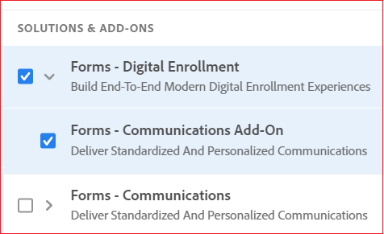

# AEM Forms as a Cloud Service通訊API {#communications-apis-overview}

> **版本可用性**
>
> * **AEM 6.5**： [AEM檔案服務總覽](https://experienceleague.adobe.com/docs/experience-manager-65/forms/use-document-services/overview-aem-document-services.html)
> * **AEM as a Cloud Service**：此文章

## 簡介

AEM Forms as a Cloud Service中的通訊API可幫助您根據業務需求建立品牌核准、個人化和標準化的檔案。 這些強大的API可讓您以程式設計方式產生、控制及保護檔案，無論是隨選還是大量批次處理中。

### 主要優點

* **簡化檔案產生** — 將範本與客戶資料合併，以建立個人化檔案
* **強大的檔案操作** — 以程式設計方式組合、重新排列及驗證PDF檔案
* **彈性的部署選項** — 使用隨選API滿足低延遲需求，或使用批次API進行高輸送量作業
* **增強式安全性** — 套用數位簽章、憑證和加密，以保護機密檔案
* **雲端原生架構** — 利用可擴充、安全的雲端基礎結構，不需維護額外費用

## API功能概觀

通訊API提供了一組完整的檔案處理功能，並歸納為下列功能區域：

| 檔案產生 | 檔案操作 | 檔案擷取 | 檔案轉換 | 檔案Assurance |
|---------------------|----------------------|---------------------|---------------------|-------------------|
| 將範本與多種格式(包括PDF和列印格式)的資料合併，以產生個人化檔案。 | 以程式設計方式組合、重新排列和驗證PDF檔案，以建立新的檔案套件。 | 從PDF檔案擷取屬性、中繼資料和內容，以供進一步處理。 | 轉換不同格式的檔案，包括針對封存需求進行PDF/A合規性驗證。 | 套用數位簽章、憑證和加密，以保全和保護檔案。 |

[API參考檔案](https://developer.adobe.com/experience-cloud/experience-manager-apis/api/experimental/document/)提供API提供的所有引數、驗證方法和各種服務的詳細資訊。 API參考檔案也以.yaml格式提供。 您可以下載.yaml並將其上傳到Postman以檢查API的功能。

## 適用性和使用案例

### 保險

## AEM Forms可以產生保單檔案嗎？

可以。AEM Forms可使用範本和透過表單擷取的結構化資料來產生原則相關檔案。

## AEM Forms可以大規模處理保險業務嗎？

可以。若在Adobe Managed Services或私密雲端上使用建議的架構進行部署，AEM Forms可支援大量表單提交和企業規模工作負載。

## 檔案產生

Communications document generation API可協助結合範本(XFA或PDF)與客戶資料(XML)，以產生PDF、AFP （進階功能簡報）和列印格式（如PS、PCL、DPL、IPL和ZPL格式）的檔案。 這些API使用包含[XML資料](communications-known-issues-limitations.md#form-data)的PDF和XFA範本，以隨選方式產生單一檔案，或使用批次工作產生多個檔案。

通常，您使用 [Designer](use-forms-designer.md) 建立範本，並使用通訊 API 將資料與範本合併。您的應用程式可以將輸出文件傳送到網路印表機、本機印表機或儲存系統進行封存。典型的立即可用和自訂工作流程如下所示：

視使用案例而定，您也可以讓這些文件可透過網站或儲存伺服器下載。

### 重要檔案產生功能

#### 以PDF/AFP電子格式建立檔案

您可以使用檔案產生API，根據表單設計和XML表單資料以PDF或AFP格式建立檔案。 輸出為非互動式檔案。 也就是說，使用者不能輸入或修改表單資料。基本的工作流程是將XML表單資料與表單設計合併，以建立檔案。 下圖顯示將表單設計與 XML 表單資料合併以產生 PDF 文件。

圖：建立檔案的典型工作流程

下表顯示AFP和PDF格式之間的差異：

| **功能** | **AFP （進階函式簡報）** | **PDF （可攜式檔案格式）** |
|---------------------------|--------------------------------------------------------------------|-------------------------------------------------------------|
| **用途** | 大量列印及製作異動檔案 | 一般用途檔案共用和檢視 |
| **使用案例** | 銀行對帳單、帳單、商業發票、保險檔案 | 電子書、表格、報告、履歷、手冊 |
| **平台來源** | 由IBM開發 | 由 Adobe 開發 |
| **結構** | 具有結構化欄位和物件的頁面導向格式 | 頁面導向，但版面配置固定 |
| **可編輯性** | 專為生產列印所設計，很少進行編輯 | 可使用各種工具(例如Adobe Acrobat)進行編輯 |
| **檔案大小與效能** | 針對高速列印環境的效能而最佳化 | 對於大量輸出而言，可能會更大，但最佳化程度較低 |
| **互動** | 最小至無；靜態頁面 | 支援互動式元素，例如表單、連結、JavaScript |
| **輸出控制項** | 印表機版面配置的微細控制 | 針對熒幕與列印最佳化的視覺版面 |
| **字型和圖形** | 使用字型和資源參考；需要轉譯器解譯 | 將字型和影像直接嵌入檔案中 |

檔案產生API會傳回產生的PDF檔案或AFP檔案。 您也可以選擇上傳產生的PDF至Azure Blob儲存體。

使用Document Generation API將產生的PDF上傳到Azure Blob Storage功能在[早期採用者計畫](/help/forms/early-access-ea-features.md)之下。 您可以使用官方電子郵件 ID 寫信至 aem-forms-ea@adobe.com，以加入早期採用者計劃並要求存取該功能。

>
>
> Document Generation API包括批次和同步輸出產生端點。這些API根據端點支援使用JWT或OAuth的伺服器對伺服器驗證。 若要進一步瞭解Document Generation API，[請按一下這裡](/help/forms/aem-forms-communication-api-overview.md#document-generation-apis)。

#### 建立 PostScript (PS)、印表機命令語言 (PCL)、Zebra 列印語言 (ZPL) 文件 {#create-PS-PCL-ZPL-documents}

您可以使用檔案產生API來建立以XDP表單設計或PDF檔案為基礎的PostScript (PS)、印表機命令語言(PCL)和Zebra列印語言(ZPL)檔案。 這些 API 可協助將表單設計與表單資料合併以產生文件。您可以將文件儲存到檔案和開發自訂流程將其傳送到印表機。

#### 處理批次資料以建立多個文件 {#processing-batch-data-to-create-multiple-documents}

您可以使用文件產生 API 為 XML 批次資料來源中的每筆記錄建立單獨的文件。您可以採大量和同步模式產生文件。您可以設定各種轉換參數，然後開始批次處理。

## 檔案操作

通訊檔案操作（檔案轉換） API有助於組合、重新排列PDF檔案。 通常，您會建立一個 DDX 並將其提交給文件操控 API 以組合或重新排列文件。[DDX 文件](https://helpx.adobe.com/content/dam/help/en/experience-manager/forms-cloud-service/ddxRef.pdf)提供了有關如何使用來源文件產生一組所需文件的說明。DDX參考檔案提供所有支援作業的詳細資訊。

>
>
> Document Manipulation API支援使用JWT的伺服器對伺服器驗證。 若要進一步瞭解Document Manipulation API，[請按一下這裡](/help/forms/aem-forms-communication-api-overview.md#document-manipulation-apis)。

### 關鍵檔案操作功能

#### 組合 PDF 文件

您可以使用文件操控 API 將兩個或更多 PDF 或 XDP 文件組成單一 PDF 文件或 PDF 組合。以下是組合PDF檔案的一些方法：

* 組合一個簡單 PDF 文件
* 建立 PDF 組合
* 組合加密的文件
* 使用貝茨編號 (Bates numbering) 組合文件
* 扁平化及組合文件

圖：將多個 PDF 文件組合成一個簡單 PDF 文件

#### 分解 PDF 文件

您可以使用文件操控 API 來分解 PDF 文件。API 可以從來源文件擷取頁面或根據書籤分隔來源文件。通常，如果 PDF 文件最初是從許多個別的文件 (例如報表集合) 建立的，則此作業很有幫助。

* 從來源文件擷取頁面
* 根據書籤分隔來源文件

圖：根據書籤將一個來源文件分隔成多個文件

>[!NOTE]
>
> AEM Forms提供多種內建字型，可順暢地與PDF檔案整合。 若要檢視支援的字型清單，[請按一下這裡](/help/forms/supported-out-of-the-box-fonts.md)。

## 檔案擷取

檔案擷取功能屬於早期採用者計畫。 您可以使用官方電子郵件 ID 寫信至 aem-forms-ea@adobe.com，以加入早期採用者計劃並要求存取該功能。

檔案擷取服務可讓您取得PDF檔案的屬性，例如使用許可權、PDF屬性和中繼資料。 檔案擷取功能包括：

* 取得PDF檔案的屬性，例如PDF是否有附件、註解、Acrobat版本等等。
* 擷取PDF檔案中啟用的使用許可權，使用者會擷取在PDF檔案中啟用或停用的使用許可權，以便Adobe Acrobat Reader擴充。
* 取得出現在PDF檔案中的中繼資料資訊，該中繼資料就是檔案的相關資訊(與檔案的內容（例如文字和圖形）有所區別)。 Adobe可延伸中繼資料平台(XMP)是處理檔案中繼資料的標準。 XMP公用程式服務可從XMP檔案中擷取PDF中繼資料，並將XMP中繼資料匯出至PDF檔案。

>
>
> 檔案擷取API支援使用OAuth的伺服器對伺服器驗證。 若要進一步瞭解檔案擷取API，[請按一下這裡](/help/forms/aem-forms-communication-api-overview.md#document-extraction-apis)。
>

## 檔案轉換

### 轉換為 PDF/A 相容文件並進行驗證

通訊檔案轉換API有助於將PDF檔案轉換為PDF/A。您可以使用這些API將PDF檔案轉換為符合PDF/A的檔案，也可以判斷PDF檔案是否符合PDF/A標準。 PDF/A是一種用於長期儲存檔案內容的封存格式。 字體嵌入在文件中，檔案未壓縮。因此，PDF/A 文件通常比標準 PDF 文件大。此外，PDF/A檔案不包含音訊和視訊內容。 支援的PDF/A合規性標準包括PDF/A-1a、1b、2a、2b、3a和3b。

### 將PDF轉換為XDP {#convert-pdf-to-xdp}

將PDF轉換成XDP功能屬於早期採用者計畫。 您可以使用官方電子郵件 ID 寫信至 aem-forms-ea@adobe.com，以加入早期採用者計劃並要求存取該功能。

將PDF檔案轉換為XDP檔案。 若要將PDF檔案成功轉換為XDP檔案，PDF檔案必須在字典中包含XFA資料流。

>
>
> 檔案轉換API支援使用OAuth的伺服器對伺服器驗證。 若要進一步瞭解檔案轉換API，[請按一下這裡](/help/forms/aem-forms-communication-api-overview.md#document-conversion-apiss)。

## 檔案Assurance {#doc-assurance}

DocAssurance服務包含簽名和加密API：

### 簽名API

簽名 API 可讓您的組織保護所分發和接收 Adobe PDF 文件的安全和隱私。<!--This service uses digital signatures and certification to ensure that only intended recipients can alter documents. -->安全性功能已套用至檔案本身，檔案在其整個生命週期內皆保持安全及受控制。 當檔案離線下載以及將它送回您的組織時，防火牆外仍會保持安全。 您可以使用簽名API完成以下任務：

* 新增可見的簽名欄位至PDF檔案。
* 將隱藏的簽名欄位新增至PDF檔案。
* 在PDF檔案中簽署指定的簽名欄位。
* 認證PDF檔案
* 從PDF檔案中的指定簽名欄位中移除簽名
* 從PDF檔案刪除指定的簽名欄位

從指定的簽章欄位中移除簽章，並從PDF檔案中刪除指定的簽章欄位（可在早期採用者程式下取得）。 您可以使用官方電子郵件 ID 寫信至 aem-forms-ea@adobe.com，以加入早期採用者計劃並要求存取該功能。

>
>
> 檔案Assurance API支援使用OAuth的伺服器對伺服器驗證。 若要進一步瞭解檔案Assurance API，[請按一下這裡](/help/forms/aem-forms-communication-api-overview.md#document-assurance-apis)。

### 加密API

加密API可讓您加密和解密檔案。 檔案加密後，其內容會變得無法讀取。 授權的使用者可以解密檔案以取得內容的存取權。 如果PDF檔案已使用密碼加密，使用者必須先指定開啟的密碼，才能在Adobe Reader或Adobe Acrobat中檢視檔案。<!-- Likewise, if a PDF document is encrypted with a certificate, the user must decrypt the PDF document with the public key that corresponds to the certificate (private key) that was used to encrypt the PDF document.-->

您可以使用加密API完成這些工作：

* 使用密碼加密PDF檔案。
* 從PDF檔案中移除密碼式加密。
* 擷取套用至PDF檔案的安全性型別。
* 傳回套用至PDF檔案的安全性型別。

簽章API和加密API都是[同步API](#types-of-communications-apis-types)。

### 檔案公用程式 {#doc-utility}

具有同步API的檔案公用程式可協助您在PDF與XDP檔案格式之間轉換檔案。 將使用許可權套用至檔案，並從檔案中擷取啟用的使用許可權。 查詢PDF檔案的相關資訊。 <!-- determines whether a PDF document contains comments or attachments and more, and use document transformation services for XMP utilities-->使用許可權API的詳細資訊如下：

#### 使用許可權API (Reader擴充功能)

使用許可權(Reader擴充功能)功能屬於率先採用者計畫。 您可以使用官方電子郵件 ID 寫信至 aem-forms-ea@adobe.com，以加入早期採用者計劃並要求存取該功能。

使用許可權功能可讓您組織透過擴充具有其他使用許可權的PDF Reader功能，輕鬆共用互動式Adobe Reader檔案。 此服務可與Adobe Reader 7.0或更新版本搭配使用，並在PDF檔案中新增使用許可權。 此動作會啟動使用Adobe Reader開啟PDF檔案時通常無法使用的功能，例如新增註釋至檔案、填寫表單及儲存檔案。

當PDF檔案新增了適當的使用許可權時，收件者可在Adobe Reader中執行下列活動：

* 線上上或離線完成PDF檔案和表單，讓收件者可在本機儲存復本以供其記錄，同時仍保持新增資訊不變。
* 將PDF檔案儲存至本機硬碟，以保留原始檔案以及任何其他註解、資料或附件。
* 將檔案和媒體剪輯附加至PDF檔案。
* 使用業界標準的公開金鑰基礎結構(PKI)技術套用數位簽名，以簽署、認證和驗證PDF檔案。
* 以電子方式提交已完成或附註的PDF檔案。
* 使用PDF檔案和表單作為內部資料庫和Web服務的直覺式開發前端。
* 與其他人共用PDF檔案，讓檢閱者可以使用直覺式的標籤工具來新增註解。 這些工具包括電子註解、印章、醒目提示和文字刪除線。 Acrobat提供相同功能。
* 支援條碼Forms解碼。

當在Adobe Reader中開啟啟用許可權的PDF檔案時，這些特殊使用許可權功能會自動啟動。 當使用者完成使用已啟用許可權的檔案時，這些功能在Adobe Reader中會再次停用。 除非使用者收到其他已啟用許可權的PDF檔案，否則這些功能會維持停用狀態。

#### 啟用或停用使用許可權

擴充PDF Reader服務的各種使用許可權功能包括：

* **條碼解碼**：解碼PDF檔案中的條碼。

* **註解**：若要在PDF檔案上離線註解。

* **線上註解**：若要線上註解PDF檔案。

* **數位簽章**：若要將數位簽章新增至PDF檔案。

* **動態表單欄位**：若要將表單欄位新增至PDF檔案。

* **動態表單頁面**：若要將表單頁面新增至PDF檔案。

* **內嵌檔案**：將檔案內嵌在PDF檔案中。

* **表單資料匯入**：若要將表單資料匯入PDF檔案。

* **表單資料匯出**：若要將表單資料匯入PDF檔案。

* **表單填入**：若要在PDF檔案中填入表單欄位。

* **線上Forms**：若要從PDF檔案存取Web服務或資料庫。

* **獨立提交**：若要從PDF檔案離線提交表單資料。

#### 其他功能

* **訊息**：開啟套用了一或多個使用許可權的PDF檔案時，Adobe Acrobat Reader中顯示的訊息。
* **解除鎖定密碼**：開啟加密的PDF檔案所需的密碼。 通常這是檔案開啟密碼，但如果PDF檔案受到許可權密碼的額外保護，則任一方都可用於開啟檔案。

## 通訊 API 類型 {#types}

通訊提供用於隨需和批次產生文件的 HTTP API：

* **[同步 API](https://developer.adobe.com/experience-manager-forms-cloud-service-developer-reference/)** 適用於隨需、低延遲和單筆記錄文件產生案例。這些 API 更適合根據使用者動作的使用案例。例如，在使用者填寫完表單後產生文件。

* **[批次 API (非同步 API)](https://developer.adobe.com/experience-manager-forms-cloud-service-developer-reference/)** 適用於已排程、高輸出量和多文件產生案例。這些 API 批次產生文件。例如，每個月都會產生電話帳單、信用卡對帳單和福利對帳單。

## 上線

通訊功能可作為獨立和附加模組供 Forms as a Cloud Service 使用者使用。您可以聯絡Adobe銷售團隊或您的Adobe代表以要求存取權。 Adobe 為您的組織啟用存取權，並向您指定的組織管理員提供所需的權限。管理員可以授予組織的Forms as a Cloud Service開發人員（使用者）存取權，以使用這些API。

上線後，若要為您的Forms as a Cloud Service環境啟用通訊功能：

1. 登入 Cloud Manager 並開啟您的 AEM Forms as a Cloud Service 執行個體。

1. 開啟「編輯方案」選項，前往「解決方案和附加元件」索引標籤，然後選擇&#x200B;**[!UICONTROL Forms - 通訊]**&#x200B;選項。

   

   如果您已經啟用&#x200B;**[!UICONTROL Forms - 數位註冊]**&#x200B;選項，則選擇&#x200B;**[!UICONTROL Forms - 通訊附加元件]**&#x200B;選項。

   

1. 按一下&#x200B;**[!UICONTROL 更新]**。

1. 執行建置管道。建置管道成功後，將為您的環境啟用通訊 API。

>[!NOTE]
>
> 若要啟用及設定檔案操作API，請將下列規則新增至[Dispatcher設定](setup-local-development-environment.md#forms-specific-rules-to-dispatcher)：
>
> `# Allow Forms Doc Generation requests`
> `/0062 { /type "allow" /method "POST" /url "/adobe/forms/assembler/*" }`

>[!MORELIKETHIS]
>
>* [AEM Forms as a Cloud Service通訊簡介](/help/forms/aem-forms-cloud-service-communications-introduction.md)
>* 最適化AEM Forms和通訊API的[Forms as a Cloud Service架構](/help/forms/aem-forms-cloud-service-architecture.md)
>* [通訊處理 — 同步API](/help/forms/aem-forms-cloud-service-communications.md)
>* [通訊處理 — 批次API](/help/forms/aem-forms-cloud-service-communications-batch-processing.md)
>* [Forms Communications API — 教學課程](/help/forms/aem-forms-cloud-service-communications-on-demand-processing.md)
>* [API參考檔案](https://developer.adobe.com/experience-cloud/experience-manager-apis/api/experimental/document/)
>* [早期採用者程式功能](/help/forms/early-access-ea-features.md)
