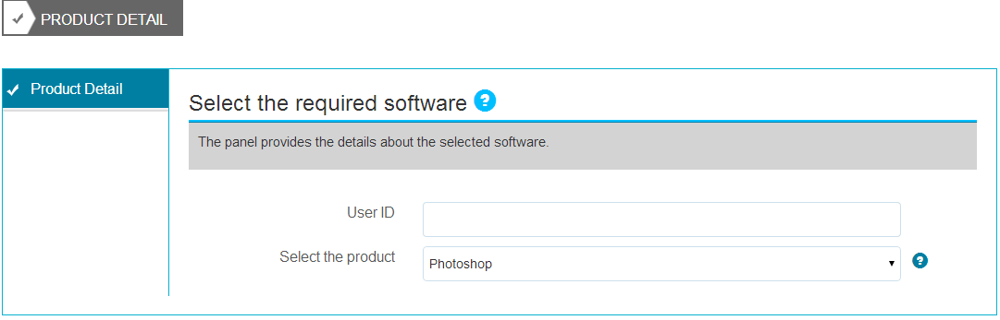

# 為表單域創作上下文幫助{#authoring-in-context-help-for-form-fields}

## 簡介 {#introduction}

有些情況下，填寫表單的最終用戶不確定如何在特定表單欄位中填寫詳細資訊。 為瞭解決這些問題，AdaptiveForms支援將文本或富上下文幫助添加到表單域。 它有助於改善表單填充體驗，避免最終用戶的歧義。

本文討論表單作者在創作Adaptive Forms時如何添加上下文幫助。

## 添加上下文幫助 {#add-in-context-help}

可以使用提要欄中「屬性」頁籤的「幫助內容」部分中的以下選項指定上下文中的幫助。

* [簡短描述](authoring-in-field-help.md#p-short-description-p)
* [長描述](authoring-in-field-help.md#p-long-description-p)

>[!NOTE]
>
>長說明會覆蓋短說明。 如果已同時指定這兩個，則只顯示「長說明」。

### 簡短描述 {#short-description}

「簡短說明」(Short description)欄位用於提供有關填寫表單域的快速和簡短提示。 在「簡短說明」(Short description)欄位中指定的文本將作為懸停在該欄位上的滑鼠工具提示顯示。

>[!NOTE]
>
>選擇 **始終顯示簡短說明** 來永久顯示該欄位下的幫助文本。

### 長描述 {#long-description}

您可以使用「長說明」欄位指定長文本或嵌入富媒體內容（包括視頻），作為上下文幫助。 例如，下圖顯示了如何將視頻嵌入為上下文幫助。

添加長說明顯示 **?** 表徵圖。 按一下該表徵圖將顯示在長說明部分中添加的內容。

### 面板級幫助 {#panel-level-help}

除了表單域的上下文幫助外，還可以在面板編輯對話框的「幫助內容」頁籤的面板級別指定幫助。

為面板添加幫助顯示 **?** 表徵圖。 按一下該表徵圖將顯示在面板編輯對話框的「幫助內容」部分中添加的內容。

