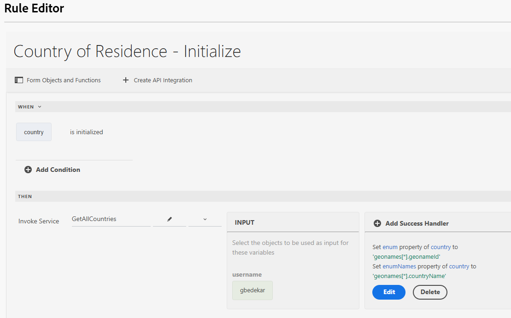

# 使用通用編輯器建立表單

使用通用編輯器建立以下表單。 此表單有3個下拉式清單，其值將使用API整合填入

## 居住國家/地區

初始化時，居住國家/地區下拉式清單會填入API呼叫的結果。

## 成功處理常式

成功處理常式的定義是使用geonames陣列中的適當值來設定國家/地區的列舉和列舉名稱下拉式清單。 地名陣列可在「事件裝載」選項下使用

## 擷取子值

當使用者在居住國家/地區下拉式清單中進行選擇時，會填入州或省下拉式清單。 與所選國家/地區關聯的geonameId會作為輸入引數傳遞到GetChildren API整合

已定義序列處理常式，以設定StateOrProvidle下拉式欄位的enum/enumNames

選取州或省時，您可以依照上述用於填入州或省下拉式清單的模式，填入城市下拉式清單。