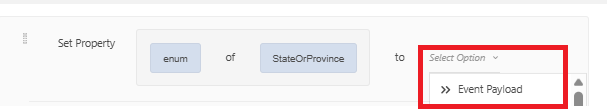
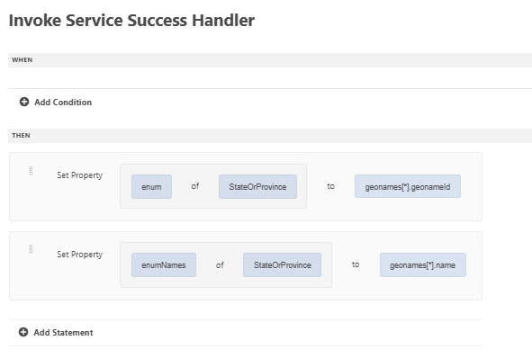

# 使用通用編輯器建立表單

使用通用編輯器建立下列表單。 此表單有3個下拉式清單，其值將使用API整合填入

## 居住國家/地區

初始化時，居住國家/地區下拉式清單會填入 API 呼叫的結果。

## 成功處理常式

成功處理常式的定義是使用 geonames 陣列中的適當值來設定國家/地區的列舉和列舉名稱下拉式清單。 地名陣列可在「事件裝載」選項下使用

## 擷取子值

使用者在居住國家/地區下拉式清單中進行選擇時，會填入州或省下拉式清單。 與所選國家/地區相關的 geonameId 會作為輸入參數，傳遞至 GetChildren API 整合

已定義序列處理常式，以設定StateOrProvidle下拉式欄位的enum/enumNames

已選取州或省份後，您可以按照上述用於填入州或省份的下拉式清單模式，來填入城市下拉式清單。