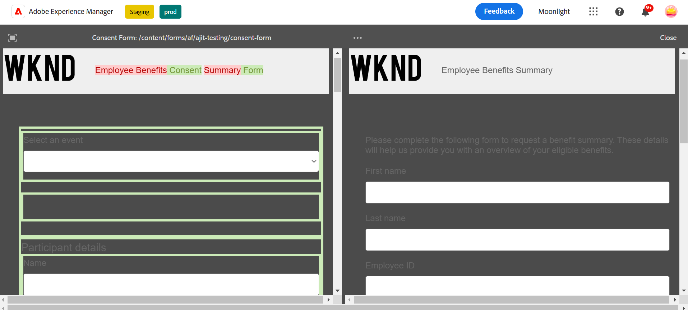

## 比較最適化Forms {#compare-two-forms}

這是一項預先發佈功能，可透過我們的[預先發佈管道](https://experienceleague.adobe.com/docs/experience-manager-cloud-service/content/release-notes/prerelease.html#new-features)存取。

當表單作者需要根據欄位、內容和表單元件比較兩個不同的表單時，他們會比較兩個表單。 表單作者必須確定兩個表單位於相同的目錄或資料夾中，才能進行比較。 若要比較兩個不同的調適型表單，請執行以下步驟：

1. 選取最適化表單並按一下 **[!UICONTROL 比較]**.

   

1. 按一下使用者，就會在預覽模式中看到兩個表單，如影像所示。

   