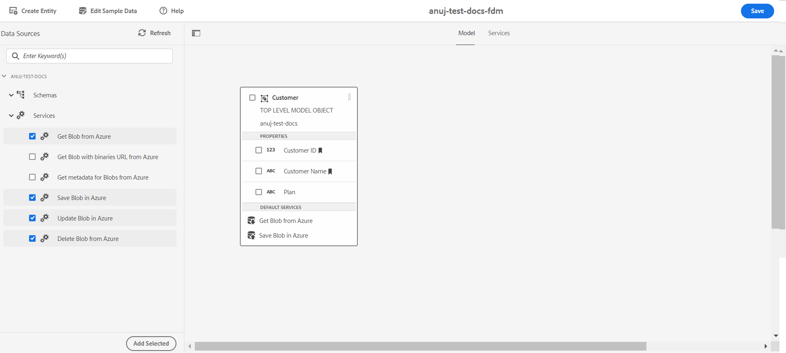

# 設定[!DNL Azure]儲存空間 {#configure-azure-storage}

[[!DNL Experience Manager Forms] 資料整合](data-integration.md) 提供 [!DNL Azure] 儲存配置，將表單與 [!DNL Azure] 儲存服務。 表單資料模型可用來建立與互動的適用性Forms [!DNL Azure] 伺服器啟用業務工作流程。 例如：

* 將資料寫入 [!DNL Azure] 在適用性表單提交時。
* 將資料寫入 [!DNL Azure] 透過「表單資料模型」中定義的自訂實體，反之亦然。
* 查詢 [!DNL Azure] 伺服器以取得資料並預先填入適用性Forms。
* 從讀取資料 [!DNL Azure] 伺服器。

## 建立 [!DNL Azure] 儲存配置 {#create-azure-storage-configuration}

執行這些步驟之前，請確定您有 [!DNL Azure] 儲存帳戶和存取金鑰，以授權存取 [!DNL Azure] 儲存帳戶。

1. 導覽至 **[!UICONTROL 工具]** > **[!UICONTROL Cloud Services]** > **[!UICONTROL Azure儲存]**.
1. 選取要建立設定的資料夾，然後點選 **[!UICONTROL 建立]**.
1. 在 **[!UICONTROL 標題]** 欄位。
1. 指定 [!DNL Azure] 儲存帳戶 **[!UICONTROL Azure儲存帳戶]** 欄位。
1. 指定要在 **[!UICONTROL Azure訪問密鑰]** 欄位和點選 **[!UICONTROL 儲存]**.

## 建立表單資料模型 {#create-azure-form-data-model}

建立 [!DNL Azure] 儲存配置，您可以 [建立表單資料模型](create-form-data-models.md). 指定包含 [!DNL Azure] 設定 **[!UICONTROL 資料來源設定]** 欄位。 然後，您可以從指定資料夾名稱中存在的配置清單中選擇配置。

### 新增 [!DNL Azure] 表單資料模型服務 {#add-azure-services}

建立「表單資料模型」和「資料模型」對象後，可以添加 [!DNL Azure] 表單資料模型的服務。

若要新增 [!DNL Azure] 服務：

1. 在「編輯」模式中，從 **[!UICONTROL 服務]** 區段，然後點選 **[!UICONTROL 添加選定內容]**. 所選服務會顯示在 **[!UICONTROL 服務]** 頁簽。

   

1. 在 **[!UICONTROL 服務]** 頁簽，選擇服務和 **[!UICONTROL 編輯屬性]**. 根據服務，定義服務的輸入或輸出模型對象。

1. 點選 **[!UICONTROL 儲存]** 保存表單資料模型。

   下表說明可用 [!DNL Azure] 服務：

   <table>
    <tbody>
     <tr>
      <th><strong>服務名稱</strong></th>
      <th><strong>說明</strong></th>
     </tr>
     <tr>
      <td>從Azure獲取Blob</td>
      <td>使用ID或名稱擷取Azure儲存中儲存為Blob的資料</td>
     </tr>
     <tr>
      <td>從Azure取得含二進位檔URL的Blob</td>
      <td>使用ID或名稱，為Azure儲存中的二進位檔擷取儲存為Blob（含URL）的資料</td>
     </tr>
     <tr>
      <td>在Azure中儲存Blob</td>
      <td>使用Blob ID將資料儲存在Azure儲存中</td>
     </tr>
     <tr>
      <td>更新Azure中的Blob</td>
      <td>使用Blob ID更新Azure儲存中的資料</td>
     </tr>
     <tr>
      <td>從Azure擷取Blob ID清單</td>
      <td>根據輸入請求中定義的數字，從Azure擷取Blob ID清單。</td>
     </tr>
     <tr>
      <td>從Azure中檢索Blob的SAS URL</td>
      <td>根據輸入請求中的Blob ID從Azure中擷取Blob的SAS URL。</td>
     </tr>
     <tr>
      <td>從Azure中刪除Blob</td>
      <td>使用Blob ID從Azure儲存中刪除資料</td>
     </tr>
    </tbody>
   </table>

### 將資料模型對象屬性定義為搜索鍵 {#define-data-model-object-as-metadata}

要將資料模型對象屬性定義為搜索鍵，請執行以下操作：

1. 在 **[!UICONTROL 模型]** 頁簽，選擇資料模型對象屬性並點選 **[!UICONTROL 編輯屬性]**.
1. 切換 **[!UICONTROL 搜尋索引鍵]** 將「 」選項切換為「開啟」狀態。 此選項僅適用於主要資料類型。
1. 點選 **[!UICONTROL 完成]** 然後點選 **[!UICONTROL 儲存]** 以保存「表單資料模型」。

將資料模型對象屬性定義為搜索鍵後，哈希值儲存在Azure索引標籤中，Base64編碼值儲存在Azure元資料中。

>[!NOTE]
>
>每個Azure實體僅允許10個搜尋金鑰，因為Azure僅允許每個Blob允許10個標籤，且雜湊後標示為搜尋金鑰的屬性值會儲存在Azure索引標籤中。
