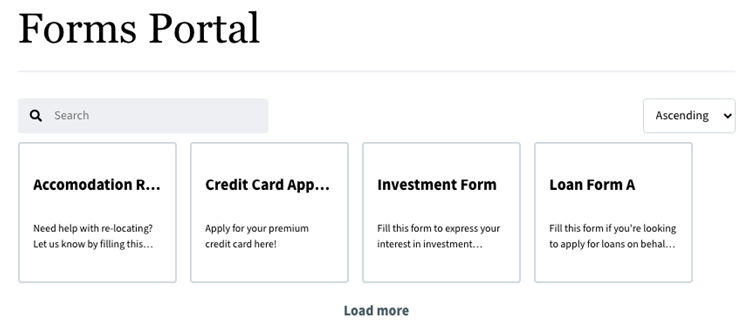

# 將Forms入口網站新增至AEM Sites頁面 {#publish-forms-on-portal}

<span class="preview">Adobe 建議使用新式且可擴充的資料擷取[核心元件](https://experienceleague.adobe.com/docs/experience-manager-core-components/using/adaptive-forms/introduction.html)，用來[建立新的最適化表單](/help/forms/creating-adaptive-form-core-components.md)或[將最適化表單新增到 AEM Sites 頁面](/help/forms/create-or-add-an-adaptive-form-to-aem-sites-page.md)。這些元件代表最適化表單建立方面的重大進步，可確保令人印象深刻的使用者體驗。本文會介紹使用基礎元件編寫最適化表單的舊方法。</span>

| 版本 | 文章連結 |
| -------- | ---------------------------- |
| AEM 6.5 | [按一下這裡](https://experienceleague.adobe.com/docs/experience-manager-65/forms/publish-process-aem-forms/introduction-publishing-forms.html) |
| AEM as a Cloud Service  | 本文章 |

在以表單為中心的典型入口網站部署情境中，表單開發和入口網站開發是兩個分離的活動。 當表單設計人員將表單設計和儲存在存放庫時，網頁開發人員會建立網站應用程式以列出表單並處理表單提交。 Forms會複製到Web層，因為Forms存放庫和Web應用程式之間沒有通訊。

這類案例通常會導致管理問題和生產延遲。 例如，如果存放庫中有較新的表單版本，您需要取代Web層上的表單、修改Web應用程式，並重新部署公用網站上的表單。 重新部署Web應用程式可能會造成伺服器停機時間。 通常伺服器停機時間是計畫的活動，因此變更無法即時推送至公用網站。

AEM Forms提供入口網站元件，可減少管理間接成本及生產延遲。 這些元件讓網頁開發人員能夠在使用Forms (AEM)編寫的網站上建立和自訂Adobe Experience Manager入口網站。

Form Portal元件可讓您新增下列功能：

* 以自訂版面配置列出表單。 隨附立即可用的清單檢視和卡片檢視版面配置。 您可以建立自己的自訂版面配置。
* 可讓您在列出自訂中繼資料和自訂動作時顯示它們。
* 列出由AEM Forms UI在使用Forms Portal元件的發佈執行個體上發佈的表單。
* 允許一般使用者以HTML和PDF格式轉譯表單。
* 啟用根據標題和說明的表單搜尋功能。
* 使用自訂CSS來自訂入口網站的外觀。
* 建立表單連結。
* 列出與使用者建立的最適化Forms相關的草稿和提交內容。

## Forms Portal頁面的元件 {#forms-portal-components}

AEM Forms提供下列立即可用的入口網站元件：

* 搜尋與清單製作程式：此元件可讓您從表單存放庫將表單列出至入口網站頁面，並提供設定選項，以根據指定條件列出表單。

* 草稿和提交：當搜尋和清單元件顯示由Forms作者公開的表單時，草稿和提交元件顯示儲存為草稿以供稍後完成和提交表單的表單。 此元件可為任何登入使用者提供個人化體驗。

* 連結：此元件可讓您建立頁面上任何位置的表單連結。

您可以 [匯入現成可用的Forms Portal元件](#import-forms-portal-components-aem-archetype) 從AEM專案原型。 匯入後，執行下列設定：

* [設定外部儲存裝置](#configure-azure-storage-adaptive-forms)

* [啟用Forms Portal元件](#enable-forms-portal-components)

* [設定Forms Portal元件](#configure-forms-portal-components)

## 匯入Forms Portal元件 {#import-forms-portal-components-aem-archetype}

若要在AEM Formsas a Cloud Service匯入現成可用的Forms Portal元件，請執行以下步驟：

1. **在本機開發執行個體上複製Cloud Manager Git存放庫：**  您的Cloud Manager Git存放庫包含預設的AEM專案。 它基於 [AEM原型](https://github.com/adobe/aem-project-archetype/). 從Cloud Manager UI使用自助Git帳戶管理來複製您的Cloud Manager Git存放庫，將專案引進您的本機開發環境中。 有關存取存放庫的詳細資訊，請參閱 [存取存放庫](https://experienceleague.adobe.com/docs/experience-manager-cloud-manager/using/managing-code/accessing-repos.html).

1. **建立 [!DNL Experience Manager Forms] as a [Cloud Service] 專案：** 建立 [!DNL Experience Manager Forms] as a [Cloud Service] 專案依據 [AEM Archetype 27](https://github.com/adobe/aem-project-archetype/releases/tag/aem-project-archetype-27) 或更新版本。 原型可協助開發人員輕鬆開始開發 [!DNL AEM Forms] as a Cloud Service。 其中也包括一些範例主題和範本，可幫助您快速入門。

   建立 [!DNL Experience Manager Forms] 與專案as a Cloud Service，請開啟命令提示字元並執行以下命令。 要包含 [!DNL Forms] 特定組態、主題和範本、集合 `includeForms=y`.

   ```shell
   mvn -B archetype:generate -DarchetypeGroupId=com.adobe.aem -DarchetypeArtifactId=aem-project-archetype -DarchetypeVersion=30 -DaemVersion="cloud" -DappTitle="My Site" -DappId="mysite" -DgroupId="com.mysite" -DincludeForms="y"
   ```

   另外，變更 `appTitle`， `appId`、和 `groupId`，以反映您的環境。

   專案準備就緒後，請更新 `<core.forms.components.version>x.y.z</core.forms.components.version>` 屬性位於頂層 `pom.xml` ，以反映最新版本的 [core-forms-components](https://github.com/adobe/aem-core-forms-components) 在您的 `AEM Archetype` 專案。

1. **將專案部署到您的本機開發環境：** 您可以使用以下命令來部署到您的本機開發環境

   `mvn -PautoInstallPackage clean install`

   如需完整的命令清單，請參閱 [建置和安裝](https://experienceleague.adobe.com/docs/experience-manager-core-components/using/developing/archetype/using.html?lang=en#building-and-installing)

1. [將程式碼部署至您的 [!DNL AEM Forms] as a Cloud Service環境](https://experienceleague.adobe.com/docs/experience-manager-cloud-service/content/implementing/developing/aem-project-content-package-structure.html#embeddeds).


## 為最適化Forms設定Azure儲存體 {#configure-azure-storage-adaptive-forms}

[[!DNL Experience Manager Forms] 資料整合](data-integration.md) 提供 [!DNL Azure] 整合表單與的儲存體設定 [!DNL Azure] 儲存服務。 表單資料模型可用來建立最適化Forms，以與互動 [!DNL Azure] 伺服器以啟用業務工作流程。

### 建立 Azure 儲存體設定 {#create-azure-storage-configuration}

在執行這些步驟之前，請確定您擁有Azure儲存體帳戶和存取金鑰，以授權存取 [!DNL Azure] 儲存體帳戶。

1. 瀏覽至 **[!UICONTROL 工具]** > **[!UICONTROL Cloud Service]** > **[!UICONTROL Azure儲存體]**.
1. 選取資料夾以建立設定，然後選取 **[!UICONTROL 建立]**.
1. 在中指定設定的標題 **[!UICONTROL 標題]** 欄位。
1. 指定 [!DNL Azure] 中的儲存體帳戶 **[!UICONTROL Azure儲存體帳戶]** 欄位。

### 為Forms入口網站設定統一的儲存聯結器 {#configure-usc-forms-portal}

執行以下步驟，為AEM Workflow設定統一的儲存聯結器：

1. 瀏覽至 **[!UICONTROL 工具]** > **[!UICONTROL Forms]** > **[!UICONTROL 統一的儲存聯結器]**.
1. 在 **[!UICONTROL Forms入口網站]** 區段，選取 **[!UICONTROL Azure]** 從 **[!UICONTROL 儲存]** 下拉式清單。
1. 指定 [Azure儲存體設定的設定路徑](#create-azure-storage-configuration) 在 **[!UICONTROL 儲存設定路徑]** 欄位。
1. 選取 **[!UICONTROL 發佈]** 然後選取 **[!UICONTROL 儲存]** 以儲存組態。

## 啟用Forms Portal元件 {#enable-forms-portal-components}

若要在Adobe Experience Manager (AEM)網站中使用任何核心元件（包括現成可用的入口網站元件），您必須建立Proxy元件並為您的網站啟用它。 如需建立Proxy元件和啟用入口網站元件的相關資訊，請參閱 [使用核心元件](https://experienceleague.adobe.com/docs/experience-manager-core-components/using/get-started/using.html?lang=en#create-proxy-components).

啟用入口網站元件後，您即可在網站頁面的製作例項中加以使用。

## 新增和設定Forms Portal元件 {#configure-forms-portal-components}

您可以透過新增和設定入口網站元件，在使用AEM編寫的網站上建立和自訂Forms入口網站。 確保 [元件已啟用](#enable-forms-portal-components) 在Forms入口網站中使用它們之前。

若要新增元件，請將元件從「元件」窗格拖放至頁面上的配置容器中，或選取配置容器上的新增圖示，然後從以下位置新增元件： [!UICONTROL 插入新元件] 對話方塊。

### 設定草稿和提交元件 {#configure-drafts-submissions-component}

草稿和提交元件會顯示儲存為草稿以供稍後完成和提交表單的表單。 若要設定，請選取元件，然後選取 . 在 [!UICONTROL 草稿與提交] 對話方塊，指定標題以指示表單清單為草稿或已提交表單。 同時選取元件是否應該以卡片或清單格式列出草稿表單或已提交的表單。


### 設定搜尋與清單元件 {#configure-search-lister-component}

「搜尋與清單製作程式」元件可用來列出頁面上的最適化表單，以及在列出的表單上實施搜尋。



若要設定，請選取元件，然後選取 . 此 [!UICONTROL 搜尋和製表人] 對話方塊開啟。

1. 在 [!UICONTROL 顯示] 索引標籤中，設定下列專案：
   * 在 **[!UICONTROL 標題]**，指定「搜尋和清單程式」元件的標題。 指示性標題可讓使用者在表單清單中執行快速搜尋。
   * 從 **[!UICONTROL 版面]** 清單中，選取版面配置以卡片或清單格式呈現表單。
   * 選取 **[!UICONTROL 隱藏搜尋]** 和 **[!UICONTROL 隱藏排序]** 以隱藏搜尋並依功能排序。
   * 在 **[!UICONTROL 工具提示]**，提供將游標停留在元件上時顯示的工具提示。
1. 在 [!UICONTROL 資產資料夾] 索引標籤中，指定提取表單並列在頁面上的位置。 您可以設定多個資料夾位置。
1. 在 [!UICONTROL 結果] 索引標籤中，設定每頁要顯示的表單數量上限。 預設為每頁八個表單。

### 設定連結元件 {#configure-link-component}

連結元件可讓您在頁面上提供最適化表單的連結。 若要設定，請選取元件，然後選取 . 此 [!UICONTROL 編輯連結元件] 對話方塊開啟。

1. 在 [!UICONTROL 顯示] 標籤中，提供連結標題和工具提示，以方便識別連結所代表的表單。
1. 在 [!UICONTROL 資產資訊] 索引標籤，指定儲存資產的存放庫路徑。
1. 在 [!UICONTROL 查詢引數] 索引標籤中，以索引鍵/值配對格式指定其他引數。 按一下連結時，這些額外的引數會與表單一起傳遞。

## 使用Adobe Sign設定非同步表單提交 {#configure-asynchronous-form-submission-using-adobe-sign}

您可以將設定為僅在所有收件者完成簽署儀式時提交最適化表單。 請依照下列步驟，使用Adobe Sign進行設定。

1. 在作者執行個體中，以編輯模式開啟調適型表單。
1. 從左窗格中，選取「屬性」圖示並展開 **[!UICONTROL 電子簽章]** 選項。
1. 選取 **[!UICONTROL 啟用Adobe Sign]**. 會顯示各種組態選項。
1. 在 [!UICONTROL 提交表單] 區段，選取 **[!UICONTROL 在每個收件者完成簽署儀式後]** 選項來設定提交表單動作，其中表單會先傳送給所有收件者以供簽署。 所有收件者簽署表單後，才提交表單。

## 將最適化Forms另存為草稿 {#save-adaptive-forms-as-drafts}

您可以將表單儲存為草稿，以便稍後完成。 有兩種方式可將表單儲存為草稿：

* 在表單元件上建立「儲存表單」規則，例如按鈕。 按一下按鈕時，規則會觸發，而表單會儲存草稿。
* 啟用「自動儲存」功能，依指定的事件或設定的時間間隔儲存表單。

### 建立規則以將最適化表單儲存為草稿 {#rule-to-save-adaptive-form-as-draft}

若要在表單元件（例如按鈕）上建立「儲存表單」規則，請遵循下列步驟：

1. 在作者執行個體中，以編輯模式開啟調適型表單。
1. 從左窗格中選取  並拖曳 [!UICONTROL 按鈕] 元件至表單。
1. 選取 [!UICONTROL 按鈕] 元件，然後選取 .
1. 選取 [!UICONTROL 編輯規則] 圖示以開啟規則編輯器。
1. 選取 **[!UICONTROL 建立]** 以設定及建立規則。
1. 在 [!UICONTROL 時間] 區段中，選取「已點按」，然後在 [!UICONTROL 則] 選取「儲存表單」選項。
1. 選取 **[!UICONTROL 完成]** 以儲存規則。

### 啟用自動儲存 {#enable-auto-save}

您可以為最適化表單設定自動儲存功能，如下所示：

1. 在作者執行個體中，以編輯模式開啟調適型表單。
1. 從左窗格中，選取  並展開 [!UICONTROL 自動儲存] 選項。
1. 選取 **[!UICONTROL 啟用]** 核取方塊以啟用表單的自動儲存。 您可以設定下列專案：
* 根據預設， [!UICONTROL 最適化表單事件] 設為「true」，表示表單會在每個事件後自動儲存。
* 在 [!UICONTROL 觸發]，設定以根據事件發生或特定時間間隔後觸發自動儲存。

## 另請參閱 {#see-also}

{{see-also}}


<!--

>[!MORELIKETHIS]
>
>* [Configure data sources for AEM Forms](/help/forms/configure-data-sources.md)
>* [Configure Azure storage for AEM Forms](/help/forms/configure-azure-storage.md)
>* [Integrate Microsoft Dynamics 365 and Salesforce with Adaptive Forms](/help/forms/configure-msdynamics-salesforce.md)

-->