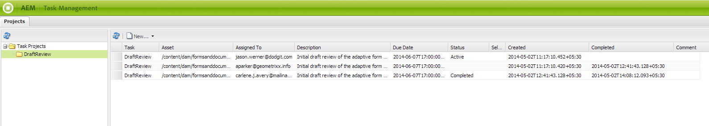
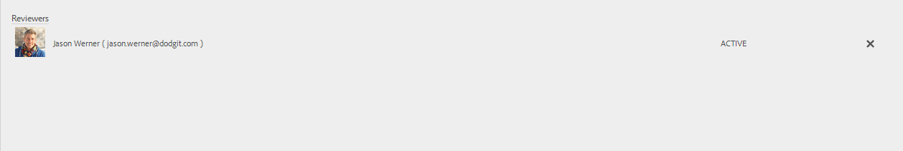

# 建立和管理表單中資產的審核{#creating-and-managing-reviews-for-assets-in-forms}

## 評論 {#review}

「審核」是一種機制，可讓一或多位審核者對表單中可用的資產發表評論。

## 設定審核 {#setting-up-a-review}

1. 導覽至Forms標籤並選取表單。
1. 如果資產沒有進行中的審核，則啟動審核  圖示。 按一下「開始審閱」  表徵圖。
1. 輸入以下資訊：

   * 審核名稱：必填，可包含英數字元、連字型大小或底線。
   * 查看說明：選用，說明用途/內容以供審核。
   * 審核截止日期：可選，審核結束的日期。 超過截止日期時，任務將顯示為「已逾期」。
   * 審閱者：至少必須有一個。 使用組合框添加審核者。 鍵入名稱會列出所有匹配的名稱；選取名稱，然後按一下「新增」 。

1. 填寫剩餘的所有詳細資訊，然後按一下「開始」。

### 設定審核時發生的動作 {#actions-that-occur-when-a-review-is-set-up}

本節說明建立或設定審核時會發生什麼情況。

1. 將建立新的審閱任務並分配給審閱的發起人。
1. 所有審閱者都被分配一個審閱任務。 該任務將顯示在其「通知」部分中。 審核者可以按一下通知，或轉到收件箱查看任務。 審核者可以按一下以開啟審核任務、查看表單並開始添加註釋。

   

   審核者通知警報

1. 資產的發起人和審閱人可以使用注釋框。 其他人可以查看注釋，但無法寫入注釋。

## 管理審核 {#managing-a-review}

>[!NOTE]
>
>只能修改正在進行的審核。 無法修改已完成的審閱。

1. 導覽至Forms標籤並選取表單。

1. 如果資產正在進行審核，而您是審核的發起者，則管理審核  圖示會出現在動作列中。 只有審核啟動器可以管理（更新/結束）審核。

   按一下管理審閱 表徵圖。

   對於啟動器以外的用戶，「管理審閱」表徵圖被禁用。

1. 畫面會顯示資訊：

   * **審核名稱**:無法編輯。

   * **查看說明**:可編輯。

   * **審核截止日期**:可編輯。 可以將截止日期修改為當前日期和時間以外的任何日期和時間。

   * **審核者**:可編輯。 可以添加或刪除審閱者。 如果任務逾期，則只能在將截止日期延長到當前日期之後才添加審閱者。

1. 編輯必要欄位，然後按一下「更新」。

   

   在任務管理器中查看更新狀態

1. 要結束審閱，請按一下「結束」。

### 修改審核時發生的操作 {#actions-that-occur-when-a-review-is-modified}

本節說明檢閱結束/修改時會發生什麼事：

1. 如果修改了審閱描述，則會更新審閱者和發起者的相應任務。
1. 如果修改了「審閱」(Review)截止期，則審閱者的相應任務將以新日期更新。

1. 如果刪除審核者：

   

   移除審核者

   1. 如果未完成，則會終止分配的任務。
   1. 審核者無法再對資產發表評論。

1. 如果已添加審核者：

   

   添加審核者

   1. 將建立審核任務並分配給新添加的審核者。
   1. 新增的審核者可為資產新增註解。

1. 審核結束時：

   1. **審核者**:對於每個審閱者，與審閱相關的未完成任務將終止。 審核者的「通知」區段中不再將任務顯示為「待定」。
   1. **啟動器**:分配給審核啟動器的任務標籤為完成。 該任務將從審閱啟動器的「通知」部分中刪除。
   1. **全部**:審閱將顯示在「前一個審閱」(Previous Reviews)部分。 無法添加其他評論。

