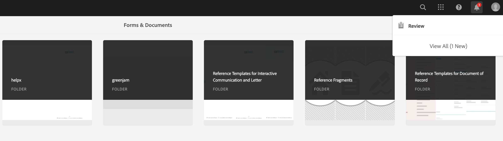

# 建立和管理表單中資產的審閱{#creating-and-managing-reviews-for-assets-in-forms}

## 評論 {#review}

審閱是一種機制，它允許一個或多個審閱者對表單中可用的資產發表評論。

## 設定審閱 {#setting-up-a-review}

1. 導航到「Forms」頁籤，然後選擇一個表單。
1. 如果表單沒有正在進行的審閱，則開始審閱  表徵圖。 按一下「Start Review（開始審閱）」  表徵圖
1. 輸入以下資訊：

   * 標題：強制，它可以包含字母數字字元、連字元或下划線。
   * 描述：可選，說明要審查的目的/內容。
   * 截止時間：可選，審閱結束的日期。 超過截止時間後，任務將顯示為「逾期」。
   * 審閱者：至少必須有一個。 鍵入組名或用戶名會列出除服務用戶組之外的所有匹配名稱。 選擇一個名稱，然後按一下「添加」。

1. 按一下「Start（開始）」開始審閱。

>[!NOTE]
>
>* 管理員可以訪問與表單用戶關聯的任何組。
>* 服務用戶組無法供選擇審閱。

### 設定審閱時發生的操作 {#actions-that-occur-when-a-review-is-set-up}

本節介紹建立或設定審閱時發生的情況。

1. 將建立新審閱任務並將其分配給選定審閱者。
1. 為所有審閱者分配審閱任務。 該任務將顯示在其「通知」部分。 審閱者可以按一下通知，或轉到收件箱查看任務。 審閱者可以按一下以開啟審閱任務、查看表單並開始添加註釋。

   

   審閱者通知警報

1. 表單的審閱者可以使用注釋框。 其他人可以查看注釋，但無法編寫注釋。

## 管理審閱 {#managing-a-review}

>[!NOTE]
>
>只能修改正在進行的審閱。 無法修改已完成的審閱。

1. 導航到「Forms」頁籤，然後選擇一個表單。

1. 如果資產正在進行複查，而您是該複查的發起者，則管理複查  表徵圖將出現在操作欄中。 只有審閱啟動器才能管理（更新/結束）審閱。

   按一下「管理審閱」(Manage Review) 表徵圖

   對於啟動器以外的用戶，「管理審閱」表徵圖被禁用。

1. 您會得到一個顯示資訊的螢幕：

   * **標題**:無法編輯。

   * **說明**:可編輯。

   * **截止時間**:可編輯。 可以將截止時間修改為超過當前日期和時間的任何日期和時間。

   * **審閱者名稱**:可編輯。 您可以添加或刪除審閱者。 如果任務逾期，則只能在將截止日期延長到當前日期之後添加審閱者。

1. 編輯必要的欄位，然後按一下「完成」。

   

   查看任務管理器中的更新狀態

1. 要結束審閱，請按一下「結束審閱」(End Review)。

### 修改審閱時發生的操作 {#actions-that-occur-when-a-review-is-modified}

本節介紹在查看更新/結束時將發生的情況：

1. 如果修改了審閱說明，則會更新審閱者和發起者的相應任務。
1. 如果修改了「審閱」截止時間，則會使用新日期更新審閱者的相應任務。

1. 如果刪除了審閱者：

   

   刪除審閱者

   1. 如果未完成，則終止分配的任務。
   1. 審閱者無法再對表單發表評論。

1. 如果添加了審閱者：

   

   添加審閱者

   1. 將建立審閱任務並將其分配給新添加的審閱者。
   1. 新添加的審閱者可以添加有關表單的注釋。

1. 審閱結束時：

   1. **審閱者**:對於每個審閱者，與審閱相關的未完成任務將終止。 在審閱者的「通知」部分中，該任務不再顯示為「待定」。
   1. **啟動器**:分配給審閱啟動器的任務被標籤為完成。 任務將從審閱啟動器的「通知」部分刪除。
   1. **全部**:該審閱將出現在「上一個審閱」(Previous Reviews)部分。 不能再添加評論。
      
