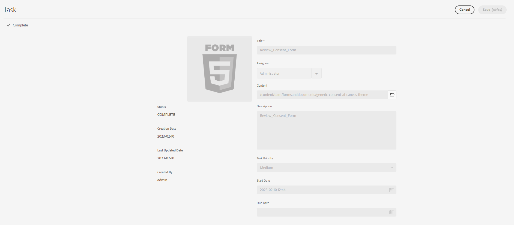

# 建立和管理表單的稽核{#creating-and-managing-reviews-to-forms}

Adobe 建議使用新式且可擴充的資料擷取[核心元件](https://experienceleague.adobe.com/docs/experience-manager-core-components/using/adaptive-forms/introduction.html)，用來[建立新的最適化表單](/help/forms/creating-adaptive-form-core-components.md)或[將最適化表單新增到 AEM Sites 頁面](/help/forms/create-or-add-an-adaptive-form-to-aem-sites-page.md)。這些元件代表最適化表單建立方面的重大進步，可確保令人印象深刻的使用者體驗。本文介紹使用基礎元件來製作最適化Forms的舊方法。 

| 版本 | 文章連結 |
| -------- | ---------------------------- |
| AEM 6.5 | [按一下這裡](https://experienceleague.adobe.com/docs/experience-manager-65/forms/adaptive-forms-advanced-authoring/create-reviews-forms.html) |
| AEM as a Cloud Service  | 本文章 |

## 評論 {#review}

稽核是一種機制，可讓一或多個稽核者在表單上加上註解。

## 設定稽核 {#setting-up-a-review}

1. 導覽至表單瀏覽器，並選取要檢閱的表單。
1. 如果表單沒有正在進行的稽核，則 **開始檢閱**  圖示會出現在「動作」列中。 按一下 **開始檢閱**  圖示。
1. 輸入下列資訊：

   * **標題**：必要，可包含英數字元、連字型大小和底線。
   * **說明**：選用，說明用途/內容以供檢閱。
   * **期限**：選擇性，稽核結束的日期。 超過截止日期時，任務顯示為「過期」。
   * **檢閱者名稱**：至少必須有一個。 使用下拉式方塊新增稽核者，輸入所有相符名稱的名稱清單；選取名稱並按一下 **新增**. 在的下一區段 **檢閱者** 標籤會顯示所有稽核者的名稱。

1. 按一下 **開始** 以開始稽核。

   >[!NOTE]
   >
   >* 管理員可以存取與表單使用者相關聯的任何群組。
   >* 服務使用者群組無法供您選取檢閱。

### 設定稽核時發生的動作 {#actions-that-occur-when-a-review-is-set-up}

本節說明建立或設定稽核時會發生什麼情況。

1. 會建立新的稽核任務並指派給所選的稽核者。
1. 所有稽核者都會被指派稽核任務。 任務會出現在其通知區段中。 檢閱者可以按一下通知，或前往「收件匣」檢視工作。 稽核者可以按一下以開啟稽核任務、檢視表單並開始新增註釋。

   

   檢閱者通知警報

1. 註解方塊可供表單的檢閱者使用。 其他人可以閱讀註解，但無法新增自己的註解。

## 管理評論 {#managing-a-review}

>[!NOTE]
>
>* 只能修改進行中的稽核。
>* 無法修改完成的檢閱。

1. 導覽至表單索引標籤並選取表單。

1. 如果表單正在進行稽核，而您是稽核的發起人， **管理評論**  圖示會顯示在動作列中。 只有稽核發起人可以管理（更新/結束）稽核。

   按一下 **管理評論** 圖示。

   對於啟動器以外的使用者，「管理檢閱」圖示會停用。

1. 現在您會看到一個顯示資訊的畫面：

   * **評論名稱**：無法編輯。

   * **檢閱說明**：可編輯。

   * **檢閱期限**：可編輯。 您可以將截止日期修改為目前日期和時間之後的任何日期和時間。

   * **檢閱者**：可編輯。 您可以新增或移除稽核者。 如果任務過期，您只能在截止日期延長至目前日期之後新增稽核者。

1. 若要結束檢閱，請按一下 **結束**.

### 修改稽核時發生的動作 {#actions-that-occur-when-a-review-is-modified}

本節說明以下專案所發生的情況： **檢閱更新/結束**：

1. 如果修改了稽核說明，則稽核者和發起者的相應任務將會更新。
1. 如果稽核截止日期已修改，則稽核者的對應任務會以新日期更新。

1. 如果移除稽核者：

   

   移除稽核者

   1. 如果未完成，則會終止指派的工作。
   1. 檢閱者無法再對表單發表評論。

1. 如果新增稽核者：

   

   新增檢閱者

   1. 稽核任務已建立並指派給新加入的稽核者。
   1. 新加入的稽核者可新增有關表單的註解。

1. 當稽核結束時：

   1. **檢閱者**：對於每個檢閱者，與檢閱相關的未完成任務會終止。 任務不再在檢視者的通知區段顯示為「待定」。
   1. **發起人**：指派給檢閱發起人的任務已標籤為完成。 任務會從稽核發起人的Notification區段中移除。
   1. **全部**：評論會顯示在「先前的評論」區段中。 無法新增其他註解。

   

## 另請參閱 {#see-also}

{{see-also}}

<!--

>[!MORELIKETHIS]
>
>* [Associating submission reviewers with a form](/help/forms/adding-reviewers-form.md)

-->