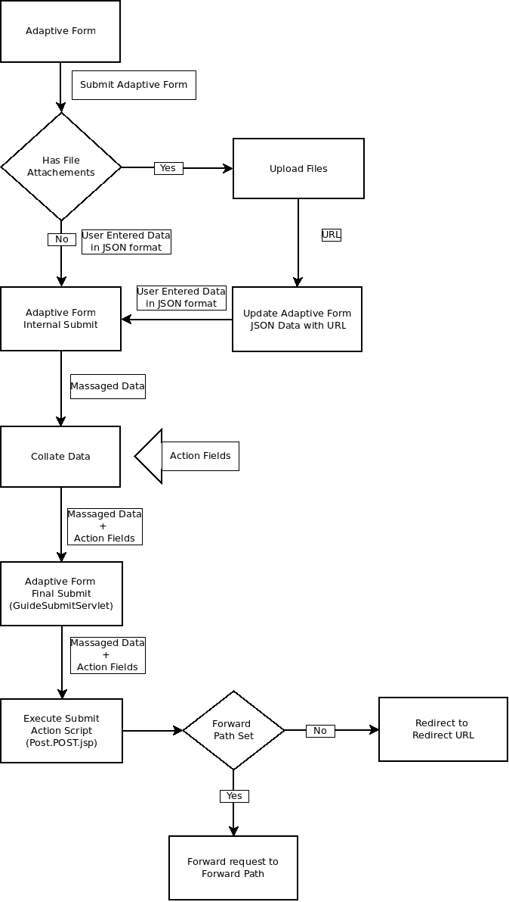

# 為自適應Forms建立自定義提交操作 {#writing-custom-submit-action-for-adaptive-forms}

自適應表單提供多個現成提交操作(OOTB)。 「提交操作」指定要對通過自適應表單收集的資料執行的操作的詳細資訊。 例如，在電子郵件中發送資料。

您可以建立自定義提交操作以添加未包含在 [預置提交操作](configuring-submit-actions.md) 或不支援通過單個OOTB提交操作。 例如，將資料提交到工作流，將資料保存在資料儲存上，向提交表單的人員發送電子郵件通知，並通過單個「提交操作」向負責處理提交表單以供審批和拒絕的人員發送電子郵件。

## XML資料格式 {#xml-data-format}

XML資料使用 **`jcr:data`** 請求參數。 「提交操作」可以訪問參數以處理資料。 以下代碼描述XML資料的格式。 綁定到「表單」模型的欄位將出現在 **`afBoundData`** 的子菜單。 未綁定的欄位出現在 `afUnoundData`的子菜單。 <!--For more information about the format of the `data.xml` file, see [Introduction to prepopulating Adaptive Form fields](prepopulate-adaptive-form-fields.md).-->

```xml
<?xml ?>
<afData>
<afUnboundData>
<data>
<field1>value</field2>
<repeatablePanel>
    <field2>value</field2>
</repeatablePanel>
<repeatablePanel>
    <field2>value</field2>
</repeatablePanel>
</data>
</afUnboundData>
<afBoundData>
<!-- xml corresponding to the Form Model /XML Schema -->
</afBoundData>
</afData>
```

### 操作欄位 {#action-fields}

提交操作可以添加隱藏的輸入欄位(使用HTML [輸入](https://developer.mozilla.org/en/docs/Web/HTML/Element/Input) 標籤)到呈現的窗體HTML。 這些隱藏欄位可以包含處理表單提交時需要的值。 在提交表單時，這些欄位值會作為請求參數被傳回，提交操作可以在提交處理過程中使用這些參數。 輸入欄位稱為操作欄位。

例如，還捕獲填寫表單所花時間的提交操作可以添加隱藏的輸入欄位 `startTime` 和 `endTime`。

指令碼可以提供 `startTime` 和 `endTime` 欄位。 提交操作指令碼 `post.jsp` 然後，可以使用請求參數訪問這些欄位並計算填寫表單所需的總時間。

### 檔案附件 {#file-attachments}

「提交操作」還可以使用「檔案附件」元件上載的檔案附件。 提交操作指令碼可以使用sling訪問這些檔案 [RequestParameter API](https://sling.apache.org/apidocs/sling5/org/apache/sling/api/request/RequestParameter.html)。 的 [是窗體欄位](https://sling.apache.org/apidocs/sling5/org/apache/sling/api/request/RequestParameter.html#isFormField()) API的方法有助於確定請求參數是檔案還是表單域。 您可以在「提交操作」中迭代「請求」參數，以標識「檔案附件」參數。

以下示例代碼標識請求中的檔案附件。 接下來，它使用 [獲取API](https://sling.apache.org/apidocs/sling5/org/apache/sling/api/request/RequestParameter.html#get())。 最後，它使用資料建立一個Document對象並將其附加到清單。

```java
RequestParameterMap requestParameterMap = slingRequest.getRequestParameterMap();
for (Map.Entry<String, RequestParameter[]> param : requestParameterMap.entrySet()) {
    RequestParameter rpm = param.getValue()[0];
    if(!rpm.isFormField()) {
        fileAttachments.add(new Document(rpm.get()));
    }
}
```

將檔案附加到Adaptive Form時，伺服器在提交Adaptive Form後驗證檔案附件，並在以下情況下返回錯誤消息：

* 檔案附件包含以(.)開頭的檔案名 字元，包含\ /*? &quot; &lt; > |;% $字元或包含為Windows作業系統保留的特殊檔案名，如 `nul`。 `prn`。 `con`。 `lpt`或 `com`。

* 檔案附件的大小為0位元組。

* 檔案附件的格式未在 [支援的檔案類型](https://helpx.adobe.com/document-cloud/help/supported-file-formats-fill-sign.html#main-pars_text) 在自適應窗體中配置檔案附件元件時。

### 轉發路徑和重定向URL {#forward-path-and-redirect-url}

執行所需操作後，提交servlet將請求轉發到轉發路徑。 操作使用setForwardPath API在指南提交servlet中設定前向路徑。

如果操作未提供轉發路徑，則提交servlet使用重定向URL重定向瀏覽器。 作者使用「自適應表單編輯」對話框中的「感謝」頁配置配置重定向URL。 您還可以通過「提交操作」或「指南提交servlet」中的setRedirectUrl API配置重定向URL。 您還可以使用指南提交servlet中的setRedirectParameters API配置發送到重定向URL的請求參數。

>[!NOTE]
>
>作者提供重定向URL（使用「感謝」頁面配置）。 [OOTB提交操作](configuring-submit-actions.md) 使用重定向URL將瀏覽器從轉發路徑引用的資源中重定向。
>
>您可以編寫一個自定義提交操作，將請求轉發到資源或servlet。 Adobe建議執行正向路徑資源處理的指令碼在處理完成後將請求重定向到重定向URL。

## 提交動作 {#submit-action}

「提交操作」(Submit Action)是sling:Folder，它包括以下內容：

* **addfields.jsp**:此指令碼提供在格式副本期間添加到HTML檔案的操作欄位。 使用此指令碼可在post.POST.jsp指令碼中添加提交期間所需的隱藏輸入參數。
* **對話框.xml**:此指令碼與「CQ元件」對話框類似。 它提供了作者自定義的配置資訊。 選擇「提交操作」後，這些欄位將顯示在「自適應表單編輯」對話框的「提交操作」頁籤中。
* **post.POST.jsp**:Submit Servlet使用您提交的資料和前面各節中的附加資料調用此指令碼。 在此頁中任何提到運行操作都意味著運行post.POST.jsp指令碼。 要將「提交操作」註冊到「自適應Forms」以在「自適應表單編輯」對話框中顯示，請將這些屬性添加到sling:Folder:

   * **guideComponentType** 字串和值類型 **fd/af/元件/指導提交類型**
   * **guideDataModel** 類型字串，指定適用提交操作的自適應表單的類型。 <!--**xfa** is supported for XFA-based Adaptive Forms while -->**xx** 支援基於XSD的自適應Forms。 **基本** 不使用XDP或XSD的Adaptive Forms支援。 要在多種類型的自適應Forms上顯示操作，請添加相應的字串。 用逗號分隔每個字串。 例如，要使操作在上可見 <!--XFA- and -->基於XSD的自適應Forms，將值指定為 <!--**xfa** and--> **xx**。

   * **jcr：說明** 類型。 此屬性的值顯示在「自適應表單編輯」對話框的「提交操作」頁籤的「提交操作」清單中。 OOTB操作存在於位置的CRX儲存庫中 **/libs/fd/af/components/guidesubmittype**。

   * **提交服務** 類型。 有關詳細資訊，請參見 [為自定義操作安排自適應表單提交](#schedule-adaptive-form-submission)。

## 建立自定義提交操作 {#creating-a-custom-submit-action}

執行以下步驟建立自定義提交操作，該操作將資料保存在CRX儲存庫中，然後向您發送電子郵件。 自適應表單包含OOTB提交操作儲存內容（已棄用），該內容將資料保存在CRX儲存庫中。 此外，還AEM提供 [郵件](https://www.adobe.io/experience-manager/reference-materials/6-5/javadoc/com/day/cq/mailer/package-summary.html) 可用於發送電子郵件的API。 使用Mail API之前，請通過系統控制台配置Day CQ Mail服務。 您可以重用「儲存內容」（已棄用）操作將資料儲存在儲存庫中。 「儲存內容（已棄用）」操作可在CRX儲存庫中的/libs/fd/af/components/guidesubmittype/store位置使用。

1. 登錄到CRXDE Lite，網址為https://&lt;server>:&lt;port>/crx/de/index.jsp。 在/apps/custom_submit_action資料夾中，使用sling:Folder和name store_and_mail屬性建立節點。 如果custom_submit_action資料夾不存在，請建立它。

   

1. **提供必需的配置欄位。**

   添加儲存操作所需的配置。 複製 **cq：對話框** 「儲存」操作的節點（從/libs/fd/af/components/guidesubmittype/store到/apps/custom_submit_action/store_and_email上的操作資料夾）。

   

1. **提供配置欄位以提示作者進行電子郵件配置。**

   Adaptive Form還提供了向用戶發送電子郵件的Email操作。 根據您的要求自定義此操作。 導航至/libs/fd/af/components/guidesubmittype/email/dialog。 將cq:dialog節點中的節點複製到「提交操作」(/apps/custom_submit_action/store_and_email/dialog)的cq:dialog節點。

   

1. **使操作在「自適應表單編輯」對話框中可用。**

   在store_and_email節點中添加以下屬性：

   * **guideComponentType** 類型 **字串** 價值 **fd/af/元件/指導提交類型**

   * **guideDataModel** 類型 **字串** 價值 **<!--xfa, -->xsd，基本**

   * **jcr：說明** 類型 **字串** 價值 **儲存和電子郵件操作**

   * **提交服務** 類型 **字串** 價值 **儲存和電子郵件**。 有關詳細資訊，請參見 [為自定義操作安排自適應表單提交](#schedule-adaptive-form-submission)。

1. 開啟任何自適應窗體。 按一下 **編輯** 按鈕 **開始** 開啟 **編輯** 對話框。 新操作將顯示在 **提交操作** 頁籤。 選擇 **儲存和電子郵件操作** 顯示在對話框節點中添加的配置。

   

1. **使用操作完成任務。**

   將post.POST.jsp指令碼添加到操作。 (/apps/custom_submit_action/store_and_mail/)。

   運行OOTB儲存操作(post.POST.jsp指令碼)。 使用 [FormsHelper.runAction](https://www.adobe.io/experience-manager/reference-materials/6-5/javadoc/com/day/cq/wcm/foundation/forms/FormsHelper.html#runAction-java.lang.String-java.lang.String-org.apache.sling.api.resource.Resource-org.apache.sling.api.SlingHttpServletRequest-org.apache.sling.api.SlingHttpServletResponse-)(java.lang.string、java.lang.String、org.apache.sling.api.resource.、org.apache.sling.api.SlingHttpServletRequest、org.apache.sling.api.SlingHttpServletResponse)API,CQ在代碼中提供以運行Store操作。 在JSP檔案中添加以下代碼：

   `FormsHelper.runAction("/libs/fd/af/components/guidesubmittype/store", "post", resource, slingRequest, slingResponse);`

   要發送電子郵件，代碼會從配置中讀取收件人的電子郵件地址。 要在操作的指令碼中提取配置值，請使用以下代碼讀取當前資源的屬性。 同樣，您也可以讀取其他配置檔案。

   `ValueMap properties = ResourceUtil.getValueMap(resource);`

   `String mailTo = properties.get("mailTo");`

   最後，使用CQ Mail API發送電子郵件。 使用 [簡單電子郵件](https://commons.apache.org/proper/commons-email/apidocs/org/apache/commons/mail/SimpleEmail.html) 類以建立電子郵件對象，如下所示：

   >[!NOTE]
   >
   >確保JSP檔案的名稱為post.POST.jsp。

   ```java
   <%@include file="/libs/fd/af/components/guidesglobal.jsp" %>
   <%@page import="com.day.cq.wcm.foundation.forms.FormsHelper,
          org.apache.sling.api.resource.ResourceUtil,
          org.apache.sling.api.resource.ValueMap,
                   com.day.cq.mailer.MessageGatewayService,
     com.day.cq.mailer.MessageGateway,
     org.apache.commons.mail.Email,
                   org.apache.commons.mail.SimpleEmail" %>
   <%@taglib prefix="sling"
                   uri="https://sling.apache.org/taglibs/sling/1.0" %>
   <%@taglib prefix="cq"
                   uri="https://www.day.com/taglibs/cq/1.0"
   %>
   <cq:defineObjects/>
   <sling:defineObjects/>
   <%
           String storeContent =
                       "/libs/fd/af/components/guidesubmittype/store";
           FormsHelper.runAction(storeContent, "post", resource,
                                   slingRequest, slingResponse);
    ValueMap props = ResourceUtil.getValueMap(resource);
    Email email = new SimpleEmail();
    String[] mailTo = props.get("mailto", new String[0]);
    email.setFrom((String)props.get("from"));
           for (String toAddr : mailTo) {
               email.addTo(toAddr);
      }
    email.setMsg((String)props.get("template"));
    email.setSubject((String)props.get("subject"));
    MessageGatewayService messageGatewayService =
                       sling.getService(MessageGatewayService.class);
    MessageGateway messageGateway =
                   messageGatewayService.getGateway(SimpleEmail.class);
    messageGateway.send(email);
   %>
   ```

   在自適應表單中選擇操作。 該操作會發送電子郵件並儲存資料。

## 將submitService屬性用於自定義提交操作 {#submitservice-property}

設定自定義提交操作時，包括 `submitService` 屬性，窗體觸發 [表單提交操作服務](https://helpx.adobe.com/experience-manager/6-5/forms/javadocs/com/adobe/aemds/guide/service/FormSubmitActionService.html) 提交。 的 `FormSubmitActionService` 使用 `getServiceName` 用於檢索 `submitService` 屬性。 基於 `submitService` 屬性，服務調用相應的提交方法。 包括 `FormSubmitActionService` 上載到 [!DNL AEM Forms] 伺服器。

添加 `submitService` 字串類型的屬性 `sling:Folder` 的自定義提交操作 [!DNL Adobe Sign] 的子菜單。 可以選擇 **[!UICONTROL 啟用Adobe Sign]** 的上界 **[!UICONTROL 電子簽名]** 在為 `submitService` 自定義提交操作的屬性。

<!--As a result of setting an appropriate value for the `submitService` property and enabling [!DNL Adobe Sign], you can schedule the submission of an Adaptive Form to ensure that all configured signers have taken an action on the form. [!DNL Adobe Sign] Configuration Service keeps polling [!DNL Adobe Sign] server at regular intervals to verify the status of signatures. If all the signers complete signing the form, the Submit Action service is started and the form is submitted.-->


<!-- You can't do comments within comments, so I changed comment tags to <start-comment> <end-comment> -->

<!--
## Workflow for a Submit Action {#workflow-for-a-submit-action}

The flowchart depicts the workflow for a Submit Action that is triggered when you click the **[!UICONTROL Submit]** button in an Adaptive Form. The files in the File Attachment component are uploaded to the server, and the form data is updated with the URLs of the uploaded files. Within the client, the data is stored in the JSON format. The client sends an Ajax request to an internal servlet that massages the data you specified and returns it in the XML format. The client collates this data with action fields. It submits the data to the final servlet (Guide Submit servlet) through a Form Submit Action. Then, the servlet forwards the control to the Submit Action. The Submit Action can forward the request to a different sling resource or redirect the browser to another URL.



### XML data format {#xml-data-format}

The XML data is sent to the servlet using the **`jcr:data`** request parameter. Submit Actions can access the parameter to process the data. The following code describes the format of the XML data. The fields that are bound to the Form model appear in the **`afBoundData`** section. Unbound fields appear in the `afUnoundData`section. For more information about the format of the `data.xml` file, see [Introduction to prepopulating Adaptive Form fields](prepopulate-adaptive-form-fields.md).

```xml
<?xml ?>
<afData>
<afUnboundData>
<data>
<field1>value</field2>
<repeatablePanel>
    <field2>value</field2>
</repeatablePanel>
<repeatablePanel>
    <field2>value</field2>
</repeatablePanel>
</data>
</afUnboundData>
<afBoundData>
<start comment> xml corresponding to the Form Model /XML Schema <end comment>
<start comment> </afBoundData> <end comment>
</afData>
```

### Action fields {#action-fields}

A Submit Action can add hidden input fields (using the HTML [input](https://developer.mozilla.org/en/docs/Web/HTML/Element/Input) tag) to the rendered form HTML. These hidden fields can contain values that it needs while processing form submission. When submitting the form, these field values are posted back as request parameters that the Submit Action can use during submission handling. The input fields are called action fields.

For example, a Submit Action that also captures the time taken to fill a form can add the hidden input fields `startTime` and `endTime`.

A script can supply the values of the `startTime` and `endTime` fields when the form renders and before form submission, respectively. The Submit Action script `post.jsp` can then access these fields using request parameters and compute the total time required to fill the form.

### File attachments {#file-attachments}

Submit Actions can also use the file attachments you upload using the File Attachment component. Submit Action scripts can access these files using the sling [RequestParameter API](https://sling.apache.org/apidocs/sling5/org/apache/sling/api/request/RequestParameter.html). The [isFormField](https://sling.apache.org/apidocs/sling5/org/apache/sling/api/request/RequestParameter.html#isFormField()) method of the API helps identify whether the request parameter is a file or a form field. You can iterate over the Request parameters in a Submit Action to identify File Attachment parameters.

The following sample code identifies the file attachments in the request. Next, it reads the data into the file using the [Get API](https://sling.apache.org/apidocs/sling5/org/apache/sling/api/request/RequestParameter.html#get()). Finally, it creates a Document object using the data and appends it to a list.

```java
RequestParameterMap requestParameterMap = slingRequest.getRequestParameterMap();
for (Map.Entry<String, RequestParameter[]> param : requestParameterMap.entrySet()) {
    RequestParameter rpm = param.getValue()[0];
    if(!rpm.isFormField()) {
        fileAttachments.add(new Document(rpm.get()));
    }
}
```

### Forward path and Redirect URL {#forward-path-and-redirect-url}

After performing the required action, the Submit servlet forwards the request to the forward path. An action uses the setForwardPath API to set the forward path in the Guide Submit servlet.

If the action doesn't provide a forward path, the Submit servlet redirects the browser using the Redirect URL. The author configures the Redirect URL using the Thank You Page configuration in the Adaptive Form Edit dialog. You can also configure the Redirect URL through the Submit Action or the setRedirectUrl API in the Guide Submit servlet. You can also configure the Request parameters sent to the Redirect URL using the setRedirectParameters API in the Guide Submit servlet.

>[!NOTE]
>
>An author provides the Redirect URL (using the Thank You Page Configuration). [OOTB Submit Actions](configuring-submit-actions.md) use the Redirect URL to redirect the browser from the resource that the forward path references.
>
>You can write a custom Submit Action that forwards a request to a resource or servlet. Adobe recommends that the script that performs resource handling for the forward path redirect the request to the Redirect URL when the processing completes.

## Submit Action {#submit-action}

A Submit Action is a sling:Folder that includes the following:

* **addfields.jsp**: This script provides the action fields that are added to the HTML file during rendition. Use this script to add hidden input parameters required during submission in the post.POST.jsp script.
* **dialog.xml**: This script is similar to the CQ Component dialog. It provides configuration information that the author customizes. The fields are displayed in the Submit Actions Tab in the Adaptive Form Edit dialog when you select the Submit Action.
* **post.POST.jsp**: The Submit servlet calls this script with the data that you submit and the additional data in the previous sections. Any mention of running an action in this page implies running the post.POST.jsp script. To register the Submit Action with the Adaptive Forms to display in the Adaptive Form Edit dialog, add these properties to the sling:Folder:

    * **guideComponentType** of type String and value **fd/af/components/guidesubmittype**
    * **guideDataModel** of type String that specifies the type of Adaptive Form for which the Submit Action is applicable. **xfa** is supported for XFA-based Adaptive Forms while **xsd** is supported for XSD-based Adaptive Forms. **basic** is supported for Adaptive Forms that do not use XDP or XSD. To display the action on multiple types of Adaptive Forms, add the corresponding strings. Separate each string by a comma. For example, to make an action visible on XFA- and XSD-based Adaptive Forms, specify the values **xfa** and **xsd** respectively.

    * **jcr:description** of type String. The value of this property is displayed in the Submit Action list in the Submit Actions Tab of the Adaptive Form Edit dialog. The OOTB actions are present in the CRX repository at the location **/libs/fd/af/components/guidesubmittype**.

## Creating a custom Submit Action {#creating-a-custom-submit-action}

Perform the following steps to create a custom Submit Action that saves the data in the CRX repository and then sends you an email. The Adaptive Form contains the OOTB Submit Action Store Content (deprecated) that saves the data in the CRX repository. In addition, CQ provides a [Mail](https://www.adobe.io/experience-manager/reference-materials/6-5/javadoc/com/day/cq/mailer/package-summary.html) API that can be used to send emails. Before using the Mail API, configure the Day CQ Mail service through the system console. You can reuse the Store Content (deprecated) action to store the data in the repository. The Store Content (deprecated) action is available at the location /libs/fd/af/components/guidesubmittype/store in the CRX repository.

1. Log in to CRXDE Lite at the URL https://&lt;server&gt;:&lt;port&gt;/crx/de/index.jsp. Create a node with the property sling:Folder and name store_and_mail in the /apps/custom_submit_action folder. Create the custom_submit_action folder if it doesn't exist already.

   

1. **Provide the mandatory configuration fields.**

   Add the configuration the Store action requires. Copy the **cq:dialog** node of the Store action from /libs/fd/af/components/guidesubmittype/store to the action folder at /apps/custom_submit_action/store_and_email.

   

1. **Provide configuration fields to prompt the author for email configuration.**

   The Adaptive Form also provides an Email action that sends emails to users. Customize this action based on your requirements. Navigate to /libs/fd/af/components/guidesubmittype/email/dialog. Copy the nodes within the cq:dialog node to cq:dialog node of your Submit Action (/apps/custom_submit_action/store_and_email/dialog).

   

1. **Make the action available in the Adaptive Form Edit dialog.**

   Add the following properties in the store_and_email node:

    * **guideComponentType** of type **String** and value **fd/af/components/guidesubmittype**

    * **guideDataModel** of type **String** and value **xfa, xsd, basic**

    * **jcr:description** of type **String** and value **Store and Email Action**

1. Open any Adaptive Form. Click the **Edit** button next to **Start** to open the **Edit** dialog of the Adaptive Form container. The new action is displayed in the **Submit Actions** Tab. Selecting the **Store and Email Action** displays the configuration added in the dialog node.

   

1. **Use the action to complete a task.**

   Add the post.POST.jsp script to your action. (/apps/custom_submit_action/store_and_mail/).

   Run the OOTB Store action (post.POST.jsp script). Use the [FormsHelper.runAction](https://www.adobe.io/experience-manager/reference-materials/6-5/javadoc/com/day/cq/wcm/foundation/forms/FormsHelper.html#runAction-java.lang.String-java.lang.String-org.apache.sling.api.resource.Resource-org.apache.sling.api.SlingHttpServletRequest-org.apache.sling.api.SlingHttpServletResponse-(java.lang.String, java.lang.String, org.apache.sling.api.resource.Resource, org.apache.sling.api.SlingHttpServletRequest, org.apache.sling.api.SlingHttpServletResponse)) API that CQ provides in your code to run the Store action. Add the following code in your JSP file:

   `FormsHelper.runAction("/libs/fd/af/components/guidesubmittype/store", "post", resource, slingRequest, slingResponse);`

   To send the email, the code reads the recipient's email address from the configuration. To fetch the configuration value in the action's script, read the properties of the current resource using the following code. Similarly you can read the other configuration files.

   `ValueMap properties = ResourceUtil.getValueMap(resource);`

   `String mailTo = properties.get("mailTo");`

   Finally, use the CQ Mail API to send the email. Use the [SimpleEmail](https://commons.apache.org/proper/commons-email/apidocs/org/apache/commons/mail/SimpleEmail.html) class to create the Email Object as depicted below:

   >[!NOTE]
   >
   >Ensure that the JSP file has the name post.POST.jsp.

   ```java
   <%@include file="/libs/fd/af/components/guidesglobal.jsp" %>
   <%@page import="com.day.cq.wcm.foundation.forms.FormsHelper,
          org.apache.sling.api.resource.ResourceUtil,
          org.apache.sling.api.resource.ValueMap,
                   com.day.cq.mailer.MessageGatewayService,
     com.day.cq.mailer.MessageGateway,
     org.apache.commons.mail.Email,
                   org.apache.commons.mail.SimpleEmail" %>
   <%@taglib prefix="sling"
                   uri="https://sling.apache.org/taglibs/sling/1.0" %>
   <%@taglib prefix="cq"
                   uri="https://www.day.com/taglibs/cq/1.0"
   %>
   <cq:defineObjects/>
   <sling:defineObjects/>
   <%
           String storeContent =
                       "/libs/fd/af/components/guidesubmittype/store";
           FormsHelper.runAction(storeContent, "post", resource,
                                   slingRequest, slingResponse);
    ValueMap props = ResourceUtil.getValueMap(resource);
    Email email = new SimpleEmail();
    String[] mailTo = props.get("mailto", new String[0]);
    email.setFrom((String)props.get("from"));
           for (String toAddr : mailTo) {
               email.addTo(toAddr);
      }
    email.setMsg((String)props.get("template"));
    email.setSubject((String)props.get("subject"));
    MessageGatewayService messageGatewayService =
                       sling.getService(MessageGatewayService.class);
    MessageGateway messageGateway =
                   messageGatewayService.getGateway(SimpleEmail.class);
    messageGateway.send(email);
   %>
   ```

   Select the action in the Adaptive Form. The action sends an email and stores the data. 

-->
