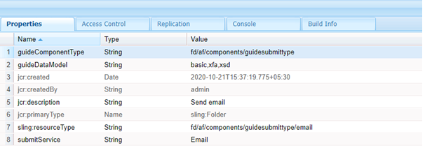

# 建立最適化Forms的自訂提交動作 {#writing-custom-submit-action-for-adaptive-forms}

| 版本 | 文章連結 |
| -------- | ---------------------------- |
| AEM 6.5 | [按一下這裡](https://experienceleague.adobe.com/docs/experience-manager-65/forms/customize-aem-forms/custom-submit-action-form.html?lang=zh-Hant) |
| AEM as a Cloud Service （核心元件） | [按一下這裡](https://experienceleague.adobe.com/zh-hant/docs/experience-manager-cloud-service/content/forms/adaptive-forms-authoring/authoring-adaptive-forms-core-components/create-an-adaptive-form-on-forms-cs/custom-submit-action-for-adaptive-forms-based-on-core-components) |
| AEM as a Cloud Service （基礎元件） | 本文章 |

最適化表單提供多個立即可用的提交動作(OOTB)。 提交動作可指定要透過最適化表單收集之資料上執行的動作細節。 例如，以電子郵件傳送資料。

您可以建立自訂提交動作，以新增[現成可用的提交動作](configuring-submit-actions.md)中未包含或不支援的功能（透過單一OOTB提交動作）。 例如，將資料提交至工作流程、將資料儲存在資料存放區、傳送電子郵件通知給提交表單的人員，以及透過單一提交動作傳送電子郵件給負責處理已提交表單以供核准和拒絕的人員。

## XML資料格式 {#xml-data-format}

使用&#x200B;**`jcr:data`**&#x200B;要求引數將XML資料傳送至servlet。 提交動作可以存取引數以處理資料。 下列程式碼說明XML資料的格式。 與表單模型繫結的欄位會顯示在&#x200B;**`afBoundData`**&#x200B;區段中。 未繫結的欄位會出現在`afUnoundData`區段中。<!--For more information about the format of the `data.xml` file, see [Introduction to prepopulating Adaptive Form fields](prepopulate-adaptive-form-fields.md).-->

```xml
<?xml ?>
<afData>
<afUnboundData>
<data>
<field1>value</field2>
<repeatablePanel>
    <field2>value</field2>
</repeatablePanel>
<repeatablePanel>
    <field2>value</field2>
</repeatablePanel>
</data>
</afUnboundData>
<afBoundData>
<!-- xml corresponding to the Form Model /XML Schema -->
</afBoundData>
</afData>
```

### 動作欄位 {#action-fields}

提交動作可以將隱藏的輸入欄位(使用HTML [input](https://developer.mozilla.org/en/docs/Web/HTML/Element/Input)標籤)新增到演算後的表單HTML。 這些隱藏欄位可包含處理表單提交時所需的值。 提交表單時，這些欄位值會傳回為請求引數，「提交動作」可在提交處理期間使用這些引數。 輸入欄位稱為動作欄位。

例如，同時擷取填寫表單所用時間的提交動作可以新增隱藏的輸入欄位`startTime`和`endTime`。

指令碼可在表單轉譯時及表單提交前分別提供`startTime`及`endTime`欄位的值。 提交動作指令碼`post.jsp`可以使用要求引數存取這些欄位，並計算填寫表單所需的總時間。

### 檔案附件 {#file-attachments}

「提交動作」也可以使用您使用「檔案附件」元件上載的檔案附件。 提交動作指令碼可以使用Sling [RequestParameter API](https://sling.apache.org/apidocs/sling5/org/apache/sling/api/request/RequestParameter.html)存取這些檔案。 API的[isFormField](https://sling.apache.org/apidocs/sling5/org/apache/sling/api/request/RequestParameter.html#isFormField())方法可協助識別要求引數是檔案或表單欄位。 您可以在「送出動作」中反複執行「要求」引數，以識別檔案附件引數。

下列範常式式碼會識別請求中的檔案附件。 接著，它會使用[取得API](https://sling.apache.org/apidocs/sling5/org/apache/sling/api/request/RequestParameter.html#get())將資料讀入檔案中。 最後，它會使用資料建立Document物件，並將其附加至清單。

```java
RequestParameterMap requestParameterMap = slingRequest.getRequestParameterMap();
for (Map.Entry<String, RequestParameter[]> param : requestParameterMap.entrySet()) {
    RequestParameter rpm = param.getValue()[0];
    if(!rpm.isFormField()) {
        fileAttachments.add(new Document(rpm.get()));
    }
}
```

將檔案附加至最適化表單時，伺服器會在最適化表單提交後驗證檔案附件，並在下列情況下傳回錯誤訊息：

* 檔案附件包括以(.)字元開頭的檔案名稱，其中包含\ / ： * ？ 「 &lt; > | ； % $$個字元，或包含保留給Windows作業系統的特殊檔案名稱，例如`nul`、`prn`、`con`、`lpt`或`com`。

* 檔案附件的大小為0位元組。

* 在調適型表單中設定檔案附件元件時，[支援的檔案型別](https://helpx.adobe.com/tw/document-cloud/help/supported-file-formats-fill-sign.html#main-pars_text)區段中未定義檔案附件的格式。

### 轉寄路徑和重新導向URL {#forward-path-and-redirect-url}

執行必要的動作後，提交servlet會將請求轉送至轉送路徑。 動作會使用setForwardPath API在指南提交servlet中設定轉寄路徑。

如果動作未提供轉寄路徑，則提交servlet會使用重新導向URL重新導向瀏覽器。 作者會使用「最適化表單編輯」對話方塊中的「感謝頁面」設定，來設定重新導向URL。 您也可以透過提交動作或指南提交servlet中的setRedirectUrl API來設定重新導向URL。 您也可以使用指南提交servlet中的setRedirectParameters API，設定傳送至重新導向URL的要求引數。

>[!NOTE]
>
>作者會提供重新導向URL （使用感謝頁面設定）。 [OOTB提交動作](configuring-submit-actions.md)使用重新導向URL，從轉送路徑參照的資源重新導向瀏覽器。
>
>您可以撰寫自訂提交動作，將請求轉送至資源或servlet。 Adobe建議在處理完成時，為轉送路徑執行資源處理的指令碼會將請求重新導向至重新導向URL。

## 提交動作 {#submit-action}

提交動作是包含以下專案的sling:Folder：

* **addfields.jsp**：此指令碼提供在轉譯期間新增至HTML檔案的動作欄位。 使用此指令碼在post.POST.jsp指令碼中新增提交期間所需的隱藏輸入引數。
* **dialog.xml**：此指令碼類似於CQ元件對話方塊。 它提供作者自訂的設定資訊。 當您選取提交動作時，欄位會顯示在「最適化表單編輯」對話方塊的「提交動作」索引標籤中。
* **post.POST.jsp**： Submit servlet會呼叫此指令碼，其中包含您提交的資料以及前幾節中的其他資料。 在此頁面中只要提到要執行動作，就表示要執行post.POST.jsp命令檔。 若要向最適化Forms註冊提交動作以顯示於最適化表單編輯對話方塊中，請將這些屬性新增到`sling:Folder`：

   * **guideComponentType**，型別為String，值為&#x200B;**fd/af/components/guidesubmittype**
   * **guideDataModel**，型別為String，指定適用提交動作的最適化表單型別。 以XSD為基礎的最適化Forms支援&#x200B;<!--**xfa** is supported for XFA-based Adaptive Forms while -->**xsd**。 不使用XDP或XSD的最適化Forms支援&#x200B;**basic**。 若要顯示多種最適化Forms型別的動作，請新增對應的字串。 以逗號分隔每個字串。 例如，若要讓動作顯示在<!--XFA- and -->XSD式Adaptive Forms上，請指定值為<!--**xfa** and--> **xsd**。

   * **jcr:description**&#x200B;屬於字串型別。 此屬性的值會顯示在「最適化表單編輯」對話方塊之「提交動作」索引標籤的「提交動作」清單中。 OOTB動作存在於CRX存放庫中&#x200B;**/libs/fd/af/components/guidessubmittype**&#x200B;位置。

   * **submitService** （型別為String）。 如需詳細資訊，請參閱[排程自訂動作的最適化表單提交](#schedule-adaptive-form-submission)。

## 建立自訂提交動作 {#creating-a-custom-submit-action}

>[!NOTE]
>
> 若要瞭解如何建立核心元件的自訂提交動作，請參閱[為最適化Forms （核心元件）建立自訂提交動作](https://experienceleague.adobe.com/zh-hant/docs/experience-manager-cloud-service/content/forms/adaptive-forms-authoring/authoring-adaptive-forms-core-components/create-an-adaptive-form-on-forms-cs/custom-submit-action-for-adaptive-forms-based-on-core-components)。

執行以下步驟來建立自訂提交動作，將資料儲存至CRX存放庫，然後傳送電子郵件給您。 最適化表單包含OOTB提交動作存放區內容（已棄用），可將資料儲存至CRX存放庫。 此外，AEM還提供可用於傳送電子郵件的[郵件](https://www.adobe.io/experience-manager/reference-materials/6-5/javadoc/com/day/cq/mailer/package-summary.html) API。 使用Mail API之前，請透過系統主控台設定Day CQ Mail服務。 您可以重複使用「儲存內容（已棄用）」動作，將資料儲存在存放庫中。 存放區內容（已棄用）動作可在CRX存放庫中的/libs/fd/af/components/guidessubmittype/store位置取得。

1. 登入CRXDE Lite，網址為https://&lt;server>：&lt;port>/crx/de/index.jsp。 在/apps/custom_submit_action資料夾中建立具有屬性sling:Folder和名稱store_and_mail的節點。 建立custom_submit_action資料夾（如果尚未存在）。

   建立節點的熒幕擷圖

2. **提供必要設定欄位。**

   新增存放區動作所需的設定。 將存放區動作的&#x200B;**cq:dialog**&#x200B;節點從/libs/fd/af/components/guidesubmittype/store複製到/apps/custom_submit_action/store_and_email的動作資料夾。

   

3. **提供設定欄位，以提示作者設定電子郵件。**

   最適化表單還提供電子郵件動作，可向使用者傳送電子郵件。 根據您的需求自訂此動作。 導覽至/libs/fd/af/components/guidessubmittype/email/dialog。 將cq:dialog節點內的節點複製到提交動作(/apps/custom_submit_action/store_and_email/dialog)的cq:dialog節點。

   

4. **讓動作可在最適化表單編輯對話方塊中使用。**

   在store_and_email節點中新增下列屬性：

   * **guideComponentType**，型別為&#x200B;**String**，值為&#x200B;**fd/af/components/guidesubmittype**

   * **guideDataModel**，型別為&#x200B;**字串**，值為&#x200B;**<!--xfa, -->xsd，基本**

   * **jcr:description**，型別為&#x200B;**字串**，值為&#x200B;**存放區與電子郵件動作**

   * **submitService** （型別為&#x200B;**String**）和值&#x200B;**Store and Email**。 如需詳細資訊，請參閱[排程自訂動作的最適化表單提交](#schedule-adaptive-form-submission)。

5. 開啟任何最適化表單。 按一下&#x200B;**開始**&#x200B;旁的&#x200B;**編輯**&#x200B;按鈕，開啟最適化表單容器的&#x200B;**編輯**&#x200B;對話方塊。 新動作會顯示在&#x200B;**提交動作**&#x200B;索引標籤中。 選取&#x200B;**存放區和電子郵件動作**&#x200B;會顯示對話方塊節點中新增的組態。

   

6. **使用此動作完成工作。**

   將post.POST.jsp指令碼新增至您的動作。 (/apps/custom_submit_action/store_and_mail/)。

   執行OOTB存放區動作（post.POST.jsp指令碼）。 使用CQ在程式碼中提供的[FormsHelper.runAction](https://www.adobe.io/experience-manager/reference-materials/6-5/javadoc/com/day/cq/wcm/foundation/forms/FormsHelper.html#runAction-java.lang.String-java.lang.String-org.apache.sling.api.resource.Resource-org.apache.sling.api.SlingHttpServletRequest-org.apache.sling.api.SlingHttpServletResponse-)&#x200B;(java.lang.String， java.lang.String， org.apache.sling.api.resource.Resource， org.apache.sling.api.SlingHttpServletRequest， org.apache.sling.api.SlingHttpServletResponse) API來執行存放區動作。 在JSP檔案中新增下列程式碼：

   `FormsHelper.runAction("/libs/fd/af/components/guidesubmittype/store", "post", resource, slingRequest, slingResponse);`

   若要傳送電子郵件，程式碼會從設定中讀取收件者的電子郵件地址。 若要在動作的指令碼中擷取設定值，請使用下列程式碼讀取目前資源的屬性。 同樣地，您可以讀取其他組態檔。

   `ValueMap properties = ResourceUtil.getValueMap(resource);`

   `String mailTo = properties.get("mailTo");`

   最後，使用CQ Mail API傳送電子郵件。 使用[SimpleEmail](https://commons.apache.org/proper/commons-email/commons-email2-javax/apidocs/org/apache/commons/mail2/javax/SimpleEmail.html)類別來建立電子郵件物件，如下所示：

   >[!NOTE]
   >
   >確定JSP檔案的名稱為post.POST.jsp。

   ```java
   <%@include file="/libs/fd/af/components/guidesglobal.jsp" %>
   <%@page import="com.day.cq.wcm.foundation.forms.FormsHelper,
          org.apache.sling.api.resource.ResourceUtil,
          org.apache.sling.api.resource.ValueMap,
                   com.day.cq.mailer.MessageGatewayService,
     com.day.cq.mailer.MessageGateway,
     org.apache.commons.mail.Email,
                   org.apache.commons.mail.SimpleEmail" %>
   <%@taglib prefix="sling"
                   uri="https://sling.apache.org/taglibs/sling/1.0" %>
   <%@taglib prefix="cq"
                   uri="https://www.day.com/taglibs/cq/1.0"
   %>
   <cq:defineObjects/>
   <sling:defineObjects/>
   <%
           String storeContent =
                       "/libs/fd/af/components/guidesubmittype/store";
           FormsHelper.runAction(storeContent, "post", resource,
                                   slingRequest, slingResponse);
    ValueMap props = ResourceUtil.getValueMap(resource);
    Email email = new SimpleEmail();
    String[] mailTo = props.get("mailto", new String[0]);
    email.setFrom((String)props.get("from"));
           for (String toAddr : mailTo) {
               email.addTo(toAddr);
      }
    email.setMsg((String)props.get("template"));
    email.setSubject((String)props.get("subject"));
    MessageGatewayService messageGatewayService =
                       sling.getService(MessageGatewayService.class);
    MessageGateway messageGateway =
                   messageGatewayService.getGateway(SimpleEmail.class);
    messageGateway.send(email);
   %>
   ```

   選取最適化表單中的動作。 動作會傳送電子郵件並儲存資料。

## 使用自訂提交動作的submitService屬性 {#submitservice-property}

當您設定包含`submitService`屬性的自訂提交動作時，表單會在提交時觸發[FormSubmitActionService](https://helpx.adobe.com/tw/experience-manager/6-5/forms/javadocs/com/adobe/aemds/guide/service/FormSubmitActionService.html)。 `FormSubmitActionService`使用`getServiceName`方法來擷取`submitService`屬性的值。 服務會根據`submitService`屬性的值，叫用適當的送出方法。 將`FormSubmitActionService`加入您上傳至[!DNL AEM Forms]伺服器的自訂套件組合。

將字串型別的`submitService`屬性新增至自訂提交動作的`sling:Folder`，以啟用最適化表單的[!DNL Adobe Sign]。 您必須先設定自訂提交動作的&#x200B;**[!UICONTROL 屬性值，才能在Adaptive Form容器屬性的]**&#x200B;電子簽章&#x200B;**[!UICONTROL 區段中選取]**&#x200B;啟用Adobe簽署`submitService`選項。

<!--As a result of setting an appropriate value for the `submitService` property and enabling [!DNL Adobe Sign], you can schedule the submission of an Adaptive Form to ensure that all configured signers have taken an action on the form. [!DNL Adobe Sign] Configuration Service keeps polling [!DNL Adobe Sign] server at regular intervals to verify the status of signatures. If all the signers complete signing the form, the Submit Action service is started and the form is submitted.-->





<!-- You can't do comments within comments, so I changed comment tags to <start-comment> <end-comment> -->

<!--
## Workflow for a Submit Action {#workflow-for-a-submit-action}

The flowchart depicts the workflow for a Submit Action that is triggered when you click the **[!UICONTROL Submit]** button in an Adaptive Form. The files in the File Attachment component are uploaded to the server, and the form data is updated with the URLs of the uploaded files. Within the client, the data is stored in the JSON format. The client sends an Ajax request to an internal servlet that massages the data you specified and returns it in the XML format. The client collates this data with action fields. It submits the data to the final servlet (Guide Submit servlet) through a Form Submit Action. Then, the servlet forwards the control to the Submit Action. The Submit Action can forward the request to a different sling resource or redirect the browser to another URL.


### XML data format {#xml-data-format}

The XML data is sent to the servlet using the **`jcr:data`** request parameter. Submit Actions can access the parameter to process the data. The following code describes the format of the XML data. The fields that are bound to the Form model appear in the **`afBoundData`** section. Unbound fields appear in the `afUnoundData`section. For more information about the format of the `data.xml` file, see [Introduction to prepopulating Adaptive Form fields](prepopulate-adaptive-form-fields.md).

```xml
<?xml ?>
<afData>
<afUnboundData>
<data>
<field1>value</field2>
<repeatablePanel>
    <field2>value</field2>
</repeatablePanel>
<repeatablePanel>
    <field2>value</field2>
</repeatablePanel>
</data>
</afUnboundData>
<afBoundData>
<start comment> xml corresponding to the Form Model /XML Schema <end comment>
<start comment> </afBoundData> <end comment>
</afData>
```

### Action fields {#action-fields}

A Submit Action can add hidden input fields (using the HTML [input](https://developer.mozilla.org/en/docs/Web/HTML/Element/Input) tag) to the rendered form HTML. These hidden fields can contain values that it needs while processing form submission. When submitting the form, these field values are posted back as request parameters that the Submit Action can use during submission handling. The input fields are called action fields.

For example, a Submit Action that also captures the time taken to fill a form can add the hidden input fields `startTime` and `endTime`.

A script can supply the values of the `startTime` and `endTime` fields when the form renders and before form submission, respectively. The Submit Action script `post.jsp` can then access these fields using request parameters and compute the total time required to fill the form.

### File attachments {#file-attachments}

Submit Actions can also use the file attachments you upload using the File Attachment component. Submit Action scripts can access these files using the sling [RequestParameter API](https://sling.apache.org/apidocs/sling5/org/apache/sling/api/request/RequestParameter.html). The [isFormField](https://sling.apache.org/apidocs/sling5/org/apache/sling/api/request/RequestParameter.html#isFormField()) method of the API helps identify whether the request parameter is a file or a form field. You can iterate over the Request parameters in a Submit Action to identify File Attachment parameters.

The following sample code identifies the file attachments in the request. Next, it reads the data into the file using the [Get API](https://sling.apache.org/apidocs/sling5/org/apache/sling/api/request/RequestParameter.html#get()). Finally, it creates a Document object using the data and appends it to a list.

```java
RequestParameterMap requestParameterMap = slingRequest.getRequestParameterMap();
for (Map.Entry<String, RequestParameter[]> param : requestParameterMap.entrySet()) {
    RequestParameter rpm = param.getValue()[0];
    if(!rpm.isFormField()) {
        fileAttachments.add(new Document(rpm.get()));
    }
}
```

### Forward path and Redirect URL {#forward-path-and-redirect-url}

After performing the required action, the Submit servlet forwards the request to the forward path. An action uses the setForwardPath API to set the forward path in the Guide Submit servlet.

If the action does not provide a forward path, the Submit servlet redirects the browser using the Redirect URL. The author configures the Redirect URL using the Thank You Page configuration in the Adaptive Form Edit dialog. You can also configure the Redirect URL through the Submit Action or the setRedirectUrl API in the Guide Submit servlet. You can also configure the Request parameters sent to the Redirect URL using the setRedirectParameters API in the Guide Submit servlet.

>[!NOTE]
>
>An author provides the Redirect URL (using the Thank You Page Configuration). [OOTB Submit Actions](configuring-submit-actions.md) use the Redirect URL to redirect the browser from the resource that the forward path references.
>
>You can write a custom Submit Action that forwards a request to a resource or servlet. Adobe recommends that the script that performs resource handling for the forward path redirect the request to the Redirect URL when the processing completes.

## Submit Action {#submit-action}

A Submit Action is a sling:Folder that includes the following:

* **addfields.jsp**: This script provides the action fields that are added to the HTML file during rendition. Use this script to add hidden input parameters required during submission in the post.POST.jsp script.
* **dialog.xml**: This script is similar to the CQ Component dialog. It provides configuration information that the author customizes. The fields are displayed in the Submit Actions Tab in the Adaptive Form Edit dialog when you select the Submit Action.
* **post.POST.jsp**: The Submit servlet calls this script with the data that you submit and the additional data in the previous sections. Any mention of running an action in this page implies running the post.POST.jsp script. To register the Submit Action with the Adaptive Forms to display in the Adaptive Form Edit dialog, add these properties to the sling:Folder:

    * **guideComponentType** of type String and value **fd/af/components/guidesubmittype**
    * **guideDataModel** of type String that specifies the type of Adaptive Form for which the Submit Action is applicable. **xfa** is supported for XFA-based Adaptive Forms while **xsd** is supported for XSD-based Adaptive Forms. **basic** is supported for Adaptive Forms that do not use XDP or XSD. To display the action on multiple types of Adaptive Forms, add the corresponding strings. Separate each string by a comma. For example, to make an action visible on XFA- and XSD-based Adaptive Forms, specify the values **xfa** and **xsd** respectively.

    * **jcr:description** of type String. The value of this property is displayed in the Submit Action list in the Submit Actions Tab of the Adaptive Form Edit dialog. The OOTB actions are present in the CRX repository at the location **/libs/fd/af/components/guidesubmittype**.

## Creating a custom Submit Action {#creating-a-custom-submit-action}

Perform the following steps to create a custom Submit Action that saves the data in the CRX repository and then sends you an email. The Adaptive Form contains the OOTB Submit Action Store Content (deprecated) that saves the data in the CRX repository. In addition, CQ provides a [Mail](https://www.adobe.io/experience-manager/reference-materials/6-5/javadoc/com/day/cq/mailer/package-summary.html) API that can be used to send emails. Before using the Mail API, configure the Day CQ Mail service through the system console. You can reuse the Store Content (deprecated) action to store the data in the repository. The Store Content (deprecated) action is available at the location /libs/fd/af/components/guidesubmittype/store in the CRX repository.

1. Log in to CRXDE Lite at the URL https://&lt;server&gt;:&lt;port&gt;/crx/de/index.jsp. Create a node with the property sling:Folder and name store_and_mail in the /apps/custom_submit_action folder. Create the custom_submit_action folder if it does not exist already.

   

1. **Provide the mandatory configuration fields.**

   Add the configuration the Store action requires. Copy the **cq:dialog** node of the Store action from /libs/fd/af/components/guidesubmittype/store to the action folder at /apps/custom_submit_action/store_and_email.

   

1. **Provide configuration fields to prompt the author for email configuration.**

   The Adaptive Form also provides an Email action that sends emails to users. Customize this action based on your requirements. Navigate to /libs/fd/af/components/guidesubmittype/email/dialog. Copy the nodes within the cq:dialog node to cq:dialog node of your Submit Action (/apps/custom_submit_action/store_and_email/dialog).

   

1. **Make the action available in the Adaptive Form Edit dialog.**

   Add the following properties in the store_and_email node:

    * **guideComponentType** of type **String** and value **fd/af/components/guidesubmittype**

    * **guideDataModel** of type **String** and value **xfa, xsd, basic**

    * **jcr:description** of type **String** and value **Store and Email Action**

1. Open any Adaptive Form. Click the **Edit** button next to **Start** to open the **Edit** dialog of the Adaptive Form container. The new action is displayed in the **Submit Actions** Tab. Selecting the **Store and Email Action** displays the configuration added in the dialog node.

   

1. **Use the action to complete a task.**

   Add the post.POST.jsp script to your action. (/apps/custom_submit_action/store_and_mail/).

   Run the OOTB Store action (post.POST.jsp script). Use the [FormsHelper.runAction](https://www.adobe.io/experience-manager/reference-materials/6-5/javadoc/com/day/cq/wcm/foundation/forms/FormsHelper.html#runAction-java.lang.String-java.lang.String-org.apache.sling.api.resource.Resource-org.apache.sling.api.SlingHttpServletRequest-org.apache.sling.api.SlingHttpServletResponse-(java.lang.String, java.lang.String, org.apache.sling.api.resource.Resource, org.apache.sling.api.SlingHttpServletRequest, org.apache.sling.api.SlingHttpServletResponse)) API that CQ provides in your code to run the Store action. Add the following code in your JSP file:

   `FormsHelper.runAction("/libs/fd/af/components/guidesubmittype/store", "post", resource, slingRequest, slingResponse);`

   To send the email, the code reads the recipient's email address from the configuration. To fetch the configuration value in the action's script, read the properties of the current resource using the following code. Similarly you can read the other configuration files.

   `ValueMap properties = ResourceUtil.getValueMap(resource);`

   `String mailTo = properties.get("mailTo");`

   Finally, use the CQ Mail API to send the email. Use the [SimpleEmail](https://commons.apache.org/proper/commons-email/apidocs/org/apache/commons/mail/SimpleEmail.html) class to create the Email Object as depicted below:

   >[!NOTE]
   >
   >Ensure that the JSP file has the name post.POST.jsp.

   ```java
   <%@include file="/libs/fd/af/components/guidesglobal.jsp" %>
   <%@page import="com.day.cq.wcm.foundation.forms.FormsHelper,
          org.apache.sling.api.resource.ResourceUtil,
          org.apache.sling.api.resource.ValueMap,
                   com.day.cq.mailer.MessageGatewayService,
     com.day.cq.mailer.MessageGateway,
     org.apache.commons.mail.Email,
                   org.apache.commons.mail.SimpleEmail" %>
   <%@taglib prefix="sling"
                   uri="https://sling.apache.org/taglibs/sling/1.0" %>
   <%@taglib prefix="cq"
                   uri="https://www.day.com/taglibs/cq/1.0"
   %>
   <cq:defineObjects/>
   <sling:defineObjects/>
   <%
           String storeContent =
                       "/libs/fd/af/components/guidesubmittype/store";
           FormsHelper.runAction(storeContent, "post", resource,
                                   slingRequest, slingResponse);
    ValueMap props = ResourceUtil.getValueMap(resource);
    Email email = new SimpleEmail();
    String[] mailTo = props.get("mailto", new String[0]);
    email.setFrom((String)props.get("from"));
           for (String toAddr : mailTo) {
               email.addTo(toAddr);
      }
    email.setMsg((String)props.get("template"));
    email.setSubject((String)props.get("subject"));
    MessageGatewayService messageGatewayService =
                       sling.getService(MessageGatewayService.class);
    MessageGateway messageGateway =
                   messageGatewayService.getGateway(SimpleEmail.class);
    messageGateway.send(email);
   %>
   ```

   Select the action in the Adaptive Form. The action sends an email and stores the data. 

-->

>[!MORELIKETHIS]
>
>* [設定最適化表單的提交動作](/help/forms/configure-submit-actions-core-components.md)