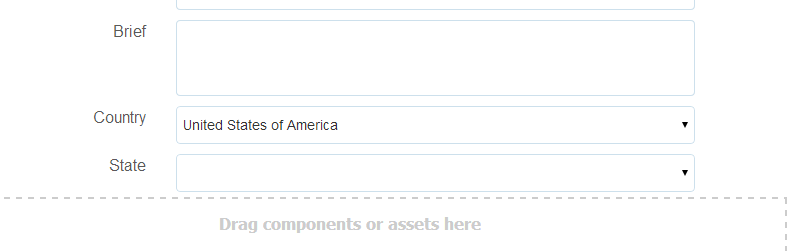

# 動態填入下拉式清單 {#dynamically-populating-drop-down-lists}

## 先決條件 {#prerequisites}

* [正在建立OSGI組合](https://helpx.adobe.com/experience-manager/using/creating-osgi-bundles-digital-marketing.html)
* [正在開發AEM元件](https://experienceleague.adobe.com/docs/experience-manager-cloud-service/implementing/developing/full-stack/components-templates/overview.html#developing)
* [建立最適化表單](creating-adaptive-form.md)
* [製作最適化表單](introduction-forms-authoring.md)

## 動態填入下拉式清單的程式 {#procedure-to-dynamically-populate-drop-down-lists}

假設您想要根據您在&#x200B;**國家**&#x200B;下拉式清單中選取的值填入&#x200B;**國家**&#x200B;下拉式清單。 如果您在&#x200B;**國家**&#x200B;下拉式清單中選取「澳洲」，**國家**&#x200B;下拉式清單會顯示澳洲境內的國家。 下列程式說明如何完成此工作。

1. 建立包含下列模組的專案：

   * 包含邏輯以填入下拉式清單（在此例中為servlet）的套件組合。
   * 內嵌.jar檔案且具有下拉式資源的內容。 此servlet指向此資源。

1. 根據請求引數Country編寫servlet，該引數會傳回包含該國家/地區內州名的陣列。

   ```java
   @Component(metatype = false)
   @Service(value = Servlet.class)
   @Properties({
           @Property(name = "sling.servlet.resourceTypes", value = "/apps/populatedropdown"),
           @Property(name = "sling.servlet.methods", value = {"GET", "POST"}),
           @Property(name = "service.description", value = "Populate states drop-down based on country value")
   })
   public class DropDownPopulator extends SlingAllMethodsServlet {
       private Logger logger = LoggerFactory.getLogger(DropDownPopulator.class);
   
       protected void doPost(SlingHttpServletRequest request,
                             final SlingHttpServletResponse response)
               throws ServletException, IOException {
           response.setHeader("Access-Control-Allow-Origin", "*");
           response.setContentType("application/json");
           response.setCharacterEncoding("UTF-8");
           try {
               String US_STATES[] = {"0=Alabama",
                       "1=Alaska",
                       "2=Arizona",
                       "3=Arkansas",
                       "4=California",
                       "5=Colorado",
                       "6=Connecticut",
                       "7=Delaware",
                       "8=Florida",
                       "9=Georgia",
                       "10=Hawaii",
                       "11=Idaho",
                       "12=Illinois",
                       "13=Indiana",
                       "14=Iowa",
                       "15=Kansas",
                       "16=Kentucky",
                       "17=Louisiana",
                       "18=Maine",
                       "19=Maryland",
                       "20=Massachusetts",
                       "21=Michigan",
                       "22=Minnesota",
                       "23=Mississippi",
                       "24=Missouri",
                       "25=Montana",
                       "26=Nebraska",
                       "27=Nevada",
                       "28=New Hampshire",
                       "29=New Jersey",
                       "30=New Mexico",
                       "31=New York",
                       "32=North Carolina",
                       "33=North Dakota",
                       "34=Ohio",
                       "35=Oklahoma",
                       "36=Oregon",
                       "37=Pennsylvania",
                       "38=Rhode Island",
                       "39=South Carolina",
                       "40=South Dakota",
                       "41=Tennessee",
                       "42=Texas",
                       "43=Utah",
                       "44=Vermont",
                       "45=Virginia",
                       "46=Washington",
                       "47=West Virginia",
                       "48=Wisconsin",
                       "49=Wyoming"};
               String AUSTRALIAN_STATES[] = {"0=Ashmore and Cartier Islands",
                       "1=Australian Antarctic Territory",
                       "2=Australian Capital Territory",
                       "3=Christmas Island",
                       "4=Cocos (Keeling) Islands",
                       "5=Coral Sea Islands",
                       "6=Heard Island and McDonald Islands",
                       "7=Jervis Bay Territory",
                       "8=New South Wales",
                       "9=Norfolk Island",
                       "10=Northern Territory",
                       "11=Queensland",
                       "12=South Australia",
                       "13=Tasmania",
                       "14=Victoria",
                       "15=Western Australia"};
               String country = request.getParameter("country");
               JSONArray stateJsonArray = new JSONArray();
               if (country.length() > 0) {
                   if ("australia".equalsIgnoreCase(country)) {
                       stateJsonArray = new JSONArray();
                       for (String state : AUSTRALIAN_STATES) {
                           stateJsonArray.put(state);
                       }
                   } else if ("unitedstates".equalsIgnoreCase(country)) {
                       stateJsonArray = new JSONArray();
                       for (String state : US_STATES) {
                           stateJsonArray.put(state);
                       }
                   }
                   response.setContentType("application/json");
                   response.getWriter().write(stateJsonArray.toString());
               }
   
           } catch ( Exception e) {
               logger.error(e.getMessage(), e);
           }
       }
   }
   ```

1. 在應用程式中的特定資料夾階層下建立下拉式節點（例如，在/apps/myfolder/demo下建立節點）。 確定節點的`sling:resourceType`引數與servlet指向的引數相同(/apps/populatedropdown)。

   

1. 封裝內容節點並將.jar檔案內嵌於特定位置（例如/apps/myfolder/demo/install/）。 在伺服器上部署相同的檔案。
1. 建立最適化表單，並在其中新增兩個下拉式清單：國家/地區和州。 國家/地區清單可包含國家/地區的名稱。 「州」清單可動態填入您在第一個清單中所選國家/地區的州名。

   新增要在國家/地區清單中顯示的國家/地區名稱。 在「州」清單中，新增指令碼，以根據「國家/地區」清單中的國家/地區名稱填入指令碼。

     

   ```javascript
   JSON.parse(
       $.ajax({
           url: "/apps/myfolder/demo/dropdown",
           type: "POST",
           async: false,
           data: {"country": country.value},
            success: function(res){},
            error : function (message) {
                 guideBridge._guide.logger().log(message);
                 successFlag = false;
                 }
              })
   .responseText);
   ```

內容套件包含實施上述程式碼的範例最適化表單（示範/AFdemo）。

[取得檔案](assets/dropdown-demo-content-1.0.1-snapshot.zip)


>[!MORELIKETHIS]
>
>* [預填最適化表單欄位](/help/forms/prepopulate-adaptive-form-fields.md)
