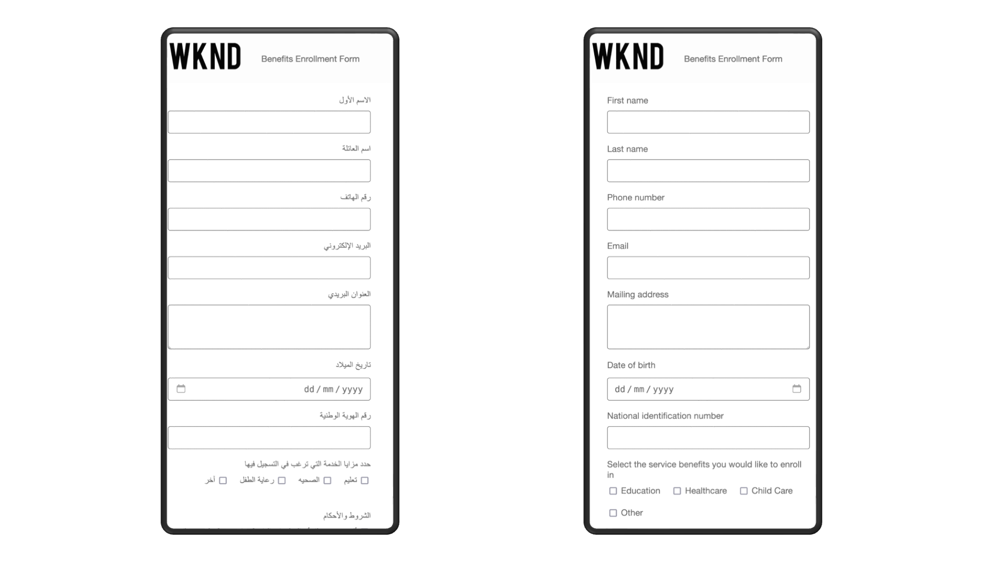

# AEM Forms搶先體驗計畫

AEM Forms搶先使用計畫提供絕佳機會，讓您可以搶在其他人之前獨佔使用尖端功能，並幫助打造開發流程。 此計畫提供您：

* 成為搶先體驗尖端技術的企業之一。
* 與產品團隊共同創新，共同塑造產品的未來。 使用您的使用案例來指導開發，確保創新成熟並解決現實世界的挑戰。
* 提供意見回饋，並協助我們在發行前解決問題，以便在完整發行時提供更流暢的使用者體驗。

## 如何加入搶先體驗計畫？

如果您有興趣加入我們的搶先存取計畫，以取得任何搶先存取創新，只要從您的正式地址傳送電子郵件至[aem-forms-ea@adobe.com](mailto:aem-forms-ea@adobe.com)要求存取即可。 您可以要求存取所有或任何特定的創新。

## 搶先體驗創新

### AEM Forms AI助理(Gen AI)

最適化表單的生成式 AI 全面提升表單開發流程的功能和易用性。藉助智慧型人工智慧功能，您可以以前所未有的速度建立更好的表單。

>[!VIDEO](https://video.tv.adobe.com/v/3435527)

透過AEM Forms AI Assistant提供的Generative AI功能包括：

* **產品查詢的 AI 助理**：立即取得 AEM 表單相關問題的答案。我們的AI助理就像您自己的個人知識庫，直接在平台內提供有見地的指引和建議。

* **調適型表單生成**：使用生成式 AI 提示輕鬆建立完整的表單。生成式 AI 會自動產生易於使用的表單，可降低流失率，同時提供個人化的體驗。

* **產生Forms的面板**：讓AI執行繁重的工作。 根據特定資料收集需求產生預先建立的表單面板。 例如，產生用於收集付款資訊、客戶偏好設定或旅行詳細資訊的區段。 節省時間並確保與預先定義的版面配置及功能的一致性。

* **變更表單版面配置**：使用生成式 AI 提示嘗試不同的版面配置和設計。嘗試不同的版面配置，例如精靈或索引標籤檢視，找到最適合您的表單版面配置。使用生成式 AI 提示來將表單最佳化，讓表單能夠在各種行動裝置上妥善顯示，並建立能在視覺上吸引使用者的表單。

* **設定提交動作**：使用生成式 AI 提示輕鬆設定表單的提交動作。從預先建立的程式庫提交動作或由您擁有的開發團隊建立和部署的自訂提交動作清單中進行選擇。

### AEM Forms Workfront Fusion聯結器

AEM Forms Workfront Fusion聯結器可緊密整合Adobe Experience Manager (AEM) Forms與Adobe Workfront Fusion。 Adobe Workfront作為工作管理應用程式，集中處理整個工作生命週期，而Workfront Fusion則作為整合平台，促進Workfront與各種業務應用程式之間的連線。

使用AEM Forms Workfront Fusion Connector，您可以設計在提交最適化表單時自動觸發的工作流程。 例如，設想這樣一個場景：啟動工作流程以便將審查提交資料的任務分配給特定個人，進而允許根據透過最適化表單擷取的資訊來核准或拒絕申請。這項簡化的整合可提升效率，並將工作流程自動化提升到新的水準。

準備好開始了嗎？ [提交最適化表單至Adobe Workfront Fusion](/help/forms/submit-adaptive-form-to-workfront-fusion.md)檔案提供使用創新的逐步指南。

<!--      -->

### 對話式Forms

對話式Forms創新功能可讓您與表單互動，就像任何AEM Sites頁面上的友好聊天機器人。

您可以直接將Conversational Forms元件拖放至AEM Sites頁面並開始使用。 不需要程式碼，因此任何人都能快速建立吸引人且方便使用的對話Forms體驗。

Forms帶來的更多對話功能如下：

* **簡易表單探索**：透過清晰且對話的介面，在任何AEM Sites頁面上尋找您所需的確切表單。
* **聊天式完成**：一次回答一個問題，就像與虛擬助理聊天一樣。 快速、直覺，感覺像是交談。
* **提交前先預覽**：在點選提交前仔細檢查所有內容。 預覽您完成的表單，以確保正確性並避免任何最後一刻的錯誤。

對話式Forms不僅是一種新外觀 — 它還能改變使用者體驗的遊戲規則。  提升參與度、減少表單放棄率，並讓每個人都能更愉快地與您的網站互動。

### AEM Forms至Marketo聯結器

[AEM Forms至Marketo聯結器](/help/forms/integrate-form-to-marketo-engage.md)彌合了使用Adobe Experience Manager (AEM)建立的網路表單(最適化Forms)與行銷自動化平台Marketo之間的差距。

當有人在使用AEM Adaptive Forms建立的網站上提交表單時，聯結器會確保提交的資料會自動傳送至Marketo。 如此一來，您就不需要手動輸入資料，並降低錯誤風險。

聯結器可簡化資料傳輸程式，協助您改善網站的轉換率。 透過自動傳送潛在客戶資料至Marketo，您可以確保合格的潛在客戶可快速進入您的培育計畫。

本質上，AEM Forms至Marketo Connector可協助您運用兩個平台的優勢，建立更有效率的行銷funnel。

準備好開始了嗎？ 以下文章提供使用創新的詳細指示。

* [將 Marketo Engage 與 AEM Forms 進行整合](/help/forms/integrate-form-to-marketo-engage.md)
* [整合最適化表單與Marketo Engage](/help/forms/integrate-adaptive-form-with-marketo-engage.md)
* [為現有的Adaptive Forms設定Marketo Engage廣告資料來源](/help/forms/use-marketo-engage-data-source-in-form.md)
* [提交現有的最適化表單至Marketo Engage](/help/forms/submit-adaptive-form-to-marketo-engage.md)

### 雲端上的互動式通訊

Cloud上的互動式通訊是建立、管理和提供資料導向互動式通訊的強大解決方案，例如商務信函、檔案、對帳單、利益通知、行銷郵件、帳單和歡迎套件。

#### 主要功能：

* **雲端型編輯器**：不同於只能安裝在Windows電腦上的AEM Forms Desktop Designer，互動式通訊編輯器可在任何新式瀏覽器中執行，而不需要安裝。 這種雲端式方法可免除安裝麻煩、提供跨平台協助工具，並可透過網際網路存取從任何位置進行協同合作。

* **方便使用的設計**：直覺式的點選式介面，需要最少的技術知識。

* **資料整合**：連線至結構描述、資料庫和網頁服務，以產生動態內容。

* **豐富型媒體**：順暢地整合文字、影像和互動元素。

* **檔案片段**：重複使用多個檔案的模組化內容區塊，以維持一致性和效率。

* **多頻道輸出**：建立符合法規要求的跨列印和數位格式的統一體驗。

* **動態內容**：使用商業邏輯和資料繫結產生個人化內容。

* **格式彈性**：輸出為PDF、HTML、PCL、PostScript®和ZPL格式。

* **規則編輯器**：使用直覺式的點選式介面，直接在您的檔案中建立動態的資料導向動作。 輕鬆定義條件式邏輯、自動化工作流程，以及將內容個人化，不需要編寫程式碼。

* **PDF預覽：**&#x200B;預覽沒有資料、本機JSON檔案或資料模型的互動式通訊，以進行彈性的資料導向測試。
* **自訂字型：**&#x200B;內嵌自訂或組織核准的字型，以確保跨裝置一致、品牌化的PDF轉譯。
* **匯入和匯出：**&#x200B;在不同環境中順暢地移轉及重複使用互動式通訊，以及它們的片段和資料模型。

* **範本鎖定**：鎖定範本中的內容與版面配置元素，以維持品牌完整性並防止未經授權的修改。

* **內容溢位**：「允許在內容內分頁」選項適用於流程版面配置，以順利編輯多頁並改善複雜檔案的文字管理。

* **XDP檔案編輯**：您現在可以在瀏覽器中編輯XDP檔案，而不是只在Forms Windows案頭上執行的Microsoft Designer。

##### 動態頁面編號

在主版頁面上自動顯示「第#頁，共#頁」，以在多頁檔案中進行清晰、一致的分頁。

#### 使用案例：

* 產生帳戶對帳單的金融機構
* 精簡福利通知的政府機構
* 建立高品質、安全且符合法律規範的通訊
* 管理資料導向互動式對應關係的建立、組裝和傳遞

準備好開始了嗎？ 互動式通訊編輯器可在Forms as a Cloud Service部署的搶先存取計畫下取得。 若要要求存取權，請從您的正式地址將您的組織ID和方案詳細資料以電子郵件傳送至[aem-forms-ea@adobe.com](mailto:aem-forms-ea@adobe.com)。

### Adobe Experience Platform (AEP) 與 AEM Forms 整合

您可以連結AEM Forms與Adobe Experience Platform (AEP)，以運用客戶設定檔和資料提供個人化表單體驗，並根據表單提交觸發下游工作流程。 透過直接將表單資料傳送到AEP資料集，您可以豐富客戶設定檔，並深入瞭解使用者互動。

準備好開始了嗎？ [進一步瞭解如何整合AEM Forms與Adobe Experience Platform (AEP)](/help/forms/aem-forms-aep-connector.md)。

### AEM FORMS HTML5 FORMS

AEM Forms HTML5 Forms可讓您以HTML5格式轉譯現有的XFA (XML Forms Architecture)表單範本，以便在不支援XFA型PDF的現代瀏覽器和行動裝置上存取。 此功能可縮短傳統PDF forms與現代Web體驗之間的差距。

**主要功能：**

* **以HTML5轉譯XFA表單範本**：以HTML5格式轉譯您現有的XFA表單，以將您的使用者端平台擴充至支援HTML5但不支援Adobe Reader搭配XFA Forms的行動裝置(Apple iPad、Android平板電腦、智慧型手機等)。

* **適用於行動裝置的表單**： HTML5 Forms提供多種適用於行動裝置的功能，協助您利用HTML5瀏覽器將目前的解決方案和工作流程擴充至平板電腦或智慧型手機。

* **協助工具支援**： HTML5 Forms使用ARIA HTML5協助工具標準並支援索引標籤導覽，使其與JAWS和VoiceOver等常見熒幕助讀程式相容。

* **自訂功能**：您可以自訂現有Widget的外觀、建立您自己的自訂Widget，或使用CSS和JavaScript等標準Web技術在表單中使用自訂樣式。

* **由右至左語言支援**： HTML5 Forms支援由右至左的語言，例如希伯來文，讓您能夠顯示和填寫RTL語言的表單。

* **附件支援**：使用HTML5表單上傳、預覽及提交附件，以強化資料收集。

* **草稿儲存**：將HTML5表單儲存為草稿，並在稍後階段繼續填寫表單。

準備好開始了嗎？ [HTML5表單簡介](/help/forms/introductionhtml5.md)檔案提供這項創新的全面概覽和快速入門手冊。

### 適用於自訂元件的AEM Forms Scaffolder CLI

使用AEM Forms CLI工具加速AEM Forms Edge Delivery Services開發。 這個命令列介面可讓您立即產生啟動自訂元件開發所需的程式碼和接線 — 沒有樣板，也不麻煩。

>[!VIDEO]（<https://video.tv.adobe.com/v/3470514/aem-forms>支架 — aem-custom component generator-aem-forms cli-aem-forms custom component-aem-forms開發工具）

**主要功能：**

* **快速支架**：立即產生新自訂元件的結構和程式碼，減少手動設定時間。
* **內建最佳實務**：此工具遵循AEM Forms Edge Delivery Services的建議模式，以確保一致性和可維護性。
* **開發人員生產力**：專注於建置商業邏輯和UI，而CLI則處理重複的設定工作。
* **緊密整合**：產生的元件已準備就緒，可使用並與您現有的AEM Forms專案整合。

準備好開始了嗎？ 適用於AEM Forms as a Cloud Service部署的Forms搶先存取計畫下提供CLI工具。 若要要求存取權，請從您的正式地址將您的組織ID和方案詳細資料以電子郵件傳送至[aem-forms-ea@adobe.com](mailto:aem-forms-ea@adobe.com)。

### 動態表單資料的API整合工具

表單作者可以利用 API 整合工具來建立動態、智慧的表單，而此表單會根據使用者互動情形，自動從外部 REST API 擷取及填入資料。這項無程式碼整合功能將靜態表單轉換為回應式資料彙集介面。

主要功能包括：

* **視覺設定介面**：透過直覺式的點選式介面建立API整合，而不需要自訂編碼
* **即時資料填入**：根據使用者輸入自動填入表單欄位（例如，使用者輸入郵遞區號時自動填寫城市和州）
* **彈性API支援**：連線至任何公開存取的REST API，並支援GET/POST方法、驗證和JSON/XML回應
* **規則型觸發器**：定義使用內建規則引擎觸發API呼叫的時間（例如，欄位變更、表單事件）
* **智慧資料對應**：使用Adobe的JSON剖析功能，設定API回應資料對應到特定表單欄位的方式
* **增強的使用者體驗**：減少手動資料輸入、改善資料準確性，並建立更吸引人的表單互動

此工具對於地址自動完成、動態下拉式母體、針對外部資料庫的即時驗證以及建立根據使用者輸入進行調整的內容感知表單體驗等案例特別有用。

## 其他早期存取創新

### 最適化表單中的 HTML 電子郵件範本

最適化表單讓您能夠使用 [HTML 電子郵件範本](/help/forms/html-email-templates-in-adaptive-forms.md)。HTML 電子郵件範本讓您能夠在提交表單時發送內容豐富又有視覺吸引力的個人化電子郵件。這些電子郵件可以使用表單資料進行自訂，並運用各種電子郵件標籤 (例如影像和連結) 加強內容。透過最適化表單，您可以上傳包含 HTML 範本的檔案，或使用純文字編輯器來建立這些範本。

### RESTful Web服務提交動作

最適化Forms現在可以使用新的RESTful Web服務提交動作，順暢地將擷取的資料傳送至已驗證的外部REST端點：

* 支援的標準：Swagger 2.0和3.0可輕鬆整合API
* 安全驗證：OAuth 2.0、基本驗證、API金鑰以及自訂驗證
* 彈性的資料格式：多部分表單資料、JSON和URL編碼（索引鍵值配對）

### 由右至左(RTL)語言支援

最適化Forms現在能以由右至左(RTL)語言顯示，提供更具包容性的使用者體驗並方便使用。

此功能適用於阿拉伯文、希伯來文和烏爾都文等語言，這些語言是從右至左(RTL)書寫和閱讀的，有助於提高表單的理解和完成率。

Adaptive Forms中支援的由右至左(RTL)語言可協助您：

* **擴充使用者群**：企業現在可觸及全球超過20億熟悉RTL語言的使用者。

* **提供增強的使用者體驗**： Forms可完美呈現，自然文字由右至左排列、適當的UI元素對齊方式，以及符合使用者閱讀習慣的直覺式版面配置。 這能減少混淆，並提高完成率。

* **提供行動回應式體驗**：由於固有的行動回應能力，Forms仍可在任何裝置上存取，以確保在桌上型電腦、平板電腦和智慧型手機上都能順暢體驗。

整體而言，最適化Forms中的RTL語言支援讓企業能夠設計真正的全球性表單，擴大觸及率、參與度和包容性。

準備好開始了嗎？ [最適化Forms RTL檔案](/help/forms/supporting-new-language-localization-core-components.md)提供使用RTL創新的逐步指南。

### 強化機器人保護方法

AEM Forms 新增對於 Cloudflare Turnstile 和 hCaptcha 兩種熱門驗證碼解決方案的支援，藉此強化其安全性功能。這是在既有的 Google reCAPTCHA 以外新增的解決方案，讓使用者擁有更多保護表單的選擇和彈性，避免發生機器人和垃圾郵件提交資料的情況。

* **Cloudflare Turnstile**：這種無摩擦的驗證碼利用不需要明確互動的簡易挑戰來驗證使用者。它與您的表單無縫整合，可提升使用者體驗。
* **hCaptcha**：這種重視隱私的驗證碼提供簡單易用且著重資料隱私權的替代方案。其目的是在安全性和使用者體驗之間取得平衡。
* **Google reCAPTCHA**：AEM Forms 繼續支援 reCAPTCHA v2 和 reCAPTCHA Enterprise，提供可靠且完善的解決方案。

透過提供多個驗證碼選項，AEM Forms 讓您根據自己的具體需求選擇最合適的解決方案。

是否準備好將上述任一驗證碼解決方案與您的最適化表單整合？我們的文件提供各個解決方案的詳細操作指示，包括 [Cloudflare Turnstile](https://experienceleague.adobe.com/zh-hant/docs/experience-manager-cloud-service/content/forms/adaptive-forms-authoring/authoring-adaptive-forms-core-components/create-an-adaptive-form-on-forms-cs/integrate-adaptive-forms-turnstile-core-components)、[hCaptcha](https://experienceleague.adobe.com/zh-hant/docs/experience-manager-cloud-service/content/forms/adaptive-forms-authoring/authoring-adaptive-forms-core-components/create-an-adaptive-form-on-forms-cs/integrate-adaptive-forms-hcaptcha-core-components) 和 [Google reCAPTCHA](https://experienceleague.adobe.com/zh-hant/docs/experience-manager-cloud-service/content/forms/adaptive-forms-authoring/authoring-adaptive-forms-core-components/create-an-adaptive-form-on-forms-cs/captcha-adaptive-forms-core-components)。

### 檔案Assurance API

AEM Forms Doc Assurance API是AEM Forms Cloud Service Communication API中的一組工具，可讓您管理PDF檔案的安全性和使用者互動。

以下為Doc Assurance API功能劃分：

* **加密和解密檔案**：透過加密使檔案的內容無法讀取，以保護您的檔案。 您可以控制PDF的加密部分，包括整個檔案、特定內容、中繼資料或附件。

* **數位簽署檔案**：將數位簽章新增至您的檔案，以進行驗證和防篡改驗證。 這可用於認證目的或確保檔案完整性

* **Reader擴充您的檔案(套用或編輯PDF檔案的使用許可權)**：透過擴充具有其他使用許可權的Adobe Reader功能，讓您的組織能夠輕鬆共用互動式PDF檔案。

  Reader擴充功能（使用許可權） API將使用許可權新增至PDF檔案。 此動作會啟動使用Adobe Reader開啟PDF檔案時通常無法使用的功能，例如新增註釋至檔案、填寫表單及儲存檔案。 協力廠商使用者不需要其他軟體或外掛程式即可使用啟用許可權的檔案。

  當PDF檔案新增了適當的使用許可權時，收件者可以從Adobe Reader中執行啟用的活動。

整體而言，[Doc Assurance API](https://developer.adobe.com/experience-manager-forms-cloud-service-developer-reference/references/docassurance/)可新增一層控制項，協助您改善檔案安全性和合規性。

### Forms服務API

Forms 服務會產生用於資料擷取的互動式 PDF forms。它也可以用來將資料匯入/匯出至現有的互動式PDF表單，以及驗證提交的資料。 以下是其功能的詳細介紹：

* **轉譯表單**：從使用 AEM Forms Designer 建立的範本，並可以選擇搭配 XML 資料，產生互動式 PDF 表單。這實質上會產生一個可填寫的 PDF 表單，可選擇預先填入資料。

* **資料擷取和匯入**：將資料匯入現有 PDF 表單，以及從已填妥的 PDF 表單中擷取資料。支援 XDP 和 XML 資料格式，而匯入至非 XFA PDF forms (又稱為 AcroForms) 可額外支援 FDF 和 XFDF 資料。

* **資料驗證**：根據使用 AEM Forms Designer 建立的範本驗證以 XDP 或 XML 格式提交的資料。

### 檔案產生API

檔案產生API包含選擇性功能，可讓您將產生的PDF直接上傳至Azure Blob儲存體。 使用Document Generation API直接將PDF上傳到Azure Blob Storage的一些主要優點包括：

* **與雲端儲存空間緊密整合**：
直接將產生的PDF上傳到Azure Blob Storage不需要額外的手動或程式化步驟來傳輸檔案、簡化工作流程及提高效率。

* **集中式檔案管理**：
將PDF儲存在Azure Blob Storage可集中管理檔案，讓您更輕鬆地組織、擷取和管理各種使用案例中產生的檔案。

* **改善安全性**：藉由運用Azure的內建安全性功能，例如靜態加密和角色型存取控制(RBAC)，在儲存期間仍可保護機密檔案。

* **可自訂的儲存路徑**：定義自訂目錄路徑的功能可確保產生的PDF儲存在有條理且特定於應用程式的位置，進而改善檔案管理。

### 視覺化規則編輯器中的增強功能

* 最適化Forms中的視覺化規則編輯器現在支援[直接API整合，不需要表單資料模型](/help/forms/api-integration-in-rule-editor.md)。 您可以透過輸入其JSON URL或使用cURL命令匯入設定來連線到API端點。 整合之後，可以使用`Invoke Service`動作叫用API。

## 另請參閱

* [AEM Forms的最新創新](/help/forms/latest-innovations.md)

* [AEM Forms as a Cloud Service的功能](/help/forms/home.md)

* [AEM 6.5 Forms （AMS和內部部署）與AEM Forms as a Cloud Services (AEM CS Forms)的差異](/help/forms/notable-changes.md)

