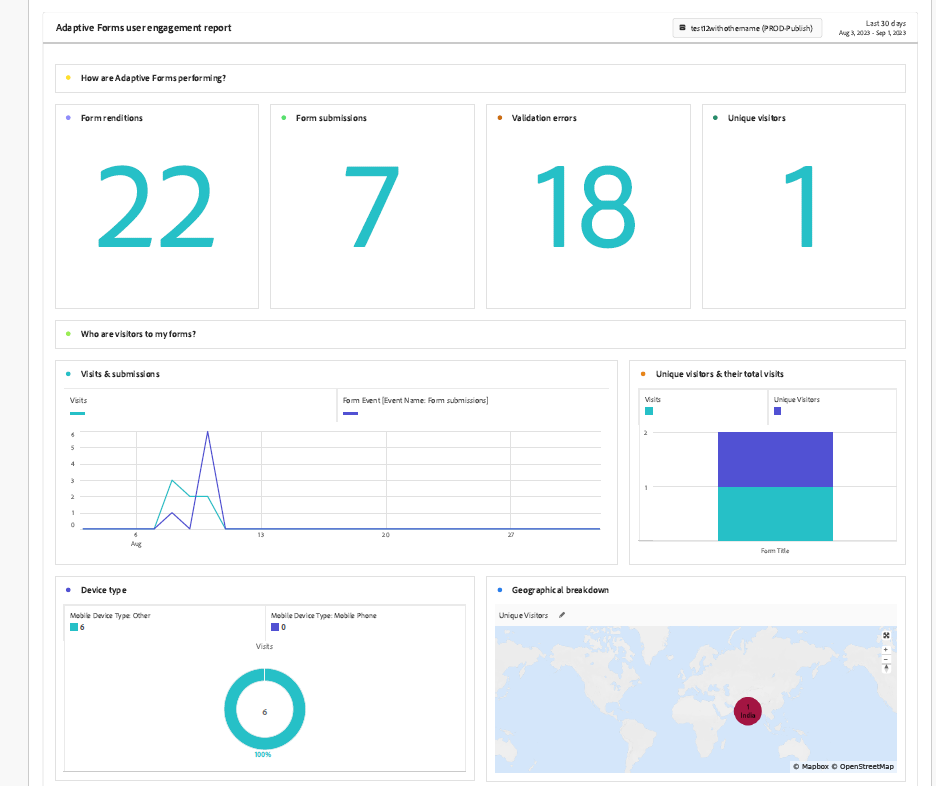

# 使用 Experience Cloud Setup Automation 為最適化表單啟用 Adobe Analytics {#integrate-adobe-analytics-to-aem-forms-with-experience-cloud-setup-automation}

| 版本 | 文章連結 |
| -------- | ---------------------------- |
| AEM as a Cloud Service  | 本文章 |
| AEM 6.5 | [按一下這裡](https://experienceleague.adobe.com/docs/experience-manager-65/forms/integrate-aem-forms-with-experience-cloud-solutions/configure-analytics-forms-documents.html?lang=zh-Hant) |

Experience Cloud Setup Automation協助將Adobe Analytics連結到Adaptive Forms，這有助於快速追蹤分析使用者與您的表單的互動，並提供訪客互動和參與情況的深入分析。 Experience Cloud Setup Automation 也可協助監控表單效能，其中涉及評估像是完成時間和退出點等量度。此分析有助於優化表單以提供更好的使用者體驗，同時根據登入狀態 (例如匿名使用者) 區分使用者行為，以識別整體趨勢和模式。

## 將 Adobe Analytics 整合至最適化表單的優勢 {#advantages-of-integrating-adobe-analytics-with-aem-forms}

* **深入分析一般使用者的行為**：Adobe Analytics 有助於深入分析一般使用者行為，顯示使用者動作、使用者退出和完成率，從而更深入了解個人如何使用表單。
* **使非技術商務使用者能夠獲得深入見解**：Adobe Analytics 透過其易於使用的介面，即使是非技術使用者也能存取和解釋表單使用數據，從而做出資料導向決策，可增強註冊體驗。
* **根據使用情況優化資料擷取體驗**：組織可以輕鬆識別資料擷取的痛點，進行有目標的改進，從而增強表單可用性並增加成功提交數量。

## 最適化表單使用情況量度的範圍 {#scope-of-adaptive-forms-usage-metrics}

Adobe Analytics提供全方位的Adaptive Forms效能量度，旨在提供表單使用的寶貴見解，並提供快速追蹤分析。 這些量度為：

* **表單轉譯、表單提交、驗證錯誤、不重複訪客**，可讓您評估表單的使用情況和有效性。

* **訪客深入見解**，其中包括造訪和提交頻率以及不重複訪客計數，提供表單客群的全貌。

* **裝置類型**&#x200B;資料告知您使用者用來存取表單之裝置的資料。

* **地理劃分**&#x200B;顯示表單使用者的區域分佈。

* **流量來源**&#x200B;和&#x200B;**熱門表單**&#x200B;量度，其包含最常使用的反向連結網域和最常被造訪的表單，可協助您了解流量來源和最受歡迎的表單。

* **熱門表單的使用者活動**，提供關於欄位造訪、表單轉譯、驗證錯誤、捨棄表單和表單提交的深入見解，使您能夠分析使用者行為。

* **表單逗留時間表**，其以時間表檢視的形式，提供表單的使用者參與度。

* **需提供訪客協助的區域**&#x200B;量度，其包括說明檢視、驗證錯誤實例和欄位造訪頻率，用於凸顯使用者在填寫表單時可能需要協助的地方。

{width="100%"}


如需每個量度的詳細資訊，請造訪[檢視並了解 AEM Forms Analytics 分析報告](/help/forms/view-understand-aem-forms-analytics-reports.md)

## 先決條件 {#prerequisites}

<!--
Analytics, Data Collection (Formerly Adobe Launch), and Experience Manager (experience.adobe.com)
-->

Experience Cloud Setup Automation需要&#x200B;**Adobe Analytics授權**、**Data Collection (先前稱為Adobe Launch)**&#x200B;來管理追蹤指令碼，以及&#x200B;**Experience Manager Forms授權**&#x200B;來簡化資料彙總與insight產生。

如果您有&#x200B;**Adobe Analytics**&#x200B;和&#x200B;**Experience Manager Forms**&#x200B;的有效授權，而且您已與&#x200B;**資料收集(先前稱為Adobe Launch)**&#x200B;整合，您應在開發人員主控台中驗證其可用性。

若要確認上述可適用於您的Forms as a Cloud Service環境，請造訪[開發人員主控台](https://developer.adobe.com/console/projects)，瀏覽至專案並使用方案ID — 環境ID搜尋您的專案，例如，使用URL `https://author-p45913-e175111-cmstg.adobeaemcloud.com/index.html`、方案ID — 環境ID為`p45913-e175111`的環境。 確保有列出 Experience Cloud Setup Automation、Adobe Analytics 和 Experience Platform Launch API。如果列出了這些專案，您可以啟用Adobe Analytics，以快速追蹤分析您的最適化Forms。

{width="100%"}

<!-- 
>[!NOTE]
> If you have an active licenses for Experience Cloud Setup Automation, Adobe Analytics, and Experience Platform Launch API, you should verify their availability within your developer console.
-->

<!-- For more information about your available integrations, see [troubleshooting Adaptive Forms with Analytics Integration](https://experienceleague.adobe.com/docs/experience-manager-65/forms/integrate-aem-forms-with-experience-cloud-solutions/view-understand-aem-forms-analytics-reports.html?lang=zh-Hant)
-->

## 設定 Adobe Analytics {#configure-adobe-analytics}

執行以下列出的步驟，啟用和設定Adobe Analytics以快速追蹤分析您的最適化Forms：

* [為以基礎元件為主的最適化表單啟用 Adobe Analytics](#integrate-adobe-analytics-with-aem-forms-for-foundation-component)
* [為以核心元件為主的最適化表單啟用 Adobe Analytics](#integrate-adobe-analytics-with-aem-forms-for-core-components)

>[!VIDEO](https://video.tv.adobe.com/v/3424577/enable-adobe-analytics/?quality=12&learn=on)


<!--
>[!NOTE]
>
> This is the demo video for **Foundation Component**. In **Core Component** you are required to perform similar steps but the container is not chosen for forms.
-->

### 針對基礎元件為最適化表單啟用 Adobe Analytics {#integrate-adobe-analytics-with-aem-forms-for-foundation-component}

1. 建立雲端服務的設定容器：
   1. 前往&#x200B;**[!UICONTROL 工具 > 一般 > 設定瀏覽器]**。
   1. 選取或建立設定容器，並啟用&#x200B;**[!UICONTROL 雲端設定]**&#x200B;資料夾。
   1. 選取「**[!UICONTROL 儲存並關閉]**」，即可儲存設定並退出對話框。
1. 在您的 AEM 執行個體上，前往 **[Forms]** >> **[表單和文件]**。
1. 選取您的&#x200B;**[!UICONTROL 表單]** >> **[!UICONTROL 屬性]**，在&#x200B;**[!UICONTROL 設定容器]**&#x200B;中，選取您在步驟 1 於&#x200B;**[!UICONTROL 設定瀏覽器]** 建立或選取的設定容器。
1. 選取左邊欄的任務面板，然後按一下&#x200B;**設定 Analytics** 和&#x200B;**啟動 Adobe Analytics**。
1. 提供您偏好的報告套裝名稱，然後按一下&#x200B;**[!UICONTROL 下一步]**&#x200B;和&#x200B;**[!UICONTROL 儲存]**。
1. 儲存專案後，設定程序會執行一段時間，直到 Adobe Analytics 整合至您的最適化表單，您也可以查看&#x200B;**整合狀態**。

   >[!NOTE]
   >
   >如果設定程序超過 15 分鐘，請重新嘗試為您的表單啟用分析功能。

1. 在您的 AEM 執行個體上，前往 **[!UICONTROL Forms]** >> **[表單和文件]**，並選取您的&#x200B;**[!UICONTROL 表單]**，您會看到 Adobe Analytics 已整合至您的表單，如下圖所示。
1. 現在您可以檢視您的[最適化表單 Adobe Analytics 報告](#view-adobe-analytics-report)。

{width="100%"}


### 針對核心元件為最適化表單啟用 Adobe Analytics {#integrate-adobe-analytics-with-aem-forms-for-core-components}

1. 在您的 AEM 執行個體上，前往 **[!UICONTROL Forms]** >> **[!UICONTROL 表單和文件]**&#x200B;並選取您的&#x200B;**[!UICONTROL 表單]**。
1. 選取左側的任務面板，然後按一下&#x200B;**設定 Analytics** 和&#x200B;**啟動 Adobe Analytics**。
1. 提供您偏好的報告套裝名稱，然後按一下&#x200B;**[!UICONTROL 下一步]**&#x200B;和&#x200B;**[!UICONTROL 儲存]**。
1. 儲存專案後，設定程序會執行一段時間，直到 Adobe Analytics 整合至您的最適化表單，您也可以查看&#x200B;**整合狀態**。

   >[!NOTE]
   >
   >如果設定程序超過 15 分鐘，請重新嘗試為您的表單啟用分析功能。

1. 在您的 AEM 執行個體上，前往 **[!UICONTROL Forms]** >> **[!UICONTROL 表單和文件]**，並選取您的&#x200B;**[!UICONTROL 表單]**，您會看到 Adobe Analytics 已整合至您的表單。
1. 現在您可以檢視您的[最適化表單 Adobe Analytics 報告](#view-adobe-analytics-report)。

## 檢視最適化表單 Adobe Analytics 報告 {#view-adobe-analytics-report}

1. 在您的 AEM 執行個體上，前往 **[!UICONTROL Forms]** >> **[!UICONTROL 表單和文件]**。
1. 選取您的表單，您會看到  Adobe Analytics 已整合到為 Adobe Analytics 啟動的表單中，如左側所示。

   {width="100%"}

1. 按一下 **Adobe Analytics** 查看報告並分析效能資料。

若要使用手動方法將最適化表單與 Adobe Analytics 連接，請造訪[將 AEM Forms 與 Adobe Analytics 整合](/help/forms/integrate-aem-forms-with-adobe-analytics.md)。

## 啟用Analytics以在Sites中自適應Forms {#Connect-Analytics-to-Adaptive-Forms-in-Sites}

在AEM Sites中為您的Adaptive Form設定Fast Track Analytics，以協助您追蹤使用者互動以及您在Sites頁面中的Form上提交的表單。 透過在您的Sites Forms中緊密整合分析，您可獲得有關使用者行為、轉換率和表單中需改善領域的寶貴見解。

### 先決條件 {#Prerequisites-to-connect-forms-analytics-to-sites}

若要在適用於AEM Sites的Adaptive Forms中連線並啟用分析，您必須確保您的AEM Sites具備作用中的Adobe Analytics。

### 在Sites中連線最適化Forms以啟用Analytics {#Connect-analytics-to-adaptive-forms}

若要在AEM Sites頁面中連線最適化表單以啟用Analytics以進行快速追蹤分析，請使用AEM Archetype/Git存放庫和部署管道，將`customfooterlibs`使用者端程式庫包含到AEM Sites頁面。

1. 在文字編輯器中開啟您的[AEM Forms原型或複製的Git存放庫](https://experienceleague.adobe.com/docs/experience-manager-core-components/using/developing/archetype/overview.html?lang=zh-Hant)專案。 例如，Visual Studio Code。

1. 導覽至您最適化表單所在的網站頁面，例如，在此示範專案中，我們有`ui.apps/src/main/content/jcr_root/apps/corecomponents/components/page/.content.xml`。

1. 複製`sling:resourceSuperType`的值。 例如，值為`core/wcm/components/page/v3/page`。

   {width="100%"}

1. 在與`core/wcm/components/page/v3/page`相同的位置`ui.apps/src/main/content/jcr_root/apps`建立類似的結構。

   {width="100%"}

1. 新增`customfooterlibs.html`檔案。

   ```
   // customheaderlibs.html
   <sly data-sly-use.page="com.adobe.cq.wcm.core.components.models.Page">
   <sly data-sly-test="${page.data && page.dataLayerClientlibIncluded}" data-sly-call="${clientlib.js @ categories='core.forms.components.commons.v1.datalayer', async=true}"></sly>
   </sly>
   ```

   `customfooterlibs.html`用於JavaScript。

1. [執行管道](https://experienceleague.adobe.com/docs/experience-manager-cloud-service/content/sites/administering/site-creation/enable-front-end-pipeline.html?lang=zh-Hant)以部署變更。

### 啟用表單分析規則至網站中的Forms {#bind-forms-analytics-rules-to-forms-in-sites}

1. 造訪&#x200B;**Adobe Experience Platform資料彙集**。
1. 按一下位於左側的&#x200B;**標籤**。
1. 使用下圖所示的方案識別碼搜尋您的專案，例如，針對URL為`https://author-p45921-e175111-cmstg.adobeaemcloud.com/index.html`的環境，方案識別碼為`45921`。

   {width="100%"}

1. 新增&#x200B;**表單規則**&#x200B;和&#x200B;**資料元素**&#x200B;的設定，如下所示：

#### 新增表單規則 {#form-rules}

1. 選取您的表單並新增位於右上角的&#x200B;**新屬性**，或按一下您的表單。
1. 在屬性頁面上，按一下&#x200B;**規則**&#x200B;並選取表單的事件。在下方的範例影像中，它是&#x200B;**表單事件**。

   {width="100%"}

1. 選取表單的所有事件和位於右上邊欄的&#x200B;**副本**。
1. 複製後，會出現&#x200B;**複製規則**&#x200B;快顯視窗，讓您使用專案ID搜尋您的網站頁面，以貼上表單規則。

   {width="100%"}

1. 按一下&#x200B;**複製**，將表單規則貼到Sites頁面。

#### 新增資料元素 {#data-elements}

1. 選取您的表單並新增位於右上角的&#x200B;**新屬性**，或按一下您的表單。
1. 在屬性頁面上，按一下&#x200B;**資料元素**&#x200B;並選取表單事件。
1. 選取表單的所有事件和位於右上欄的&#x200B;**複製**。
1. 複製後，會出現&#x200B;**複製規則**&#x200B;快顯視窗，讓您使用專案ID搜尋您的網站頁面，以貼上表單規則。
1. 按一下&#x200B;**複製**，將表單規則貼到Sites頁面。

   {width="100%"}

透過上述步驟繫結Form和Sites規則後，請執行以下步驟以啟用Analytics至Sites頁面中的調適型表單：

1. 按一下左側的&#x200B;**發佈流程**。
1. 按一下&#x200B;**新增資料庫**，然後輸入您偏好的名稱。
1. 在右側的&#x200B;**環境**&#x200B;下拉式清單中，選取&#x200B;**開發**。
1. 按一下&#x200B;**新增所有變更的資源**。
1. 按一下&#x200B;**儲存並建置到開發**。

{width="100%"}


<!--

## Best Practices

1.    Verify that Adobe Analytics is enabled on all the forms activated for Adobe Analytics.

1.    Check the Adobe Analytics report periodically to gain insights into user behavior and form performance. For instance, you may set the cadence to 15 days or the period you prefer to choose for report analysis. This enables you to improve the forms enrollment experience.

1.    Enable Analytics for all or most of your forms for tracking and analyzing user interaction with your forms and to gain insights into visitor interactions and engagement.

1. Check your forms performance after you update your form fields or components.

1.    Share Analytics report with your peer groups for review, you can schedule your report for a later time.

-->

## 另請參閱 {#see-also}

* [檢視和瞭解最適化Forms分析報表](/help/forms/view-understand-aem-forms-analytics-reports.md)
* [新增自適應表單至 AEM Sites 頁面或體驗片段](/help/forms/create-or-add-an-adaptive-form-to-aem-sites-page.md)
* [將AEM Forms與Adobe Analytics整合](/help/forms/integrate-aem-forms-with-adobe-analytics.md)
