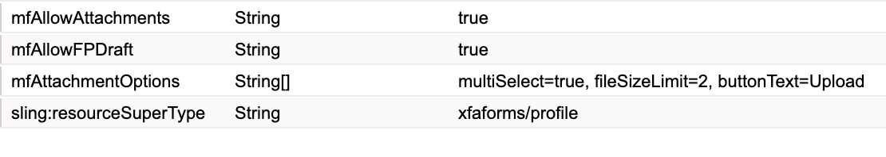

# 啟用 HTML5 表單附件 {#enabling-attachments-for-an-html-form}

 HTML5 Forms功能屬於Early Access方案的一部分。 若要要求存取權，請將您的正式（工作）電子郵件ID傳送電子郵件至aem-forms-ea@adobe.com。

您可以使用HTML5表單上傳、預覽及提交附件。 依預設，會停用附件支援。 若要啟用附件支援：

1. 建立具有[多重選取字串屬性的](/help/forms/custom-profile.md)自訂設定檔`mfAttachmentOptions`。 `mfAttachmentOptions`屬性中的每個字串都必須有`property=value`格式，才能設定檔案附件小工具的選項。 `property`和`value`可以有下列任何值：

   | 屬性 | 值 |
   |--- |---|
   | multiSelect | true或false （預設為true） |
   | fileSizeLimit | 以MB為單位的編號（預設為2 MB）。 例如，5。 |
   | 按鈕文字 | 快顯視窗的按鈕文字（預設為「附加」） |
   | accept | 要接受的檔案型別清單（預設為「audio/&amp;amp； ast；， video/&amp;amp； ast；， image/&amp;amp； ast；， text/&amp;amp； ast；， .pdf」）（以逗號分隔） |

   例如：

   

   如有需要，您也可以為`mfAttachmentOptions`屬性指定更多自訂選項。

   >[!NOTE]
   >
   >在Microsoft Internet Explorer 9中，使用者可以附加超過指定限制的檔案。 這是已知問題。

1. 使用[中繼資料編輯器](/help/forms/manage-form-metadata.md)選取您在上面為HTML 5表單建立的自訂設定檔。
1. 使用自訂設定檔轉譯您的表單範本，表單工具列上會顯示附件圖示。

   >[!NOTE]
   >
   >Forms Portal提供開箱即用的自訂設定檔，並啟用草稿和附件功能。 如需&#x200B;**儲存為草稿**&#x200B;設定檔的詳細資訊，請參閱[將HTML5表單儲存為草稿](/help/forms/saving-html5-form-draft.md)。

1. 按一下附件圖示，附件選取對話方塊就會顯示。 瀏覽並選取附件，然後按一下&#x200B;**附加**。

   >[!NOTE]
   >
   >若要預覽附件，請按一下附件名稱。

   >[!NOTE]
   >
   >檔案預覽選項不適用於匿名使用者。

## 附件提交格式 {#attachment-submission-format}

啟用附件時，HTML5表單會提交多部分資料。 多部分提交資料有兩個部分&#x200B;**dataXml**&#x200B;和&#x200B;**附件**。

>[!NOTE]
>
>為了回溯相容性，如果關閉`mfAllowAttachments`選項，HTML5表單就不會傳送多部分資料。 它以&#x200B;**application/xml**&#x200B;格式傳送簡單資料xml。

如果開啟mfAllowAttachments旗標，[送出服務Proxy服務](/help/forms/service-proxy.md)也會張貼包含dataXml和附件的多部分資料。
