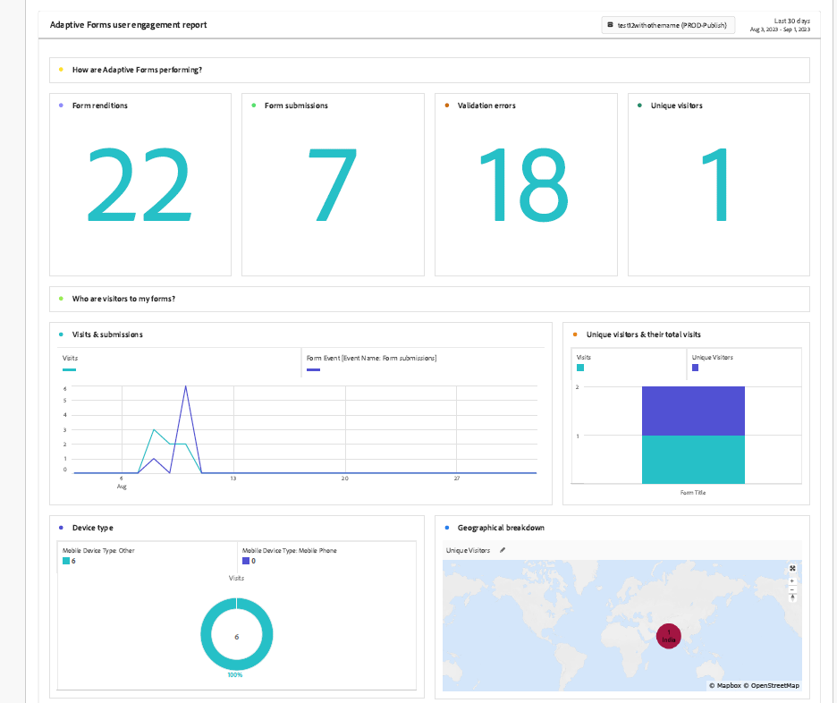

# 使用Experience Cloud設定自動化啟用最適化表單的Adobe Analytics {#integrate-adobe-analytics-to-aem-forms-with-experience-cloud-setup-automation}

<span class="preview">這是一項預先發佈功能，可透過我們的[預先發佈管道](https://experienceleague.adobe.com/docs/experience-manager-cloud-service/content/release-notes/prerelease.html#new-features)存取。</span>

Experience Cloud設定自動化有助於將Adobe Analytics連結到Adaptive Forms，這有助於追蹤和分析使用者與您的表單的互動，並提供訪客互動和參與情況的深入分析。 Experience Cloud設定自動化還有助於監控涉及評估量度（例如完成時間和下降點）的表單效能。 此分析有助於最佳化表單，以獲得更佳的使用者體驗，同時根據登入狀態區分使用者行為（例如匿名使用者），以識別一般趨勢和模式。

## 整合Adobe Analytics與最適化Forms的優勢 {#advantages-of-integrating-adobe-analytics-with-aem-forms}

* **深入分析一般使用者行為**： Adobe Analytics可協助您深入瞭解一般使用者行為、顯示使用者動作、流失和完成率，進而深入瞭解個人與表單的互動方式。
* **讓非技術業務使用者獲得見解**：Adobe Analytics透過其簡單易用的介面，讓非技術使用者也能存取及詮釋表單使用資料，形成資料導向式決策，進而增強註冊體驗。
* **根據使用情況最佳化資料擷取體驗**：組織可輕鬆找出資料擷取中的痛點，進而進行有針對性的改善，以提升表單可用性並提升提交成功率。

## 最適化Forms使用量度的範圍 {#scope-of-adaptive-forms-usage-metrics}

Adobe Analytics提供全方位的Adaptive Forms效能量度，旨在提供表單使用的寶貴見解。 這些量度包括：

* **表單轉譯、表單提交、驗證錯誤和不重複訪客**，讓您評估表單的使用情形和成效。

* **訪客分析** 其中包含造訪和提交頻率，以及不重複訪客計數，提供您表單對象的完整檢視。

* **裝置型別** 此資料會通知您使用者使用哪些裝置來存取您的表格。

* **地理劃分** 顯示表單使用者的地區分佈。

* **流量來源** 和 **熱門表單** 量度包含最熱門的反向連結網域和最常造訪的表單，有助於您瞭解流量的來源地以及哪些表單最受歡迎。

* **熱門表單上的使用者活動** 提供欄位造訪、表單轉譯、驗證錯誤、放棄的表單和表單提交等的深入分析，讓您能夠分析使用者行為。

* **表單逗留時間的時間表** 可提供使用者與表單互動的時間表型檢視。

* **需要訪客協助的區域** 量度包括說明檢視、驗證錯誤例項和欄位造訪頻率，以強調使用者在填寫表單時可能需要協助的位置。

{width="100%"}


如需每個量度的詳細資訊，請造訪 [檢視和瞭解AEM Forms Analytics報表](/help/forms/view-understand-aem-forms-analytics-reports.md)

## 先決條件 {#prerequisites}

<!--
Analytics, Data Collection (Formerly Adobe Launch), and Experience Manager (experience.adobe.com)
-->

Experience Cloud設定自動化需要 **Adobe Analytics授權**， **資料收集(先前稱為Adobe Launch)** 管理追蹤指令碼，以及 **Experience Manager Forms授權** 以簡化資料彙總和洞察力產生作業。

如果您擁有的有效授權 **Adobe Analytics** 和 **Experience Manager Forms**，而且您已與整合 **資料收集(先前稱為Adobe Launch)**，您應該在開發人員主控台中驗證其可用性。

若要確認上述功能是否適用於您的Formsas a Cloud Service環境，請造訪 [開發人員主控台](https://developer.adobe.com/console/projects)，瀏覽至專案並使用方案id — 環境id搜尋您的專案，例如，使用URL的環境 `https://author-p45913-e175111-cmstg.adobeaemcloud.com/index.html`，方案id — 環境id為 `p45913-e175111`. 請確定已列出Experience Cloud設定自動化、Adobe Analytics和Experience Platform Launch API。 如果列出了這些選項，您可以為最適化Forms啟用Adobe Analytics 。

{width="100%"}

<!-- 
>[!NOTE]
> If you have an active licenses for Experience Cloud Setup Automation, Adobe Analytics, and Experience Platform Launch API, you should verify their availability within your developer console.
-->

<!-- For more information about your available integrations, see [troubleshooting Adaptive Forms with Analytics Integration](https://experienceleague.adobe.com/docs/experience-manager-65/forms/integrate-aem-forms-with-experience-cloud-solutions/view-understand-aem-forms-analytics-reports.html)
-->

## 設定Adobe Analytics {#configure-adobe-analytics}

執行以下列出的步驟，為最適化Forms啟用和設定Adobe Analytics：

* [根據基礎元件啟用最適化Forms的Adobe Analytics](#integrate-adobe-analytics-with-aem-forms-for-foundation-component)
* [根據核心元件啟用最適化Forms的Adobe Analytics](#integrate-adobe-analytics-with-aem-forms-for-core-components)

### 使用適用於基礎元件的最適化Forms啟用Adobe Analytics {#integrate-adobe-analytics-with-aem-forms-for-foundation-component}

1. 建立雲端服務的設定容器：
   1. 前往 **[!UICONTROL 「工具」>「一般」>「設定瀏覽器」]**.
   1. 選取或建立設定容器，並啟用資料夾 **[!UICONTROL 雲端設定]**.
   1. 點選 **[!UICONTROL 儲存並關閉]** 以儲存組態並結束對話方塊。
1. 在您的AEM執行個體上，前往 **[Forms]** >> **[Forms和檔案]**.
1. 選取您的 **[!UICONTROL 表單]** >> **[!UICONTROL 屬性]**，在 **[!UICONTROL 設定容器]**，選取您在「 」中建立或選取的設定容器 **[!UICONTROL 設定瀏覽器]** 在步驟1中。
1. 在左側邊欄上選取工作面板，然後按一下 **設定Analytics** 和 **啟動Adobe Analytics**.
1. 提供您偏好的報表套裝名稱，按一下 **[!UICONTROL 下一個]** 和 **[!UICONTROL 儲存]**.
1. 儲存專案後，設定會執行一段時間，直到Adobe Analytics與您的調適型表單整合為止，您也可以檢查 **整合狀態**.

   >[!NOTE]
   >
   >如果您的設定超過15分鐘，請重試為您的表單啟用分析。

1. 在您的AEM執行個體上，前往 **[!UICONTROL Forms]** >> **[Forms和檔案]** 並選取 **[!UICONTROL 表單]**，您會看到Adobe Analytics已整合至您的表單，如下圖所示。
1. 現在您可以檢視 [最適化表單Adobe Analytics報表](#view-adobe-analytics-report).

{width="100%"}

>[!VIDEO](https://video.tv.adobe.com/v/3424577/recaptcha-google-adaptive-forms/?quality=12&learn=on)

### 啟用具有核心元件適用性Forms的Adobe Analytics {#integrate-adobe-analytics-with-aem-forms-for-core-components}

1. 在您的AEM執行個體上，前往 **[!UICONTROL Forms]** >> **[!UICONTROL Forms和檔案]** 並選取 **[!UICONTROL 表單]**.
1. 選取左側的「工作」面板，然後按一下 **設定Analytics** 和 **啟動Adobe Analytics**.
1. 提供您偏好的報表套裝名稱，按一下 **[!UICONTROL 下一個]** 和 **[!UICONTROL 儲存]**.
1. 儲存專案後，設定會執行一段時間，直到Adobe Analytics與您的調適型表單整合為止，您也可以檢查 **整合狀態**.

   >[!NOTE]
   >
   >如果您的設定超過15分鐘，請重試為您的表單啟用分析。

1. 在您的AEM執行個體上，前往 **[!UICONTROL Forms]** >> **[!UICONTROL Forms和檔案]** 並選取 **[!UICONTROL 表單]**，您會看到Adobe Analytics已整合至您的表單。
1. 現在您可以檢視 [最適化表單Adobe Analytics報表](#view-adobe-analytics-report).

## 檢視最適化Forms Adobe Analytics報表 {#view-adobe-analytics-report}

1. 在您的AEM執行個體上，前往 **[!UICONTROL Forms]** >> **[!UICONTROL Forms和檔案]**.
1. 選取您的表單，您會看到Adobe Analytics已整合（如左側所示）至為Adobe Analytics啟動的Forms。

   {width="100%"}

1. 按一下 **Adobe Analytics** 以檢視您的報表和分析效能資料。

若要使用手動方法連線最適化表單與Adobe Analytics，請造訪 [將AEM Forms與Adobe Analytics整合](/help/forms/integrate-aem-forms-with-adobe-analytics.md).

## 啟用Analytics以在Sites中自適應Forms {#Connect-Analytics-to-Adaptive-Forms-in-Sites}

在AEM Sites中為您的Adaptive Form設定Analytics可協助您追蹤使用者互動以及您在Sites頁面中的Form上提交的表單。 透過在您的Sites Forms中緊密整合分析，您可獲得有關使用者行為、轉換率和表單中需改善領域的寶貴見解。

### 先決條件 {#Prerequisites-to-connect-forms-analytics-to-sites}

若要在適用於AEM Sites的Adaptive Forms中連線並啟用分析，您必須確保您的AEM Sites擁有作用中的Adobe Analytics。

### 在Sites中連線最適化Forms以啟用Analytics {#Connect-analytics-to-adaptive-forms}

若要在AEM Sites頁面中連線最適化表單以啟用Analytics，請包含 `customfooterlibs` 使用AEM原型/Git存放庫和部署管道將使用者端程式庫移至AEM Sites頁面。

1. 開啟您的 [AEM Forms原型或複製的Git存放庫](https://experienceleague.adobe.com/docs/experience-manager-core-components/using/developing/archetype/overview.html) 在文字編輯器中專案。 例如，Visual Studio Code。

1. 導覽至您最適化表單所在的網站頁面，例如，在此示範專案中，我們有 `ui.apps/src/main/content/jcr_root/apps/corecomponents/components/page/.content.xml`.

1. 複製值 `sling:resourceSuperType`. 例如，值為 `core/wcm/components/page/v3/page`.

   

1. 在該位置建立類似的結構 `ui.apps/src/main/content/jcr_root/apps` 與 `core/wcm/components/page/v3/page`.

   

1. 新增 `customfooterlibs.html` 檔案。

       ```
       // customheaderlibs.html
       &lt;sly data-sly-use.page=&quot;com.adobe.cq.wcm.core.components.models.Page&quot;>
       &lt;sly data-sly-test=&quot;${page.data &amp;&amp; page.dataLayerClientlibIncluded}&quot; data-sly-call=&quot;${clientlib.js @ categories=&amp;#39;core.forms.components.commons.v1.datalayer&amp;#39;, async=true}&quot;>&lt;/sly>
       &lt;/sly>
       
       ```
   
   此 `customfooterlibs.html` 用於JavaScript。

1. [執行管道](https://experienceleague.adobe.com/docs/experience-manager-cloud-service/content/sites/administering/site-creation/enable-front-end-pipeline.html) 以部署變更。

### 啟用表單分析規則至網站中的Forms {#bind-forms-analytics-rules-to-forms-in-sites}

1. 造訪 **Adobe Experience Platform資料彙集**.
1. 按一下 **標籤** 位於左側。
1. 使用計畫ID （如下圖所示）搜尋您的專案，例如，搜尋具有URL的環境 `https://author-p45921-e175111-cmstg.adobeaemcloud.com/index.html`，方案id為 `45921`.

   

1. 新增以下專案的設定： **表單規則** 和 **資料元素** 如下所示：

#### 新增表單規則 {#form-rules}

1. 選擇您的表單並新增 **新增屬性** 位於右上角，或按一下您的表單。
1. 在屬性頁面上，按一下 **規則** 並為您的表單選取事件，在下方的範例影像中，它是 **表單事件**.

   

1. 選取表單中的所有事件並 **複製** 位在右上邊欄的位置。
1. 一旦複製， **複製規則** 會出現快顯視窗，讓您使用project-id搜尋Sites頁面，以貼上「表單規則」。

   

1. 按一下 **複製** 將表單規則貼到Sites頁面。

#### 新增資料元素 {#data-elements}

1. 選擇您的表單並新增 **新增屬性** 位於右上角，或按一下您的表單。
1. 在屬性頁面上，按一下 **資料元素** 並為您的表單選取事件。
1. 選取表單中的所有事件並 **複製** 位於右上邊欄中。
1. 一旦複製， **複製規則** 會出現快顯視窗，讓您使用project-id搜尋Sites頁面，以貼上「表單規則」。
1. 按一下 **複製** 將表單規則貼到Sites頁面。

   

透過上述步驟繫結Form和Sites規則後，請執行以下步驟以啟用Analytics至Sites頁面中的調適型表單：

1. 按一下 **發佈流程** 左側。
1. 按一下 **新增程式庫** 並輸入您偏好的名稱。
1. 在 **環境** 從右側的下拉式清單中選取 **開發**.
1. 按一下 **新增所有變更的資源**.
1. 按一下 **儲存並建置到開發環境**.


