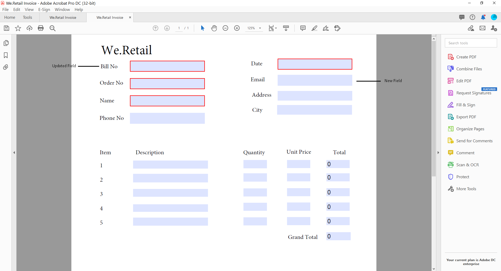

# 為最適化表單產生記錄文件

| 版本 | 文章連結 |
| -------- | ---------------------------- |
| AEM 6.5 | [按一下這裡](https://experienceleague.adobe.com/docs/experience-manager-65/forms/adaptive-forms-advanced-authoring/generate-document-of-record-for-non-xfa-based-adaptive-forms.html) |
| AEM as a Cloud Service  | 本文 |

## 概觀 {#overview}

填寫或提交表單時，您可以以列印或檔案格式保留表單記錄。 此記錄稱為記錄檔案(DoR)。 這是已提交表單的易列印復本。 您也可以參考記錄檔案，以瞭解客戶在稍後日期填寫的資訊，或使用「記錄檔案」以「PDF格式」將表單與內容一起封存。


若要建立記錄檔案，會將XFA或Acroform型範本與透過最適化表單收集的資料合併。 您可以自動或依需求產生記錄檔案。
隨選選項可讓您指定自訂XFA或Acroform型範本，以提供記錄檔案的自訂外觀。

您可以：

* [產生以XFA為基礎的記錄檔案](#generate-an-XFA-based-document-of-record)
* [產生以Acroform為基礎的(Acrobat表單PDF)記錄檔案](#generate-an-Acroform-based-document-of-record)
* [自動產生記錄檔案](#auto-generate-a-document-of-record)

## 開始之前 {#components-to-automatically-generate-a-document-of-record}

開始學習並準備記錄檔案所需的資產之前：

**基礎範本：** 在Forms Designer或Acrobat表單(AcroForm)中建立的XFA範本（XDP檔案）。 [基礎範本](#base-template-of-a-document-of-record) 用於指定記錄檔案的樣式和品牌資訊。 先將您的XFA範本（XDP檔案）上傳至您的AEM Forms執行個體，然後再執行

**最適化表單：** 要為其產生記錄檔案的最適化表單。

## 產生以XFA為基礎的記錄檔案 {#generate-an-XFA-based-document-of-record}

將您的XFA範本（XDP檔案）上傳至您的AEM Forms執行個體。 執行以下步驟來設定最適化表單，以使用XFA範本（XDP檔案）作為記錄檔案的範本：

1. 在Experience Manager編寫執行個體中，按一下 **[!UICONTROL Forms]** > **[!UICONTROL Forms和檔案].**
1. 選取表單，然後按一下 **[!UICONTROL 屬性]**.
1. 在「屬性」視窗中，點選 **[!UICONTROL 表單模型]**.
1. 於  **[!UICONTROL 表單模型]** 標籤，在 **[!UICONTROL 選擇來源]** 下拉式清單，選取 **[!UICONTROL 結構描述]** 或 **[!UICONTROL 無]**. 您也可以在建立表單時選取表單模型。
1. 在「表單模型」標籤的「記錄檔案範本組態」區段中，選取 **建立表單範本為記錄檔案範本的關聯**. 選取此選項時，會顯示電腦上可用的所有XFA範本（XDP檔案）。 選取適當的檔案。 此外，請確定最適化表單和選定的XFA範本（XDP檔案）使用的是相同的結構描述（資料結構描述）。
1. 按一下 **[!UICONTROL 完成。]**

您的最適化表單現在已設定為使用XDP檔案作為記錄檔案的範本。 接下來的步驟是 [將最適化表單元件與對應範本欄位繫結](#bind-adaptive-form-components-with-template-fields).

## 產生以Acroform為基礎的記錄檔案 {#generate-an-Acroform-based-document-of-record}

將您的Adobe AcrobatPDF(Acroform)上傳至您的AEM Forms執行個體。 執行以下步驟來設定最適化表單，以使用Adobe AcrobatPDF(Acroform)作為記錄檔案的範本：

1. 在Experience Manager編寫執行個體中，按一下 **[!UICONTROL Forms]** > **[!UICONTROL Forms和檔案].**
1. 選取表單，然後按一下 **[!UICONTROL 屬性]**.
1. 在「屬性」視窗中，點選 **[!UICONTROL 表單模型]**.
1. 於  **[!UICONTROL 表單模型]** 標籤，在 **[!UICONTROL 選擇來源]** 下拉式清單，選取 **[!UICONTROL 結構描述]** 或 **[!UICONTROL 無]**. 您也可以在建立表單時選取表單模型。
1. 在「表單模型」標籤的「記錄檔案範本組態」區段中，選取 **建立表單範本為記錄檔案範本的關聯**. 選取此選項時，會顯示電腦上可用的所有AcrobatPDF(Acroform)。 選取適當的檔案。
1. 按一下 **[!UICONTROL 完成。]**

您的最適化表單現在已設定為使用Acroform作為記錄檔案的範本。 接下來的步驟是 [將最適化表單元件與對應範本欄位繫結](#bind-adaptive-form-components-with-template-fields).

## 自動產生記錄檔案 {#auto-generate-a-document-of-record}

當最適化表單設定為自動生成記錄檔案時，每次表單變更時，其記錄檔案都會立即更新。 例如，如果欄位從現有的最適化表單中移除，則對應的欄位也會被移除，並且不會顯示在記錄檔案中。 自動產生記錄檔案還有許多其他的優點。 ：

* 表單開發人員不需要手動維護資料繫結。 自動產生的記錄檔案會處理資料繫結相關更新。
* 表單開發人員不必手動隱藏標籤為從記錄檔案排除的欄位。 自動產生的記錄檔案已預先設定為排除此類欄位。
* 自動產生的記錄檔案選項可節省建立記錄檔案的表單範本所需的時間。
* 「自動產生的記錄檔案」選項可讓您使用不同的基底範本來使用不同的樣式和外觀。 它有助於為您的組織選擇記錄檔案的最佳樣式和外觀。 如果您未指定樣式，系統樣式會設為預設值。
* 自動產生的記錄檔案可確保表單中的任何變更都立即反映在記錄檔案中。

執行以下步驟來設定最適化表單，以自動生成記錄檔案：

1. 在Experience Manager編寫執行個體中，按一下 **[!UICONTROL Forms]** > **[!UICONTROL Forms和檔案].**
1. 選取表單，然後按一下 **[!UICONTROL 屬性]**.
1. 在「屬性」視窗中，點選 **[!UICONTROL 表單模型]**.
1. 於  **[!UICONTROL 表單模型]** 標籤，在 **[!UICONTROL 選擇來源]** 下拉式清單，選取 **[!UICONTROL 結構描述]** 或 **[!UICONTROL 無]**. 您也可以在建立表單時選取表單模型。
1. 在「表單模型」標籤的「記錄檔案範本組態」區段中，選取 **產生記錄檔案**.
1. 按一下 **[!UICONTROL 完成。]**

## 將最適化表單元件與範本欄位繫結 {#bind-adaptive-form-components-with-template-fields}

繫結最適化表單欄位與範本欄位，以在對應的記錄檔案欄位中顯示擷取的表單資料。 若要將最適化表單元件與對應的記錄檔案範本欄位繫結：

1. 開啟最適化表單，設定為使用自訂表單範本進行編輯。

1. 選取最適化表單元件，然後按一下「開啟設定」  圖示。 它會開啟屬性瀏覽器。

1. 在屬性瀏覽器中，瀏覽並選取欄位。

   * （針對AcroForm範本） **[!UICONTROL 記錄檔案繫結參考欄位]** 屬性。
   * （針對XFA範本） **[!UICONTROL 資料模型繫結參考]** 屬性。

1. 按一下「**[!UICONTROL 儲存]**」。

<!-- 
In the following video Adaptive Form components are binded with corresponding Acroform template fields and the Document of Record is sent as an email attachment.
-->

您可以搭配使用「傳送電子郵件」、「Experience Manager工作流程」提交動作和 [記錄檔案步驟和其他提交動作](configuring-submit-actions.md) 以接收記錄檔案。

## 記錄檔案範本的增量更新 {#document-of-record-template-incremental-updates}

最適化表單和記錄範本的對應檔案可能會隨著時間而改變。 您可以選擇新增、移除或修改最適化表單或記錄檔案範本的欄位。

當您變更記錄檔案範本並將變更後的記錄檔案範本上傳到AEM Forms時，調適型Forms編輯器會自動偵測變更的繫結，並通知您需要新繫結的最適化表單元件。 它可讓您對記錄檔案範本進行增量更新。

例如，組織、 *We.Retail*，擁有以AcroForm為基礎的記錄檔案範本， *we-retail-invoice.pdf*. 範本看起來像這樣：


使用範本一段時間後，組織會決定重新命名 `invoice-number` 欄位至 `bill-number` 欄位並擷取購買者的電子郵件地址。 開發人員更新名稱 `invoice-number` 欄位並新增電子郵件欄位至範本。 他也會建立名為的新版範本  *we-retail-invoice-v2.pdf*.



開發人員會上傳並將更新後的範本套用至最適化表單。 最適化表單會自動偵測並顯示繫結已變更的欄位清單。


表單開發人員會將最適化Forms欄位與對應的記錄檔案範本繫結。
>[!VIDEO](assets/we-retail-binding.mp4)

現在，提交最適化表單時，會建立更新的記錄檔案。


## 使用記錄檔案時的主要考量事項 {#key-considerations-when-working-with-document-of-record}

處理最適化Forms的記錄檔案時，請謹記下列考量事項和限制。

* 記錄檔案範本不支援RTF文字。 因此，靜態最適化表單中或一般使用者填入的資訊中的任何RTF文字都會在記錄檔案中顯示為純文字。
* 最適化表單中的檔案片段未出現在記錄檔案中。 不過，支援自適應表單片段。
* 不支援為以XML結構描述為基礎的最適化表單產生的記錄檔案中的內容繫結。
* 當使用者請求轉譯記錄檔案時，系統會根據地區設定需求建立記錄檔案的當地語系化版本。 記錄檔案的本地化與最適化表單的本地化同時發生。 <!-- For more information on localization of Document of Record and Adaptive Forms see Using AEM translation workflow to localize Adaptive Forms and Document of Record.-->

<!-- ## Configure an adaptive form to generate  Document of Record {#adaptive-form-types-and-their-documents-of-record}

While creating an adaptive form, in the Form Model tab of Adaptive Form properties, select one the following option: 

* **None**
  Select the option to create an Adaptive Form without a form model. When the option is selected, the Document of Record is automatically generated for your Adaptive Form.

* **[Associate form template as a Document of Record template](creating-adaptive-form.md#create-an-adaptive-form-based-on-an-xfa-form-template)**
  
  Select the option to use an XFA Form as a template for Document of Record. 

* **[Generate Document of Record](creating-adaptive-form.md#create-an-adaptive-form-based-on-xml-or-json-schema)**
  Select the option to use an XFA Form as a template. When the option is selected, the Document of Record is automatically generated for your Adaptive Form. When you use an XML schema as a template for an Adaptive Form, ensure that the adaptive form and associated XFA Form use the same XML schema as your Adaptive Form
  

When you select a form model, configure Document of Record using options available under Document of Record Template Configuration. See [Document of Record Template Configuration](#document-of-record-template-configuration). -->

## 最適化表單元素的對應 {#mapping-of-adaptive-form-elements}

下表說明最適化表單元件和對應的XFA元件，以及這些元件是否出現在記錄檔案中。

### 欄位 {#fields}

<table>
 <tbody>
  <tr>
   <th>最適化表單元件</th>
   <th>對應的XFA元件</th>
   <th>預設包含在記錄檔案範本中？</th>
   <th>附註</th>
  </tr>
  <tr>
   <td>按鈕</td>
   <td>按鈕</td>
   <td>false</td>
   <td> </td>
  </tr>
  <tr>
   <td>核取方塊</td>
   <td>核取方塊</td>
   <td>true</td>
   <td> </td>
  </tr>
  <tr>
   <td>日期挑選器</td>
   <td>日期/時間欄位</td>
   <td>true</td>
   <td> </td>
  </tr>
  <tr>
   <td>下拉式清單</td>
   <td>下拉式清單</td>
   <td>true</td>
   <td> </td>
  </tr>
  <tr>
   <td>草寫簽名</td>
   <td>手寫簽名</td>
   <td>true</td>
   <td> </td>
  </tr>
  <tr>
   <td>數值方塊</td>
   <td>數值欄位</td>
   <td>true</td>
   <td> </td>
  </tr>
  <tr>
   <td>密碼方塊</td>
   <td>密碼欄位</td>
   <td>false</td>
   <td> </td>
  </tr>
  <tr>
   <td>選項按鈕</td>
   <td>選項按鈕</td>
   <td>true</td>
   <td> </td>
  </tr>
  <tr>
   <td>文字方塊</td>
   <td>文字欄位</td>
   <td>true</td>
   <td> </td>
  </tr>
  <tr>
   <td>重設按鈕</td>
   <td>重設按鈕</td>
   <td>false</td>
   <td> </td>
  </tr>
  <tr>
   <td>提交按鈕</td>
   <td><p>電子郵件提交按鈕</p> <p>HTTP提交按鈕</p> </td>
   <td>false</td>
   <td> </td>
  </tr>
  <tr>
   <td>條款與條件</td>
   <td> </td>
   <td>true</td>
   <td> </td>
  </tr>
  <tr>
   <td>檔案附件</td>
   <td> </td>
   <td>false</td>
   <td>在記錄檔案範本中無法使用。 只能透過附件在記錄檔案中使用。</td>
  </tr>
 </tbody>
</table>

### 容器 {#containers}

<table>
 <tbody>
  <tr>
   <th>最適化表單元件</th>
   <th>對應的XFA元件</th>
   <th>附註</th>
  </tr>
  <tr>
   <td>面板<br /> </td>
   <td>子表單<br /> </td>
   <td>可重複面板對應至可重複的子表單。</td>
  </tr>
 </tbody>
</table>

### 靜態元件 {#static-components}

| 最適化表單元件 | 對應的XFA元件 | 附註 |
|---|---|---|
| 影像 | 影像 | 除非使用「記錄檔案」設定加以排除，否則TextDraw和Image元件（無論繫結或未繫結）一律顯示在XSD型最適化表單的記錄檔案中。 |
| 文字 | 文字 |

### 表格 {#tables}

最適化Forms表格元件（例如頁首、頁尾和列）對應至對應的XFA元件。 您可以將可重複面板對應至記錄檔案中的表格。

## 記錄檔案的基礎範本 {#base-template-of-a-document-of-record}

基底範本為記錄檔案提供樣式和外觀資訊。 它可讓您自訂自動產生的記錄檔案的預設外觀。 例如，您可以使用基本範本在記錄檔案的頁首中新增您的公司標誌，並在頁尾中新增版權資訊。

基礎範本的主版頁面會用作「記錄檔案」範本的主版頁面。 主版頁面可以包含頁首、頁尾和頁碼等資訊，可套用至記錄檔案。 您可以使用基礎範本將此類資訊套用至記錄檔案，以自動產生記錄檔案。 使用基礎範本可讓您變更欄位的預設屬性。

永遠關注 [基礎範本慣例](#base-template-conventions) 當您設計基底範本時。

## 基礎範本慣例 {#base-template-conventions}

基礎範本用於定義記錄檔案的頁首、頁尾、樣式和外觀。 頁首和頁尾可包含公司標誌和版權文字等資訊。 基礎範本中的第一個主版頁面會被複製並當做記錄檔案的主版頁面，其中包含頁首、頁尾、頁碼或應該出現在記錄檔案所有頁面上的任何其他資訊。 如果您使用不符合基礎範本慣例的基礎範本，則基礎範本中的第一個主版頁面仍會用於「記錄檔案」範本中。 強烈建議您依照其慣例設計基礎範本，並使用它來自動產生記錄檔案。

**主版頁面慣例**

* 在基本範本中，將根子表單命名為 `AF_METATEMPLATE` 主版頁面為 `AF_MASTERPAGE`.

* 具有名稱的主版頁面 `AF_MASTERPAGE` 位於 `AF_METATEMPLATE` 建議使用根子表單來擷取頁首、頁尾和樣式資訊。

* 若 `AF_MASTERPAGE` 不存在，則會使用基本範本中存在的第一個主版頁面。

**欄位的樣式慣例**

* 若要在記錄檔案中的欄位上套用樣式，基本範本會提供位於 `AF_FIELDSSUBFORM` subfrom under the `AF_METATEMPLATE` 根子表單。

* 這些欄位的屬性會套用至記錄檔案中的欄位。 這些欄位應遵循 `AF_<name of field in all caps>_XFO` 命名慣例。 例如，核取方塊的欄位名稱應為 `AF_CHECKBOX_XFO`.

若要建立基礎範本，請在Forms Designer中執行下列動作。

1. 按一下 **[!UICONTROL 檔案]** > **[!UICONTROL 新增]**.
1. 選取 **[!UICONTROL 根據範本]** 選項。

1. 選取 **[!UICONTROL Forms — 記錄檔案]** 類別。
1. 選取 **[!UICONTROL DoR基本範本]**.
1. 按一下 **[!UICONTROL 下一個]** 並提供必要資訊。

1. （可選）修改要套用至記錄檔案中欄位的樣式和外觀。
1. 儲存表單。

您現在可以使用儲存的表單作為記錄檔案的基礎範本。 請勿修改或移除基底範本中存在的任何指令碼。

**修改基底範本**

* 如果未對基礎範本中的欄位套用任何樣式，建議從基礎範本中移除這些欄位，以便自動擷取對基礎範本的任何升級。
* 修改基底範本時，請勿移除、新增或修改指令碼。

請嚴格遵守上述慣例和指示，以設計基礎範本。

## 自訂記錄檔案中的品牌資訊 {#customize-the-branding-information-in-document-of-record}

產生記錄檔案時，您可以在記錄檔案索引標籤上變更記錄檔案的品牌資訊。 「記錄檔案」索引標籤包含標誌、外觀、版面、頁首與頁尾、免責宣告等選項，以及是否包含未選取的核取方塊和選項按鈕選項。

若要將您在「記錄檔案」標籤中輸入的品牌資訊當地語系化，請確保已正確設定瀏覽器的地區設定。 若要自訂記錄檔案的品牌資訊，請執行下列步驟：

1. 在記錄檔案中選取面板（根面板），然後點選 .
1. 點選 . 記錄檔案索引標籤隨即顯示。
1. 選取用於呈現記錄檔案的預設範本或自訂範本。 如果您選取預設範本，「範本」下拉式清單下方會顯示記錄檔案的縮圖預覽。
1. 根據您選取預設或自訂範本，以下部分或全部屬性會出現在「記錄檔案」標籤中。 指定以下提及的屬性，以定義記錄檔案的外觀：

   1. **基本屬性**:
      * **範本**：如果您選擇選取自訂範本，請瀏覽並選取 [!DNL AEM Forms] 伺服器。 如果您想要使用的範本尚未在您的 [!DNL AEM Forms] 伺服器，您應該先將XDP上傳至 [!DNL AEM Forms] 伺服器。
      * **輔色**：在檔案或記錄PDF中呈現標頭文字和分隔線的色彩。
      * **字型系列**：記錄檔案PDF中文字的字型系列。
      * **包含未繫結至資料模型的表單物件**：設定屬性時，記錄檔案中會包含以結構描述為基礎的最適化表單中未繫結的欄位。
      * **從記錄檔案排除隱藏欄位**：設定屬性可識別從記錄檔案中排除的隱藏欄位。
      * **隱藏面板說明**：設定屬性會從記錄檔案中排除面板/表格的說明。 適用於面板和表格。

      

   1. **表單欄位屬性**:
      * **對於核取方塊與選項按鈕元件，僅顯示選取的值**：設定屬性，只會顯示中核取方塊和選項按鈕的選取值 [!UICONTROL 記錄檔案].
      * **多個值的分隔符號**：您可以選擇任何分隔符號（例如逗號或分行符號）來顯示多個值。
      * **選項對齊方式**：您可以選取所需的對齊方式（水準、垂直、與調適型表單相同），以設定核取方塊或選項按鈕等欄位要顯示的對齊方式 [!UICONTROL 記錄檔案]. 依預設，垂直對齊方式會針對中的欄位進行設定 [!UICONTROL 記錄檔案]. 從設定屬性 [!UICONTROL 表單欄位屬性] DoR的屬性會覆寫在 [!UICONTROL 專案對齊方式] 最適化表單上的欄位。 如果是，您選取 [!UICONTROL 與自適應表單相同] 選項，最適化表單作者例項中所設定的對齊方式會用於 [!UICONTROL 記錄檔案] 欄位。
      * **水準對齊方式的選項數量**：您可以設定要在記錄檔案上針對水準對齊方式顯示的選項數量。

      

   1. **主版頁面屬性**:
      * **標誌影像**：您可以選擇使用最適化表單中的標誌影像、從DAM中選擇影像，或從您的電腦上傳一個影像。
      * **表單標題**：記錄檔案的標題。
      * **頁首文字**：顯示在記錄檔案標題區段的文字。
      * **免責宣告標籤**：免責宣告的標籤。
      * **免責宣告**：指定記錄檔案權利與義務範圍的文字。
      * **免責宣告文字**：免責宣告文字。

      

   >[!NOTE]
   >
   >如果您使用以6.3版之前的Designer版本建立的調適型表單範本，為了使輔色和字型系列屬性發揮作用，請確定根子表單下的調適型表單範本中存在下列內容：

   ```xml
   <proto>
   <font typeface="Arial"/>
   <fill>
   <color value="4,166,203"/>
   </fill>
   <edge>
   <color value="4,166,203"/>
   </edge>
   </proto>
   ```

1. 若要儲存品牌變更，請點選 **[!UICONTROL 完成]**.

## 最適化表單編輯器中的記錄檔案支援 {#dor-support-in-adaptiveform}

您可以設定 [!UICONTROL 記錄檔案] 直接從最適化表單編輯器或最適化表單範本編輯器存取範本。

從最適化表單編輯器的作者執行個體執行以下步驟：

1. 選取 **[!UICONTROL 最適化表單容器（根）]** 元件。
1. 按一下  圖示以開啟 **[!UICONTROL 屬性]** 最適化表單容器的預設值。
1. 開啟 **[!UICONTROL 記錄範本檔案]** 標籤並從下列選項中選取：
   * **[!UICONTROL 無]**：選取此選項時否 [!UICONTROL 記錄檔案] 為最適化表單建立的範本。

   * **[!UICONTROL 建立表單範本為記錄檔案範本的關聯]**：選取此選項時，會使用XFA表單作為記錄檔案的範本。

   * **[!UICONTROL 產生記錄檔案]**：選取此選項時， [!UICONTROL 記錄檔案] 系統會自動為您的最適化表單產生範本。

1. 點選  以儲存屬性。


>[!NOTE]
>
>時間 [!UICONTROL 記錄檔案] 範本是使用最適化表單範本編輯器建立的，則下只有兩個選項可用 [!UICONTROL 記錄範本檔案] 標籤為 [!UICONTROL 無] 和 [!UICONTROL 產生記錄檔案].

## 記錄檔案中面板的表格和欄配置 {#table-and-column-layouts-for-panels-in-document-of-record}

您的調適型表單可能很長，包含多個表單欄位。 您可能不想將記錄檔案儲存為最適化表單的精確副本。 現在您可以選擇表格或欄版面配置，以將一或多個最適化表單面板儲存在記錄檔案PDF中。

在產生記錄檔案之前，在面板的設定中，為該面板選取「表格或欄」形式的記錄檔案佈局。 面板中的欄位會在記錄檔案中進行相應組織。


面板中的欄位會以記錄檔案中的表格版面配置呈現


面板中的欄位在記錄檔案中的欄版面中轉譯

## 記錄檔案設定 {#document-of-record-settings}

記錄檔案設定可讓您選擇要包含在記錄檔案中的選項。 例如，銀行接受表單中的姓名、年齡、社會安全號碼和電話號碼。 此表單會產生銀行帳號及分行詳細資訊。 您可以選擇在記錄檔案中只顯示名稱、社會安全號碼、銀行帳戶和分行明細。

記錄檔案元件的設定在其屬性下可用。 若要存取元件的屬性，請選取元件並按一下  在覆蓋圖中。 屬性會列在側邊欄中，您可以在該側邊欄中找到以下設定。

**欄位層級設定**

* **從記錄檔案排除**：將屬性設定為true會從記錄檔案中排除欄位。 這是名為的指令碼屬性 `excludeFromDoR`. 其行為取決於 **若隱藏自DoR排除欄位** 表單層級屬性。

* **以表格顯示面板：** 如果面板中有少於6個欄位，設定屬性會在記錄檔案中將面板顯示為表格。 僅適用於面板。
* **從記錄檔案排除標題：** 設定屬性會從記錄檔案中排除面板/表格的標題。 僅適用於面板和表格。
* **從記錄檔案排除描述：** 設定屬性會從記錄檔案中排除面板/表格的說明。 僅適用於面板和表格。

**表單層級設定**

* **包括DoR中未繫結欄位：** 設定屬性會包含記錄檔案中以結構描述為基礎的最適化表單中未繫結的欄位。 預設為true。
* **若隱藏自DoR排除欄位：** 設定屬性以在表單提交時從記錄檔案排除隱藏欄位。 當您啟用時 [在伺服器上重新驗證](/help/forms/configuring-submit-actions.md#server-side-revalidation-in-adaptive-form-server-side-revalidation-in-adaptive-form)，伺服器會重新計算隱藏欄位，然後再從記錄檔案中排除這些欄位。

## 使用自訂XCI檔案

XCI檔案可協助您設定檔案的各種屬性。 Formsas a Cloud Service有主XCI檔案。 您可以使用自訂XCI檔案來覆寫主XCI檔案中指定的一個或多個預設屬性。 例如，您可以選擇將字型內嵌到檔案中，或為所有檔案啟用標籤屬性。 下表指定XCI選項：

| XCI選項 | 說明 |
|--- |--- |
| config/present/pdf/creator | 使用檔案資訊字典中的建立者專案來識別檔案建立者。 如需此字典的詳細資訊，請參閱 [PDF參考指南](https://opensource.adobe.com/dc-acrobat-sdk-docs/acrobatsdk/). |
| config/present/pdf/producer | 使用檔案資訊字典中的製作者專案來識別檔案製作者。 如需此字典的詳細資訊，請參閱 [PDF參考指南](https://opensource.adobe.com/dc-acrobat-sdk-docs/acrobatsdk/). |
| config/present/layout | 控制輸出是單一面板還是分頁。 |
| config/present/pdf/compression/level | 指定產生PDF檔案時要使用的壓縮程度。 |
| config/present/pdf/fontInfo/embed | 控制輸出檔案中的字型內嵌。 |
| config/present/pdf/scriptModel | 控制輸出PDF檔案中是否包含XFA特定資訊。 |
| config/present/common/data/adjustData | 控制XFA應用程式是否在合併後調整資料。 |
| config/present/pdf/renderPolicy | 控制頁面內容的產生是在伺服器上完成，還是延後至使用者端。 |
| config/present/common/locale | 指定輸出檔案中使用的預設地區設定。 |
| config/present/destination | 當由目前元素包含時，指定輸出格式。 當由openAction元素包含時，會指定在互動式使用者端中開啟檔案時要執行的動作。 |
| config/present/output/type | 指定要套用至檔案的壓縮型別，或是要產生的輸出型別。 |
| config/present/common/temp/uri | 指定表單URI。 |
| config/present/common/template/base | 在表單設計中提供URI的基本位置。 當此元素不存在或空白時，會使用表單設計的位置作為基礎。 |
| config/present/common/log/to | 控制記錄資料或輸出資料的寫入位置。 |
| config/present/output/to | 控制記錄資料或輸出資料的寫入位置。 |
| config/present/script/currentPage | 指定開啟檔案時的初始頁面。 |
| config/present/script/exclude | 通知Formsas a Cloud Service要忽略哪些事件。 |
| config/present/pdf/linearized | 控制輸出PDF檔案是否線性化。 |
| config/present/script/runScripts | 控制Formsas a Cloud Service執行的指令碼集。 |
| config/present/pdf/tagged | 控制將標籤包含在輸出PDF檔案中。 在PDF的內容中，標籤是包含在檔案中的其他資訊，用於公開檔案的邏輯結構。 標籤可協助協助協助工具及重新格式化。 例如，頁碼可能會被標籤為成品，這樣熒幕閱讀器就不會在文字中間朗讀它。 雖然標籤讓檔案變得更實用，但也會增加檔案的大小和建立檔案的處理時間。 |
| config/present/pdf/fontInfo/alwaysEmbed | 指定內嵌在輸出檔案中的字型。 |
| config/present/pdf/fontInfo/neverEmbed | 指定不得嵌入到輸出檔案中的字型。 |
| config/present/pdf/pdfa/part | 指定檔案符合的PDF/A規格的版本號碼。 |
| config/present/pdf/pdfa/amd | 指定PDF/A規格的修正層級。 |
| config/present/pdf/pdfa/conformance | 指定符合PDF/A規格的等級。 |
| config/present/pdf/version | 指定要產生的PDF檔案版本 |
| config/present/pdf/version/map | 指定檔案的後援字型 |

### 在您的Formsas a Cloud Service環境中使用自訂XCI檔案

1. 將自訂XCI檔案新增至您的開發專案。
1. 指定下列專案 [內嵌屬性](/help/implementing/deploying/configuring-osgi.md)：

   ```JSON
    {
     "xciFilePath": "[path of XCI file]"
    }
   ```

   例如，

   ```JSON
    {
     "xciFilePath": "/content/dam/formsanddocuments/customMinionProBoldAndTagged.xci"
    }
   ```

1. 將專案部署至您的Cloud Service環境。

### 在本機Formsas a Cloud Service開發環境中使用自訂XCI檔案

1. 上傳XCI檔案至您的本機開發環境。
1. 開啟Cloud ServiceSDK設定管理員。 預設URL為： <http://localhost:4502/system/console/configMgr>.
1. 找到並開啟 **[!UICONTROL Adaptive Forms和互動式通訊Web Channel]** 設定。
1. 指定XCI檔案的路徑並按一下 **[!UICONTROL 儲存]**.
