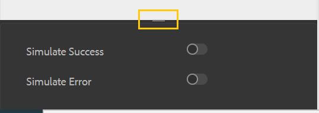

# 最適化表單元件的內嵌樣式 {#inline-styling-of-adaptive-form-components}

>[!NOTE]
>
> Adobe建議針對[建立新的Adaptive Forms](https://experienceleague.adobe.com/docs/experience-manager-core-components/using/adaptive-forms/introduction.html?lang=zh-Hant)或[將Adaptive Forms新增至AEM Sites頁面](/help/forms/creating-adaptive-form-core-components.md)，使用現代且可擴充的資料擷取[核心元件](/help/forms/create-or-add-an-adaptive-form-to-aem-sites-page.md)。 這些元件代表最適化表單建立方面的重大進步，可確保令人印象深刻的使用者體驗。本文說明使用基礎元件製作最適化Forms的舊方法。

| 版本 | 文章連結 |
| -------- | ---------------------------- |
| AEM 6.5 | [按一下這裡](https://experienceleague.adobe.com/docs/experience-manager-65/forms/adaptive-forms-basic-authoring/inline-style-adaptive-forms.html?lang=zh-Hant) |
| AEM as a Cloud Service  | 本文章 |

您可以使用[主題編輯器](themes.md)來指定樣式，以定義最適化表單的整體外觀和樣式。 此外，您也可以將CSS內嵌樣式套用至個別的最適化表單元件，並即時預覽變更。 內嵌樣式會覆寫主題中提供的樣式。

## 套用內嵌CSS屬性 {#apply-inline-css-properties}

若要將內嵌樣式新增至元件：

1. 在表單產生器中開啟表單，並將模式變更為樣式模式。 若要將模式變更為樣式模式，請在頁面工具列中選取 > **[!UICONTROL 樣式]**。
1. 在頁面中選取元件，然後選取編輯按鈕。 在側邊欄中開啟樣式屬性。

   您也可以從側欄中的表單階層樹狀結構中選取元件。 表單階層樹狀結構可在側邊欄中做為表單物件使用。

   在[!UICONTROL 樣式]模式中，您可以看到列在「表單物件」下的元件。 不過，側邊欄中的「表單物件」清單會列出欄位和面板等元件。 欄位和面板是可包含文字方塊和選項按鈕等元件的類屬元件。

   從側欄選取元件時，您會看到列出所有子元件以及所選元件的屬性。 您可以選取特定的子元件並設定其樣式。

1. 按一下側邊欄中的索引標籤以指定CSS屬性。 您可以指定屬性，例如：

   * [!UICONTROL 尺寸與位置] （顯示設定、邊框間距、高度、寬度、邊界、位置、z索引、浮點數、清除、溢位）
   * [!UICONTROL 文字] （字型系列、粗細、顏色、大小、行高和對齊）
   * [!UICONTROL 背景] （影像和漸層，背景顏色）
   * [!UICONTROL 框線] （寬度、樣式、顏色、半徑）
   * [!UICONTROL 效果] （陰影、不透明度）
   * [!UICONTROL 進階] （讓您為元件撰寫自訂CSS）

1. 同樣地，您可以為元件的其他部分套用樣式，例如[!UICONTROL Widget]、[!UICONTROL 標題]和[!UICONTROL 說明]。
1. 選取&#x200B;**[!UICONTROL 完成]**&#x200B;以確認變更，或選取&#x200B;**[!UICONTROL 取消]**&#x200B;以捨棄變更。

## 範例：欄位元件的內嵌樣式 {#example-inline-styles-for-a-field-component}

下列影像說明套用內嵌樣式之前和之後的文字欄位。

套用內嵌樣式之前的

套用內嵌樣式屬性前的文字方塊元件

請注意套用下列CSS屬性後，文字方塊樣式所發生的變化，如下圖所示。

<table>
 <tbody>
  <tr>
   <td>
選擇器
 </td>
   <td>
CSS屬性
 </td>
   <td>
值
 </td>
   <td>
效果
 </td>
  </tr>
  <tr>
   <td>
欄位
 </td>
   <td>
邊框
 </td>
   <td>
邊框寬度=2px
 
邊框樣式=實線
 
框線色彩=#1111
 </td>
   <td>
在欄位周圍建立黑色2畫素寬邊框
 </td>
  </tr>
  <tr>
   <td>
文字方塊
 </td>
   <td>
background-color
 </td>
   <td>
#6495ED
 </td>
   <td>
將背景顏色變更為葵花藍(#6495ED)
 
注意：您可以在值欄位中指定顏色名稱或其十六進位代碼。
 </td>
  </tr>
  <tr>
   <td>
標籤
 </td>
   <td>
尺寸與位置&gt;寬度
 </td>
   <td>
100畫素
 </td>
   <td>
修正標籤的寬度為100px
 </td>
  </tr>
  <tr>
   <td>欄位說明圖示</td>
   <td>文字&gt;字型顏色</td>
   <td>#2ECC40</td>
   <td>變更說明圖示面部的顏色。</td>
  </tr>
  <tr>
   <td>
詳細說明
 </td>
   <td>
text-align
 </td>
   <td>
中心點
 </td>
   <td>
將說明的完整說明對齊中心
 </td>
  </tr>
 </tbody>
</table>

套用內嵌樣式後的

套用內嵌樣式屬性後的文字方塊元件

依照上述步驟，您可以選取其他元件並設定其樣式，例如面板、提交按鈕和選項按鈕。

>[!NOTE]
>
>樣式屬性會依您選取的元件而有所不同。

## 複製並貼上樣式 {#copy-paste-styles}

您也可以在最適化表單中，將樣式從一個元件複製並貼到另一個元件。 在&#x200B;**[!UICONTROL 樣式]**&#x200B;模式中，選取元件並選取「複製」圖示。

選取相同型別的其他元件，並選取「貼上」圖示以貼上複製的樣式。 您也可以選取「清除樣式」圖示來清除套用的樣式。

## 為元件的不同狀態設定樣式 {#set-styles-for-states}

您可以為元件型別的不同狀態設定樣式。 不同的狀態包括： [!UICONTROL 焦點]、[!UICONTROL 已停用]、[!UICONTROL 暫留]、[!UICONTROL 錯誤]、[!UICONTROL 成功]以及[!UICONTROL 必要]。

若要定義元件狀態的樣式：

1. 在&#x200B;**[!UICONTROL 樣式]**&#x200B;模式中，選取元件並選取「編輯」圖示。

1. 使用&#x200B;**[!UICONTROL 狀態]**&#x200B;下拉式清單選取元件的狀態。

   

1. 定義元件所選取狀態的樣式，並選取以儲存屬性。

您也可以模擬成功和錯誤狀態。 選取「展開」圖示以檢視&#x200B;**[!UICONTROL 模擬成功]**&#x200B;和&#x200B;**[!UICONTROL 模擬錯誤]**&#x200B;選項。

## 另請參閱 {#see-also}

{{see-also}}

<!--

>[!MORELIKETHIS]
>
>* [Use themes in Adaptive Form Core Components ](/help/forms/using-themes-in-core-components.md)

-->