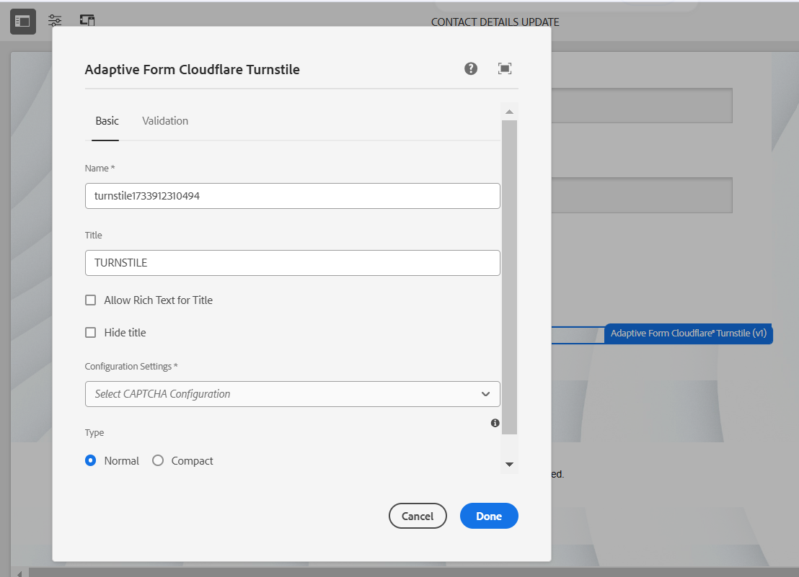

# 使用Turnstile連線您的AEM Forms環境 {#connect-your-forms-environment-with-turnstile-service}

此功能在早期採用者計畫之下。 您可以從您的官方電子郵件ID寫信到aem-forms-ea@adobe.com ，以加入率先採用者計畫並請求存取該功能。

CAPTCHA （完全自動化公用圖靈測試來區分電腦和人之間的差異）是一種常用於線上交易的程式，以區分人和自動化程式或機器人。 這會帶來挑戰，並評估使用者的回應，以判斷其是否為人類或機器人與網站互動。 它可防止使用者在測試失敗時繼續進行，並透過防止機器人張貼垃圾郵件或惡意目的來確保線上交易的安全。

AEM Forms as a Cloud Service支援下列驗證碼解決方案：

* [Turnstile](/help/forms/integrate-adaptive-forms-turnstile-core-components.md)
* [Google reCAPTCHA](/help/forms/captcha-adaptive-forms-core-components.md)
* [驗證碼](/help/forms/integrate-adaptive-forms-hcaptcha-core-components.md)

<!-- -->

## 將AEM Forms環境與Turnstile驗證碼整合

Cloudflare的Turnstile驗證碼是一種安全性措施，旨在保護表單和網站免受自動化機器人、惡意攻擊、垃圾郵件和不需要的自動化流量的傷害。 在允許提交表單前，它會在表單提交上顯示核取方塊，以驗證使用者是否為人類。 AEM Forms as a Cloud Service支援Adaptive Forms核心元件中的Turnstile驗證碼。

### 整合AEM Forms環境與Turnstile驗證碼的必要條件 {#prerequisite}

若要設定AEM Forms核心元件的Turnstile，您必須從Turnstile網站取得[Turnstile網站金鑰和秘密金鑰](https://developers.cloudflare.com/turnstile/get-started/)。

### 設定Turnstile {#steps-to-configure-hcaptcha}

若要將AEM Forms與Turnstile服務整合，請執行下列步驟：

1. 在您的AEM Forms as a Cloud Service環境中建立設定容器。 設定容器內含用來將AEM連線至外部服務的雲端設定。 若要建立並設定設定設定容器來將您的AEM Forms環境與Turnstile連線，請遵循下列指定步驟：
   1. 開啟您的AEM Forms as a Cloud Service執行個體。
   1. 前往&#x200B;**[!UICONTROL 工具 > 一般 > 設定瀏覽器]**。
   1. 在設定瀏覽器中，建立新資料夾並為其啟用雲端設定，或為現有資料夾啟用雲端設定，如下所述：

      * 若要建立&#x200B;**新資料夾**，並依照下列步驟啟用其雲端設定：
         1. 在組態瀏覽器中，按一下&#x200B;**[!UICONTROL 建立]**。
         1. 在建立設定對話方塊中，指定名稱、標題，並選取&#x200B;**[!UICONTROL 雲端設定]**&#x200B;選項。
         1. 按一下&#x200B;**[!UICONTROL 建立]**。
      * 若要啟用&#x200B;**現有資料夾**&#x200B;的雲端組態選項：
         1. 在組態瀏覽器中，選取現有的資料夾，然後按一下&#x200B;**[!UICONTROL 內容]**。
         1. 在[組態內容]對話方塊中，啟用&#x200B;**[!UICONTROL 雲端組態]**。
         1. 按一下&#x200B;**[!UICONTROL 儲存並關閉]**&#x200B;以儲存設定並結束。

1. 設定Cloud Service：
   1. 在您的AEM作者執行個體上，前往 > **[!UICONTROL 雲端服務]**&#x200B;並按一下&#x200B;**[!UICONTROL Turnstile]**。
      在ui中
   1. 選取已建立或已更新的設定容器，如上一節所述。 選取「**[!UICONTROL 建立]**」。
      
   1. 將&#x200B;**[!UICONTROL Widget Type]**&#x200B;指定為Managed、非互動式或隱藏式。 若要進一步瞭解Widget型別，請造訪[Turnstile Widget](https://developers.cloudflare.com/turnstile/concepts/widget/)。
   1. 針對先決條件](#prerequisite)中取得的Turnstile服務[，指定&#x200B;**[!UICONTROL 標題]**、**[!UICONTROL 名稱]**、**[!UICONTROL 網站金鑰]**&#x200B;和&#x200B;**[!UICONTROL 秘密金鑰]**。
   1. 按一下&#x200B;**[!UICONTROL 建立]**。

      

   >[!NOTE]
   >
   > 使用者不需要修改使用者端JavaScript驗證URL和伺服器端驗證URL，因為已預先填入Turnstile驗證。

   設定Turnstile Captcha服務後，即可用於根據核心元件的[最適化表單](https://experienceleague.adobe.com/en/docs/experience-manager-core-components/using/adaptive-forms/introduction)。

## 在最適化表單中使用 Turnstile {#using-turnstile-core-components}

1. 開啟您的AEM Forms as a Cloud Service執行個體。
1. 移至&#x200B;**[!UICONTROL Forms]** > **[!UICONTROL Forms和檔案]**。
1. 選取最適化表單並按一下&#x200B;**[!UICONTROL 屬性]**。 在&#x200B;**[!UICONTROL 設定容器]**&#x200B;區段中，選取包含連線AEM Forms與Turnstile的雲端設定的設定容器。
1. 按一下「**[!UICONTROL 儲存並關閉]**」。

   如果您沒有設定容器，請參閱[設定Turnstile](#steps-to-configure-hcaptcha)一節，以瞭解如何建立設定容器。

   

1. 選取最適化表單，然後按一下&#x200B;**[!UICONTROL 編輯]**&#x200B;以在編輯器中開啟表單。
1. 從元件瀏覽器中，拖放或將&#x200B;**[!UICONTROL 調適型表單Turnstile]**元件新增至調適型表單。
   
1. 選取&#x200B;**[!UICONTROL Adaptive Form Turnstile]**&#x200B;元件，然後按一下屬性圖示。 它會開啟屬性對話方塊。 指定下列屬性：

   

   * **[!UICONTROL 名稱]：**&#x200B;指定驗證碼元件的名稱，您可以在表單和規則編輯器中以唯一名稱輕鬆識別表單元件。
   * **[!UICONTROL 標題]：**&#x200B;指定驗證碼元件的標題。 您可以允許使用RTF文字作為標題，也可以透過勾選核取方塊來隱藏標題。
   * **[!UICONTROL 組態設定]：**&#x200B;選取為Turnstile Captcha服務設定的雲端組態。

     >[!NOTE]
     >
     >* 基於類似目的，您的環境中可以有多個雲端設定。 因此，請謹慎選擇服務。 如果未列出任何服務，請參閱[設定Turnstile](#steps-to-configure-hcaptcha)一節，瞭解如何建立設定容器以將您的AEM Forms環境與Turnstile服務連線。

   * **[!UICONTROL 驗證]：**&#x200B;提供錯誤訊息形式的驗證碼驗證：

      * **錯誤訊息：**&#x200B;提供驗證碼提交失敗時向使用者顯示的錯誤訊息。

        >[!NOTE]
        >
        >* 只有在使用者端已填入驗證碼時，才會顯示錯誤訊息。

1. 按一下&#x200B;**[!UICONTROL 「完成」]**。

現在，只有合法的表單，表單填寫者才能成功清除Turnstile服務帶來的挑戰，才能提交表單。

## 常見問題

* **問：我可以在最適化表單中使用多個驗證碼元件嗎？**
* **Ans：**&#x200B;不支援在最適化表單中使用一個以上的Captcha元件。 此外，不建議在片段或標示為延遲載入的面板中使用驗證碼元件。

## 另請參閱 {#see-also}

{{see-also}}
