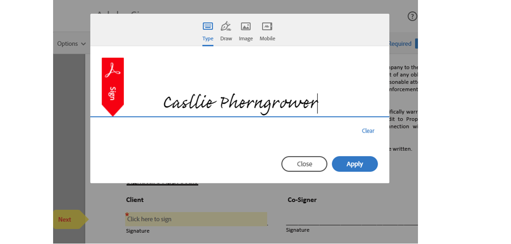

<!-- # Introduction to [!DNL AEM Forms] as a Cloud Service {#overview}

Adobe Experience Manager Forms as a Cloud Service offers a cloud-native, Platform as a Service (PaaS) solution for businesses to create, manage, publish, and update complex digital forms while integrating submitted data with back-end processes, business rules, and saving data in an external data store. The service is always current, always available, and always learning.

You can use the service to create and rollout  interactive and engaging digital forms. For example, an organization is looking to digitize their customer enrollment journey. They have multiple data sources with existing customer data, they are looking to pre-populate forms, add e-sign their forms, and archive filled forms as PDF files. Besides, the organization has multiple print forms (PDF forms), they are also looking to convert all of their print forms to digital forms.

The organization can use [!DNL AEM Forms] as a Cloud Service to create digital forms, connect forms to existing data sources, integrate forms with [!DNL Adobe Sign] to add e-signatures to forms, and generate Document of Record (DoR) to archive filled forms as PDF files. The organization can also use the service to convert their existing PDF forms to digital forms. 

An organization can sign up for [!DNL AEM Forms] as a Cloud Service and start using all these features without waiting to buy and set up a local infrastructure. The service also frees the organizations from the cycle of upgrades as it is always up to date and always offers the latest feature.  -->

# 主要功能 {#key-features}

[!DNL AEM Forms] as a Cloud Service提供數種雲端原生功能，例如雲端原生架構、自動調整規模、為升級停機時間零、CDN（內容傳遞網路）、雲端原生開發環境，以及透過Cloud Manager為環境自助服務的功能。 您可以使用服務：

* [建立適用性Forms](creating-adaptive-form.md#strong-create-an-adaptive-form-strong) 會為使用者的裝置和瀏覽器自動呈現。

   

* [建立像素完美PDF forms](use-forms-designer.md#create-an-adaptive-form) 看起來像紙。

* 使用 [automated forms conversion服務](https://experienceleague.adobe.com/docs/aem-forms-automated-conversion-service/using/introduction.html) 將PDF表單轉換為最適化表單。 它可協助您加速組織的資料擷取體驗的數位化和現代化。

   

* [建立業務流程](aem-forms-workflow-step-reference.md#create-form-centric-workflows). 例如，您可以在提交最適化表單時建立並觸發核准和拒絕工作流程。

除了上述 [!DNL AEM Forms] as a Cloud Service提供下列功能：

* 簡單易用的圖形用戶介面，可讓商務用戶輕鬆導入、管理、預覽和發佈表單
* 回應式表單目錄，具有使用關鍵字、標籤和中繼資料的強大搜尋功能
* 動態偵測使用者的裝置和位置，以在網路和行動頻道上適當地呈現表單
* [與Adobe Sign整合](adobe-sign-integration-adaptive-forms.md) 或手寫，以電子方式簽署包含機密資訊的文檔
* 能 [將服務連接到各種類型的資料源](data-integration.md#create-an-adaptive-form) 來傳送和擷取資料。 該服務支援從RESTful Web服務、基於SOAP的Web服務和啟用OData的服務發送和檢索資料。
* 與AEM Sites整合。 可將最適化表單內嵌在AEM Sites頁面中。 您也可以將最適化表單整合至任何網頁。
* 能夠建立記錄文檔(DoR)，以保留您提供的資訊的記錄並在適用性表單中提交，以便您以後可以參考它。 DoR是表單的PDF版本。 其中同時包含範本和資料。 該服務提供預設的DoR模板和工具，以開發自定義模板。
* 能夠建立適用性Forms，以產生符合架構的資料。 它可協助您將擷取的資料提交至現有的程式和資料來源，而不需進行任何或最少的修改。
* 能夠根據條件建立預填服務，以使用現有客戶資料填寫表單。 有助於加快表單填寫程式，降低放棄率。

<!-- 

## Enterprise-class forms {#enterprise-class-forms}

You can create enterprise class forms (Adaptive Forms) and deliver beautiful, interactive, responsive, and personalized experiences to your customers. These forms change behavior and appearance based on the underlying device. You can also use themes and templates with Adaptive Forms to mandate a uniform structure and appearance for all the forms of an organization or a department.

## Automatic conversion of PDF forms to Adaptive Forms {#automatic-conversion-of-pdf-forms-to-adaptive-forms}

You can use Automated Forms Conversion service to convert a PDF Form to an Adaptive Form. It helps you accelerate digitization and modernization of data capture experiences of your organization.

## Data Integration {#data-integration}

You can connect the service to various types of data sources to send and retrieve data. The service supports sending and retrieving data from RESTful web services, SOAP-based web services, and OData enabled services.

## Integration with [!DNL Adobe Sign] {#integration-with-adobe-sign}

 You can integrate the service with [!DNL Adobe Sign] and add [!DNL Adobe Sign] fields to an Adaptive Form. It allows your users to e-sign an Adaptive Form and use [!DNL Adobe Sign] with AEM Workflows. You can use AEM Workflows to develop a business logic and send forms and documents to recipients for signatures based on the business logic.

## Integration with [!DNL AEM Sites] {#integration-with-aem-sites}

You can embed an adaptive form in an AEM Sites or an external webpage. The service provides a component out of the box to integrate an adaptive forms to an AEM Sites page.

## Business Processes Automation {#bpa}

You can use AEM Workflows to create business processes and automate operations. For example, You can create and trigger an approval and rejection workflow on submission of an Adaptive Form. 

## Document of Record {#dor}

You can create a Document of Record (DoR) to keep a record of the information that you provide and submit in an Adaptive Form so that you can refer to it later. A DoR is a PDF version of a form. It includes both a template and data. The service provides a default DoR template and tools to develop a custom template.

## Rule editor {#rule-editor}

Rule editor empowers you to build dynamism and interactivity to Adaptive Forms. These rules define actions to trigger on form objects based on preset conditions, user inputs, and user actions on the form. It helps  streamline the form filling experience while ensuring accuracy and speed.
  

## WYSIWYG editors {#wysiwyg-editor} 

The service provides several WYSIWYG editors: Adaptive Forms editor, Theme editor, and Template editor. These help you create and edit forms and related assets in WYSIWYG manner. The editors also provide out-of-the-box options to simulate views for popular mobile devices, tablets, and desktop screen configurations.

## Schema-compliant data {#schema-complaint-data}

You can create Adaptive Forms to produce schema-compliant data. It helps you submit captured data to existing processes and data sources without any or minimal modifications.

## Prefill a form

You can create a prefill service to fill a form with existing customer data based on a criteria. It helps fasten the form filling process and reduce the abandon rate.

## Submit Actions

A Submit Action allows you to persist and process captured data. The service provides several Submit Actions out-of-the-box. You can use these Submit Actions to send submitted data to a REST endpoint, database, or an AEM Workflow. You can also email submitted data along with attachments and Document of Record(DoR). You can also develop a custom Submit Action to perform an action specific to your business.

* **Emulators:** You can view an Adaptive Form in an in-built emulator. It helps you simulate how an Adaptive Form appears on different devices to an end user. It provides out-of-the-box options to simulate views for popular mobile devices, tablets, and desktop screen configurations. 

In addition to standard [!DNL AEM Forms] features, [!DNL AEM Forms] as a Cloud Service provides several cloud-native capabilities such as a cloud-native architecture, auto-scaling, zero downtime for upgrades, a CDN (Content Delivery Network), cloud-native development environment, and ability to self-Service the environments via Cloud Manager. -->
