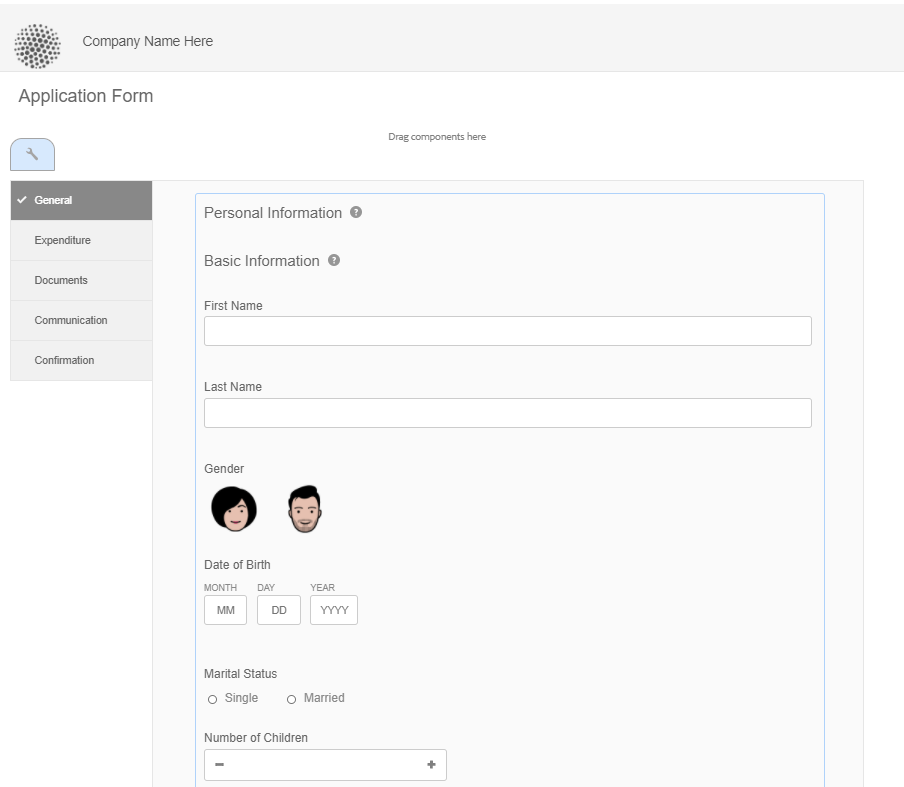
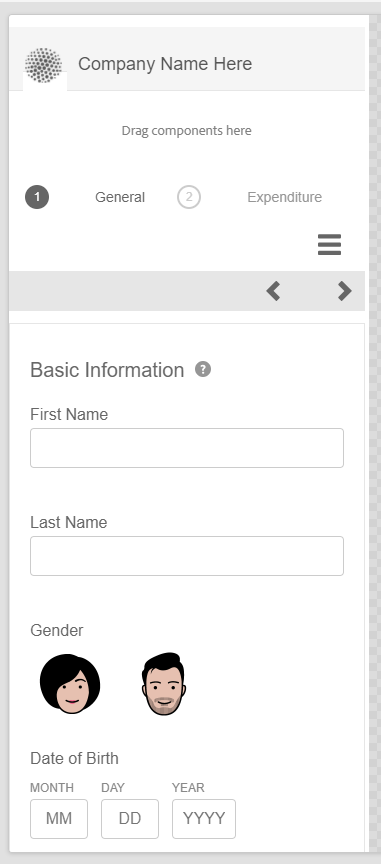

# 適用性Forms的版面功能 {#layout-capabilities-of-adaptive-forms}

[!DNL Adobe Experience Manager] 可讓您建立簡單易用的適用性Forms，為使用者提供動態體驗。 表單版面會控制項目或元件在最適化表單中的顯示方式。

<!-- ## Prerequisite knowledge {#prerequisite-knowledge}

Before learning about the different layout capabilities of Adaptive Forms, read [Introduction to authoring forms](introduction-forms-authoring.md) to know more about Adaptive Forms. -->

## 版面類型 {#types-of-layouts}

適用性表單提供下列類型的配置：

**[!UICONTROL 面板版面]** 控制面板內的項目或元件在裝置上的顯示方式。

**[!UICONTROL 行動版面]** 控制行動裝置上表單的導覽。 如果裝置寬度為768像素或以上，版面會視為行動版面，並針對行動裝置最佳化。

**[!UICONTROL 工具列版面]** 控制窗體中工具欄或面板工具欄中的操作按鈕的放置。

所有這些面板配置都定義於 `/libs/fd/af/layouts` 位置。

若要變更最適化表單的版面，請在 [!DNL Experience Manager].

## [!UICONTROL 面板布局] {#panel-layout}

表單作者可將版面配置與適用性表單的每個面板（包括根面板）建立關聯。

面板佈局位於 `/libs/fd/af/layouts/panel` 位置。 點選面板並選取  來查看面板屬性。


### [!UICONTROL 回應式 — 單一頁面上的所有項目，無需導覽] {#responsive-everything-on-one-page-without-navigation-br}

使用此面板配置建立回應式配置，可根據裝置的螢幕大小進行調整，而不需進行特殊導覽。

使用此版面，您可以放置多個 **[!UICONTROL 面板最適化表單]** 元件在面板內逐一顯示。



### [!UICONTROL 精靈] {#wizard}

使用此面板佈局在表單內提供引導式導航。 例如，當您想要在表單中擷取必填資訊，同時逐步引導使用者時，可使用此版面。

使用 **[!UICONTROL 面板最適化表單]** 元件，在面板內提供逐步導覽。 使用此版面時，使用者只有在目前步驟完成後才會移至下一個步驟

```javascript
window.guideBridge.validate([], this.panel.navigationContext.currentItem.somExpression)
```


### [!UICONTROL 折疊式面板] {#layout-for-accordion-design}

使用此版面，您可以將 **[!UICONTROL 面板最適化表單]** 元件（在具有折疊式面板樣式導覽的面板中）。 使用此配置，您也可以建立可重複的面板。 可重複的面板可讓您視需要動態新增或移除面板。 您可以定義面板重複的次數下限和上限。 此外，基於在面板項中提供的資訊，可動態地確定面板的標題。

摘要運算式可用來顯示使用者在最小化面板的標題中提供的值。


### [!UICONTROL 頁簽式佈局 — 頁簽顯示在左側 ]{#tabbed-layout-tabs-appear-on-the-left}

使用此版面，您可以將 **[!UICONTROL 面板最適化表單]** 元件（位於面板中），並搭配Tab導覽。 標籤會放置在面板內容的左側。


顯示在面板左側的標籤

### [!UICONTROL 頁簽式佈局 — 頁簽顯示在頂部] {#tabbed-layout-tabs-appear-on-the-top}

使用此版面，您可以將 **[!UICONTROL 面板最適化表單]** 面板中的元件，帶有定位導航。 標籤會放置在面板內容上方。


## 行動版面 {#mobile-layouts}

行動配置可讓使用者在螢幕相對較小的行動裝置上輕鬆導覽。 行動版面使用標籤樣式或嚮導樣式進行表單導航。 套用行動版面可提供整個表單的單一版面。

此版面會使用導覽列和導覽功能表來控制導覽。 導覽列隨即顯示 **&lt;** 和 **>** 圖示表示 **[!UICONTROL next]** 和 **[!UICONTROL 上一個]** 導覽表單中的步驟。

行動版面位於 `/libs/fd/af/layouts/mobile/` 位置。 下列行動配置預設為適用性Forms提供。


選取 **[!UICONTROL 將回應式版面的可導覽項目新增至行動功能表]** 選項，檢視「行動版面」中面板可用的導覽選項。 只有在您選取 **[!UICONTROL 回應式]** 面板的版面。

使用行動版面時，若要存取各種表單面板，點選即可使用表單功能表  表徵圖。

### [!UICONTROL 表單標題中具有面板標題的版面] {#layout-with-panel-titles-in-the-form-header}

如名稱所示，此版面會顯示面板標題以及導覽功能表和導覽列。 此版面也提供「下一步」和「上一步」導覽圖示。



### [!UICONTROL 表單標題中不包含面板標題的佈局 ]{#layout-without-panel-titles-in-the-form-header}

如名稱所示，此版面只會顯示導覽功能表和導覽列，而不顯示面板標題。 此版面也提供「下一步」和「上一步」導覽圖示。


<!-- ## Toolbar layouts {#toolbar-layouts}

A Toolbar Layout controls positioning and display of any action buttons that you add to your Adaptive Forms. The layout can be added at a form level or at a panel level.


A list of Toolbar Layouts in Adaptive Forms

Toolbar layouts are available at `/libs/fd/af/layouts/toolbar` location. Adaptive Forms provide the following Toolbar Layouts, by default.

### [!UICONTROL Default layout for toolbar] {#default-layout-for-toolbar}

This layout is selected as the default layout when you add any action buttons in an Adaptive Form. Selecting this layout displays the same layout for both, desktop and mobile devices.

Also, you can add multiple toolbars containing action buttons configured with this layout. An action button is associated with a form control. You can configure the toolbars to be before or after a panel.


Default view for toolbar

### [!UICONTROL Mobile fixed layout for toolbar] {#mobile-fixed-layout-for-toolbar}

Select this layout to provide alternate layouts for desktop and mobile devices.

For the desktop layout, you can add Action buttons using some specific labels. Only one toolbar can be configured with this layout. If more than one toolbar is configured with this layout, there is an overlap for mobile devices and only one toolbar is visible. For example, you can have a toolbar at the bottom or the top of the form, or, after or before panels in the form.

For the Mobile layout, you can add action buttons using icons.


Mobile fixed layout for toolbar-->
