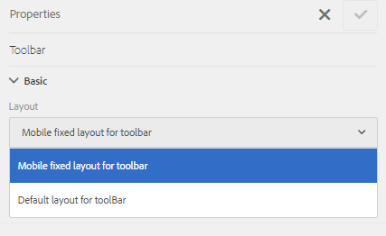

# 自適應Forms的佈局功能 {#layout-capabilities-of-adaptive-forms}

[!DNL Adobe Experience Manager] 讓您建立易於使用的自適應Forms，為最終用戶提供動態體驗。 表單佈局控制項目或元件在自適應表單中的顯示方式。

<!-- ## Prerequisite knowledge {#prerequisite-knowledge}

Before learning about the different layout capabilities of Adaptive Forms, read [Introduction to authoring forms](introduction-forms-authoring.md) to know more about Adaptive Forms. -->

## 佈局類型 {#types-of-layouts}

「自適應表單」提供以下類型的佈局：

**[!UICONTROL 面板佈局]** 控制面板內的項目或元件在設備上的顯示方式。

**[!UICONTROL 移動佈局]** 控制移動設備上表單的導航。 如果設備寬度為768像素或更多，則該佈局被視為移動佈局並針對移動設備進行優化。

**[!UICONTROL 工具欄佈局]** 控制窗體中工具欄或面板工具欄中「操作」按鈕的位置。

所有這些面板佈局都在 `/libs/fd/af/layouts` 位置。

要更改自適應表單的佈局，請在 [!DNL Experience Manager]。

## [!UICONTROL 面板布局] {#panel-layout}

表單作者可以將佈局與包括根面板的自適應表單的每個面板相關聯。

「面板」佈局可在 `/libs/fd/af/layouts/panel` 位置。 按一下面板並選擇  按鈕。


### [!UICONTROL 響應 — 無需導航即可將所有內容放在一頁上] {#responsive-everything-on-one-page-without-navigation-br}

使用此面板佈局可建立響應佈局，該佈局可根據設備的螢幕大小進行調整，而無需進行任何專用導航。

使用此佈局，可以放置多個 **[!UICONTROL 面板自適應窗體]** 在面板中一個接一個的元件。


### [!UICONTROL 精靈] {#wizard}

使用此面板佈局可在窗體中提供引導導航。 例如，當要在逐步引導用戶的同時捕獲表單中的必需資訊時，請使用此佈局。

使用 **[!UICONTROL 面板自適應窗體]** 元件，用於在面板內提供分步導航。 使用此佈局時，用戶僅在當前步驟完成後才移動到下一步

```javascript
window.guideBridge.validate([], this.panel.navigationContext.currentItem.somExpression)
```


### [!UICONTROL 折疊式面板] {#layout-for-accordion-design}

使用此佈局，可以 **[!UICONTROL 面板自適應窗體]** 元件。 使用此佈局，還可以建立可重複面板。 可重複面板使您能夠根據需要動態添加或刪除面板。 您可以定義面板重複的最小次數和最大次數。 此外，可以根據在面板項目中提供的資訊動態地確定面板的標題。

摘要表達式可用於在最小化面板的標題中顯示最終用戶提供的值。


### [!UICONTROL 頁籤式佈局 — 頁籤顯示在左側 ]{#tabbed-layout-tabs-appear-on-the-left}

使用此佈局，可以 **[!UICONTROL 面板自適應窗體]** 元件。 這些頁籤放置在面板內容的左側。


顯示在面板左側的頁籤

### [!UICONTROL 頁籤式佈局 — 頁籤顯示在頂部] {#tabbed-layout-tabs-appear-on-the-top}

使用此佈局，可以 **[!UICONTROL 面板自適應窗體]** 帶制表符導航的面板中的元件。 這些頁籤放置在面板內容的頂部。


## 移動佈局 {#mobile-layouts}

移動佈局允許在螢幕相對較小的移動設備上進行用戶友好的導航。 移動佈局使用頁籤式樣式或嚮導式樣進行表單導航。 應用移動佈局為整個表單提供單個佈局。

此佈局使用導航欄和導航菜單控制導航。 導航欄顯示 **&lt;** 和 **>** 表徵圖 **[!UICONTROL 下]** 和 **[!UICONTROL 上]** 中選擇相應的選項。

Mobile Layouts可在 `/libs/fd/af/layouts/mobile/` 位置。 預設情況下，以下移動佈局在AdaptiveForms中可用。


選擇 **[!UICONTROL 向移動菜單添加響應佈局的可導航項]** 按鈕，將選定控制項在Mobile佈局中移動。 僅當您選擇 **[!UICONTROL 響應]** 面板的佈局。

使用Mobile佈局時，可通過點擊表格菜單訪問各種表格面板  表徵圖

### [!UICONTROL 在表單標題中包含面板標題的佈局] {#layout-with-panel-titles-in-the-form-header}

如名稱所示，此佈局顯示面板標題以及導航菜單和導航欄。 此佈局還提供了「下一步」和「上一步」表徵圖以用於導航。


### [!UICONTROL 窗體標題中沒有面板標題的佈局 ]{#layout-without-panel-titles-in-the-form-header}

如名稱所示，此佈局僅顯示沒有面板標題的導航菜單和導航欄。 此佈局還提供了「下一步」和「上一步」表徵圖以用於導航。


<!-- ## Toolbar layouts {#toolbar-layouts}

A Toolbar Layout controls positioning and display of any action buttons that you add to your Adaptive Forms. The layout can be added at a form level or at a panel level.



A list of Toolbar Layouts in Adaptive Forms

Toolbar layouts are available at `/libs/fd/af/layouts/toolbar` location. Adaptive Forms provide the following Toolbar Layouts, by default.

### [!UICONTROL Default layout for toolbar] {#default-layout-for-toolbar}

This layout is selected as the default layout when you add any action buttons in an Adaptive Form. Selecting this layout displays the same layout for both, desktop and mobile devices.

Also, you can add multiple toolbars containing action buttons configured with this layout. An action button is associated with a form control. You can configure the toolbars to be before or after a panel.


Default view for toolbar

### [!UICONTROL Mobile fixed layout for toolbar] {#mobile-fixed-layout-for-toolbar}

Select this layout to provide alternate layouts for desktop and mobile devices.

For the desktop layout, you can add Action buttons using some specific labels. Only one toolbar can be configured with this layout. If more than one toolbar is configured with this layout, there is an overlap for mobile devices and only one toolbar is visible. For example, you can have a toolbar at the bottom or the top of the form, or, after or before panels in the form.

For the Mobile layout, you can add action buttons using icons.


Mobile fixed layout for toolbar-->
