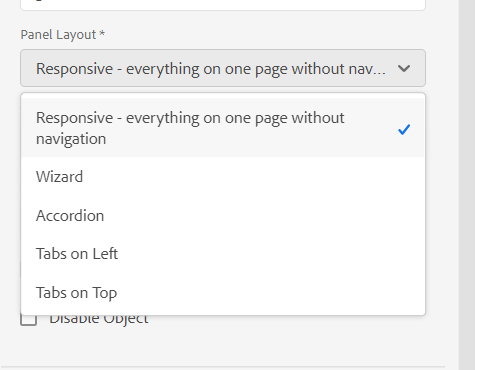

# Adaptive Forms的版面配置功能 {#layout-capabilities-of-adaptive-forms}

<span class="preview">Adobe 建議使用新式且可擴充的資料擷取[核心元件](https://experienceleague.adobe.com/docs/experience-manager-core-components/using/adaptive-forms/introduction.html)，用來[建立新的最適化表單](/help/forms/creating-adaptive-form-core-components.md)或[將最適化表單新增到 AEM Sites 頁面](/help/forms/create-or-add-an-adaptive-form-to-aem-sites-page.md)。這些元件代表最適化表單建立方面的重大進步，可確保令人印象深刻的使用者體驗。本文會介紹使用基礎元件編寫最適化表單的舊方法。</span>


| 版本 | 文章連結 |
| -------- | ---------------------------- |
| AEM 6.5 | [按一下這裡](https://experienceleague.adobe.com/docs/experience-manager-65/forms/adaptive-forms-basic-authoring/layout-capabilities-adaptive-forms.html) |
| AEM as a Cloud Service  | 本文章 |

[!DNL Adobe Experience Manager] 可讓您建立簡單易用的最適化Forms，為使用者提供動態體驗。 表單版面配置會控制專案或元件在調適型表單中的顯示方式。

<!-- ## Prerequisite knowledge {#prerequisite-knowledge}

Before learning about the different layout capabilities of Adaptive Forms, read [Introduction to authoring forms](introduction-forms-authoring.md) to know more about Adaptive Forms. -->

## 版面型別 {#types-of-layouts}

調適型表單提供下列版面型別：

**[!UICONTROL 面板配置]** 控制面板內的專案或元件在裝置上的顯示方式。

**[!UICONTROL 行動佈局]** 控制行動裝置上表單的導覽。 如果裝置寬度為768畫素或以上，則配置會視為行動版面，且已針對行動裝置最佳化。

**[!UICONTROL 工具列配置]** 控制動作按鈕在表單工具列或面板工具列中的位置。

所有這些面板配置均定義於 `/libs/fd/af/layouts` 位置。

若要變更最適化表單的版面，請在以下位置使用製作模式： [!DNL Experience Manager].

## [!UICONTROL 面板配置] {#panel-layout}

表單作者可以將版面配置與調適型表單的每個面板建立關聯，包括根面板。

面板配置位於 `/libs/fd/af/layouts/panel` 位置。 選取面板並選取  以檢視面板屬性。



### [!UICONTROL Responsive — 全部於單頁無需導覽] {#responsive-everything-on-one-page-without-navigation-br}

使用此面板佈局可建立回應式佈局，此佈局會根據裝置的熒幕大小進行調整，而無需任何專門的導覽。

使用此版面，您可以放置多個 **[!UICONTROL 面板最適化表單]** 面板中的元件一個接一個。


### [!UICONTROL 精靈] {#wizard}

使用此面板配置在表單內提供引導式導覽。 例如，當您想要在表單中擷取必要資訊，同時逐步引導使用者時，請使用此版面。

使用 **[!UICONTROL 面板最適化表單]** 元件，在面板內提供逐步導覽。 使用此版面配置時，使用者只會在目前步驟完成後才移至下一個步驟

```javascript
window.guideBridge.validate([], this.panel.navigationContext.currentItem.somExpression)
```


### [!UICONTROL 折疊式面板] {#layout-for-accordion-design}

使用此版面，您可以放置 **[!UICONTROL 面板最適化表單]** 具有摺疊式功能表樣式導覽的面板中的元件。 使用此版面，您也可以建立可重複的面板。 可重複面板可讓您視需要動態新增或移除面板。 您可以定義面板重複的最小和最大次數。 此外，面板的標題可以根據面板專案中提供的資訊動態決定。

摘要運算式可用來顯示使用者在最小化面板標題中提供的值。


### [!UICONTROL 索引標籤版面配置 — 索引標籤顯示在左側]{#tabbed-layout-tabs-appear-on-the-left}

使用此版面，您可以放置 **[!UICONTROL 面板最適化表單]** 具有索引標籤導覽的面板中的元件。 標籤會放置在面板內容的左側。


出現在面板左側的索引標籤

### [!UICONTROL 索引標籤版面配置 — 索引標籤顯示在頂端] {#tabbed-layout-tabs-appear-on-the-top}

使用此版面，您可以放置 **[!UICONTROL 面板最適化表單]** 具有索引標籤導覽的面板中的元件。 索引標籤會放置在面板內容的頂端。


## 行動版面配置 {#mobile-layouts}

行動版面配置可在熒幕較小之行動裝置上進行方便好用的導覽。 行動版面配置會使用索引標籤或精靈樣式來進行表單導覽。 套用行動版面配置可為整個表單提供單一版面配置。

此版面配置會使用導覽列和導覽功能表來控制導覽。 導覽列隨即顯示 **&lt;** 和 **>** 圖示表示 **[!UICONTROL 下一個]** 和 **[!UICONTROL 上一個]** 表單中的導覽步驟。

行動版面配置位於 `/libs/fd/af/layouts/mobile/` 位置。 下列行動版面預設可在Adaptive Forms中使用。


選取 **[!UICONTROL 將回應式佈局的可導覽專案新增至行動功能表]** 選項以檢視適用於行動版面配置中面板的可導覽選項。 只有在選取「 」時，可瀏覽選項才會顯示 **[!UICONTROL 回應式]** 面板的配置。

使用行動版面配置時，可透過點選使用表單功能表來存取各種表單面板  圖示。

### [!UICONTROL 在表單標題中使用面板標題的佈局] {#layout-with-panel-titles-in-the-form-header}

如名稱所建議，此版面會顯示面板標題以及導覽功能表和導覽列。 此版面配置也提供用於導覽的「下一個」和「上一個」圖示。


### [!UICONTROL 在表單標題中不使用面板標題進行佈局]{#layout-without-panel-titles-in-the-form-header}

如名稱所建議，此版面只會顯示導覽功能表與導覽列，而不會顯示面板標題。 此版面配置也提供用於導覽的「下一個」和「上一個」圖示。


## 另請參閱 {#see-also}

{{see-also}}


<!-- ## Toolbar layouts {#toolbar-layouts}

A Toolbar Layout controls positioning and display of any action buttons that you add to your Adaptive Forms. The layout can be added at a form level or at a panel level.


A list of Toolbar Layouts in Adaptive Forms

Toolbar layouts are available at `/libs/fd/af/layouts/toolbar` location. Adaptive Forms provide the following Toolbar Layouts, by default.

### [!UICONTROL Default layout for toolbar] {#default-layout-for-toolbar}

This layout is selected as the default layout when you add any action buttons in an Adaptive Form. Selecting this layout displays the same layout for both, desktop and mobile devices.

Also, you can add multiple toolbars containing action buttons configured with this layout. An action button is associated with a form control. You can configure the toolbars to be before or after a panel.


Default view for toolbar

### [!UICONTROL Mobile fixed layout for toolbar] {#mobile-fixed-layout-for-toolbar}

Select this layout to provide alternate layouts for desktop and mobile devices.

For the desktop layout, you can add Action buttons using some specific labels. Only one toolbar can be configured with this layout. If more than one toolbar is configured with this layout, there is an overlap for mobile devices and only one toolbar is visible. For example, you can have a toolbar at the bottom or the top of the form, or, after or before panels in the form.

For the Mobile layout, you can add action buttons using icons.


Mobile fixed layout for toolbar-->


