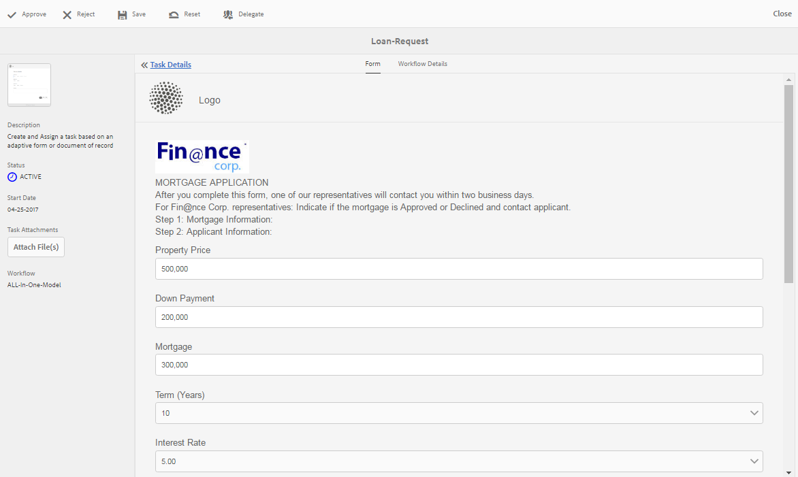

# 在收件箱中管理Forms應用程式AEM和任務{#manage-forms-applications-and-tasks-in-aem-inbox}

啟動或觸發以Forms為中心的工作流的多種方法之一是通過收件箱中的AEM應用程式。 您需要建立工作流應用程式，以使Forms工作流作為「收件箱」中的應用程式可用。 有關工作流應用程式和啟動Forms工作流的其他方法的詳細資訊，請參閱 [在OSGi上啟動以Forms為中心的工作流](aem-forms-workflow.md#launch)。

此外，收件箱AEM還整合來自各個元件(包括Forms工作AEM流)的通知和任務。 當觸發包含「分配」任務步驟的表單工作流時，關聯的應用程式將作為任務列在受分配人的收件箱中。 如果受分配者是組，則任務將出現在所有組成員的收件箱中，直到單個成員聲明或委派任務。

「收件箱」用戶介面提供清單和日曆視圖以查看任務。 您還可以配置視圖設定。 您可以根據各種參數篩選任務。 有關視圖和篩選器的詳細資訊，請參見 [收件箱](https://experienceleague.adobe.com/docs/experience-manager-cloud-service/sites/authoring/getting-started/inbox.html#inbox-in-the-header)。

總之，「收件箱」允許您建立新應用程式並管理已分配的任務。

>[!NOTE]
>
>您必須是 [!DNL workflow-users] 組以便能夠使用收AEM件箱。

## 建立應用程式 {#create-application}

1. 轉至AEM收件箱https://&#39;[伺服器]:[埠]「/aem/inbox」。
1. 在收件箱UI中，點擊 **[!UICONTROL 建立>應用程式]**。 此時將顯示「選擇應用程式」頁。
1. 選擇應用程式並按一下 **[!UICONTROL 建立]**。 將開啟與應用程式關聯的「自適應表單」。 在「自適應表單」中填充資訊並點擊 **[!UICONTROL 提交]**。 它將啟動關聯的工作流，並在受分配人的「收件箱」中建立任務。

## 管理任務 {#manage-tasks}

當Forms工作流觸發器並且您是受分配者或受分配者組的一部分時，「收件箱」中將顯示一個任務。 您可以在收件箱中查看任務詳細資訊並對任務執行可用操作。

### 聲明或委託任務 {#claim-or-delegate-tasks}

分配給組的任務顯示在所有組成員的收件箱中。 任何組成員都可以聲明該任務或將其委託給其他組成員。 為此：

1. 點擊以選擇任務的縮略圖。 開啟或委派任務的選項顯示在頂部。

   

1. 執行下列操作之一：

   * 要委派任務，請點擊 **[!UICONTROL 委託]**。 將開啟「委託項」(Delegate Item)對話框。 選擇用戶，可選擇添加註釋，然後點擊 **[!UICONTROL 確定]**。

   

   * 要聲明任務，請點擊 **[!UICONTROL 開啟]**。 將開啟「分配到自身」對話框。 點擊 **[!UICONTROL 繼續]** 來聲明任務。 聲明的任務將作為收件箱中的受分配者出現。

   

### 查看詳細資訊並對任務執行操作 {#view-details-and-perform-actions-on-tasks}

開啟任務時，可以查看任務詳細資訊並執行可用操作。 可用於任務的操作在關聯的Forms工作流的「分配」任務步驟中定義。

1. 點擊以選擇任務的縮略圖。 開啟或委派選定任務的選項顯示在頂部。
1. 點擊 **開啟** 查看任務詳細資訊並執行操作。 將開啟詳細的任務視圖。 在此視圖中，您可以查看任務詳細資訊並對任務執行操作。

   >[!NOTE]
   >
   >如果任務已分配給組，則必須聲明它能夠在詳細視圖中開啟它。



詳細的任務視圖包括以下部分：

* 任務詳細資訊
* 表單
* 工作流程資訊
* 操作工具欄

#### 任務詳細資訊 {#task-details}

「任務詳細資訊」部分顯示有關任務的資訊。 顯示的資訊取決於 [分配任務步驟](https://experienceleague.adobe.com/docs/experience-manager-65/developing/extending-aem/extending-workflows/workflows-step-ref.html#extending-aem) 的子菜單。 上例顯示用於任務的說明、狀態、起始日期和工作流。 它還允許將檔案附加到任務。

#### 表單 {#form}

主內容區域中的「表單」頁籤顯示已提交的表單和欄位級附件（如果有）。

#### 工作流程資訊 {#workflow-details}

頂部的「工作流詳細資訊」(Workflow Details)頁籤顯示任務在工作流的各個階段中的進度。 它顯示任務的已完成、當前和掛起階段。 工作流的階段在 [分配任務步驟](https://experienceleague.adobe.com/docs/experience-manager-65/developing/extending-aem/extending-workflows/workflows-step-ref.html#extending-aem) 的子菜單。

此外，該頁籤還顯示工作流中每個已完成階段的任務歷史記錄。 你可以點擊 **[!UICONTROL 查看詳細資訊]** 以瞭解該階段的詳細資訊。 它顯示有關任務的注釋、表單和任務附件、狀態、起始日期和終止日期等。


#### 操作工具欄 {#actions-toolbar}

「操作」(Actions)工具欄顯示任務的所有可用選項。 雖然「保存」(Save)、「重置」(Reset)和「委託」(Delegate)是預設操作，但在中配置了其他可用操作 [分配任務步驟](https://experienceleague.adobe.com/docs/experience-manager-65/developing/extending-aem/extending-workflows/workflows-step-ref.html#extending-aem)。 在上例中，工作流中配置了「批准」和「拒絕」。

在對任務執行操作時，它將在工作流中繼續。

### 查看已完成的任務 {#view-completed-tasks}

收AEM件箱僅顯示活動任務。 已完成的任務不會顯示在清單中。 但是，您可以使用收件箱篩選器根據多個參數（如任務類型、狀態、開始和結束日期等）篩選任務。 要查看已完成的任務：

1. 在收AEM件箱中，點擊  開啟篩選器選擇器。
1. 點擊 **[!UICONTROL 任務狀態]** 折疊式，選擇 **[!UICONTROL 完成]**。 所有已完成的任務都會出現。

   

1. 點擊以選擇任務，然後按一下 **[!UICONTROL 開啟]**。

此任務將開啟，以顯示與任務關聯的文檔或自適應表單。 對於自適應表單，任務將顯示只讀自適應表單或其PDF記錄文檔，如在「自適應表單」的「表單/文檔」頁籤中配置 [分配任務工作流步驟](https://experienceleague.adobe.com/docs/experience-manager-65/developing/extending-aem/extending-workflows/workflows-step-ref.html#extending-aem)。

「任務詳細資訊」部分顯示已執行的操作、任務狀態、起始日期和終止日期等資訊。


的 **[!UICONTROL 工作流詳細資訊]** 頁籤。 點擊 **[!UICONTROL 查看詳細資訊]** 的上界。


## 疑難排解 {#troubleshooting-workflows}

### 無法查看收件箱中與工AEM作流相關AEM的項 {#unable-to-see-aem-worklow-items}

工作流模型所有者無法查看收件箱中與工AEM作流相關AEM的項目。 要解決此問題，請將下面列出的索引添加AEM到儲存庫並重建索引。

1. 使用以下方法之一添加索引：

   * 在CRX DE中建立以下節點 `/oak:index/workflowDataLucene/indexRules/granite:InboxItem/properties` 具有下表中指定的相應屬性：

      | 節點 | 屬性 | 類型 |
      |---|---|---|
      | 共用 | 共用 | 字串 |
      | 鎖定 | 鎖定 | 布林值 |
      | 返回 | 返回 | 布林值 |
      | 允許收件箱共用 | 允許收件箱共用 | 布林值 |
      | allowExplicitSharing | allowExplicitSharing | 布林值 |


   * 通過包部署索AEM引。 您可以使用 [原AEM型](https://experienceleague.adobe.com/docs/experience-manager-core-components/using/developing/archetype/overview.html?lang=en) 項目以建立可部署AEM包。 使用以下示例代碼將索引添加到AEMArchetype項目：

   ```Java
      .property("sharedWith", "sharedWith").type(TYPENAME_STRING).propertyIndex()
      .property("locked", "locked").type(TYPENAME_BOOLEAN).propertyIndex()
      .property("returned", "returned").type(TYPENAME_BOOLEAN).propertyIndex()
      .property("allowInboxSharing", "allowInboxSharing").type(TYPENAME_BOOLEAN).propertyIndex()
      .property("allowExplicitSharing", "allowExplicitSharing").type(TYPENAME_BOOLEAN).propertyIndex()
   ```

1. [建立屬性索引並將其設定為true](https://experienceleague.adobe.com/docs/experience-manager-65/deploying/deploying/queries-and-indexing.html?lang=en#the-property-index)。

1. 在CRX DE中配置索引或通過包部署後， [重新為儲存庫編製索引](https://helpx.adobe.com/in/experience-manager/kb/HowToCheckLuceneIndex.html#Completelyrebuildtheindex)。

