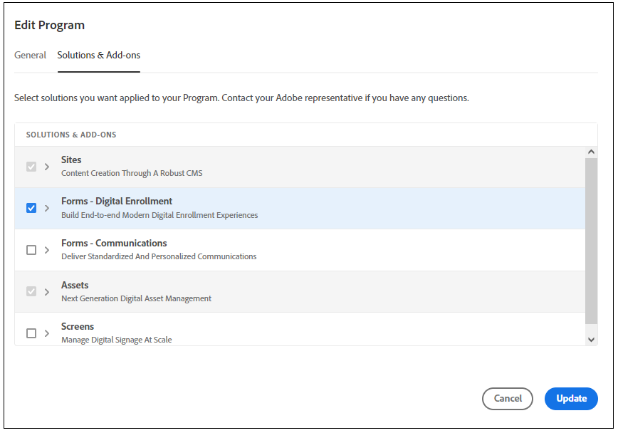

# 移轉至[!DNL AEM Forms]as a Cloud Service  {#Harden-your-AEM-Forms-as-a-Cloud-Service-environment}

您可以從中遷移您的自適應Forms、主題、模板和雲配置 <!-- AEM 6.3 Forms--> OSGiAEM上的Forms6.4 AEMOSGi上的Forms6.5 [!DNL AEM] as a Cloud Service。 在遷移這些資產之前，請使用遷移實用程式將早期版本中使用的格式轉換為 [!DNL AEM] as a Cloud Service。 運行遷移實用程式時，將更新以下資產：

* 自適應Forms的自定義元件
* 自適應Forms模板和主題
* 雲配置
* 代碼編輯器指令碼被轉換為可重用的函式並應用於可視規則。

## 注意事項 {#consideration}

* 該服務僅幫助從 [!DNL AEM Forms] 在OSGi環境中。 從遷移內容 [!DNL AEM Forms] 不支援將JEE連接到Cloud Service環境。

* (僅適用於AEM6.3Forms或舊版本環境，升級到AEM6.4Forms或AEM6.5Forms)基於出廠設定模板和在AEM6.3Forms或舊版本中提供的主題的自適應Forms不受[!DNL]支援 [!DNL AEM Forms]]as a Cloud Service。

## 必備條件 {#prerequisites}

* [啟用Forms — 數字註冊](https://experienceleague.adobe.com/docs/experience-manager-cloud-manager/using/getting-started/setting-up-program.html?#editing-program) 選項，以及您的FormsCloud Service計畫 [運行管線](https://experienceleague.adobe.com/docs/experience-manager-cloud-manager/using/how-to-use/deploying-code.html)。

   

* 在Cloud Service環境中，遷移實用程式與用戶映射工具和內容傳輸工具結合使用。 遷移實用程式 [!DNL AEM Forms] 與Cloud Service相容的資產，內容傳輸工具將內容從 [!DNL AEM Forms] 環境 [!DNL AEM] as a Cloud Service環境。 在使用遷移實用程式之前，請瞭解 [移到AEMas a Cloud Service](https://experienceleague.adobe.com/docs/experience-manager-cloud-service/moving/home.html)。 該過程有兩種工具：
   * [用戶映射工具](https://experienceleague.adobe.com/docs/experience-manager-cloud-service/moving/cloud-migration/content-transfer-tool/using-user-mapping-tool.html?lang=en#cloud-migration):用戶映射工具可幫助您將用戶與相應的Adobe IMS用戶帳戶進行映射。
   * [內容傳輸工具](https://experienceleague.adobe.com/docs/experience-manager-cloud-service/moving/cloud-migration/content-transfer-tool/overview-content-transfer-tool.html?#cloud-migration):內容傳輸工具可幫助您準備內容並將內容從現有環境傳輸到Cloud Service環境。
* 具有管理員權限的帳戶 [!DNL AEM Forms] as a Cloud Service和本地 [!DNL AEM Forms] 環境。
* 下載並安裝Best Practice Analyzer 、內容傳輸工具，以及 [!DNL AEM Forms] 遷移實用程式 [軟體分發門戶](https://experience.adobe.com/#/downloads/content/software-distribution/en/aemcloud.html)

* 運行 [最佳做法分析器](https://experienceleague.adobe.com/docs/experience-manager-cloud-service/moving/cloud-migration/best-practices-analyzer/overview-best-practices-analyzer.html?lang=en#cloud-migration) 工具並修復報告的問題。

<!-- * Download the latest [compatibility package](https://experienceleague.adobe.com/docs/experience-manager-release-information/aem-release-updates/forms-updates/aem-forms-releases.html?lang=en#aem-65-forms-releases) for your [!DNL AEM Forms] version. -->

## 遷移 [!DNL AEM Forms] 資產  {#use-the-migration-utility}

執行以下步驟，使 [!DNL AEM Forms] 與Cloud Service相容的資產，並將其 [!DNL AEM] as a Cloud Service環境。

1. 建立 [克隆](https://experienceleaguecommunities.adobe.com/t5/adobe-experience-manager/correct-method-to-clone-the-aem-environment/qaq-p/363487) 您現有 [!DNL AEM Forms] 環境。

   始終使用克隆的環境運行內容傳輸工具和遷移實用程式。 內容傳輸工具和遷移實用程式對內容和資產做了一些更改。 因此，不要在生產環境中運行內容傳輸工具和遷移實用程式。

1. 使用管理權限登錄到克隆的環境。

1. 運行 [用戶映射工具](https://experienceleague.adobe.com/docs/experience-manager-cloud-service/moving/cloud-migration/content-transfer-tool/using-user-mapping-tool.html?lang=en#cloud-migration) 將用戶與相應的Adobe IMS用戶帳戶映射。 您需要Adobe IMS用戶帳戶登錄到 [!DNL AEM Forms] as a Cloud Service實例。

1. 下載並安裝 [內容傳輸工具](https://experienceleague.adobe.com/docs/experience-manager-cloud-service/moving/cloud-migration/content-transfer-tool/overview-content-transfer-tool.html?#cloud-migration) 和 [!DNL AEM Forms] as a Cloud Service遷移實用程式 [軟體分發門戶](https://experience.adobe.com/#/downloads/content/software-distribution/en/aemcloud.html) 在克隆的環境中。 可以使用包管AEM理器來安裝工具和實用程式。

1. 導航到 **[!UICONTROL 工具]** > **[!UICONTROL 操作]** > **[!UICONTROL 內容遷移]**。

1. 開啟 **[!UICONTROL 為Forms遷移做好準備]** 卡。 瀏覽器顯示五個選項：
   * **[!UICONTROL AEM Forms 資產移轉]**
   * **[!UICONTROL 自適應Forms自定義元件遷移]**
   * **[!UICONTROL 自適應Forms模板遷移]**
   * **[!UICONTROL AEM 表單雲端組態移轉]**
   * **[!UICONTROL 代碼編輯器指令碼遷移]**

1. 使用一個接一個的選項 [!DNL AEM Forms] 與 [!DNL AEM] as a Cloud Service:

   1. 點擊 **[!UICONTROL AEM Forms資產遷移]**，在下一個螢幕中，點擊 **[!UICONTROL 開始遷移]**。 它使Adaptive Forms和主題 [!DNL AEM Forms] 環境相容 [!DNL AEM] as a Cloud Service。

   1. 點擊 **[!UICONTROL 自適應Forms自定義元件遷移]** 在「自定義元件遷移」頁中，按一下 **[!UICONTROL 開始遷移]**。 它使任何為自適應Forms開發的定製元件和元件覆蓋在您的 [!DNL AEM Forms] 環境相容 [!DNL AEM] as a Cloud Service。

   1. 點擊 **[!UICONTROL 自適應Forms模板遷移]** 在「自定義元件遷移」頁中，按一下 **[!UICONTROL 開始遷移]**。 它使/apps或/conf上的Adaptive Form模板與相容，並使用模板編AEM輯器建立 [!DNL AEM] as a Cloud Service。

   1. 點擊 **[!UICONTROL AEM Forms雲配置遷移]** 然後在「配置遷移」頁上，按一下 **[!UICONTROL 開始遷移]**。 它會更新以下Cloud Services並將其移動到新位置：

      * 表單資料模型Cloud Service
      * GooglereCAPTCHACloud Service
      * [!DNL Adobe Sign] 雲端服務
      * Adobe FontsCloud Service
   1. 點擊 **[!UICONTROL 代碼編輯器指令碼遷移]**，指定保存可重用函式的位置，然後點擊**[!UICONTROL 開始遷移]。

   該Cloud Service不支援規則編輯器指令碼。 的 **[!UICONTROL 代碼編輯器指令碼遷移]** 工具將環境中的所有規則指令碼轉換為可重用函式，並將可重用函式應用到適當位置的可視編輯器。 這些可重用功能以客戶端庫的形式保存，並幫助您保持現有功能不變。 該工具自動將生成的可重用函式應用到相應的自適應Forms。

   使用 [包管理器](https://experienceleague.adobe.com/docs/experience-manager-65/administering/contentmanagement/package-manager.html?lang=en#contentmanagement) 將可重用函式（客戶端庫）導出到包。

1. [部署](https://experienceleague.adobe.com/docs/experience-manager-cloud-service/implementing/deploying/overview.html?lang=en#deploying-content-packages-via-cloud-manager-and-package-manager) 可重用的函式（客戶端庫）包， [自定義代碼，元件，配置](https://experienceleague.adobe.com/docs/experience-manager-learn/cloud-service/cloud-manager/devops/deploy-code.html#cloud-manager)，自定義區域設定特定的庫 [!DNL AEM] as a Cloud Service環境。

   <!-- 1. Install the latest [Compatibility Package](https://experienceleague.adobe.com/docs/experience-manager-cloud-service/moving/cloud-migration/content-transfer-tool/overview-content-transfer-tool.html?#cloud-migration) to your cloned [!DNL AEM Forms] environment. -->

1. 運行 [內容傳輸工具](https://experienceleague.adobe.com/docs/experience-manager-cloud-service/moving/cloud-migration/content-transfer-tool/overview-content-transfer-tool.html?#cloud-migration)。 在上指定參數時 **[!UICONTROL 建立遷移集]** 框中，指定自適應Forms、主題、模板、表單資料模型、Cloud Services、自定義元件和其他AEM Forms特定資產的路徑 **[!UICONTROL 要包括的路徑]** 的雙曲餘切值。 它添加了指定的 [!DNL AEM Forms] 要遷移的資產。

## AEM Forms特有資產的路徑

* **自適應Forms**:可以在以下位置找到自適應表單 `/content/dam/formsanddocuments/`和/content/forms/af。 例如，對於標題為WKND註冊的自適應表單添加路徑 `/content/dam/formsanddocuments/wknd-registration` 和 `/content/forms/af/wknd-registration`。
* **表單資料模式**:可在以下位置找到所有表單資料模型 `/content/dam/formsanddocuments-fdm`。 比如說， `/content/dam/formsanddocuments-fdm/ms-dynamics-fdm`。

* **客戶端庫**:客戶端庫的預設路徑是 `/etc/clientlibs/fd/theme`。

* **自適應表單模板**:模板的預設路徑是 `/conf/<template folder>`。 例如，對於標題為基本添加路徑的模板 `/conf/ReferenceEditableTemplates/settings/wcm/templates/basic`。

* **自適應表單主題和客戶端庫**:主題的預設路徑是 ` /content/dam/formsanddocuments-themes/` 而客戶端庫的預設路徑為 `/etc/clientlibs/fd/theme`。 例如，對於標題為WKND主題的模板添加路徑 ` /content/dam/formsanddocuments-themes/wkndtheme` 和客戶端庫(位於 `/etc/clientlibs/reference-themes/wkndtheme-3-0`。 您還可以在其它自定義路徑上使用主題和客戶端庫。

* **雲配置**:您可以在以下位置找到雲配置： `/conf/`。 例如，表單資料模型雲配置位於 `/conf/global/settings/cloudconfigs/fdm`。

* **工作流模型**:可以在以下位AEM置找到工作流模型 `/conf/global/settings/workflow/models/`。 例如，對於標題為WKND註冊添加路徑的工作流模型 `/conf/global/settings/workflow/models/wknd-registration`

您可以添加下面列出的頂級資料夾路徑或特定資料夾路徑，如下所述。 它使您能夠同時遷移特定資產和所有資產和表單。

* /content/dam/formsanddocuments-fdm
* /content/dam/formsanddocuments/主題
* /內容/表單/af
* /etc/clientlibs/fd/theme

要遷移工AEM作流模型，請指定以下路徑：

* /conf/global/settings/workflow/models/
* /conf/global/settings/workflow/launcher
* /var/workflow/models
