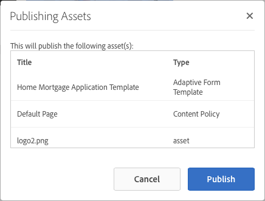
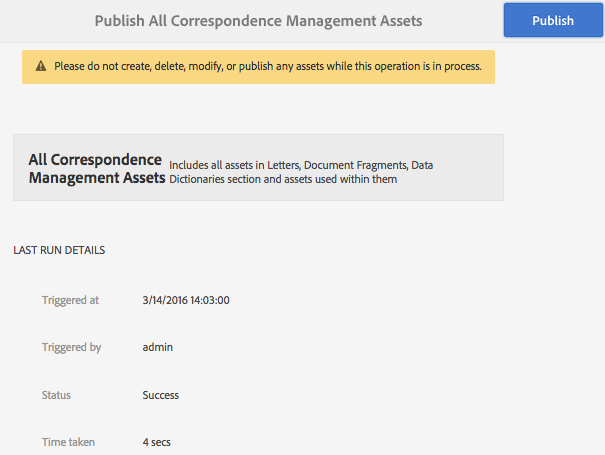

# 發佈和取消發佈表單和檔案{#publishing-and-unpublishing-forms-and-documents}

[!DNL AEM Forms] 可讓您輕鬆建立、發佈和取消發佈表單。 此 [!DNL AEM Forms] 伺服器提供兩個執行個體：製作和發佈。 製作例項用於建立和管理表單資產和資源。 發佈例項用於保留可供使用者使用的資產和相關資源。

## 支援的資產   {#supported-assets-nbsp}

[!DNL AEM Forms] 支援下列資產類型：

* 調適型表單
* 最適化檔案
* 最適化表單片段
* 主題
* 表單範本 <!-- (XFA forms) -->
* PDF forms
* 文檔(平面PDF文檔)
* 表單集
* 資源（影像、結構和樣式表）

起初，所有資產僅可在製作例項中使用。 管理員或表單作者可以發佈資源以外的所有資產。

選取表單並發佈後，也會發佈其相關資產和資源。 但不會發佈相依資產。 在此情境中，相關資產和資源是已發佈資產使用或參照的資產。 相依資產是指指發佈資產的資產。

您的適用性Forms可能會利用一些未自動發佈的設定、設定和自訂。 建議您先發佈或啟動這些資源，再發佈最適化表單。

* 可編輯的最適化表單範本
* Adobe Sign、Typekit、reCAPTCHA和表單資料模型的Cloud Service設定
* 只有在使用者具有管理員權限時，才會啟用其他雲端服務設定。
* 自訂。 這些包括但不限於：

   * 自訂配置
   * 自訂外觀
   * CSS檔案 — 在「適用性表單容器屬性」對話方塊中作為輸入
   * 用戶端程式庫類別 — 在「適用性表單容器屬性」對話方塊中作為輸入
   * 任何其他可納入適用性表單範本的用戶端程式庫。
   * 設計路徑

## 資產狀態 {#asset-states}

資產可具有下列狀態：

* **未發佈：** 從未發佈的資產(未發佈的狀態僅適用於Forms資產。 通信管理資產沒有取消發佈狀態。)
* **已發佈**:已發佈且可在「發佈」例項上使用的資產
* **已修改**:發佈後修改的資產

## 發佈資產 {#publish-an-asset}

1. 登入 [!DNL AEM Forms] 伺服器。
1. 使用下列其中一項來選取和發佈資產。

   1. 將指標移至資產上方，然後點選 **[!UICONTROL 發佈]** .
   1. 執行下列任一操作，然後點選「發佈」：

      * 如果您在卡片檢視中，請點選 **[!UICONTROL 輸入選擇]** ，然後點選資產。 已選取資產。
      * 如果您位於清單檢視中，請選取資產的核取方塊。 已選取資產。
      * 點選資產以顯示其詳細資訊。
      * 點選「檢視屬性」以顯示資產的屬性 .

      >[!NOTE]
      >
      >請勿選取多個資產。 不支援一次發佈多個資產。

1. 「發佈」程式開始時，會出現確認對話方塊，列出所有相關資產和資源。 在包含相關資產的對話方塊中，點選 **[!UICONTROL 發佈]**. 資產隨即發佈，並出現「發佈資產成功」對話方塊。

   >[!NOTE]
   >
   >針對適用性Forms以及相關資產，也會顯示適用性表單頁面名稱。

   

   與所有相關資產和資源進行確認對話。

   >[!NOTE]
   >
   >若為Forms Manager，如果使用者沒有發佈列出資產的權限，則會停用「發佈」動作。 需要額外權限的資產會以紅色顯示。

   發佈資產後，資產的中繼資料屬性會複製到「發佈」例項，而資產的狀態會變更為「發佈」。 已發佈的相依資產的狀態也會變更為「已發佈」。

   <!-- After publishing an asset, you can use the Forms Portal to display all the assets on a web page. For more information, see [Introduction to publishing forms on a portal](introduction-publishing-forms.md).-->

## 發佈所有通信管理資產 {#publish-all-the-correspondence-management-assets}

[!DNL AEM Forms] 可讓您一次在伺服器上發佈所有通信管理資產。 已發佈的資產包含所有通信管理資產和相關相依性。

完成下列步驟，在伺服器上發佈所有通信管理資產：

1. 登入 [!DNL AEM Forms] 伺服器。
1. 點選 **Adobe Experience Manager** 中的其他參數。
1. 點選 ，然後點選 **Forms**.
1. 點選 **發佈通信管理資產**.

   

   出現「發佈所有通信管理資產」頁面，並顯示上次嘗試發佈通信管理資產程式時的相關資訊。

   

1. 點選 **發佈** 然後，在確認訊息中，點選 **確定**.

   批處理完成後，您可以查看上次運行的詳細資訊。 這包括管理員登錄以及批處理運行成功還是失敗等資訊。

   >[!NOTE]
   >
   >一旦啟動，發佈程式就無法取消。 此外，在「發佈」操作進行中時，請勿建立、刪除、修改或發佈任何資產，或起始「匯出所有通信管理資產」操作。

## 自動發佈和取消發佈Forms與檔案 {#automate-publishing-and-unpublishing-for-forms-amp-documents}

[!DNL AEM Forms] 可讓您排程Forms與檔案的資產發佈和取消發佈。 您可以在中繼資料編輯器中指定排程。 如需管理表單中繼資料的詳細資訊，請參閱 [管理表單中繼資料。](manage-form-metadata.md)

請依照下列步驟，排程發佈和取消發佈Forms與檔案資產的日期和時間：

1. 選取資產並點選 **[!UICONTROL 檢視屬性]**. 將開啟「元資料屬性」頁。
1. 在「中繼資料屬性」頁面中，點選 **[!UICONTROL 進階]**，然後點選 **[!UICONTROL 編輯]** .
1. 在 **[!UICONTROL 準時發佈]** 和 **[!UICONTROL 發佈關閉時間]** 欄位，選擇日期和時間。\
   點選 **[!UICONTROL 完成]** .

## 取消發佈資產 {#unpublish-an-asset}

1. 選取已發佈的資產，然後點選 **[!UICONTROL 取消發佈]** .
1. 使用下列其中一項來選取和取消發佈資產。

   1. 將指標移至資產上方，然後點選 **[!UICONTROL 取消發佈]** .
   1. 執行下列任一操作，然後點選「取消發佈」：

      * 如果您在卡片檢視中，請點選 **[!UICONTROL 輸入選擇]** ，然後點選資產。 已選取資產。

      * 如果您在清單檢視中，請將滑鼠移至資產上，然後點選  . 已選取資產。

      * 點選資產以顯示其詳細資訊。
      * 點選「檢視屬性」以顯示資產的屬性 .

1. 「取消發佈」程式啟動時，會顯示確認對話方塊。 點選 **[!UICONTROL 取消發佈]**.

   >[!NOTE]
   >
   >只有選取的資產未發佈，且其子項和參考的資產（如果有）未發佈。

## 將資產或信函回復為先前發佈的版本 {#revert-an-asset-or-letter-to-the-previously-published-version}

每當您在編輯資產或信函後發佈資產或信函時，就會建立資產或信函版本。 您可以將資產或信函回復為先前發佈的版本。 如果資產或檔案的目前版本發生錯誤，您可能需要執行此動作。

>[!NOTE]
>
>如果已發佈信函中使用的任何相依資產已從系統中刪除，請勿將信函回復為上次發佈狀態。

1. 選取資產並點選 **[!UICONTROL 回復為先前發佈的版本]** .
1. 還原資產前，會出現確認對話方塊。 點選 **[!UICONTROL 還原]**.

   資產或信函會復原至先前發佈的版本。

## 刪除資產 {#delete-an-asset}

>[!NOTE]
>
>刪除資產會將其從發佈執行個體中移除。 刪除資產也會移除其版本歷史記錄，但基本版本除外。

1. 選取資產並點選 **[!UICONTROL 刪除]** .

   >[!NOTE]
   >
   >點選資產以顯示資產詳細資訊，或點選「檢視屬性」以顯示資產屬性時，也可使用「刪除」選項 .

1. 刪除資產前，會出現確認對話方塊。 點選 **[!UICONTROL 刪除]**.

   >[!NOTE]
   >
   >系統只會刪除選取的資產，不會刪除相依資產和。 若要檢查資產的參考，請點選  然後選取資產。
   >
   >
   >如果您嘗試刪除的資產是其他資產的子資產，則不會刪除該資產。 若要刪除此資產，請從其他資產中移除此資產的參考，然後重試。

## 受保護的適用性Forms {#protected-adaptive-forms}

您可以為希望選定用戶訪問的表單啟用身份驗證。 當您啟用表單驗證時，使用者在存取表單前會先看到登入畫面。 只有具有已授權憑證的使用者才能存取表單。

啟用表單驗證：

1. 在您的瀏覽器中，開啟發佈執行個體中的configMgr 。\
   URL: `https://<hostname>:<PublishPort>/system/console/configMgr`

1. 在「 Adobe Experience Manager Web主控台設定」中，按一下 **Apache Sling Authentication Service** 來設定。
1. 在出現的Apache Sling Authentication Service對話方塊中，使用 **+** 按鈕來新增路徑。\
   新增路徑時，會為該路徑中的表單啟用驗證服務。
