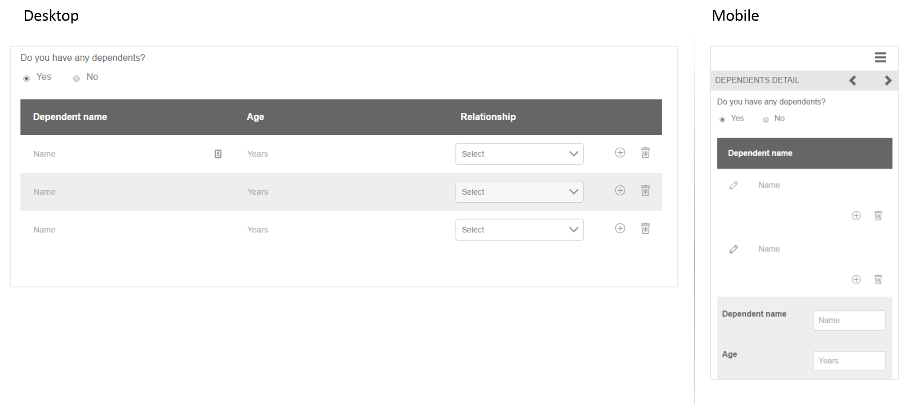

# 參考最適化表單片段 {#reference-adaptive-form-fragments}

適用性表單片段是一組欄位，或是包含一組欄位的面板，可供您在建立表單時使用。 它可讓您輕鬆快速地建立表單。 您可以使用側欄中的資產瀏覽器，將適用性表單片段拖放至表單中，也可以在表單編輯器中編輯。

針對適用性Forms作者， [!DNL AEM Forms] 套件 [[!DNL AEM FORMS] 參考片段](https://www.adobeaemcloud.com/content/marketplace/marketplaceProxy.html?packagePath=/content/companies/public/adobe/packages/cq630/fd/AEM-FORMS-6.3-REFERENCE-FRAGMENTS). 包含下列片段：

* 地址
* 連絡人資訊
* 信用卡資訊
* 當前就業
* 相依項資訊
* 就業史
* 收支
* 名稱
* 條款與條件
* 使用手寫的條款與條件

安裝套件時，會在Forms與檔案下方建立包含參考片段的參考片段資料夾。 如需安裝套件，請參閱 [透過Cloud Manager和Package Manager部署內容套件](https://experienceleague.adobe.com/docs/experience-manager-cloud-service/implementing/deploying/overview.html#deploying-content-packages-via-cloud-manager-and-package-manager) 和 [如何使用套件](https://experienceleague.adobe.com/docs/experience-manager-65/administering/contentmanagement/package-manager.html).

## 地址 {#address}

包括用於指定郵寄地址的欄位。 可用欄位包括街道地址、郵遞區號、城市、州和國家。 此外也包含預先設定的Web服務，會針對指定的美國郵遞區號填入城市和州。

<!--[Click to enlarge

](assets/address-1.png)-->

## 連絡人資訊 {#contact-information}

包括用於捕獲電話號碼和電子郵件地址的欄位。

<!--[Click to enlarge

](assets/contact-info-1.png)-->

## 信用卡資訊 {#credit-card-information}

包括用於捕獲信用卡資訊的欄位，這些資訊可用於處理付款。

## 當前就業 {#current-employment}

包括用於獲取當前雇傭詳細資訊的欄位，如雇傭狀態、雇傭欄位、指定、組織和加入日期。

<!--[Click to enlarge

](assets/current-emp-1.png)-->

## 相依項資訊 {#dependents-information}

包括欄位，以指定一個或多個相依項的相關資訊，如其名稱、關係和年齡，以表格格式顯示。

<!--[Click to enlarge

](assets/dependents-info-1.png)-->

## 就業史 {#employment-history}

包括用於捕獲雇傭歷史記錄的欄位。 它允許新增多個組織。

<!--[Click to enlarge

](assets/emp-history-1.png)-->

## 收支 {#income-expenditure}

包括用於獲取每月現金流和費用的欄位。 Forms若要求使用者提供財務詳細資料，可使用此片段擷取收入和支出。

<!--[Click to enlarge

](assets/income-1.png)-->

## 名稱 {#name}

包括用於指定標題、名字、中間名和姓氏的欄位。

<!--[Click to enlarge

](assets/name-1.png)-->

## 條款與條件 {#terms-conditions}

指定提交表單之前，用戶要接受的條款和條件。

<!--[Click to enlarge

](assets/tnc-1.png)-->

## 使用手寫的條款與條件 {#terms-conditions-with-scribble}

指定使用者在提交表單前接受和簽署的條款與條件。

<!--[Click to enlarge

](assets/tnc-scribble-1.png)-->
