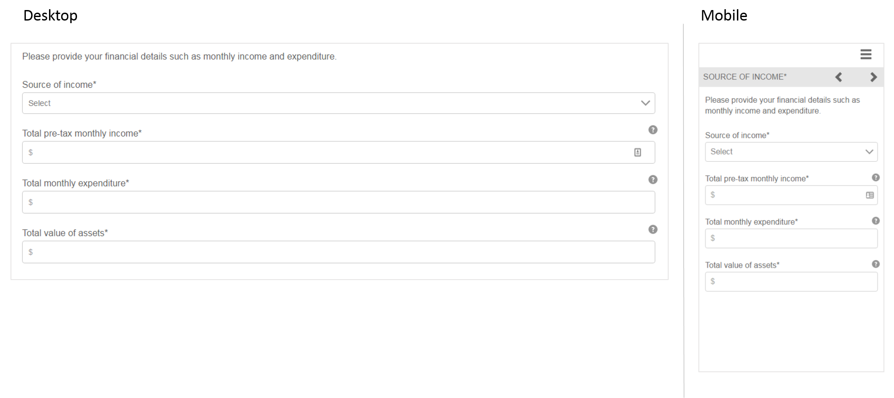

# 參考自適應格式片段 {#reference-adaptive-form-fragments}

自適應表單片段是一組欄位，或是包含一組欄位的面板，在建立表單時可使用這些欄位。 它使您能夠輕鬆快速地建立表單。 可以使用邊欄中的資產瀏覽器將自適應表單片段拖放到表單中，並可以在表單編輯器中對其進行編輯。

對於自適應Forms作者，在 [!DNL AEM Forms] 包 [[!DNL AEM FORMS] 引用片段](https://www.adobeaemcloud.com/content/marketplace/marketplaceProxy.html?packagePath=/content/companies/public/adobe/packages/cq630/fd/AEM-FORMS-6.3-REFERENCE-FRAGMENTS)。 它包括以下片段：

* 地址
* 連絡人資訊
* 信用卡資訊
* 當前雇傭
* 依存對象資訊
* 就業歷史記錄
* 收入和支出
* 名稱
* 條款和條件
* 使用Scribble的條款和條件

安裝包時，將在「Forms和文檔」下建立包含引用片段的「引用片段」資料夾。 有關安裝軟體包的資訊，請參見 [通過雲管理器和包管理器部署內容包](https://experienceleague.adobe.com/docs/experience-manager-cloud-service/implementing/deploying/overview.html#deploying-content-packages-via-cloud-manager-and-package-manager) 和 [如何使用包](https://experienceleague.adobe.com/docs/experience-manager-65/administering/contentmanagement/package-manager.html)。

## 地址 {#address}

包括用於指定郵寄地址的欄位。 可用欄位包括街道地址、郵遞區號、城市、州和國家/地區。 它還包括預配置的Web服務，用於填充指定的美國郵遞區號的城市和州。

<!--[Click to enlarge

](assets/address-1.png)-->

## 連絡人資訊 {#contact-information}

包括用於捕獲電話號碼和電子郵件地址的欄位。

<!--[Click to enlarge

](assets/contact-info-1.png)-->

## 信用卡資訊 {#credit-card-information}

包括用於捕獲可用於處理付款的信用卡資訊的欄位。

## 當前雇傭 {#current-employment}

包括用於獲取當前雇傭詳細資訊的欄位，如雇傭狀態、雇傭欄位、指定、組織和加入日期。

<!--[Click to enlarge

](assets/current-emp-1.png)-->

## 依存對象資訊 {#dependents-information}

包含以表格格式指定一個或多個依存對象資訊的欄位，如其名稱、關係和年齡。

<!--[Click to enlarge

](assets/dependents-info-1.png)-->

## 就業歷史記錄 {#employment-history}

包括用於捕獲雇傭歷史記錄的欄位。 它允許添加多個組織。

<!--[Click to enlarge

](assets/emp-history-1.png)-->

## 收入和支出 {#income-expenditure}

包括用於獲取每月現金流和費用的欄位。 Forms要求用戶提供財務細節，可以利用這一片段獲取收入和支出。

<!--[Click to enlarge

](assets/income-1.png)-->

## 名稱 {#name}

包括用於指定標題、名、中名和姓氏的欄位。

<!--[Click to enlarge

](assets/name-1.png)-->

## 條款和條件 {#terms-conditions}

指定用戶在提交表單之前接受的條款和條件。

<!--[Click to enlarge

](assets/tnc-1.png)-->

## 使用Scribble的條款和條件 {#terms-conditions-with-scribble}

指定用戶在提交表單之前接受和簽名的條款和條件。

<!--[Click to enlarge

](assets/tnc-scribble-1.png)-->
