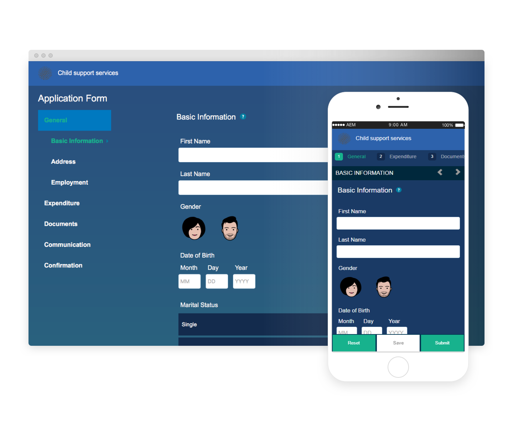

# 參考主題、範本和表單資料模型 {#reference-themes-templates-and-data-models}

 Adobe建議使用現代化且可擴充的資料擷取 [核心元件](https://experienceleague.adobe.com/docs/experience-manager-core-components/using/adaptive-forms/introduction.html) 的 [建立新的Adaptive Forms](/help/forms/creating-adaptive-form-core-components.md) 或 [將最適化Forms新增至AEM Sites頁面](/help/forms/create-or-add-an-adaptive-form-to-aem-sites-page.md). 這些元件代表最適化Forms建立工作取得重大進展，可確保提供令人驚歎的使用者體驗。 本文說明使用基礎元件製作最適化Forms的舊方法。 

AEM Formsas a Cloud Service提供多種參考主題、範本和表單資料模型，可幫助您快速開始建立最適化Forms。 您可以下載 [來自軟體發佈入口網站的參考內容套件](https://experience.adobe.com/#/downloads/content/software-distribution/en/aemcloud.html?package=/content/software-distribution/en/details.html/content/dam/aemcloud/public/aem-forms-reference-content.ui.content-2.1.0.zip) 並使用 [封裝管理員](/help/implementing/developing/tools/package-manager.md) 安裝 [參考內容封裝](https://experience.adobe.com/#/downloads/content/software-distribution/en/aemcloud.html?package=/content/software-distribution/en/details.html/content/dam/aemcloud/public/aem-forms-reference-content.ui.content-2.1.0.zip) 在您的生產、開發或本機開發環境中，將這些參考資產帶至您的環境。

參考內容套件中包含的主題、範本和表單資料模型包括：

| 主題 | 範本 | 表單資料模型 |
---------|----------|---------
| Canvas 3.0 | 基本 | Microsoft Dynamics 365 |
| 寧靜 | 空白 | Salesforce |
| 城市 |   |  |
| Ultraminary |  |  |
| Beryl |  |  |
| 保健 |  |   |
| FSI |   |   |

## 參考主題 {#reference-themes}

[主題](/help/forms/themes.md) 讓您無須深入瞭解CSS即可設定表單樣式。 您可以安裝 [參考內容封裝](https://experience.adobe.com/#/downloads/content/software-distribution/en/aemcloud.html?package=/content/software-distribution/en/details.html/content/dam/aemcloud/public/aem-forms-reference-content.ui.content-2.1.0.zip)：

* Beryl
* Canvas 3.0
* 寧靜
* 城市
* Ultraminary
* 保健
* FSI （金融服務與保險）

每個主題都包含獨特且優雅的樣式，可用來為使用者建立愉快的最適化表單。 它包含面板、文字方塊、數值方塊、選項按鈕、表格和切換器等選擇器的獨特樣式。 這些主題中的樣式是根據需求。 例如，在特定案例中，您需要使用簡潔字型的極簡主題。 Liberty主題可讓您獲得該外觀。

此套件中包含的主題具有回應性，這些主題中的樣式是為行動裝置和案頭顯示器定義的。 各種裝置上的大部分現代化瀏覽器都能輕鬆轉譯套用這些主題之一的表單。

如需安裝套件的詳細資訊，請參閱 [如何使用套件](/help/implementing/developing/tools/package-manager.md).

## Beryl {#beryl}

Beryl佈景主題強調使用背景影像、透明度及大型平面圖示。 在下方熒幕擷圖中，您可以看到Beryl佈景主題的外觀，以及如何增強表單的樣式。

## Canvas 3.0 {#canvas}

Canvas 3.0是Adaptive Forms的預設主題，強調使用基本顏色、透明和平坦圖示。 在下方熒幕擷圖中，您可以看到Canvas 3.0佈景主題的外觀。

## 寧靜 {#tranquil}

寧靜的主題提供寧靜色彩配置的光暗陰影，以反白顯示表單的不同元件。 例如，單選按鈕、面板和標籤會以不同的綠色陰影顯示。

## 城市 {#urbane}

城市佈景主題強調您的外型應具有極簡主義與功能外觀。 當您將Urbane主題套用至表單時，您可以看到元件是平坦的。 這些面板的外框很細，可以打造現代外觀。

## Ultraminary {#ultramarine}

超海洋主題使用深藍色陰影來反白顯示標籤、面板、文字方塊和按鈕等元件。

## 保健 {#healthcare}

醫療保健主題使用深綠色陰影來反白顯示標籤、面板、文字方塊和按鈕等元件。

## FSI （金融服務與保險）

FSI主題強調表單的簡約與功能外觀。 當您將FSI主題套用至表單時，您可以看到面板元件是黃色的。

## 參考範本 {#reference-templates}

[範本](/help/forms/themes.md) 可讓您定義表單的初始表單結構、內容和動作。 您可以安裝 [參考內容封裝](https://experience.adobe.com/#/downloads/content/software-distribution/en/aemcloud.html?package=/content/software-distribution/en/details.html/content/dam/aemcloud/public/aem-forms-reference-content.ui.content-2.1.0.zip)：

* 基本
* 空白

基本範本可協助您快速建立登錄檔單。 您也可以用它來預覽Adaptive Forms Foundation元件的功能。 它提供精靈版面配置，用於逐節呈現資料。 使用「空白」範本，在空白畫布上開始建立最適化表單。

## 參考表單資料模型 {#reference-models}

最適化Forms可以與Microsoft Dynamics 365和Salesforce伺服器互動，以啟用業務工作流程。 例如：

* 將資料寫入Microsoft Dynamics 365和Salesforce的最適化表單提交中。
* 透過「表單資料模型」中定義的自訂實體在Microsoft Dynamics 365和Salesforce中寫入資料，反之亦然。
* 查詢Microsoft Dynamics 365和Salesforce伺服器以取得資料，並預先填入Adaptive Forms。
* 從Microsoft Dynamics 365和Salesforce伺服器讀取資料。

您可以安裝 [參考內容封裝](https://experience.adobe.com/#/downloads/content/software-distribution/en/aemcloud.html?package=/content/software-distribution/en/details.html/content/dam/aemcloud/public/aem-forms-reference-content.ui.content-2.1.0.zip)：

* Microsoft® Dynamics 365
* Salesforce

如需使用這些模型的詳細資訊，請參閱 [設定Microsoft Dynamics 365和Salesforce雲端服務](https://experienceleague.adobe.com/docs/experience-manager-cloud-service/content/forms/integrate/use-form-data-model/configure-msdynamics-salesforce.html?lang=en#configure-dynamics-cloud-service)
