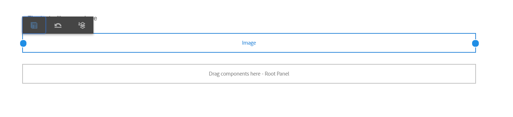

# 使用「版面」模式調整元件大小 {#use-layout-mode-to-resize-components}

適用性表單製作介面可讓您使用「版面」模式來調整元件大小。 拖曳欄中的藍點，以定義要定位元件的起點和終點。 點選回應式格線內的元件後，藍點隨即顯示。 回應式格線包含12個相等欄。 替換列中的白色和藍色底紋區分了一列和另一列。

您可以使用「版面」模式來調整所有裝置類型（例如桌上型電腦、平板電腦、手機和其他較小裝置）的元件大小。 平板電腦會自動從案頭版本衍生配置，而較小的裝置則從手機衍生配置。 不過，您可以覆寫自動衍生的設定，以定義每種裝置類型的不同設定。

## 存取配置模式 {#access-layout-mode}

選擇 **[!UICONTROL 版面]** 下拉式清單中顯示於 **[!UICONTROL 預覽]** 選項。 表單會以「配置」模式顯示。

1. 登入 [!DNL Adobe Experience Manager] 製作例項並導覽至 **[!UICONTROL Adobe Experience Manager]** > **[!UICONTROL Forms]** > **[!UICONTROL Forms與檔案]**.
1. 建立新或開啟現有 [適用性表單](creating-adaptive-form.md).
1. 選擇 **[!UICONTROL 版面]** 從顯示於 **[!UICONTROL 預覽]** 選項。 表單會以「配置」模式顯示。

   

## 調整元件大小 {#resize-components}

1. 在「版面」模式中，點選元件以調整大小。 藍點顯示在回應式格線的開始和結束處。
1. 拖放藍點，以定義元件在回應式格線中的位置。

   

   點選元件後顯示的工具列包含下列選項：

   * **[!UICONTROL 父級]**:選取元件的父項。
   * **[!UICONTROL 恢復斷點佈局]**:撤消所有調整大小的更改，並將預設佈局應用到元件。
   * **[!UICONTROL 浮點到新行]**:如果同一行中有多個元件，請將元件移至下一行。

   您也可以使用 **[!UICONTROL 恢復斷點佈局]** ( )選項，還原所有重新調整大小的變更。

   >[!NOTE]
   >
   >無法使用「佈局」模式調整表列、工具欄、工具欄按鈕和目標區域元件的大小。 使用樣式模式調整這些元件的大小。

### 範例 {#example}

**目標：** 想要插入表格元件和影像元件，並在最適化表單中彼此平行放置。

1. 使用 [!UICONTROL 編輯] 模式。 影像元件會顯示在表格元件之後。
1. 切換至 [!UICONTROL 版面] 模式並點選 [!UICONTROL 表格] 元件。 在第1欄和第12欄顯示的藍點可調整元件大小。
1. 將第12欄的藍點拖曳至回應式格線的第6欄。

   

1. 同樣地，請選取 [!UICONTROL 影像] 元件，並將回應式格線的欄1處的藍點拖曳至欄7。 表格和影像元件彼此平行顯示。

   

   您可以選取「影像」元件，然後點選 **[!UICONTROL 浮點到新行]** 選項，將「影像」元件移至下一行。

## 調整面板大小 {#resize-panels-layout-mode}

如果要調整整個面板的大小，而不是個別元件，請執行下列步驟：

1. 點選面板中要調整大小的任何元件，選取 ，並在下拉式清單中選取第一個選項（如果面板是元件的直接父項）。

   藍點顯示在回應式格線的開始和結束處。

1. 拖放藍點，以定義回應式格線中面板的位置。
您可以重複步驟1和2，然後選取  將調整後的面板移至下一行。

## 定義面板的多欄版面

執行下列步驟以定義面板的欄數：

1. 在 **[!UICONTROL 編輯]** 模式，點選面板，選取 ，然後選取 **[!UICONTROL 回應式 — 頁面上的所有項目，不需導覽]** 選項 **[!UICONTROL 面板版面]** 下拉式清單。

1. 點選  以儲存屬性。

1. 在 **[!UICONTROL 版面]** 模式，點選面板中的任何元件，然後選取 ，然後選取面板。

1. 點選  並從下拉式清單中選取欄數。 欄數的範圍可從1到12。 面板會分為多欄版面。

## 為舊的回應式配置啟用新的回應式格線 {#enableresponsivegrid}

為您使用 [!DNL Adobe Experience Manager] Forms 6.4或更新版本，可調整元件大小。

>[!NOTE]
>
>切換至新的回應格線會捨棄已針對表單中使用之元件定義的版面屬性。

執行下列步驟以啟用新的回應式格線：

1. 選擇 **[!UICONTROL 版面]** 從顯示於 **[!UICONTROL 預覽]** 選項。 隨即顯示啟用「配置」模式的確認。
1. 點選 **[!UICONTROL 是]** 啟用 **[!UICONTROL 版面]** 模式。

### 將舊片段內嵌在具有新回應式版面的適用性表單中 {#embed-an-old-fragment-in-an-adaptive-form-with-new-responsive-layout}

適用於適用性表單的全新回應式版面可讓您使用舊的回應式版面，新增適用性表單片段至表單。 但是，新佈局會捨棄已為片段中使用的元件定義的佈局屬性。 您可以切換到「佈局」模式，以定義片段中所用元件的佈局屬性。

### 在舊的適用性表單中內嵌具有新回應式版面的片段 {#embed-a-fragment-with-new-responsive-layout-in-an-old-adaptive-form}

如果您在具有舊回應式版面的適用性表單中內嵌具有新回應式版面的片段，系統會提示您為表單啟用「版面」模式，並重新內嵌片段。

若要啟用「配置」模式，請選取 **[!UICONTROL 版面]** 從顯示於 **[!UICONTROL 預覽]** 選項，點選 **[!UICONTROL 是]** 確認。 選擇 **[!UICONTROL 編輯]** 重新內嵌片段的模式。

## 停用具有舊回應式版面的表單的「版面」模式 {#disable-layout-mode-for-forms-with-old-responsive-layout}

您可以編輯表單中使用之範本的屬性，以停用具有舊回應式版面的表單的「版面」模式。

執行下列步驟以停用「配置」模式：

1. 選擇 **[!UICONTROL 工具]** > **[!UICONTROL 一般]** > **[!UICONTROL 範本]** 並開啟表單中使用的範本，位於 **[!UICONTROL 編輯]** 模式。
1. 在左窗格中選取「表單容器」，然後點選 **[!UICONTROL 政策。]**

   

1. 點選 **[!UICONTROL 版面設定]** 索引標籤和選取 **[!UICONTROL 禁用佈局模式]**.
1. 點選  以儲存範本屬性。
