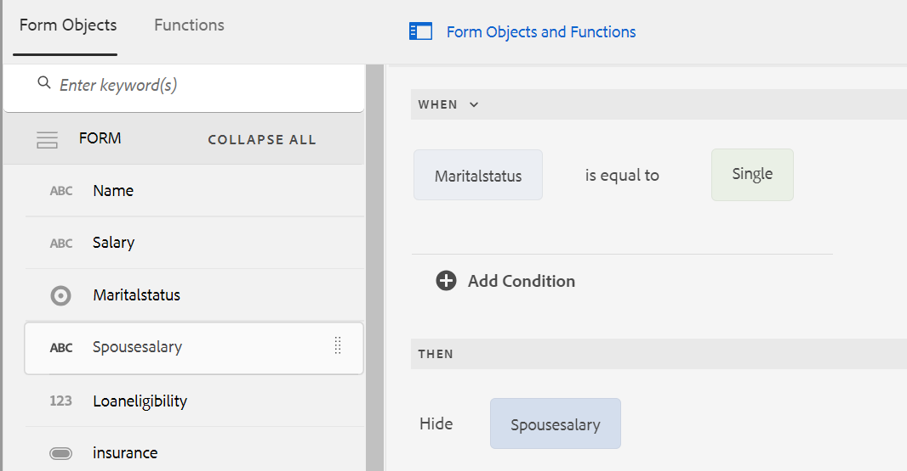
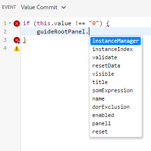

# 以核心元件為主之最適化表單的規則編輯器使用者介面

根據核心元件的最適化Forms的規則編輯器使用者介面增強了Adobe Experience Manager (AEM)內的表單建立流程。 它可讓業務使用者和開發人員透過撰寫根據預先定義的條件、使用者輸入和互動來觸發動作的規則，將動態行為和複雜邏輯實作到表單中。 此功能支援最新的JavaScript功能（最高可達ES2022），並提供直覺式的視覺化編輯器，簡化規則撰寫程式。
規則編輯器有助於簡化表單填寫體驗，確保準確性和效率。 它允許驗證或重設面板和表單，並執行自訂函式以計算表單物件的值。 規則編輯器使用者介面支援巢狀條件並具備叫用表單資料模型服務的功能，是建立回應式、方便使用者且最適化表單的關鍵元件。

## 瞭解規則編輯器使用者介面 {#understanding-the-rule-editor-user-interface}

規則編輯器提供完整但簡單的使用者介面，用於撰寫和管理規則。 您可以在撰寫模式下，從最適化表單中啟動規則編輯器使用者介面。

若要啟動規則編輯器使用者介面：

1. 以撰寫模式開啟最適化表單。
1. 選取您要編寫規則的表單物件，然後在元件工具列中選取。 規則編輯器使用者介面隨即顯示。

   

   此檢視中會列出所選表單物件上的任何現有規則。 如需有關管理現有規則的資訊，請參閱[管理規則](rule-editor.md#p-manage-rules-p)。

1. 選取&#x200B;**[!UICONTROL 建立]**&#x200B;以撰寫新規則。 第一次啟動規則編輯器時，規則編輯器使用者介面的視覺化編輯器預設會開啟。

   

讓我們來詳細瞭解規則編輯器UI的每個元件。

### A.元件規則顯示 {#a-component-rule-display}

顯示啟動規則編輯器所使用之最適化表單物件的標題，以及目前選取的規則型別。 在上述範例中，規則編輯器是從標題為問題1的最適化表單物件啟動，而選取的規則型別是「何時」。

### B.表單物件與函式 {#b-form-objects-and-functions-br}

規則編輯器使用者介面左側的窗格包含兩個標籤 — **[!UICONTROL Forms物件]**&#x200B;和&#x200B;**[!UICONTROL 函式]**。

「表單物件」標籤會顯示最適化表單中包含之所有物件的階層檢視。 它會顯示物件的標題和型別。 撰寫規則時，您可以將表單物件拖放至規則編輯器上。 將物件或函式拖放至預留位置時，在建立或編輯規則時，預留位置會自動採用適當的值型別。

已套用一或多個有效規則的表單物件會以綠色圓點標示。 如果套用至表單物件的任何規則無效，則表單物件會標示為黃點。

函式索引標籤包含一組內建函式，例如Sum Of、Min Of、Max Of、Average Of、Number Of和Validate表單。 您可以使用這些函式計算可重複面板和表格列中的值，並在撰寫規則時在動作和條件陳述式中使用它們。 不過，您也可以建立自訂函式。

某些函式清單如下圖所示：


>[!NOTE]
>
>您可以在Forms「物件」和「函式」標籤中搜尋物件和函式名稱及標題。

在表單物件的左側樹狀結構中，您可以選取表單物件，以顯示套用到每個物件的規則。 您不僅可以瀏覽各種表單物件的規則，也可以在表單物件之間複製 — 貼上規則。 如需詳細資訊，請參閱[複製貼上規則](rule-editor.md#p-copy-paste-rules-p)。

### C.表單物件與功能切換 {#c-form-objects-and-functions-toggle-br}

點選「切換」按鈕時，會切換表單物件和函數窗格。

### D.視覺規則編輯器 {#visual-rule-editor}

視覺化規則編輯器是規則編輯器使用者介面的視覺化編輯器模式中您編寫規則的區域。 它可讓您選取規則型別，並據此定義條件和動作。 在規則中定義條件和動作時，您可以從「表單物件與函式」窗格中拖放表單物件與函式。

如需使用視覺化規則編輯器的詳細資訊，請參閱[撰寫規則](rule-editor.md#p-write-rules-p)。
<!-- 
### E. Visual-code editors switcher {#e-visual-code-editors-switcher}

Users in the forms-power-users group can access code editor. For other users, code editor is not available. If you have the rights, you can switch from visual editor mode to code editor mode of the rule editor, and conversely, using the switcher right above the rule editor. When you launch rule editor the first time, it opens in the visual editor mode. You can write rules in the visual editor mode or switch to the code editor mode to write a rule script. However, note that if you modify a rule or write a rule in code editor, you cannot switch back to the visual editor for that rule unless you clear the code editor.

[!DNL Experience Manager Forms] tracks the rule editor mode you used last to write a rule. When you launch the rule editor next time, it opens in that mode. However, you can also configure a default mode to open the rule editor in the specified mode. To do so:

1. Go to [!DNL Experience Manager] web console at `https://[host]:[port]/system/console/configMgr`.
1. Click to edit **[!UICONTROL Adaptive Form Configuration Service]**.
1. choose **[!UICONTROL Visual Editor]** or **[!UICONTROL Code Editor]** from the **[!UICONTROL Default Mode for Rule Editor]** drop-down

1. Click **[!UICONTROL Save]**.
-->

### E.完成和取消按鈕 {#done-and-cancel-buttons}

「**[!UICONTROL 完成]**」按鈕用於儲存規則。您可以儲存不完整的規則。 但是，不完整內容無效，因此不會執行。 當您下次從相同表單物件啟動規則編輯器時，會列出表單物件上已儲存的規則。 您可以在該檢視中管理現有規則。 如需詳細資訊，請參閱[管理規則](rule-editor.md#p-manage-rules-p)。

「**[!UICONTROL 取消]**」按鈕會放棄您對規則所做的任何變更並關閉規則編輯器。

## 寫入規則 {#write-rules}

您可以使用視覺化規則編輯器<!-- or the code editor. When you launch the rule editor the first time, it opens in the visual editor mode. You can switch to the code editor mode and write rules. However, if you write or modify a rule in code editor, you cannot switch to the visual editor for that rule unless you clear the code editor. When you launch the rule editor next time, it opens in the mode that you used last to create rule. -->來撰寫規則

讓我們先來看看如何使用視覺化編輯器來撰寫規則。

+++ 使用視覺化編輯器{#using-visual-editor}

讓我們瞭解如何使用下列範例表單在視覺化編輯器中建立規則。


範例貸款申請表單中的「貸款需求」區段要求申請人指定其婚姻狀況、薪資，如果已婚，則指定其配偶的薪資。 規則會根據使用者輸入來計算貸款資格金額，並顯示在「貸款資格」欄位中。 套用下列規則以實施情境：

* 配偶的「薪資」欄位僅在「婚姻狀況」為「已婚」時顯示。
* 貸款資格金額為薪資總額的50%。

若要編寫規則，請執行下列步驟：

1. 首先，根據使用者為「婚姻狀況」選項按鈕選取的選項，撰寫規則以控制「配偶薪資」欄位的可見度。

   以編寫模式開啟貸款申請表單。 選取&#x200B;**[!UICONTROL 婚姻狀況]**&#x200B;元件並選取。 接著，選取&#x200B;**[!UICONTROL 建立]**&#x200B;以啟動規則編輯器。

   

   啟動規則編輯器時，預設會選取When規則。 此外，您啟動規則編輯器的表單物件（在此例中為「婚姻狀況」）會在When陳述式中指定。

   雖然您無法變更或修改選取的物件，但可以使用規則下拉式清單（如下所示）來選取其他規則型別。 如果您想在其他物件上建立規則，請選取「取消」結束規則編輯器，然後從想要的表單物件再次啟動它。

1. 選取&#x200B;**[!UICONTROL 選取狀態]**&#x200B;下拉式清單，並選取&#x200B;**[!UICONTROL 等於]**。 **[!UICONTROL 輸入字串]**&#x200B;欄位就會顯示。

   

1. 在規則的&#x200B;**[!UICONTROL 輸入字串]**&#x200B;欄位中，從下拉式功能表中選取&#x200B;**已婚**。

   

   您已將條件定義為`When Marital Status is equal to Married`。 接著，定義若此條件為True時要執行的動作。

1. 在Then陳述式中，從&#x200B;**[!UICONTROL 選取動作]**&#x200B;下拉式清單中選取&#x200B;**[!UICONTROL 顯示]**。

   

1. 從&#x200B;**[!UICONTROL 拖放物件上的[表單物件]索引標籤中拖放]**&#x200B;配偶薪資&#x200B;**[!UICONTROL 欄位，或選取這裡]**&#x200B;欄位。 或者，選取&#x200B;**[!UICONTROL 拖放物件或選取這裡]**&#x200B;欄位，然後從躍現式選單中選取&#x200B;**[!UICONTROL 配偶薪資]**&#x200B;欄位，這會列出表單中的所有表單物件。

   

   接著，定義若此條件為False時要執行的動作。
1. 按一下&#x200B;**[!UICONTROL 新增其他區段]**，為&#x200B;**[!UICONTROL 配偶薪資]**&#x200B;欄位新增其他條件，以備您選取「婚姻狀況」為單一時使用。

   


1. 在Else陳述式中，從&#x200B;**[!UICONTROL 選取動作]**&#x200B;下拉式清單中選取&#x200B;**[!UICONTROL 隱藏]**。
   

1. 從&#x200B;**[!UICONTROL 拖放物件上的[表單物件]索引標籤中拖放]**&#x200B;配偶薪資&#x200B;**[!UICONTROL 欄位，或選取這裡]**&#x200B;欄位。 或者，選取&#x200B;**[!UICONTROL 拖放物件或選取這裡]**&#x200B;欄位，然後從躍現式選單中選取&#x200B;**[!UICONTROL 配偶薪資]**&#x200B;欄位，這會列出表單中的所有表單物件。
   

   規則在規則編輯器中會顯示如下。

   

1. 選取「**[!UICONTROL 完成]**」以儲存此規則。

<!--
1. Repeat steps 1 through 5 to define another rule to hide the Spouse Salary field if the marital Status is Single. The rule appears as follows in the rule editor.

    -->

>[!NOTE]
>
> 或者，您可以在「配偶薪資」欄位上撰寫「顯示」規則，而不是「婚姻狀況」欄位上的「何時」規則，以實施相同的行為。


1. 接著，撰寫規則以計算貸款資格金額（為薪資總額的50%），並在「貸款資格」欄位中顯示。 若要取得此結果，請在[貸款資格]欄位上建立&#x200B;**[!UICONTROL 設定值]**。

   在撰寫模式中，選取&#x200B;**[!UICONTROL 貸款資格]**&#x200B;欄位，然後選取。 接著，選取&#x200B;**[!UICONTROL 建立]**&#x200B;以啟動規則編輯器。

1. 從規則下拉式清單中選取&#x200B;**[!UICONTROL 設定值]**。

   

1. 選取「**[!UICONTROL 選取選項]**」，並選取「**[!UICONTROL 數學運算式]**」。開啟用於編寫數學運算式的欄位。

   

1. 在運算式欄位中：

   * 從Forms物件標籤中選取或拖放第一個&#x200B;**[!UICONTROL 放置物件中的]** Salary **[!UICONTROL 欄位，或選取這裡]**&#x200B;欄位。

   * 從&#x200B;**[!UICONTROL 選取運運算元]**&#x200B;欄位中選取&#x200B;**[!UICONTROL 加號]**。

   * 從「Forms物件」標籤中選取或拖放其他&#x200B;**[!UICONTROL 拖放物件的]**&#x200B;配偶薪資&#x200B;**[!UICONTROL 欄位，或選取這裡]**&#x200B;欄位。

   

1. 接下來，選取運算式欄位周圍醒目標示的區域，並選取「**[!UICONTROL 擴充運算式]**」。

   

   在擴展運算式欄位中，從「**[!UICONTROL 選取運算子]**」欄位選取「**[!UICONTROL 除以]**」以及從「**[!UICONTROL 選取選項]**」欄位選取「**[!UICONTROL 數字]**」。然後在數字欄位中指定&#x200B;**[!UICONTROL 2]**。

   

   >[!NOTE]
   >
   >您可以在「選取選項」欄位中使用元件、函式、數學運算式和屬性值來建立複雜運算式。

   接著，建立條件，當傳回True時，執行運算式。

1. 選取&#x200B;**[!UICONTROL 新增條件]**&#x200B;以新增When陳述式。

   

   在When陳述式中：

   * 從Forms物件索引標籤中選取或拖放第一個&#x200B;**[!UICONTROL 放置物件的]**&#x200B;婚姻狀況&#x200B;**[!UICONTROL 欄位，或選取這裡]**&#x200B;欄位。

   * 從&#x200B;**[!UICONTROL 選取運運算元]**&#x200B;欄位中選取&#x200B;**[!UICONTROL 等於]**。

   * 選取其他&#x200B;**[!UICONTROL 拖放物件中的字串，或選取這裡]**&#x200B;欄位，並在&#x200B;**[!UICONTROL 輸入字串]**&#x200B;欄位中指定&#x200B;**[!UICONTROL 已婚]**。

   規則最後會顯示在規則編輯器中，如下所示。  

1. 選取&#x200B;**[!UICONTROL 完成]**。 這會儲存規則。

1. 重複步驟7到14，定義另一個規則，以計算婚姻狀況為「單身」時的貸款資格。 規則在規則編輯器中會顯示如下。

   

或者，您可以使用「設定值」規則，在您建立用來顯示 — 隱藏「配偶薪資」欄位的「時機」規則中，計算貸款資格。 當「婚姻狀況」為「單一」時，產生的合併規則會顯示在規則編輯器中，如下所示。


您可以使用Else條件，撰寫合併規則以控制「配偶薪資」欄位的可見度，並在「婚姻狀況」為「已婚」時計算貸款資格。


+++

### 支援輸入引數的函式和數學運算式

輸入引數現在支援函式輸出（例如concat、trim和join）以及數學運算式。 此增強功能可讓表單作者直接傳遞動態計算的值，簡化規則設定、減少對額外欄位的需求，並讓表單更適合複雜的邏輯和計算驅動案例。


### 處理中斷的規則

如果移動或刪除參照的欄位，規則有時可能會失效。 發生此情況時，規則編輯器會以紅點指標標籤受影響的規則。

* 當欄位移動時（例如，從一個面板移動到另一個面板），關聯的規則可能會失效。 在此情況下，請開啟規則並再次儲存。 規則會自動還原。

* 刪除欄位時，無法修復規則。

  若要瞭解此問題，請將游標停留在規則編輯器中的規則狀態上，即可檢視錯誤訊息。

  

<!-- ### Using code editor {#using-code-editor}

Users added to the forms-power-users group can use code editor. The rule editor auto generates the JavaScript code for any rule you create using visual editor. You can switch from visual editor to the code editor to view the generated code. However, if you modify the rule code in the code editor, you cannot switch back to the visual editor. If you prefer writing rules in code editor rather than visual editor, you can write rules afresh in the code editor. The visual-code editors switcher helps you switch between the two modes.

The code editor JavaScript is the expression language of Adaptive Forms. All the expressions are valid JavaScript expressions and use Adaptive Forms scripting model APIs. These expressions return values of certain types. For the complete list of Adaptive Forms classes, events, objects, and public APIs, see [JavaScript Library API reference for Adaptive Forms](https://helpx.adobe.com/experience-manager/6-5/forms/javascript-api/index.html).

For more information about guidelines to write rules in the code editor, see [Adaptive Form Expressions](adaptive-form-expressions.md).

While writing JavaScript code in the rule editor, the following visual cues help you with the structure and syntax:

* Syntax highlights

* Auto Indentation

* Hints and suggestions for Form objects, functions, and their properties

* Auto completion of form component names and common JavaScript functions


-->

### 規則編輯器中的自訂函式 {#custom-functions}

除了列在&#x200B;*函式輸出*&#x200B;下的現成函式（如&#x200B;**總和**）之外，您也可以在規則編輯器中使用自訂函式。 規則編輯器支援指令碼和自訂函式的JavaScript ECMAScript 2019語法。 如需建立自訂函式的指示，請參閱文章[最適化Forms中的自訂函式](/help/forms/create-and-use-custom-functions.md)。

<!--

Ensure that the function you write is accompanied by the `jsdoc` above it. Adaptive Form supports the various [JavaScript annotations for custom functions](/help/forms/create-and-use-custom-functions.md#js-annotations).

For more information, see [jsdoc.app](https://jsdoc.app/).

Accompanying `jsdoc` is required:

* If you want custom configuration and description
* Because there are multiple ways to declare a function in `JavaScript,` and comments let you keep a track of the functions.

Supported `jsdoc` tags:

* **Private**
  Syntax: `@private`
  A private function is not included as a custom function.

* **Name**
  Syntax: `@name funcName <Function Name>`
  Alternatively `,` you can use: `@function funcName <Function Name>` **or** `@func` `funcName <Function Name>`.
  `funcName` is the name of the function (no spaces allowed).
  `<Function Name>` is the display name of the function.

* **Parameter**
  Syntax: `@param {type} name <Parameter Description>`
  Alternatively, you can use: `@argument` `{type} name <Parameter Description>` **or** `@arg` `{type}` `name <Parameter Description>`.
  Shows parameters used by the function. A function can have multiple parameter tags, one tag for each parameter in the order of occurrence.
  `{type}` represents parameter type. Allowed parameter types are:

    1. string
    2. number
    3. boolean
    4. scope
    5. string[]
    6. number[]
    7. boolean[]
    8. date
    9. date[]
    10. array
    11. object

   `scope` refers to a special globals object which is provided by forms runtime. It must be the last parameter and is not be visible to the user in the rule editor. You can use scope to access readable form and field proxy object to read properties, event which triggered the rule and a set of functions to manipulate the form.

   `object` type is used to pass readable field object in parameter to a custom function instead of passing the value.

   All parameter types are categorized under one of the above. None is not supported. Ensure that you select one of the types above. Types are not case-sensitive. Spaces are not allowed in the parameter name.  Parameter description can have multiple words.

* **Optional Parameter**
Syntax: `@param {type=} name <Parameter Description>` 
Alternatively, you can use: `@param {type} [name] <Parameter Description>`
By default all parameters are mandatory. You can mark a parameter optional by adding `=` in type of the parameter or by putting param name in square brackets.
   
   For example, let us declare `Input1` as optional parameter:
    * `@param {type=} Input1`
    * `@param {type} [Input1]`

* **Return Type**
  Syntax: `@return {type}`
  Alternatively, you can use `@returns {type}`.
  Adds information about the function, such as its objective.
  {type} represents the return type of the function. Allowed return types are:

    1. string
    2. number
    3. boolean
    4. string[]
    5. number[]
    6. boolean[]
    7. date
    8. date[]
    9. array
    10. object

  All other return types are categorized under one of the above. None is not supported. Ensure that you select one of the types above. Return types are not case-sensitive.

**Adding a custom function**

For example, you want to add a custom function which calculates area of a square. Side length is the user input to the custom function, which is accepted using a numeric box in your form. The calculated output is displayed in another numeric box in your form. To add a custom function, you have to first create a client library, and then add it to the CRX repository.

To create a client library and add it in the CRX repository, perform the following steps:

1. Create a client library. For more information, see [Using Client-Side Libraries](https://experienceleague.adobe.com/docs/experience-manager-cloud-service/implementing/developing/full-stack/clientlibs.html#developing).
2. In CRXDE, add a property `categories`with string type value as `customfunction` to the `clientlib` folder.

   >[!NOTE]
   >
   >`customfunction`is an example category. You can choose any name for the category you create in the `clientlib`folder.

After you have added your client library in the CRX repository, use it in your Adaptive Form. It lets you use your custom function as a rule in your form. To add the client library in your Adaptive Form, perform the following steps:

1. Open your form in edit mode.
   To open a form in edit mode, select a form and select **[!UICONTROL Open]**.
1. In the edit mode, select a component, then select  &gt; **[!UICONTROL Adaptive Form Container]**, and then select .
1. In the sidebar, under Name of Client Library, add your client library. ( `customfunction` in the example.)

   

1. Select the input numeric box, and select  to open the rule editor.
1. Select **[!UICONTROL Create Rule]**. Using options shown below, create a rule to save the squared value of the input in the Output field of your form.

   [](assets/add-custom-rule.png)
  
1. Select **[!UICONTROL Done]**. Your custom function is added.

   >[!NOTE]
   >
   > To invoke a form data model from rule editor using custom functions, [see here](/help/forms/using-form-data-model.md#invoke-services-in-adaptive-forms-using-rules-invoke-services). 

#### Function declaration supported types {#function-declaration-supported-types}

**Function Statement**

```javascript
function area(len) {
    return len*len;
}
```

This function is included without `jsdoc` comments.

**Function Expression**

```javascript
var area;
//Some codes later
/** */
area = function(len) {
    return len*len;
};
```

**Function Expression and Statement**

```javascript
var b={};
/** */
b.area = function(len) {
    return len*len;
}
```

**Function Declaration as Variable**

```javascript
/** */
var x1,
    area = function(len) {
        return len*len;
    },
    x2 =5, x3 =true;
```

Limitation: custom function picks only the first function declaration from the variable list, if together. You can use function expression for every function declared.

**Function Declaration as Object**

```javascript
var c = {
    b : {
        /** */
        area : function(len) {
            return len*len;
        }
    }
};
```

>[!NOTE]
>
>Ensure that you use `jsdoc` for every custom function. Although `jsdoc`comments are encouraged, include an empty `jsdoc`comment to mark your function as custom function. It enables default handling of your custom function.
-->

## 管理規則 {#manage-rules}

當您選取物件並選取時，表單物件上的任何現有規則都會列出。 您可以檢視標題並預覽規則摘要。 此外，UI可讓您展開並檢視完整的規則摘要、變更規則順序、編輯規則及刪除規則。


您可以對規則執行下列動作：

* **展開/摺疊**：規則清單中的「內容」欄會顯示規則內容。 如果在預設檢視中看不到整個規則內容，請選取以展開它。

* **重新排序**：您建立的任何新規則都會棧疊在規則清單底部。 規則會從上到下執行。 頂端的規則會先執行，接著執行相同型別的其他規則。 例如，如果您分別從上方的第一、第二、第三和第四個位置有When、Show、Enable和When規則，則上方的規則會先執行，接著在第四個位置執行When規則。 接著會執行「顯示」和「啟用」規則。
您可以對規則點選或將其拖放到清單中所需的順序來變更規則的順序。

* **編輯**：若要編輯規則，請選取規則標題旁的核取方塊。 隨即顯示編輯和刪除規則的選項。 選取&#x200B;**[!UICONTROL 編輯]**&#x200B;以在規則編輯器中開啟選取的規則。

* **刪除**：若要刪除規則，請選取該規則並選取&#x200B;**[!UICONTROL 刪除]**。

* **啟用/停用**：當您必須暫時暫停使用規則時，您可以選取一或多個規則，並在[動作]工具列中選取[停用] **[!UICONTROL 停用]**&#x200B;以停用這些規則。 如果規則已停用，則不會在執行階段執行。 若要啟用已停用的規則，您可以選取該規則，然後選取動作工具列中的「啟用」 。 規則的狀態列顯示規則是啟用還是停用。


## 複製貼上規則 {#copy-paste-rules}

您可以將規則從一個欄位複製並貼上到其他類似欄位，以節省時間。

若要複製貼上規則，請執行下列動作：

1. 選取您要從中複製規則的表單物件，然後在元件工具列中選取。 規則編輯器使用者介面會出現，並選取表單物件，而現有規則會出現。

   

   如需有關管理現有規則的資訊，請參閱[管理規則](rule-editor.md#p-manage-rules-p)。

1. 選取規則標題旁的核取方塊，管理規則的選項就會出現。 選取&#x200B;**[!UICONTROL 複製]**。

   

1. 選取您要貼上規則的其他表單物件，並選取&#x200B;**[!UICONTROL 貼上]**。 此外，您可以編輯規則以對其進行變更。

   >[!NOTE]
   >
   >只有當表單物件支援所複製規則的事件，您才能將規則貼到另一個表單物件。 例如，按鈕支援點選事件。 您可以將具有點選事件的規則貼到按鈕上，但無法貼到核取方塊上。

1. 選取「**[!UICONTROL 完成]**」以儲存此規則。

## 下一步

若要瞭解最適化表單的規則編輯器中的各種運運算元型別和事件，請參閱最適化表單的規則編輯器中的[可用運運算元型別和事件](/help/forms/rule-editor-core-components-events-operators.md)文章。


## 另請參閱

{{see-also-rule-editor}}
