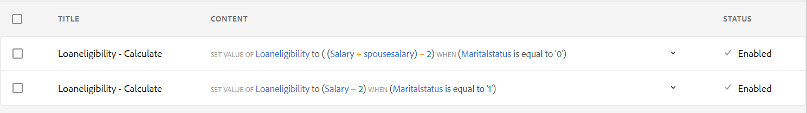

| 版本 | 文章連結 |
| -------- | ---------------------------- |
| AEM as a Cloud Service （核心元件） | 本文章 |
| AEM as a Cloud Service （基礎元件） | [按一下這裡](/help/forms/rule-editor.md) |
| AEM 6.5 | [按一下這裡](https://experienceleague.adobe.com/docs/experience-manager-65/forms/adaptive-forms-advanced-authoring/rule-editor.html) |

# 將規則新增至最適化表單（核心元件） {#adaptive-forms-rule-editor}

規則編輯器功能可讓表單業務使用者和開發人員在調適型表單物件上編寫規則。 這些規則會根據預設條件、使用者輸入及使用者對表單的動作，定義要在表單物件上觸發的動作。 它有助於進一步簡化表單填寫體驗，確保準確性和速度。

規則編輯器提供直覺式且簡化的使用者介面來撰寫規則。 規則編輯器為所有使用者提供一個視覺化編輯器。<!-- In addition, only for forms power users, rule editor provides a code editor to write rules and scripts. -->您可以使用規則對最適化表單物件執行的部分關鍵動作如下：

* 顯示或隱藏物件
* 啟用或停用物件
* 設定物件的值
* 驗證物件的值
* 執行函式以計算物件的值
* 啟動表單資料模型(FDM)服務並執行作業
* 設定物件的屬性

<!-- Rule editor replaces the scripting capabilities in [!DNL Experience Manager 6.1 Forms] and earlier releases. However, your existing scripts are preserved in the new rule editor. For more information about working with existing scripts in the rule editor, see [Impact of rule editor on existing scripts](rule-editor.md#p-impact-of-rule-editor-on-existing-scripts-p). -->

新增至表單超級使用者群組的使用者可以建立指令碼並編輯現有指令碼。 [!DNL forms-users]群組中的使用者可以使用指令碼，但不能建立或編輯指令碼。

## 核心元件中的規則編輯器和基礎元件中的規則編輯器之間的差異

{{rule-editor-diff}}

>[!NOTE]
>
> 若要詳細瞭解如何建立和使用自訂函式，請參閱最適化Forms （核心元件）中的[自訂函式](/help/forms/create-and-use-custom-functions.md)文章。

## 瞭解規則 {#understanding-a-rule}

規則是動作和條件的組合。 在規則編輯器中，動作包括隱藏、顯示、啟用、停用或計算表單中物件值等活動。 條件是對表單物件的狀態、值或屬性執行檢查和作業來評估的Boolean運算式。 根據評估條件所傳回的值（ `True`或`False`）執行動作。

規則編輯器提供一組預先定義的規則型別（例如「何時」、「顯示」、「隱藏」、「啟用」、「停用」、「設定值」和「驗證」）來協助您編寫規則。 每種規則型別都可讓您定義規則中的條件和動作。 本檔案將詳細說明每種規則型別。

規則通常會遵循下列其中一種建構：

**Condition-Action**&#x200B;在此建構中，規則會先定義條件，然後定義要觸發的動作。 此建構與程式設計語言中的if-then陳述式類似。

在規則編輯器中，**When**&#x200B;規則型別會強制執行condition-action結構。

**Action-Condition**&#x200B;在此建構中，規則會先定義要觸發的動作，接著定義評估條件。 此建構的另一個變數為action-condition-alternate action，這也會定義在條件傳回False時要觸發的替代動作。

規則編輯器中的「顯示」、「隱藏」、「啟用」、「停用」、「設定值」和「驗證」規則型別會強制實施動作條件規則結構。 依預設，「顯示」的替代動作是「隱藏」，而「啟用」的替代動作是「停用」，反之亦然。 您無法變更預設的替代動作。

>[!NOTE]
>
>可用的規則型別（包括您在規則編輯器中定義的條件和動作）也取決於您建立規則的表單物件型別。 規則編輯器僅顯示有效的規則型別和選項，用於寫入特定表單物件型別的條件和動作陳述式。 例如，您看不到面板物件的「驗證和設定值」型別。

如需規則編輯器中可用規則型別的詳細資訊，請參閱規則編輯器中的[可用規則型別](rule-editor.md#p-available-rule-types-in-rule-editor-p)。

### 選擇規則建構的准則 {#guidelines-for-choosing-a-rule-construct}

雖然您可以使用任何規則建構來實現大部分的使用案例，以下提供一些選擇建構勝過其他建構的准則。 如需規則編輯器中可用規則的詳細資訊，請參閱規則編輯器中的[可用規則型別](rule-editor.md#p-available-rule-types-in-rule-editor-p)。

* 建立規則時，經驗法則的典型做法是思考您所撰寫規則的物件內容。 假設您要根據使用者在欄位A中指定的值隱藏或顯示欄位B。在此案例中，您評估欄位A的條件，並且根據它傳回的值，觸發欄位B的動作。

  因此，如果您在欄位B （您評估條件的物件）上撰寫規則，請使用condition-action建構或When規則型別。 同樣地，使用動作條件建構或在欄位A上顯示或隱藏規則型別。

* 有時候，您必須根據一個條件執行多個動作。 在這種情況下，建議使用條件 — 動作建構。 在此建構中，您可以評估條件一次，並指定多個動作陳述式。

  例如，若要根據條件隱藏欄位B、C和D，以檢查使用者在欄位A中指定的值，請撰寫一個具有條件 — 動作建構的規則或欄位A上的規則型別時並指定動作來控制欄位B、C和D的可見性。否則，您需要在欄位B、C和D上設定三個個別規則，每個規則會檢查條件並顯示或隱藏個別欄位。 在此範例中，在一個物件上撰寫When規則型別比在三個物件上撰寫Show或Hide規則型別更有效率。

* 若要根據多個條件來觸發動作，建議使用動作條件建構。 例如，若要藉由評估欄位B、C和D的條件來顯示和隱藏欄位A，請在欄位A上使用顯示或隱藏規則型別。
* 如果規則包含適用於一個條件的一個動作，請使用條件 — 動作或動作條件建構。
* 如果規則檢查條件，並在欄位中提供值或退出欄位時立即執行動作，則建議在評估條件的欄位上編寫具有條件 — 動作建構或When規則型別的規則。
* 當使用者變更套用When規則的物件值時，會評估When規則中的條件。 但是，如果您希望動作在伺服器端變更時觸發（例如預先填入值），建議寫入在欄位初始化時觸發動作的When規則。
* 在撰寫下拉清單、選項按鈕或核取方塊物件的規則時，這些表單物件在表單中的選項或值會預先填入規則編輯器中。

## 規則編輯器中可用的運運算元型別和事件 {#available-operator-types-and-events-in-rule-editor}

規則編輯器提供下列邏輯運運算元和事件，您可使用它們建立規則。

* **等於**
* **不等於**
* **開頭為**
* **結尾為**
* **包含**
* **不包含**
* **是空的**
* **不是空的**
* **已選取：**&#x200B;當使用者選取核取方塊、下拉式清單單選按鈕的特定選項時，傳回True。
* **已初始化（事件）：**&#x200B;當表單物件在瀏覽器中呈現時傳回True。
* **已變更（事件）：**&#x200B;當使用者變更表單物件的輸入值或選取的選項時，傳回true。

<!--
* **Navigation(event):** Returns true when the user clicks a navigation object. Navigation objects are used to move between panels. 
* **Step Completion(event):** Returns true when a step of a rule completes.
* **Successful Submission(event):** Returns true on successful submission of data to a form data model.
* **Error in Submission(event):**  Returns true on unsuccessful submission of data to a form data model. -->

## 規則編輯器中的可用規則型別 {#available-rule-types-in-rule-editor}

規則編輯器提供了一組預先定義的規則型別，您可以使用這些型別來撰寫規則。 讓我們來詳細瞭解一下每種規則型別。 如需有關在規則編輯器中寫入規則的詳細資訊，請參閱[寫入規則](rule-editor.md#p-write-rules-p)。

### [!UICONTROL 時間] {#whenruletype}

**[!UICONTROL When]**&#x200B;規則型別遵循&#x200B;**condition-action-alternate action**&#x200B;規則建構，有時只遵循&#x200B;**condition-action**&#x200B;建構。 在此規則型別中，您先指定評估條件，接著指定滿足條件時觸發的動作( `True`)。 使用When規則型別時，您可以使用多個AND和OR運運算元來建立[巢狀運算式](#nestedexpressions)。

使用When規則型別，您可以評估表單物件的條件，並對一或多個物件執行動作。

簡單地說，典型的When規則結構如下：

`When on Object A:`

`(Condition 1 AND Condition 2 OR Condition 3) is TRUE;`

`Then, do the following:`

`Action 2 on Object B;`
`AND`
&#39;物件C上的動作3；

`Else, do the following:`

`Action 2 on Object C;`
_

當您有多值元件（如單選按鈕或清單）時，為該元件建立規則時，會自動擷取選項，並讓規則建立者可以使用這些選項。 您不需要再次輸入選項值。

例如，清單有四個選項：紅色、藍色、綠色和黃色。 建立規則時，會自動擷取選項（選項按鈕），以供規則建立者使用，如下所示：


撰寫When規則時，您可以觸發「清除值」動作。 清除值動作會清除指定物件的值。 在When陳述式中將的清除值作為選項可讓您建立具有多個欄位的複雜條件。 您可以新增Else陳述式以進一步新增條件

的值

>[!NOTE]
>
> 當規則型別僅支援單一層級then-else陳述式時。

#### [!UICONTROL When]中允許多個欄位 {#allowed-multiple-fields}

在&#x200B;**When**&#x200B;條件中，您可以選擇新增套用規則的欄位以外的其他欄位。

例如，使用When規則型別，您可以評估不同表單物件的條件並執行動作：

時間：

（物件A條件1）

和/或

（物件B條件2）

接著，執行下列動作：

物件A上的動作1

_


##### 在「當條件」功能中使用允許的多個字段時的注意事項

* [確保核心元件設置為版本 3.0.14 或更高版本](https://github.com/adobe/aem-core-forms-components)，以便在規則 編輯者中使用此功能。
* 如果將規則應用於 When 條件中的不同欄位，則僅更改其中一個字段時，規則觸發平均。


<!--
* It is not possible to add multiple fields in the When condition while applying rules to a button.

##### To enable Allowed Multiple fields in When condition feature

Allowed Multiple fields in When condition feature is disabled by default. To enable this feature, add a custom property at the template policy:

1. Open the corresponding template associated with an Adaptive Form in the template editor.
1. Select the existing policy as **formcontainer-policy**.
1. Navigate to the **[!UICONTROL Structure]**  view and, from the **[!UICONTROL Allowed Components]** list, open the **[!UICONTROL Adaptive Forms Container]** policy.
1. Go to the **[!UICONTROL Custom Properties]** tab and to add a custom property, click **[!UICONTROL Add]**.
1. Specify the **Group Name** of your choice. For example, in our case, we added the group name as **allowedfeature**.
1. Add the **key** and **value** pair as follows:
   * key: fd:changeEventBehaviour
   * value: deps
1. Click **[!UICONTROL Done]**. -->

如果「條件」功能中允許的多個欄位發生任何問題，請遵循下列疑難排解步驟：

1. 在編輯模式中開啟表單。
1. 開啟內容瀏覽器，然後選取最適化表單的&#x200B;**[!UICONTROL 指南容器]**&#x200B;元件。
1. 按一下「指引容器」屬性  圖示。此時會開啟「最適化表單容器」對話框。
1. 按一下完成，然後再次儲存對話方塊。

**[!UICONTROL 隱藏]**&#x200B;隱藏指定的物件。

**[!UICONTROL 顯示]**&#x200B;顯示指定的物件。

**[!UICONTROL 啟用]**&#x200B;啟用指定的物件。

**[!UICONTROL 停用]**&#x200B;停用指定的物件。

**[!UICONTROL 啟動服務]**&#x200B;啟動表單資料模型(FDM)中設定的服務。 選擇「啟動服務」作業時，會出現一個欄位。 點選欄位時，它會顯示您[!DNL Experience Manager]執行個體上所有表單資料模型(FDM)中設定的所有服務。 選擇表單資料模型服務時，會出現更多欄位，您可在其中對應具有指定服務的輸入和輸出引數的表單物件。 請參閱叫用表單資料模型(FDM)服務的規則範例。

除了表單資料模型服務之外，您還可以指定直接的WSDL URL來叫用Web服務。 不過，表單資料模型服務有許多優點，且建議叫用服務的方法。

如需有關在表單資料模型(FDM)中設定服務的詳細資訊，請參閱[[!DNL Experience Manager Forms] 資料整合](data-integration.md)。

**[!UICONTROL 設定值]**&#x200B;計算並設定指定物件的值。 您可以將物件值設為字串、其他物件的值、使用數學運算式或函式的計算值、物件屬性的值，或來自已設定表單資料模型服務的輸出值。 當您選擇Web服務選項時，它會顯示您[!DNL Experience Manager]執行個體上所有表單資料模型(FDM)中設定的所有服務。 選擇表單資料模型服務時，會出現更多欄位，您可在其中對應具有指定服務的輸入和輸出引數的表單物件。

如需有關在表單資料模型(FDM)中設定服務的詳細資訊，請參閱[[!DNL Experience Manager Forms] 資料整合](data-integration.md)。

**[!UICONTROL Set Property]**&#x200B;規則型別可讓您根據條件動作來設定指定物件的屬性值。 您可以將屬性設定為下列其中一項：
* 可見（布林值）
* label.value （字串）
* label.visible （布林值）
* 說明（字串）
* 已啟用（布林值）
* readOnly （布林值）
* 必要（布林值）
* screenReaderText （字串）
* 有效（布林值）
* errorMessage （字串）
* 預設（數字、字串、日期）
* enumNames （字串[]）
* chartType （字串）

例如，這可讓您定義規則，以便在按一下按鈕時顯示文字方塊。 您可以使用自訂函式、表單物件、物件屬性或服務輸出來定義規則。


若要根據自訂函式定義規則，請從下拉式清單中選取&#x200B;**[!UICONTROL 函式輸出]**，然後從&#x200B;**[!UICONTROL 函式]**&#x200B;索引標籤中拖放自訂函式。 如果符合條件動作，文字輸入方塊就會顯示。

若要根據表單物件定義規則，請從下拉式清單中選取&#x200B;**[!UICONTROL 表單物件]**，然後從&#x200B;**[!UICONTROL 表單物件]**&#x200B;標籤中拖放表單物件。 如果符合條件動作，文字輸入方塊就會顯示在最適化表單中。

以物件屬性為基礎的「設定屬性」規則可讓您根據最適化表單中包含的其他物件屬性，在最適化表單中顯示文字輸入方塊。

下圖是根據最適化表單中文字方塊的隱藏或顯示來動態啟用核取方塊的範例：


**[!UICONTROL 清除值]**&#x200B;清除指定物件的值。

**[!UICONTROL 設定焦點]**&#x200B;將焦點設定在指定的物件上。

**[!UICONTROL 提交表單]**&#x200B;提交表單。

**[!UICONTROL 重設]**&#x200B;重設表單或指定的物件。

**[!UICONTROL 驗證]**&#x200B;驗證表單或指定的物件。

**[!UICONTROL 新增執行個體]**&#x200B;新增指定之可重複面板或表格列的執行個體。

**[!UICONTROL 移除執行個體]**&#x200B;移除指定之可重複面板或表格列的執行個體。

**[!UICONTROL 函式輸出]**&#x200B;根據預先定義的函式或自訂函式定義規則。

**[!UICONTROL 導覽至]**&#x200B;導覽至其他<!--Interactive Communications,-->最適化Forms、其他資產（例如影像或檔案片段）或外部URL。<!-- For more information, see [Add button to the Interactive Communication](create-interactive-communication.md#addbuttontothewebchannel). -->

**[!UICONTROL 分派事件]**&#x200B;根據預先定義的條件或事件觸發特定動作或行為。


### [!UICONTROL 設定值] {#set-value-of}

]**規則型別的**[!UICONTROL &#x200B;設定值可讓您依據指定的條件是否符合，來設定表單物件的值。 值可以設定為另一個物件的值、常值字串、衍生自數學運算式或函式的值、另一個物件的屬性值，或表單資料模型服務的輸出。 同樣地，您可以檢查元件、字串、屬性或衍生自函式或數學運算式的值的條件。

**Set Value Of**&#x200B;規則型別不適用於所有表單物件，例如面板和工具列按鈕。 標準的「設定值」規則具有以下結構：

將物件 A 的值設定為：

（字串 ABC）或
（物件 屬性 物件 C 的 X）或
（來自函數的值）或
（值來自數學運算式）或
（數據模型服務的輸出值）;

時間（選擇）：

（條件 1 和條件 2 和條件 3） 為 TRUE;

下列範例選取`Question2`的值做為`True`，並將`Result`的值設定為`correct`。


使用表單資料模型服務的設定值規則範例。

### [!UICONTROL 節目] {#show}

使用&#x200B;**[!UICONTROL 顯示]**&#x200B;規則型別，您可以撰寫規則來根據條件是否滿足來顯示或隱藏表單物件。 Show規則型別也會觸發Hide動作，以防條件未滿足或傳回`False`。

典型的Show規則結構如下：

`Show Object A;`

`When:`

`(Condition 1 OR Condition 2 OR Condition 3) is TRUE;`

`Else:`

`Hide Object A;`

### [!UICONTROL 隱藏] {#hide}

與「顯示」規則型別類似，您可以使用&#x200B;**[!UICONTROL 隱藏]**&#x200B;規則型別，根據是否符合條件來顯示或隱藏表單物件。 Hide規則型別也會觸發Show動作，以防條件不滿足或傳回`False`。

典型的「隱藏」規則結構如下：

`Hide Object A;`

`When:`

`(Condition 1 AND Condition 2 AND Condition 3) is TRUE;`

`Else:`

`Show Object A;`

### [!UICONTROL 啟用] {#enable}

**[!UICONTROL 啟用]**&#x200B;規則型別可讓您根據條件是否滿足來啟用或停用表單物件。 Enable規則型別也會觸發Disable動作，以防條件不滿足或傳回`False`。

典型的Enable規則結構如下：

`Enable Object A;`

`When:`

`(Condition 1 AND Condition 2 AND Condition 3) is TRUE;`

`Else:`

`Disable Object A;`

### [!UICONTROL 停用] {#disable}

與「啟用」規則型別類似，**[!UICONTROL 停用]**&#x200B;規則型別可讓您根據條件是否滿足來啟用或停用表單物件。 Disable規則型別也會觸發Enable動作，以防條件不滿足或傳回`False`。

典型的「停用」規則結構如下：

`Disable Object A;`

`When:`

`(Condition 1 OR Condition 2 OR Condition 3) is TRUE;`

`Else:`

`Enable Object A;`

### [!UICONTROL 驗證] {#validate}

**[!UICONTROL Validate]**&#x200B;規則型別使用運算式來驗證欄位中的值。 例如，您可以撰寫運算式來檢查指定名稱的文字方塊是否不包含特殊字元或數字。

典型的驗證規則結構如下：

`Validate Object A;`

`Using:`

`(Expression 1 AND Expression 2 AND Expression 3) is TRUE;`

>[!NOTE]
>
>如果指定的值不符合驗證規則，您可以向使用者顯示驗證訊息。 您可以在側邊欄中元件屬性的&#x200B;**[!UICONTROL 指令碼驗證訊息]**&#x200B;欄位中指定訊息。


<!--
### [!UICONTROL Set Options Of] {#setoptionsof}

The **[!UICONTROL Set Options Of]** rule type enables you to define rules to add check boxes dynamically to the Adaptive Form. You can use a Form Data Model or a custom function to define the rule.

To define a rule based on a custom function, select **[!UICONTROL Function Output]** from the drop-down list, and drag-and-drop a custom function from the **[!UICONTROL Functions]** tab. The number of checkboxes defined in the custom function are added to the Adaptive Form.


To create a custom function, see [custom functions in rule editor](#custom-functions).

To define a rule based on a form data model:

1. Select **[!UICONTROL Service Output]** from the drop-down list.
1. Select the data model object.
1. Select a data model object property from the **[!UICONTROL Display Value]** drop-down list. The number of checkboxes in the Adaptive Form is derived from the number of instances defined for that property in the database.
1. Select a data model object property from the **[!UICONTROL Save Value]** drop-down list.

 -->

## 瞭解規則編輯器使用者介面 {#understanding-the-rule-editor-user-interface}

規則編輯器提供完整但簡單的使用者介面，用於撰寫和管理規則。 您可以在撰寫模式下，從最適化表單中啟動規則編輯器使用者介面。

若要啟動規則編輯器使用者介面：

1. 以撰寫模式開啟最適化表單。
1. 選取您要編寫規則的表單物件，然後在元件工具列中選取。 規則編輯器使用者介面隨即顯示。

   

   此檢視中會列出所選表單物件上的任何現有規則。 如需有關管理現有規則的資訊，請參閱[管理規則](rule-editor.md#p-manage-rules-p)。

1. 選取&#x200B;**[!UICONTROL 建立]**&#x200B;以撰寫新規則。 第一次啟動規則編輯器時，規則編輯器使用者介面的視覺化編輯器預設會開啟。

   

讓我們來詳細瞭解規則編輯器UI的每個元件。

### A.元件規則顯示 {#a-component-rule-display}

顯示啟動規則編輯器所使用之最適化表單物件的標題，以及目前選取的規則型別。 在上述範例中，規則編輯器是從標題為問題1的最適化表單物件啟動，而選取的規則型別是「何時」。

### B.表單物件與函式 {#b-form-objects-and-functions-br}

規則編輯器使用者介面左側的窗格包含兩個標籤 — **[!UICONTROL Forms物件]**&#x200B;和&#x200B;**[!UICONTROL 函式]**。

「表單物件」標籤會顯示最適化表單中包含之所有物件的階層檢視。 它會顯示物件的標題和型別。 撰寫規則時，您可以將表單物件拖放至規則編輯器上。 將物件或函式拖放至預留位置時，在建立或編輯規則時，預留位置會自動採用適當的值型別。

已套用一或多個有效規則的表單物件會以綠色圓點標示。 如果套用至表單物件的任何規則無效，則表單物件會標示為黃點。

函式索引標籤包含一組內建函式，例如Sum Of、Min Of、Max Of、Average Of、Number Of和Validate表單。 您可以使用這些函式計算可重複面板和表格列中的值，並在撰寫規則時在動作和條件陳述式中使用它們。 不過，您也可以建立自訂函式。

某些函式清單如下圖所示：


>[!NOTE]
>
>您可以在Forms「物件」和「函式」標籤中搜尋物件和函式的名稱及標題。

在表單物件的左側樹狀結構中，您可以選取表單物件，以顯示套用到每個物件的規則。 您不僅可以瀏覽各種表單物件的規則，也可以在表單物件之間複製 — 貼上規則。 如需詳細資訊，請參閱[複製貼上規則](rule-editor.md#p-copy-paste-rules-p)。

### C.表單物件與功能切換 {#c-form-objects-and-functions-toggle-br}

點選切換按鈕時，會切換表單物件和函式窗格。

### D.視覺規則編輯器 {#visual-rule-editor}

視覺化規則編輯器是規則編輯器使用者介面的視覺化編輯器模式中您編寫規則的區域。 它可讓您選取規則型別，並據此定義條件和動作。 在規則中定義條件和動作時，您可以從「表單物件與函式」窗格中拖放表單物件與函式。

有關使用可視化規則 編輯者的詳細信息，請参閱 [編寫規則](rule-editor.md#p-write-rules-p)。
<!-- 
### E. Visual-code editors switcher {#e-visual-code-editors-switcher}

Users in the forms-power-users group can access code editor. For other users, code editor is not available. If you have the rights, you can switch from visual editor mode to code editor mode of the rule editor, and conversely, using the switcher right above the rule editor. When you launch rule editor the first time, it opens in the visual editor mode. You can write rules in the visual editor mode or switch to the code editor mode to write a rule script. However, note that if you modify a rule or write a rule in code editor, you cannot switch back to the visual editor for that rule unless you clear the code editor.

[!DNL Experience Manager Forms] tracks the rule editor mode you used last to write a rule. When you launch the rule editor next time, it opens in that mode. However, you can also configure a default mode to open the rule editor in the specified mode. To do so:

1. Go to [!DNL Experience Manager] web console at `https://[host]:[port]/system/console/configMgr`.
1. Click to edit **[!UICONTROL Adaptive Form Configuration Service]**.
1. choose **[!UICONTROL Visual Editor]** or **[!UICONTROL Code Editor]** from the **[!UICONTROL Default Mode for Rule Editor]** drop-down

1. Click **[!UICONTROL Save]**.
-->

### E. 完成和取消按鈕 {#done-and-cancel-buttons}

**[!UICONTROL 完成]**&#x200B;按鈕用于儲存規則。您可以保存不完整的規則。 但是，不完整無效並且不會運行。 當您下次從同一表單物件啟動規則 編輯者時，會列出表單物件上已保存的規則。 您可以管理該視圖中的現有規則。 具體操作，請參見 [管理規則](rule-editor.md#p-manage-rules-p)。

「**[!UICONTROL 取消]**」按鈕會放棄您對規則所做的任何變更並關閉規則編輯器。

## 寫入規則 {#write-rules}

您可以使用視覺化規則編輯器<!-- or the code editor. When you launch the rule editor the first time, it opens in the visual editor mode. You can switch to the code editor mode and write rules. However, if you write or modify a rule in code editor, you cannot switch to the visual editor for that rule unless you clear the code editor. When you launch the rule editor next time, it opens in the mode that you used last to create rule. -->來撰寫規則

讓我們先來看看如何使用視覺化編輯器來撰寫規則。

### 使用視覺化編輯器 {#using-visual-editor}

讓我們瞭解如何使用下列範例表單在視覺化編輯器中建立規則。


範例貸款申請表單中的「貸款需求」區段要求申請人指定其婚姻狀況、薪資，如果已婚，則指定其配偶的薪資。 規則會根據使用者輸入來計算貸款資格金額，並顯示在「貸款資格」欄位中。 套用下列規則以實施情境：

* 配偶的「薪資」欄位僅在「婚姻狀況」為「已婚」時顯示。
* 貸款資格金額為薪資總額的50%。

若要撰寫規則，請執行下列步驟：

1. 首先，根據使用者為「婚姻狀況」選項按鈕選取的選項，撰寫規則以控制「配偶薪資」欄位的可見度。

   以編寫模式開啟貸款申請表單。 選取&#x200B;**[!UICONTROL 婚姻狀況]**&#x200B;元件並選取。 接著，選取&#x200B;**[!UICONTROL 建立]**&#x200B;以啟動規則編輯器。

   

   啟動規則編輯器時，預設會選取When規則。 此外，您啟動規則編輯器的表單物件（在此例中為「婚姻狀況」）會在When陳述式中指定。

   雖然您無法變更或修改選取的物件，但可以使用規則下拉式清單（如下所示）來選取其他規則型別。 如果您想在其他物件上建立規則，請選取「取消」結束規則編輯器，然後從想要的表單物件再次啟動它。

1. 選取&#x200B;**[!UICONTROL 選取狀態]**&#x200B;下拉式清單，並選取&#x200B;**[!UICONTROL 等於]**。 **[!UICONTROL 輸入字串]**&#x200B;欄位就會顯示。

   

<!--  In the Marital Status radio button, **[!UICONTROL Married]** and **[!UICONTROL Single]** options are assigned **0** and **1** values, respectively. You can verify assigned values in the Title tab of the Edit radio button dialog as shown below.

   -->

1. 在規則的&#x200B;**[!UICONTROL 輸入字串]**&#x200B;欄位中，從下拉式功能表中選取&#x200B;**已婚**。

   

   您已將條件定義為`When Marital Status is equal to Married`。 接著，定義若此條件為True時要執行的動作。

1. 在Then陳述式中，從&#x200B;**[!UICONTROL 選取動作]**&#x200B;下拉式清單中選取&#x200B;**[!UICONTROL 顯示]**。

   

1. 從&#x200B;**[!UICONTROL 拖放物件上的[表單物件]索引標籤中拖放**[!UICONTROL &#x200B;配偶薪資&#x200B;]**欄位，或選取這裡]**&#x200B;欄位。 或者，選取&#x200B;**[!UICONTROL 拖放物件或選取這裡]**&#x200B;欄位，然後從躍現式選單中選取&#x200B;**[!UICONTROL 配偶薪資]**&#x200B;欄位，這會列出表單中的所有表單物件。

   

   接著，定義若此條件為False時要執行的動作。
1. 按一下&#x200B;**[!UICONTROL 新增其他區段]**，為&#x200B;**[!UICONTROL 配偶薪資]**&#x200B;欄位新增其他條件，以備您選取「婚姻狀況」為單一時使用。

   


1. 在Else陳述式中，從&#x200B;**[!UICONTROL 選取動作]**&#x200B;下拉式清單中選取&#x200B;**[!UICONTROL 隱藏]**。
   

1. 從&#x200B;**[!UICONTROL 拖放物件上的[表單物件]索引標籤中拖放**[!UICONTROL &#x200B;配偶薪資&#x200B;]**欄位，或選取這裡]**&#x200B;欄位。 或者，選取&#x200B;**[!UICONTROL 拖放物件或選取這裡]**&#x200B;欄位，然後從躍現式選單中選取&#x200B;**[!UICONTROL 配偶薪資]**欄位，這會列出表單中的所有表單物件。
   

   規則在規則編輯器中會顯示如下。

   


1. 選取&#x200B;**[!UICONTROL 完成]**&#x200B;以儲存規則。

<!--
1. Repeat steps 1 through 5 to define another rule to hide the Spouse Salary field if the marital Status is Single. The rule appears as follows in the rule editor.

    -->

>[!NOTE]
>
> 或者，您可以在「配偶薪資」欄位上撰寫「顯示」規則，而不是「婚姻狀況」欄位上的「何時」規則，以實施相同的行為。


1. 接著，撰寫規則以計算貸款資格金額（為薪資總額的50%），並在「貸款資格」欄位中顯示。 若要取得此結果，請在貸款適用性欄位上建立&#x200B;**[!UICONTROL 設定值（共]**&#x200B;個）。

   在撰寫模式中，選取&#x200B;**[!UICONTROL 貸款資格]**&#x200B;欄位，然後選取。 接著，選取&#x200B;**[!UICONTROL 建立]**&#x200B;以啟動規則編輯器。

1. 從規則下拉式清單中選取&#x200B;**[!UICONTROL 設定值]**。

   

1. 選取&#x200B;**[!UICONTROL 選取選項]**&#x200B;並選取&#x200B;**[!UICONTROL 數學運算式]**。 用於寫入數學運算式的欄位隨即開啟。

   

1. 在運算式欄位中：

   * 從Forms物件標籤中選取或拖放第一個&#x200B;**[!UICONTROL 放置物件中的**[!UICONTROL  Salary ]**欄位，或選取這裡]**&#x200B;欄位。

   * 從&#x200B;**[!UICONTROL 選取運運算元]**&#x200B;欄位中選取&#x200B;**[!UICONTROL 加號]**。

   * 從「Forms物件」標籤中選取或拖放其他&#x200B;**[!UICONTROL 拖放物件的**[!UICONTROL &#x200B;配偶薪資&#x200B;]**欄位，或選取這裡]**&#x200B;欄位。

   

1. 接著，在運算式欄位周圍反白的區域中選取，並選取&#x200B;**[!UICONTROL 延伸運算式]**。

   

   在擴展運算式欄位中，從“選擇運算元&#x200B;]**”欄位中選擇“除以]****[!UICONTROL ”，從**[!UICONTROL “選擇選項&#x200B;]**”字段中選擇**[!UICONTROL **[!UICONTROL “數位]**”。然後，在數位欄位中指定 **[!UICONTROL 2]** 。

   

   >[!NOTE]
   >
   >您可以使用“選擇選項”字段中的元件、函數、數學表達式和屬性值來創建複雜表達式。

   接著，建立條件，當傳回True時，執行運算式。

1. 選取&#x200B;**[!UICONTROL 新增條件]**&#x200B;以新增When陳述式。

   

   在When陳述式中：

   * 從Forms物件索引標籤中選取或拖放第一個&#x200B;**[!UICONTROL 放置物件的**[!UICONTROL &#x200B;婚姻狀況&#x200B;]**欄位，或選取這裡]**&#x200B;欄位。

   * 從&#x200B;**[!UICONTROL 選取運運算元]**&#x200B;欄位中選取&#x200B;**[!UICONTROL 等於]**。

   * 選取其他&#x200B;**[!UICONTROL 拖放物件中的字串，或選取這裡]**&#x200B;欄位，並在&#x200B;**[!UICONTROL 輸入字串]**&#x200B;欄位中指定&#x200B;**[!UICONTROL 已婚]**。

   規則最後會顯示在規則編輯器中，如下所示。  

1. 選取&#x200B;**[!UICONTROL 完成]**。 這會儲存規則。

1. 重複步驟7到14，定義另一個規則，以計算婚姻狀況為「單身」時的貸款資格。 規則在規則編輯器中會顯示如下。

   

或者，您可以使用「設定值」規則，在您建立用來顯示 — 隱藏「配偶薪資」欄位的「時機」規則中，計算貸款資格。 當「婚姻狀況」為「單一」時，產生的合併規則會顯示在規則編輯器中，如下所示。


您可以使用Else條件，撰寫合併規則以控制「配偶薪資」欄位的可見度，並在「婚姻狀況」為「已婚」時計算貸款資格。


<!-- ### Using code editor {#using-code-editor}

Users added to the forms-power-users group can use code editor. The rule editor auto generates the JavaScript code for any rule you create using visual editor. You can switch from visual editor to the code editor to view the generated code. However, if you modify the rule code in the code editor, you cannot switch back to the visual editor. If you prefer writing rules in code editor rather than visual editor, you can write rules afresh in the code editor. The visual-code editors switcher helps you switch between the two modes.

The code editor JavaScript is the expression language of Adaptive Forms. All the expressions are valid JavaScript expressions and use Adaptive Forms scripting model APIs. These expressions return values of certain types. For the complete list of Adaptive Forms classes, events, objects, and public APIs, see [JavaScript Library API reference for Adaptive Forms](https://helpx.adobe.com/experience-manager/6-5/forms/javascript-api/index.html).

For more information about guidelines to write rules in the code editor, see [Adaptive Form Expressions](adaptive-form-expressions.md).

While writing JavaScript code in the rule editor, the following visual cues help you with the structure and syntax:

* Syntax highlights

* Auto Indentation

* Hints and suggestions for Form objects, functions, and their properties

* Auto completion of form component names and common JavaScript functions


-->

#### 規則編輯器中的自訂函式 {#custom-functions}

除了列在&#x200B;**函式輸出**&#x200B;下的現成函式（如&#x200B;*總和*）之外，您也可以在規則編輯器中使用自訂函式。 規則編輯器支援指令碼和自訂函式的JavaScript ECMAScript 2019語法。 如需建立自訂函式的指示，請參閱文章[最適化Forms中的自訂函式](/help/forms/create-and-use-custom-functions.md)。

<!--

Ensure that the function you write is accompanied by the `jsdoc` above it. Adaptive Form supports the various [JavaScript annotations for custom functions](/help/forms/create-and-use-custom-functions.md#js-annotations).

For more information, see [jsdoc.app](https://jsdoc.app/).

Accompanying `jsdoc` is required:

* If you want custom configuration and description
* Because there are multiple ways to declare a function in `JavaScript,` and comments let you keep a track of the functions.

Supported `jsdoc` tags:

* **Private**
  Syntax: `@private`
  A private function is not included as a custom function.

* **Name**
  Syntax: `@name funcName <Function Name>`
  Alternatively `,` you can use: `@function funcName <Function Name>` **or** `@func` `funcName <Function Name>`.
  `funcName` is the name of the function (no spaces allowed).
  `<Function Name>` is the display name of the function.

* **Parameter**
  Syntax: `@param {type} name <Parameter Description>`
  Alternatively, you can use: `@argument` `{type} name <Parameter Description>` **or** `@arg` `{type}` `name <Parameter Description>`.
  Shows parameters used by the function. A function can have multiple parameter tags, one tag for each parameter in the order of occurrence.
  `{type}` represents parameter type. Allowed parameter types are:

    1. string
    2. number
    3. boolean
    4. scope
    5. string[]
    6. number[]
    7. boolean[]
    8. date
    9. date[]
    10. array
    11. object

   `scope` refers to a special globals object which is provided by forms runtime. It must be the last parameter and is not be visible to the user in the rule editor. You can use scope to access readable form and field proxy object to read properties, event which triggered the rule and a set of functions to manipulate the form.

   `object` type is used to pass readable field object in parameter to a custom function instead of passing the value.

   All parameter types are categorized under one of the above. None is not supported. Ensure that you select one of the types above. Types are not case-sensitive. Spaces are not allowed in the parameter name.  Parameter description can have multiple words.

* **Optional Parameter**
Syntax: `@param {type=} name <Parameter Description>` 
Alternatively, you can use: `@param {type} [name] <Parameter Description>`
By default all parameters are mandatory. You can mark a parameter optional by adding `=` in type of the parameter or by putting param name in square brackets.
   
   For example, let us declare `Input1` as optional parameter:
    * `@param {type=} Input1`
    * `@param {type} [Input1]`

* **Return Type**
  Syntax: `@return {type}`
  Alternatively, you can use `@returns {type}`.
  Adds information about the function, such as its objective.
  {type} represents the return type of the function. Allowed return types are:

    1. string
    2. number
    3. boolean
    4. string[]
    5. number[]
    6. boolean[]
    7. date
    8. date[]
    9. array
    10. object

  All other return types are categorized under one of the above. None is not supported. Ensure that you select one of the types above. Return types are not case-sensitive.

**Adding a custom function**

For example, you want to add a custom function which calculates area of a square. Side length is the user input to the custom function, which is accepted using a numeric box in your form. The calculated output is displayed in another numeric box in your form. To add a custom function, you have to first create a client library, and then add it to the CRX repository.

To create a client library and add it in the CRX repository, perform the following steps:

1. Create a client library. For more information, see [Using Client-Side Libraries](https://experienceleague.adobe.com/docs/experience-manager-cloud-service/implementing/developing/full-stack/clientlibs.html#developing).
2. In CRXDE, add a property `categories`with string type value as `customfunction` to the `clientlib` folder.

   >[!NOTE]
   >
   >`customfunction`is an example category. You can choose any name for the category you create in the `clientlib`folder.

After you have added your client library in the CRX repository, use it in your Adaptive Form. It lets you use your custom function as a rule in your form. To add the client library in your Adaptive Form, perform the following steps:

1. Open your form in edit mode.
   To open a form in edit mode, select a form and select **[!UICONTROL Open]**.
1. In the edit mode, select a component, then select  &gt; **[!UICONTROL Adaptive Form Container]**, and then select .
1. In the sidebar, under Name of Client Library, add your client library. ( `customfunction` in the example.)

   

1. Select the input numeric box, and select  to open the rule editor.
1. Select **[!UICONTROL Create Rule]**. Using options shown below, create a rule to save the squared value of the input in the Output field of your form.

   [](assets/add-custom-rule.png)
  
1. Select **[!UICONTROL Done]**. Your custom function is added.

   >[!NOTE]
   >
   > To invoke a form data model from rule editor using custom functions, [see here](/help/forms/using-form-data-model.md#invoke-services-in-adaptive-forms-using-rules-invoke-services). 

#### Function declaration supported types {#function-declaration-supported-types}

**Function Statement**

```javascript
function area(len) {
    return len*len;
}
```

This function is included without `jsdoc` comments.

**Function Expression**

```javascript
var area;
//Some codes later
/** */
area = function(len) {
    return len*len;
};
```

**Function Expression and Statement**

```javascript
var b={};
/** */
b.area = function(len) {
    return len*len;
}
```

**Function Declaration as Variable**

```javascript
/** */
var x1,
    area = function(len) {
        return len*len;
    },
    x2 =5, x3 =true;
```

Limitation: custom function picks only the first function declaration from the variable list, if together. You can use function expression for every function declared.

**Function Declaration as Object**

```javascript
var c = {
    b : {
        /** */
        area : function(len) {
            return len*len;
        }
    }
};
```

>[!NOTE]
>
>Ensure that you use `jsdoc` for every custom function. Although `jsdoc`comments are encouraged, include an empty `jsdoc`comment to mark your function as custom function. It enables default handling of your custom function.
-->

## 管理規則 {#manage-rules}

當您選取物件並選取時，表單物件上的任何現有規則都會列出。 您可以檢視標題並預覽規則摘要。 此外，UI可讓您展開並檢視完整的規則摘要、變更規則順序、編輯規則及刪除規則。



您可以對規則執行下列動作：

* **展開/摺疊**：規則清單中的「內容」欄會顯示規則內容。 如果在預設檢視中看不到整個規則內容，請選取以展開它。

* **重新排序**：您建立的任何新規則都會棧疊在規則清單底部。 規則會從上到下執行。 頂端的規則會先執行，接著執行相同型別的其他規則。 例如，如果您分別從頂端開始，在第一、第二、第三和第四個位置有When、Show、Enable和When規則，則頂端的規則會先執行，接著在第四個位置有When規則。 接著會執行「顯示」和「啟用」規則。
您可以對規則點選或將其拖放到清單中所需的順序來變更規則的順序。

* **編輯**：若要編輯規則，請選取規則標題旁的核取方塊。 隨即顯示編輯和刪除規則的選項。 選取&#x200B;**[!UICONTROL 編輯]**&#x200B;以在規則編輯器<!-- in visual  or code editor mode depending on the mode used to create the rule -->中開啟選取的規則。

* **刪除**：若要刪除規則，請選取該規則並選取&#x200B;**[!UICONTROL 刪除]**。

* **啟用/停用**：當您必須暫時暫停使用規則時，您可以選取一或多個規則，並在[動作]工具列中選取[停用] **[!UICONTROL 停用]**&#x200B;以停用這些規則。 如果規則已停用，則不會在執行階段執行。 若要啟用已停用的規則，您可以選取該規則，然後選取動作工具列中的「啟用」 。 規則的狀態列顯示規則是啟用還是停用。


## 複製貼上規則 {#copy-paste-rules}

您可以將規則從一個欄位複製並貼上到其他類似欄位，以節省時間。

若要複製貼上規則，請執行下列動作：

1. 選取您要從中複製規則的表單物件，然後在元件工具列中選取。 規則編輯器使用者介面會出現，並選取表單物件，而現有規則會出現。

   

   如需有關管理現有規則的資訊，請參閱[管理規則](rule-editor.md#p-manage-rules-p)。

1. 選取規則標題旁的核取方塊，管理規則的選項就會出現。 選取&#x200B;**[!UICONTROL 複製]**。

   

1. 選取您要貼上規則的其他表單物件，並選取&#x200B;**[!UICONTROL 貼上]**。 此外，您可以編輯規則以對其進行變更。

   >[!NOTE]
   >
   >只有當表單物件支援所複製規則的事件，您才能將規則貼到另一個表單物件。 例如，按鈕支援點選事件。 您可以將具有點選事件的規則貼到按鈕上，但無法貼到核取方塊上。

1. 選取&#x200B;**[!UICONTROL 完成]**&#x200B;以儲存規則。

## 巢狀運算式 {#nestedexpressions}

規則編輯器可讓您使用多個AND和OR運運算元來建立巢狀規則。 您可以在規則中混合使用多個AND和OR運運算元。

以下是巢狀規則的範例，該規則會在符合所需條件時，向使用者顯示有關子女監護權的資格的訊息。


您也可以拖放規則中的條件以進行編輯。 選取並將滑鼠游標停留在條件前的控制代碼（ ）上。 指標變為手形符號（如下所示）后，將條件拖放到規則內的任何位置。 規則結構將發生變化。


## 日期運算式條件 {#dateexpression}

規則 編輯者 可讓您使用日期比較來建立條件。

以下是一個範例條件，會在房屋抵押貸款已辦理時顯示靜態文字物件，使用者填寫日期欄位即表示該條件。

當使用者填寫的屬性按揭日期為過去時，最適化表單會顯示收入計算的相關備註。 下列規則會比較使用者填寫的日期與目前日期，如果使用者填寫的日期早於目前日期，則表單會顯示文字訊息（名為「收入」）。


當填寫日期早於目前日期時，表單會顯示文字訊息（收入）如下：


## 數字比較條件 {#number-comparison-conditions}

規則編輯器可讓您建立比較兩個數字的條件。

如果應徵者在目前地址停留的月數少於36，則會顯示靜態文字物件的範例條件如下。


當使用者表示在目前的居住地址生活少於36個月時，表單會顯示通知，要求更多居住證明。


<!-- ## Impact of rule editor on existing scripts {#impact-of-rule-editor-on-existing-scripts}

In [!DNL Experience Manager Forms] versions prior to [!DNL Experience Manager 6.1 Forms] feature pack 1, form authors and developers used to write expressions in the Scripts tab of the Edit component dialog to add dynamic behavior to Adaptive Forms. The Scripts tab is now replaced by the rule editor.

Any scripts or expressions that you must have written in the Scripts tab are available in the rule editor. While you cannot view or edit them in visual editor, if you are a part of the forms-power-users group you can edit scripts in code editor. -->

## 規則範例 {#example}

### 使用內建函式簡化可重複面板中的複雜計算

規則編輯器可讓您直接在可重複面板中的欄位上使用現成可用的函式，例如Sum、Min、Max和Join。 這開啟了強大的自動化功能，讓您無需自訂程式碼即可實施複雜的商業邏輯。
想像一個具有可重複面板的表單。 每個面板例項可能會收集產品數量等資料。 您可以使用「總和」函式自動計算所有面板的總數量，消除手動計算與可能的錯誤。


這只是個範例！ 探索可用的[功能](#b-form-objects-and-functions-br)以簡化工作流程，並提高表單中的資料準確度。

### 啟動表單資料模型服務 {#invoke}

假設有一項Web服務`GetInterestRates`，它會將貸款金額、保有權及申請者的信用評分當作輸入，並傳回包含EMI金額和利率的貸款計畫。 您可以使用Web服務作為資料來源來建立表單資料模型(FDM)。 您新增資料模型物件和`get`服務至表單模型。 服務會出現在表單資料模型(FDM)的「服務」標籤中。 接著，建立包含資料模型物件欄位的最適化表單，以擷取貸款金額、使用期限和信用評分的使用者輸入。 新增觸發Web服務擷取計畫詳細資料的按鈕。 輸出會填入適當的欄位中。

下列規則顯示如何設定叫用服務動作來完成範例案例。


>[!NOTE]
>
>如果輸入為陣列型別，則支援陣列的欄位會顯示在「輸出」下拉式區段下。

### 使用When規則觸發多個動作 {#triggering-multiple-actions-using-the-when-rule}

在貸款申請表單中，您想要擷取貸款申請人是否為現有客戶。 根據使用者提供的資訊，客戶ID欄位應顯示或隱藏。 此外，如果使用者是現有客戶，您想要將焦點設定在客戶ID欄位。 貸款申請表單包含下列元件：

* 單選按鈕&#x200B;**[!UICONTROL 您是現有的Geometrixx客戶嗎？]**，提供[!UICONTROL 是]和[!UICONTROL 否]選項。 「是」的值為&#x200B;**0**，「否」的值為&#x200B;**1**。

* 文字欄位&#x200B;**[!UICONTROL 客戶ID]** Geometrixx，用以指定客戶ID。

當您在選項按鈕上編寫實施此行為的When規則時，該規則在視覺規則編輯器中會顯示如下。


視覺化編輯器中的規則

在範例規則中，When區段中的陳述式是條件，當傳回True時，會執行Then區段中指定的動作。

<!-- The rule appears as follows in the code editor.

 

Rule in the code editor -->

### 在規則中使用函式輸出 {#using-a-function-output-in-a-rule}

在採購單表單中，您有下表，使用者可在其中填寫訂單。 在此表格中：

* 第一列是可重複的，因此使用者可以訂購多個產品並指定不同的數量。 它的元素名稱為`Row1`。
* 重複資料列之「產品數量」欄中的儲存格標題為「數量」。 此儲存格的元素名稱為`productquantity`。
* 表格中的第二列是不可重複的，且此列中「產品數量」欄中的儲存格標題為「總數量」。


**A.**&#x200B;列1 **B.**&#x200B;數量&#x200B;**C.**&#x200B;總數量

現在，您要在所有產品的「產品數量」欄中新增指定數量，並在「總數量」儲存格中顯示總和。 您可以在「總數量」儲存格上撰寫「設定值」規則，以達到此總和，如下所示。


視覺化編輯器中的規則

<!-- he rule appears as follows in the code editor.


Rule in the code editor -->

### 使用運算式驗證欄位值 {#validating-a-field-value-using-expression}

在上一個範例中說明的採購單表單中，您想要限制使用者訂購超過一10000數量的產品。 若要執行此驗證，您可以編寫驗證規則，如下所示。


<!-- The rule appears as follows in the code editor.


Rule in the code editor -->
