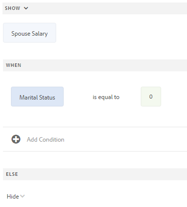
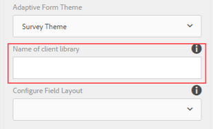
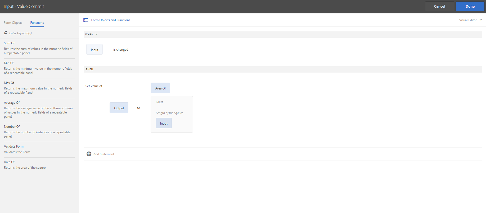

# 將規則新增至最適化表單 {#adaptive-forms-rule-editor}

## 概覽 {#overview}

規則編輯器功能使表單業務用戶和開發人員能夠在自適應表單對象上編寫規則。 這些規則根據表單上的預設條件、用戶輸入和用戶操作定義對表單對象觸發的操作。 它有助於進一步簡化表單填充體驗，確保準確性和速度。

規則編輯器提供了一個直觀且簡化的用戶介面來編寫規則。 規則編輯器為所有用戶提供可視編輯器。<!-- In addition, only for forms power users, rule editor provides a code editor to write rules and scripts. --> 可以使用規則對自適應表單對象執行的一些關鍵操作包括：

* 顯示或隱藏對象
* 啟用或禁用對象
* 為對象設定值
* 驗證對象的值
* 執行函式以計算對象的值
* 調用表單資料模型服務並執行操作
* 設定對象的屬性

<!-- Rule editor replaces the scripting capabilities in [!DNL Experience Manager 6.1 Forms] and earlier releases. However, your existing scripts are preserved in the new rule editor. For more information about working with existing scripts in the rule editor, see [Impact of rule editor on existing scripts](rule-editor.md#p-impact-of-rule-editor-on-existing-scripts-p). -->

添加到表單超級用戶組的用戶可以建立指令碼並編輯現有指令碼。 中的用戶 [!DNL forms-users] 組可以使用指令碼，但不能建立或編輯指令碼。

## 瞭解規則 {#understanding-a-rule}

規則是行動和條件的組合。 在規則編輯器中，操作包括隱藏、顯示、啟用、禁用或計算表單中對象的值等活動。 條件是通過對表單對象的狀態、值或屬性執行檢查和操作來計算的布爾表達式。 根據值( `True` 或 `False`)返回。

規則編輯器提供一組預定義的規則類型，如「何時」、「顯示」、「隱藏」、「啟用」、「禁用」、「設定值」和「驗證」，以幫助您編寫規則。 每種規則類型都允許您定義規則中的條件和操作。 文檔進一步詳細說明了每種規則類型。

規則通常遵循以下結構之一：

**條件 — 操作** 在此構造中，規則首先定義一個條件，然後定義要觸發的操作。 該構造可與寫程式語言中的if-then語句相比。

在規則編輯器中， **當** 規則類型強制條件 — 操作構造。

**操作條件** 在此構造中，規則首先定義要觸發的操作，然後定義要評估的條件。 此構造的另一個變體是action-condition-alternate操作，該操作還定義了在條件返回False時觸發的替代操作。

規則編輯器中的「顯示」、「隱藏」、「啟用」、「禁用」、「設定值」和「驗證」規則類型將強制執行操作條件規則構造。 預設情況下，「顯示」(Show)的替代操作為「隱藏」(Hide)，「啟用」(Enable)的替代操作為「禁用」(Disable)，相反。 不能更改預設備用操作。

>[!NOTE]
>
>可用的規則類型（包括在規則編輯器中定義的條件和操作）也取決於要在其上建立規則的表單對象的類型。 規則編輯器僅顯示用於為特定表單對象類型編寫條件和操作語句的有效規則類型和選項。 例如，您看不到面板對象的驗證、設定值、啟用和禁用規則類型。

有關規則編輯器中可用的規則類型的詳細資訊，請參見 [規則編輯器中可用的規則類型](rule-editor.md#p-available-rule-types-in-rule-editor-p)。

### 選擇規則構造的准則 {#guidelines-for-choosing-a-rule-construct}

雖然您可以使用任何規則構造來實現大多數使用情形，但以下是選擇一個構造而不是另一個構造的一些准則。 有關規則編輯器中可用規則的詳細資訊，請參見 [規則編輯器中可用的規則類型](rule-editor.md#p-available-rule-types-in-rule-editor-p)。

* 建立規則時的一個典型經驗法則是在您正在編寫規則的對象上下文中考慮它。 請考慮您要根據用戶在欄位A中指定的值隱藏或顯示欄位B。在這種情況下，您正在評估欄位A上的條件，並且根據它返回的值，您正在觸發欄位B上的操作。

   因此，如果要在欄位B（要對其評估條件的對象）上編寫規則，請使用condition-action構造或When規則類型。 同樣，在欄位A上使用action-condition構造或「顯示」或「隱藏」規則類型。

* 有時，必鬚根據一個條件執行多個操作。 在這種情況下，建議使用條件 — 操作構造。 在此構造中，可以計算條件一次並指定多個操作語句。

   例如，要根據檢查用戶在欄位A中指定的值的條件隱藏欄位B、C和D，請使用條件 — 操作構造或在欄位A上的規則類型寫入一條規則，並指定控制欄位B、C和D的可見性的操作。否則，您需要在欄位B、C和D上使用三個單獨的規則，其中每個規則都檢查條件並顯示或隱藏相應的欄位。 在本示例中，在一個對象上寫入「當」(When)規則類型比在三個對象上顯示或隱藏規則類型更有效。

* 要根據多個條件觸發操作，建議使用操作條件構造。 例如，要通過評估欄位B、C和D的條件來顯示和隱藏欄位A，請在欄位A上使用「顯示」或「隱藏」規則類型。
* 如果規則包含一個條件的操作，則使用condition-action或action condition構造。
* 如果規則檢查條件並在提供欄位中的值或退出欄位時立即執行操作，則建議在條件評估所依據的欄位上使用條件 — 操作構造或When規則類型編寫規則。
* 當用戶更改應用When規則的對象的值時，將評估When規則中的條件。 但是，如果希望操作在伺服器端的值發生更改時觸發，例如預填充值，則建議在初始化欄位時寫入觸發操作的「時間」規則。
* 在編寫下拉清單、單選按鈕或複選框對象的規則時，表單中這些表單對象的選項或值將預先填充在規則編輯器中。

## 規則編輯器中的可用運算子類型和事件 {#available-operator-types-and-events-in-rule-editor}

規則編輯器提供了以下邏輯運算子和事件，您可以使用它們建立規則。

* **等於**
* **不等於**
* **開頭為**
* **結尾為**
* **包含**
* **為空**
* **不為空**
* **已選擇：** 當用戶為複選框、下拉菜單和單選按鈕選擇特定選項時，返回true。
* **已初始化（事件）:** 當表單對象在瀏覽器中呈現時，返回true。
* **已更改（事件）:** 當用戶更改表單對象的輸入值或選定選項時，返回true。
* **導航（事件）:** 當用戶按一下導航對象時返回true。 導航對象用於在面板之間移動。
* **步驟完成（事件）:** 當規則的步驟完成時返回true。
* **成功提交（事件）:** 成功將資料提交到表單資料模型時返回true。
* **提交（事件）中出錯：**  如果向表單資料模型提交資料失敗，則返回true。

## 規則編輯器中可用的規則類型 {#available-rule-types-in-rule-editor}

規則編輯器提供了一組預定義的規則類型，可用於編寫規則。 讓我們詳細瞭解每種規則類型。 有關在規則編輯器中寫入規則的詳細資訊，請參見 [寫入規則](rule-editor.md#p-write-rules-p)。

### [!UICONTROL 時間] {#whenruletype}

的 **[!UICONTROL 當]** 規則類型跟在後面 **條件 — 操作 — 替代操作** 規則構造，有時 **條件作用** 構造。 在此規則類型中，您首先為評估指定一個條件，然後在滿足條件時指定觸發操作( `True`)。 使用「當」(When)規則類型時，可以使用多個AND和OR運算子來建立 [嵌套表達式](#nestedexpressions)。

使用「當時」(When)規則類型，可以評估表單對象上的條件，並對一個或多個對象執行操作。

簡單地說，典型的When規則的結構如下：

`When on Object A:`

`(Condition 1 AND Condition 2 OR Condition 3) is TRUE;`

`Then, do the following:`

對對象B採取行動2;C對象的AND操作3;

_

當您在為該元件建立規則時擁有多值元件（如單選按鈕或清單）時，將自動檢索選項並使其可用於規則建立者。 您無需再次鍵入選項值。

例如，清單有四個選項：紅、藍、綠和黃。 在建立規則時，會自動檢索選項（單選按鈕），並使規則建立者可以使用這些選項，如下所示：


在編寫When規則時，可以觸發「清除值」(Clear Value)操作。 「清除值」(Clear Value Of)操作將清除指定對象的值。 在When語句中，將Clear Value作為選項，允許您建立具有多個欄位的複雜條件。


**[!UICONTROL 隱藏]** 隱藏指定的對象。

**[!UICONTROL 顯示]** 顯示指定的對象。

**[!UICONTROL 啟用]** 啟用指定的對象。

**[!UICONTROL 禁用]** 禁用指定的對象。

**[!UICONTROL 調用服務]** 調用在表單資料模型中配置的服務。 選擇「調用服務」操作時，將顯示一個欄位。 點擊該欄位時，它將顯示您的 [!DNL Experience Manager] 實例。 在選擇表單資料模型服務時，將出現更多欄位，您可以在其中使用指定服務的輸入和輸出參數映射表單對象。 請參閱調用表單資料模型服務的示例規則。

除了表單資料模型服務外，還可以指定直接WSDL URL來調用Web服務。 但是，表單資料模型服務有許多好處，並且建議了調用服務的方法。

有關在表單資料模型中配置服務的詳細資訊，請參見 [[!DNL Experience Manager Forms] 資料整合](data-integration.md)。

**[!UICONTROL 設定值]** 計算和設定指定對象的值。 可以將對象值設定為字串、另一個對象的值、使用數學表達式或函式計算的值、對象屬性的值或配置的表單資料模型服務的輸出值。 選擇Web服務選項時，它將顯示您的所有表單資料模型中配置的所有服務 [!DNL Experience Manager] 實例。 在選擇表單資料模型服務時，將出現更多欄位，您可以在其中使用指定服務的輸入和輸出參數映射表單對象。

有關在表單資料模型中配置服務的詳細資訊，請參見 [[!DNL Experience Manager Forms] 資料整合](data-integration.md)。

的 **[!UICONTROL 設定屬性]** 規則類型允許您基於條件操作設定指定對象的屬性值。

它使您能夠定義規則以動態地將複選框添加到「自適應表單」中。 可以使用自定義函式、表單對象或對象屬性來定義規則。


要基於自定義函式定義規則，請選擇 **[!UICONTROL 函式輸出]** 從下拉清單中，並從 **[!UICONTROL 函式]** 頁籤。 如果滿足條件操作，則在自定義函式中定義的複選框數將添加到自適應表單中。

要基於表單對象定義規則，請選擇 **[!UICONTROL 窗體對象]** 從下拉清單中，並從 **[!UICONTROL 窗體對象]** 頁籤。 如果滿足條件操作，則在表單對象中定義的複選框數將添加到自適應表單中。

基於對象屬性的「設定屬性」規則允許您基於自適應表單中包含的另一個對象屬性在自適應表單中添加複選框的數量。

下圖描述了根據自適應表單中下拉清單的數量動態添加複選框的示例：


**[!UICONTROL 清除值]** 清除指定對象的值。

**[!UICONTROL 設定焦點]** 將焦點集中到指定的對象。

**[!UICONTROL 保存窗體]** 保存窗體。

**[!UICONTROL 提交Forms]** 提交表單。

**[!UICONTROL 重置窗體]** 重置窗體。

**[!UICONTROL 驗證表單]** 驗證表單。

**[!UICONTROL 添加實例]** 添加指定可重複面板或表行的實例。

**[!UICONTROL 刪除實例]** 刪除指定的可重複面板或表行的實例。

**[!UICONTROL 導航到]** 導航到其他 <!--Interactive Communications,--> 自適應Forms、影像或文檔片段等其他資產或外部URL。 <!-- For more information, see [Add button to the Interactive Communication](create-interactive-communication.md#addbuttontothewebchannel). -->

### [!UICONTROL 設定下列項目的值: ] {#set-value-of}

的 **[!UICONTROL 設定值]** 規則類型允許您根據指定的條件是否滿足來設定表單對象的值。 該值可以設定為另一個對象的值、字面字串、從數學表達式或函式中派生的值、另一個對象的屬性的值或表單資料模型服務的輸出。 同樣，您可以檢查從函式或數學表達式派生的元件、字串、屬性或值上的條件。

的 **設定值** 規則類型不適用於所有窗體對象，如面板和工具欄按鈕。 標準規則集值具有以下結構：

將對象A的值設定為：

（字串ABC）或（對象C的對象屬性X）或（函式的值）或（數學表達式的值）或（資料模型服務或Web服務的輸出值）;

時間（可選）:

（條件1和條件2和條件3）為真；

下面的示例將值 `dependentid` 欄位作為輸入並設定 `Relation` 的 `Relation` 論據 `getDependent` 窗體資料模型服務。


使用表單資料模型服務設定值規則的示例

>[!NOTE]
>
>此外，您還可以使用「設定規則值」從表單資料模型服務或Web服務的輸出中填充下拉清單元件中的所有值。 但是，請確保您選擇的輸出參數是陣列類型。 在陣列中返回的所有值在指定的下拉清單中都可用。

### [!UICONTROL 顯示] {#show}

使用 **[!UICONTROL 顯示]** 規則類型，您可以根據條件是否滿足來編寫規則來顯示或隱藏表單對象。 如果條件不滿足或返回，則「顯示」規則類型還會觸發「隱藏」操作 `False`。

典型的「顯示」規則的結構如下：

`Show Object A;`

`When:`

`(Condition 1 OR Condition 2 OR Condition 3) is TRUE;`

`Else:`

`Hide Object A;`

### [!UICONTROL 隱藏] {#hide}

與「顯示」(Show)規則類型類似，您可以使用 **[!UICONTROL 隱藏]** 用於根據條件是否滿足來顯示或隱藏表單對象的規則類型。 如果條件不滿足或返回，則隱藏規則類型還會觸發顯示操作 `False`。

典型的隱藏規則的結構如下：

`Hide Object A;`

`When:`

`(Condition 1 AND Condition 2 AND Condition 3) is TRUE;`

`Else:`

`Show Object A;`

### [!UICONTROL 啟用] {#enable}

的 **[!UICONTROL 啟用]** 規則類型允許您根據條件是否滿足啟用或禁用表單對象。 如果條件不滿足或返回，則「啟用」規則類型還會觸發「禁用」操作 `False`。

典型的「啟用」規則的結構如下：

`Enable Object A;`

`When:`

`(Condition 1 AND Condition 2 AND Condition 3) is TRUE;`

`Else:`

`Disable Object A;`

### [!UICONTROL 停用] {#disable}

與「啟用」規則類型類似， **[!UICONTROL 禁用]** 規則類型允許您根據條件是否滿足啟用或禁用表單對象。 如果條件不滿足或返回，則「禁用」規則類型還會觸發「啟用」操作 `False`。

典型的「禁用」規則的結構如下：

`Disable Object A;`

`When:`

`(Condition 1 OR Condition 2 OR Condition 3) is TRUE;`

`Else:`

`Enable Object A;`

### [!UICONTROL 驗證] {#validate}

的 **[!UICONTROL 驗證]** 規則類型使用表達式驗證欄位中的值。 例如，可以編寫表達式來檢查用於指定名稱的文本框是否不包含特殊字元或數字。

典型的驗證規則的結構如下：

`Validate Object A;`

`Using:`

`(Expression 1 AND Expression 2 AND Expression 3) is TRUE;`

>[!NOTE]
>
>如果指定的值與驗證規則不符，則可以向用戶顯示驗證消息。 您可以在 **[!UICONTROL 指令碼驗證消息]** 欄位。


### [!UICONTROL 設定選項] {#setoptionsof}

的 **[!UICONTROL 設定選項]** 規則類型允許您定義規則以將複選框動態添加到「自適應表單」中。 可以使用表單資料模型或自定義函式來定義規則。

要基於自定義函式定義規則，請選擇 **[!UICONTROL 函式輸出]** 從下拉清單中，並從 **[!UICONTROL 函式]** 頁籤。 自定義函式中定義的複選框數將添加到自適應表單中。


要建立自定義函式，請參見 [規則編輯器中的自定義函式](#custom-functions)。

要基於表單資料模型定義規則，請執行以下操作：

1. 選擇 **[!UICONTROL 服務輸出]** 從下拉清單中。
1. 選擇資料模型對象。
1. 從中選擇資料模型對象屬性 **[!UICONTROL 顯示值]** 的子菜單。 「自適應表單」中的複選框數是從資料庫中為該屬性定義的實例數派生的。
1. 從中選擇資料模型對象屬性 **[!UICONTROL 保存值]** 的子菜單。


## 瞭解規則編輯器用戶介面 {#understanding-the-rule-editor-user-interface}

規則編輯器提供了一個全面而簡單的用戶介面來編寫和管理規則。 可以在創作模式下從自適應表單中啟動規則編輯器用戶介面。

要啟動規則編輯器用戶介面：

1. 在創作模式下開啟自適應表單。
1. 按一下要為其編寫規則的表單對象，然後在元件工具欄中按一下 。 將顯示規則編輯器用戶介面。

   

   此視圖中列出了選定窗體對象上的任何現有規則。 有關管理現有規則的資訊，請參見 [管理規則](rule-editor.md#p-manage-rules-p)。

1. 點擊 **[!UICONTROL 建立]** 寫一條新規則。 在首次啟動規則編輯器時，預設情況下將開啟規則編輯器用戶介面的可視編輯器。

   

讓我們詳細瞭解規則編輯器UI的每個元件。

### 答：元件規則顯示 {#a-component-rule-display}

顯示自適應表單對象的標題，您通過該對象啟動規則編輯器和當前選定的規則類型。 在上例中，規則編輯器從標題為「薪金」的Adaptive Form對象啟動，所選規則類型為「時間」。

### B窗體對象和函式 {#b-form-objects-and-functions-br}

規則編輯器用戶介面左側的窗格包含兩個頁籤： **[!UICONTROL Forms物]** 和 **[!UICONTROL 函式]**。

「表單對象」頁籤顯示「自適應表單」中包含的所有對象的分層視圖。 它顯示對象的標題和類型。 編寫規則時，可將表單對象拖放到規則編輯器上。 在將對象或函式拖放到佔位符中時，建立或編輯規則時，佔位符會自動採取相應的值類型。

應用了一個或多個有效規則的表單對象用綠點標籤。 如果應用於表單對象的任何規則無效，則表單對象將標籤為黃點。

「函式」頁籤包括一組內置函式，如總和、最小值、最大值、平均值、數和驗證表單。 您可以使用這些函式在可重複面板和表行中計算值，並在編寫規則時在操作和條件語句中使用它們。 但是，您可以建立 [自定義函式](#custom-functions) 也。


>[!NOTE]
>
>可以在「Forms對象和函式」頁籤中對對象和函式名稱和標題執行文本搜索。

在表單對象的左樹中，可以點擊表單對象以顯示應用於每個對象的規則。 您不僅可以瀏覽各種表單對象的規則，還可以在表單對象之間複製和貼上規則。 有關詳細資訊，請參見 [複製 — 貼上規則](rule-editor.md#p-copy-paste-rules-p)。

### C.表單對象和函式切換 {#c-form-objects-and-functions-toggle-br}

點擊時，切換按鈕可切換表單對象和函式窗格。

### D可視規則編輯器 {#visual-rule-editor}

可視規則編輯器是規則編輯器用戶介面在可視編輯器模式下編寫規則的區域。 它允許您選擇規則類型並相應地定義條件和操作。 在規則中定義條件和操作時，可以從「表單對象和函式」窗格中拖放表單對象和函式。

有關使用可視規則編輯器的詳細資訊，請參見 [寫入規則](rule-editor.md#p-write-rules-p)。
<!-- 
### E. Visual-code editors switcher {#e-visual-code-editors-switcher}

Users in the forms-power-users group can access code editor. For other users, code editor is not available. If you have the rights, you can switch from visual editor mode to code editor mode of the rule editor, and vice versa, using the switcher right above the rule editor. When you launch rule editor the first time, it opens in the visual editor mode. You can write rules in the visual editor mode or switch to the code editor mode to write a rule script. However, note that if you modify a rule or write a rule in code editor, you cannot switch back to the visual editor for that rule unless you clear the code editor.

[!DNL Experience Manager Forms] tracks the rule editor mode you used last to write a rule. When you launch the rule editor next time, it opens in that mode. However, you can also configure a default mode to open the rule editor in the specified mode. To do so:

1. Go to [!DNL Experience Manager] web console at `https://[host]:[port]/system/console/configMgr`.
1. Click to edit **[!UICONTROL Adaptive Form Configuration Service]**.
1. choose **[!UICONTROL Visual Editor]** or **[!UICONTROL Code Editor]** from the **[!UICONTROL Default Mode for Rule Editor]** drop-down

1. Click **[!UICONTROL Save]**.
-->

### E.完成並取消按鈕 {#done-and-cancel-buttons}

的 **[!UICONTROL 完成]** 按鈕用於保存規則。 您可以保存不完整的規則。 但是，不完整無效且不執行。 下次從同一表單對象啟動規則編輯器時，將列出窗體對象上保存的規則。 您可以管理該視圖中的現有規則。 有關詳細資訊，請參見 [管理規則](rule-editor.md#p-manage-rules-p)。

的 **[!UICONTROL 取消]** 按鈕將放棄對規則所做的任何更改並關閉規則編輯器。

## 寫入規則 {#write-rules}

可以使用可視規則編輯器編寫規則 &lt;!> — 或代碼編輯器>。 首次啟動規則編輯器時，它將在可視編輯器模式下開啟。 可以切換到代碼編輯器模式並編寫規則。 但是，如果在代碼編輯器中編寫或修改規則，則無法切換到該規則的可視編輯器，除非清除代碼編輯器。 下次啟動規則編輯器時，它將以上次用於建立規則的模式開啟。

讓我們首先看一下如何使用可視編輯器編寫規則。

### 使用可視編輯器 {#using-visual-editor}

讓我們瞭解如何使用以下示例表單在可視編輯器中建立規則。


貸款申請表示例中的「貸款要求」部分要求申請人指定其婚姻狀況、薪金，如果結婚，則指定其配偶的薪金。 規則根據用戶輸入計算貸款資格金額並顯示在「貸款資格」欄位中。 應用以下規則來實施方案：

* 「配偶的薪金」欄位僅在「婚姻狀態」為「已婚」時才顯示。
* 貸款資格金額是薪金總額的50%。

要編寫規則，請執行以下步驟：

1. 首先，根據用戶為「婚姻狀態」單選按鈕選擇的選項，編寫規則以控制「配偶薪金」欄位的可見性。

   在擬定模式下開啟貸款申請表。 點擊 **[!UICONTROL 婚姻狀況]** 元件和抽頭 。 下一步，點擊 **[!UICONTROL 建立]** 啟動規則編輯器。

   

   啟動規則編輯器時，預設情況下會選擇「何時」規則。 此外，在When語句中指定了從中啟動規則編輯器的表單對象（本例中為婚姻狀態）。

   雖然不能更改或修改所選對象，但可以使用規則下拉清單來選擇其他規則類型，如下所示。 如果要在另一個對象上建立規則，請點擊「取消」退出規則編輯器，然後從所需的窗體對象重新啟動它。

1. 點擊 **[!UICONTROL 選擇狀態]** 下拉並選擇 **[!UICONTROL 等於]**。 的 **[!UICONTROL 輸入字串]** 的子菜單。

   

   在「婚姻狀態」單選按鈕中， **[!UICONTROL 已婚]** 和 **[!UICONTROL 單]** 選項 **0** 和 **1** 值。 您可以在「編輯」單選按鈕對話框的「標題」頁籤中驗證已分配的值，如下所示。

   

1. 在 **[!UICONTROL 輸入字串]** 欄位中，指定 **0**。

   

   已將條件定義為 `When Marital Status is equal to Married`。 接下來，定義如果此條件為True則要執行的操作。

1. 在Then語句中，選擇 **[!UICONTROL 顯示]** 從 **[!UICONTROL 選擇操作]** 下拉。

   

1. 拖放 **[!UICONTROL 配偶薪金]** 對話框 **[!UICONTROL 刪除對象或選擇此處]** 的子菜單。 或者，點擊 **[!UICONTROL 刪除對象或選擇此處]** ，然後選擇 **[!UICONTROL 配偶薪金]** 的子菜單。

   

   規則在規則編輯器中顯示如下。

   

1. 點擊 **[!UICONTROL 完成]** 來保存規則。

1. 重複步驟1至步驟5，以定義另一條規則，以在婚姻狀態為「單身」時隱藏「配偶薪金」欄位。 規則在規則編輯器中顯示如下。

   

   >[!NOTE]
   >
   >或者，您可以在「配偶薪金」欄位中編寫一條「顯示」規則，而不是在「婚姻狀態」欄位中編寫兩條「當」規則，以實現相同的行為。

   

1. 接下來，編寫規則以計算貸款資格金額（即總薪金的50%），並將其顯示在「貸款資格」欄位中。 要實現此結果，請建立 **[!UICONTROL 設定值]** 「貸款資格」欄位的規則。

   在創作模式下，點擊 **[!UICONTROL 貸款資格]** 欄位和攻擊 。 下一步，點擊 **[!UICONTROL 建立]** 啟動規則編輯器。

1. 選擇 **[!UICONTROL 設定值]** 下拉清單中的規則。

   

1. 點擊 **[!UICONTROL 選擇選項]** 選擇 **[!UICONTROL 數學表達式]**。 將開啟一個要寫入數學表達式的欄位。

   

1. 在表達式欄位中：

   * 從「Forms對象」頁籤中選擇或拖放 **[!UICONTROL 薪金]** 欄位 **[!UICONTROL 刪除對象或選擇此處]** 的子菜單。

   * 選擇 **[!UICONTROL 加]** 從 **[!UICONTROL 選擇運算子]** 的子菜單。

   * 從「Forms對象」頁籤中選擇或拖放 **[!UICONTROL 配偶薪金]** 欄位 **[!UICONTROL 刪除對象或選擇此處]** 的子菜單。

   

1. 接下來，在表達式欄位周圍的突出顯示區域中按一下，然後按一下 **[!UICONTROL 擴展表達式]**。

   

   在擴展表達式欄位中，選擇 **[!UICONTROL 除以]** 從 **[!UICONTROL 選擇運算子]** 欄位和 **[!UICONTROL 數字]** 從 **[!UICONTROL 選擇選項]** 的子菜單。 然後，指定 **[!UICONTROL 2]** 的子菜單。

   

   >[!NOTE]
   >
   >可以使用「選擇選項」欄位中的元件、函式、數學表達式和屬性值來建立複雜表達式。

   接下來，建立一個條件，當返回True時，表達式將執行該條件。

1. 點擊 **[!UICONTROL 添加條件]** 來修改標籤元素的屬性。

   

   在When語句中：

   * 從「Forms對象」頁籤中選擇或拖放 **[!UICONTROL 婚姻狀況]** 欄位 **[!UICONTROL 刪除對象或選擇此處]** 的子菜單。

   * 選擇 **[!UICONTROL 等於]** 從 **[!UICONTROL 選擇運算子]** 的子菜單。

   * 在另一個中選擇字串 **[!UICONTROL 刪除對象或選擇此處]** 欄位和指定 **[!UICONTROL 已婚]** 的 **[!UICONTROL 輸入字串]** 的子菜單。

   規則最後在規則編輯器中顯示如下。  

1. 點擊 **[!UICONTROL 完成]**。 它保存了規則。

1. 重複步驟7至14，以定義另一條規則，在婚姻狀態為「單一」時計算貸款資格。 規則在規則編輯器中顯示如下。

   

>[!NOTE]
>
>或者，您可以使用「設定值」規則在為顯示和隱藏配偶薪金欄位而建立的「何時」規則中計算貸款資格。 「婚姻狀態」為「單一」時生成的組合規則，如下所示顯示在規則編輯器中。
>
>同樣，您可以編寫一個組合規則來控制「配偶薪金」欄位的可見性，並在「婚姻狀態」為「已婚」時計算貸款資格。


<!-- ### Using code editor {#using-code-editor}

Users added to the forms-power-users group can use code editor. The rule editor auto generates the JavaScript code for any rule you create using visual editor. You can switch from visual editor to the code editor to view the generated code. However, if you modify the rule code in the code editor, you cannot switch back to the visual editor. If you prefer writing rules in code editor rather than visual editor, you can write rules afresh in the code editor. The visual-code editors switcher helps you switch between the two modes.

The code editor JavaScript is the expression language of Adaptive Forms. All the expressions are valid JavaScript expressions and use Adaptive Forms scripting model APIs. These expressions return values of certain types. For the complete list of Adaptive Forms classes, events, objects, and public APIs, see [JavaScript Library API reference for Adaptive Forms](https://helpx.adobe.com/experience-manager/6-5/forms/javascript-api/index.html).

For more information about guidelines to write rules in the code editor, see [Adaptive Form Expressions](adaptive-form-expressions.md).

While writing JavaScript code in the rule editor, the following visual cues help you with the structure and syntax:

* Syntax highlights

* Auto Indentation

* Hints and suggestions for Form objects, functions, and their properties

* Auto completion of form component names and common JavaScript functions


-->

#### 規則編輯器中的自定義函式 {#custom-functions}

除了開箱即用的功能 *總和* 列在「函式輸出」(Functions Output)下的函式，您可以編寫您經常需要的自定義函式。 確保您編寫的函式與 `jsdoc` 在上面。

隨附 `jsdoc` 是必需的：

* 如果要自定義配置和說明
* 因為有多種方法在中聲明函式 `JavaScript,` 和注釋，讓你瞭解這些功能。

有關詳細資訊，請參見 [jsdoc.app](https://jsdoc.app/)。

支援 `jsdoc` 標籤：

* **私人**
語法：私有函式不作為自定義函式包含。`@private`
私有函式不作為自定義函式包含。

* **名稱**
語法：或者， `@name funcName <Function Name>`
或者， `,` 您可以使用： `@function funcName <Function Name>` **或** `@func` `funcName <Function Name>`。
   `funcName` 是函式的名稱（不允許使用空格）。
   `<Function Name>` 是函式的顯示名稱。

* **成員**
語法：將命名空間附加到函式。`@memberof namespace`
將命名空間附加到函式。

* **參數**
語法：或者，您可以使用： `@param {type} name <Parameter Description>`
或者，您可以使用： `@argument` `{type} name <Parameter Description>` **或** `@arg` `{type}` `name <Parameter Description>`。
顯示函式使用的參數。 函式可以具有多個參數標籤，每個參數的標籤按出現順序排列。
   `{type}` 表示參數類型。 允許的參數類型包括：

   1. 字串
   1. 數字
   1. 布林值
   1. 範圍

   範圍指自適應表單的欄位。 當表單使用懶散載入時，可以使用 `scope` 訪問其欄位。 可以在載入欄位或將欄位標籤為全局時訪問欄位。

   所有參數類型都按上述一種類型分類。 不支援任何。 確保您選擇上述類型之一。 類型不區分大小寫。 參數中不允許有空格 `name`。 `<Parameter Descrption>` `<parameter>  can have multiple words. </parameter>`

* **返回類型**
語法：或者，您可以 `@return {type}`
或者，您可以 `@returns {type}`。
添加有關函式的資訊，如其目標。
{type}表示函式的返回類型。 允許的返回類型包括：

   1. 字串
   1. 數字
   1. 布林值

   所有其他返回類型均按上述一種分類。 不支援任何。 確保您選擇上述類型之一。 返回類型不區分大小寫。

   * **此**
語法： 
`@this currentComponent`
   使用@this可引用編寫規則的Adaptive Form元件。

   以下示例基於欄位值。 在以下示例中，規則隱藏表單中的欄位。 的 `this` 部分 `this.value` 引用基礎的自適應表單元件，在該元件上編寫規則。

   ```
      /**
      * @function myTestFunction
      * @this currentComponent
      * @param {scope} scope in which code inside function will be executed.
      */
      myTestFunction = function (scope) {
         if(this.value == "O"){
               scope.age.visible = true;
         } else {
            scope.age.visible = false;
         }
      }
   ```

   >[!NOTE]
   >
   >自定義函式用於摘要之前的注釋。 摘要可以擴展到多行，直到遇到標籤。 在規則生成器中，將大小限制為單個，以提供簡明的說明。

**添加自定義函式**

例如，您要添加一個計算正方形面積的自定義函式。 邊長是用戶對自定義函式的輸入，它是使用窗體中的數字框接受的。 計算的輸出顯示在窗體中的另一個數字框中。 要添加自定義函式，必須先建立客戶端庫，然後將其添加到CRX儲存庫。

要建立客戶端庫並將其添加到CRX儲存庫中，請執行以下步驟：

1. 建立客戶端對庫執行以下步驟。 有關詳細資訊，請參見 [使用客戶端庫](https://experienceleague.adobe.com/docs/experience-manager-cloud-service/implementing/developing/full-stack/clientlibs.html#developing)。
1. 在CRXDE中，添加屬性 `categories`字串類型值為 `customfunction` 到 `clientlib` 的子菜單。

   >[!NOTE]
   >
   >`customfunction`是示例類別。 您可以為在 `clientlib`的子菜單。

在CRX儲存庫中添加客戶端庫後，請在自適應表單中使用它。 它允許您將自定義函式用作表單中的規則。 要在自適應表單中添加客戶端庫，請執行以下步驟：

1. 在編輯模式下開啟窗體。
要在編輯模式下開啟表單，請選擇一個表單並點擊 **[!UICONTROL 開啟]**。
1. 在編輯模式下，選擇一個元件，然後點擊  > **[!UICONTROL 自適應窗體容器]**，然後按一下 。
1. 在提要欄中的「客戶端庫名稱」下，添加您的客戶端庫。 ( `customfunction` )。

   

1. 選擇輸入數字框，然後點擊  開啟規則編輯器。
1. 點擊 **[!UICONTROL 建立規則]**。 使用下面所示的選項，建立一個規則以在窗體的「輸出」欄位中保存輸入的平方值。

[](assets/add-custom-rule.png)

1. 點擊 **[!UICONTROL 完成]**。 添加了自定義函式。

#### 函式聲明支援的類型 {#function-declaration-supported-types}

**函式語句**

```javascript
function area(len) {
    return len*len;
}
```

此函式包含在 `jsdoc` 注釋。

**函式表達式**

```javascript
var area;
//Some codes later
/** */
area = function(len) {
    return len*len;
};
```

**函式表達式和語句**

```javascript
var b={};
/** */
b.area = function(len) {
    return len*len;
}
```

**函式聲明為變數**

```javascript
/** */
var x1,
    area = function(len) {
        return len*len;
    },
    x2 =5, x3 =true;
```

限制：custom函式只從變數清單中選取第一個函式聲明（如果加在一起）。 可以對聲明的每個函式使用函式表達式。

**函式聲明為對象**

```javascript
var c = {
    b : {
        /** */
        area : function(len) {
            return len*len;
        }
    }
};
```

>[!NOTE]
>
>確保您使用 `jsdoc` 來修改。 儘管 `jsdoc`鼓勵注釋，包括空 `jsdoc`注釋，將函式標籤為自定義函式。 它啟用自定義函式的預設處理。

## 管理規則 {#manage-rules}

按一下表單對象並點擊時，將列出表單對象上的任何現有規則 。 您可以查看標題並預覽規則摘要。 此外，UI還允許您展開和查看完整的規則摘要、更改規則順序、編輯規則和刪除規則。


您可以對規則執行以下操作：

* **展開/折疊**:規則清單中的「內容」列顯示規則內容。 如果整個規則內容在預設視圖中不可見，請點擊  來擴大它。

* **重新排序**:您建立的任何新規則都堆放在規則清單的底部。 規則從上到下執行。 頂部的規則首先執行，然後是同一類型的其他規則。 例如，如果從上到下分別有規則在第一個、第二個、第三個和第四個位置的When、Show、Enable和When，則頂部的When規則首先被執行，而第四個位置的When規則則被執行。 然後，執行「顯示」和「啟用」規則。
通過點擊  或將其拖放到清單中所需的順序。

* **編輯**:要編輯規則，請選中規則標題旁的複選框。 將顯示編輯和刪除規則的選項。 點擊 **[!UICONTROL 編輯]** 在規則編輯器中開啟選定規則 <!-- in visual  or code editor mode depending on the mode used to create the rule -->。

* **刪除**:要刪除規則，請選擇該規則並點擊 **[!UICONTROL 刪除]**。

* **啟用/禁用**:當必須暫時暫停使用規則時，可以選擇一個或多個規則並點擊 **[!UICONTROL 禁用]** 的子菜單。 如果規則被禁用，則它不會在運行時執行。 要啟用已禁用的規則，可以選擇該規則並在操作工具欄中按一下啟用。 規則的狀態列顯示規則是啟用還是禁用。


## 複製 — 貼上規則 {#copy-paste-rules}

您可以將規則從一個欄位複製貼上到其他類似欄位以節省時間。

要複製 — 貼上規則，請執行以下操作：

1. 按一下要從中複製規則的表單對象，然後在元件工具欄中按一下 。 將顯示規則編輯器用戶介面，同時選定表單對象並顯示現有規則。

   

   有關管理現有規則的資訊，請參見 [管理規則](rule-editor.md#p-manage-rules-p)。

1. 選中規則標題旁的複選框，將顯示用於管理規則的選項。 點選「 **[!UICONTROL 複製]**」。

   

1. 選擇要貼上規則的另一個窗體對象，然後點擊 **[!UICONTROL 貼上]**。 此外，可以編輯規則以對其進行更改。

   >[!NOTE]
   >
   >僅當該表單對象支援複製規則的事件時，才能將規則貼上到另一個表單對象。 例如，按鈕支援按一下事件。 您可以將帶有按一下事件的規則貼上到按鈕，但不能貼上到複選框。

1. 點擊 **[!UICONTROL 完成]** 來保存規則。

## 嵌套表達式 {#nestedexpressions}

規則編輯器允許您使用多個AND和OR運算子來建立嵌套規則。 可以在規則中混合使用多個AND和OR運算子。

下面是一個嵌套規則的示例，該規則在滿足所需條件時向用戶顯示有關子女監護資格的消息。


也可以在規則內拖放條件來編輯它。 點擊並懸停在手柄上( )。 當指針變為手形符號（如下所示）後，拖動並放下規則內任意位置的條件。 規則結構將更改。


## 日期表達式條件 {#dateexpression}

規則編輯器允許您使用日期比較來建立條件。

以下是一個示例條件，如果房屋上的抵押貸款已經獲得，則該條件將顯示一個靜態文本對象，用戶通過填寫日期欄位來表示該對象。

當用戶填寫的物業抵押日期過去時，「自適應表單」將顯示有關收入計算的附註。 以下規則將用戶填寫的日期與當前日期進行比較，如果用戶填寫的日期早於當前日期，則表單將顯示文本消息（名為「收入」）。


當填充日期早於當前日期時，表單將按如下方式顯示文本消息（收入）:


## 數字比較條件 {#number-comparison-conditions}

規則編輯器允許您建立比較兩個數字的條件。

以下是一個示例條件，如果申請人當前地址的停留月數小於36，則顯示靜態文本對象。


當用戶表示在當前住宅地址居住少於36個月時，表格顯示可以請求更多居住證明的通知。


<!-- ## Impact of rule editor on existing scripts {#impact-of-rule-editor-on-existing-scripts}

In [!DNL Experience Manager Forms] versions prior to [!DNL Experience Manager 6.1 Forms] feature pack 1, form authors and developers used to write expressions in the Scripts tab of the Edit component dialog to add dynamic behavior to Adaptive Forms. The Scripts tab is now replaced by the rule editor.

Any scripts or expressions that you must have written in the Scripts tab are available in the rule editor. While you cannot view or edit them in visual editor, if you are a part of the forms-power-users group you can edit scripts in code editor. -->

## 示例規則 {#example}

### 調用表單資料模型服務 {#invoke}

考慮Web服務 `GetInterestRates` 以貸款金額、保有期和申請人的信用評分為輸入，並返回包括百代金額和利率在內的貸款計畫。 使用Web服務作為資料源建立表單資料模型。 添加資料模型對象和 `get` 服務到窗體模型。 該服務顯示在表單資料模型的「服務」頁籤中。 然後，建立一個自適應表單，該表單包括來自資料模型對象的欄位，以捕獲貸款金額、保有期和信用分數的用戶輸入。 添加觸發Web服務以獲取計畫詳細資訊的按鈕。 輸出將填充到相應的欄位中。

以下規則顯示如何配置調用服務操作以完成示例方案。


使用自適應表單規則調用表單資料模型服務

### 使用When規則觸發多個操作 {#triggering-multiple-actions-using-the-when-rule}

在貸款申請表中，您要獲取貸款申請人是否是現有客戶。 根據用戶提供的資訊，客戶ID欄位應顯示或隱藏。 此外，如果用戶是現有客戶，則要將焦點設定在客戶ID欄位上。 貸款申請表包含以下元件：

* 一個單選按鈕， **[!UICONTROL 您是現有Geometrixx客戶嗎？]**，提供 [!UICONTROL 是] 和 [!UICONTROL 否] 頁籤 「是」的值為 **0** 不是 **1**。

* 文本欄位， **[!UICONTROL Geometrixx客戶ID]**，以指定客戶ID。

當您在單選按鈕上寫入When規則以實現此行為時，該規則將如下顯示在可視規則編輯器中。


可視編輯器中的規則

在示例規則中，When節中的語句是條件，當返回True時，該條件將執行Then節中指定的操作。

<!-- The rule appears as follows in the code editor.

 

Rule in the code editor -->

### 在規則中使用函式輸出 {#using-a-function-output-in-a-rule}

在採購訂單表單中，您有下表，用戶在其中填寫訂單。 在下表中：

* 第一行是可重複的，因此用戶可以訂購多個產品並指定不同的數量。 其元素名稱為 `Row1`。
* 可重複行的「產品數量」列中單元格的標題為「數量」。 此單元格的元素名稱為 `productquantity`。
* 表中的第二行是非可重複的，此行中「產品數量」列中單元格的標題是「總數量」。


**答：** 行1 **B** 數量 **C.** 總數量

現在，您要在「產品數量」(Product Quantity)列中為所有產品添加指定數量，並在「總數量」(Total Quantity)單元格中顯示總數。 您可以通過在「總數量」(Total Quantity)單元格上寫入「設定值」(Set Value Of)規則來實現此總和，如下所示。


可視編輯器中的規則

<!-- he rule appears as follows in the code editor.


Rule in the code editor -->

### 使用表達式驗證欄位值 {#validating-a-field-value-using-expression}

在上例中說明的採購訂單表單中，您希望限制用戶訂購任何定價超過10000的產品的數量。 要執行此驗證，可以編寫驗證規則，如下所示。


可視編輯器中的規則

<!-- The rule appears as follows in the code editor.


Rule in the code editor -->
