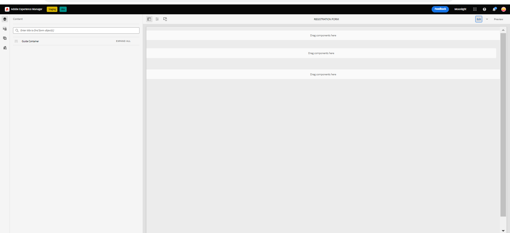

# 核心元件中的範例主題、範本和表單資料模型 {#sample-themes-templates-and-data-models}

AEM Formsas a Cloud Service提供幾個範例參考主題、範本和表單資料模型，可幫助您使用核心元件快速開始建立最適化Forms。 您可以 [啟用最適化Forms核心元件](https://experienceleague.adobe.com/docs/experience-manager-cloud-service/content/forms/setup-configure-migrate/enable-adaptive-forms-core-components.html) 在AEM Formsas a Cloud Service和本機開發環境中取得，以取得參考OOTB範本和 [使用和自訂主題](https://experienceleague.adobe.com/docs/experience-manager-cloud-service/content/forms/adaptive-forms-authoring/authoring-adaptive-forms-core-components/create-an-adaptive-form-on-forms-cs/using-themes-in-core-components.html) 在 [!DNL AEM Forms].

參考內容套件中包含的範例主題、範本和表單資料模型包括：

| 範本 | 主題 | 表單資料模型 |
---------|----------|---------
| 基本 | 畫布 | Microsoft® Dynamics 365 |
| 空白 | WKND | Salesforce |
| 聯絡我們 | 畫架 |  |
| 同意表單 | |  |
| 提出投訴 | | |
| 記錄服務要求 |  |  |
| 提供意見回饋 |  |  |
| 福利註冊 |  |   |
| 員工福利彙總 |   |   |
| 要求帳戶對帳單 |   |   |
| 聯絡詳細資料更新 |   |   |
| 安全檢查表 |   |   |
| 品質控制檢查 |   |   |
| 購買要求 |  |  |

## 範例主題 {#Sample-Themes}

參考主題可協助您定義表單的樣式，而不需要具備CSS的專業知識，即使您可以根據需求自訂主題。 您可以 [啟用最適化Forms核心元件](https://experienceleague.adobe.com/docs/experience-manager-cloud-service/content/forms/setup-configure-migrate/enable-adaptive-forms-core-components.html) 在AEM Formsas a Cloud Service和本機開發環境中，以取得這些主題的說明，如下所示：

### 畫布 {#Canvas}

「畫布」是「最適化Forms」的預設主題，強調使用基本顏色、透明度與平面圖示。 在下方熒幕擷圖中，您可以看到畫布布佈景主題的外觀。

### WKND {#WKND}

WKND主題體現了生動、富有想象力且吸引人的設計，以您的形式展現時尚的外觀。 主題是根據 [WKND網站](https://wknd.site/us/en.html) 這是一個旅遊和冒險網站，建立在 [Adobe Experience Manager核心元件](https://experienceleague.adobe.com/docs/experience-manager-core-components/using/introduction).

### 畫架 {#Easel}

畫架主題是指容易設定的特定範本設計型別，並且是經過自訂以簡化和方便使用。 畫架主題是以一個可攜式支架的概念為基礎，藝術家在創作畫作時可使用此支架來支援畫布。

## 範例範本 {#Sample-templates}

範本會定義要在您的表單中復寫的初始表單結構、內容和動作，或是使用與您的表單類似的範本結構，例如，同意表單、權益登錄檔單等等。 您可以透過以下方式取得下列範本 [啟用最適化Forms核心元件](https://experienceleague.adobe.com/docs/experience-manager-cloud-service/content/forms/setup-configure-migrate/enable-adaptive-forms-core-components.html) 在AEM Formsas a Cloud Service或本機開發環境中。 最適化Forms核心元件中的範本包括：

### 基本 {#Basic}

基本範本可幫助您快速建立註冊體驗表單。 您也可以用它來預覽最適化Forms核心元件的功能。 它提供精靈版面配置，用於逐節呈現資料。

>[!BEGINTABS]

>[!TAB 桌面]

    

>[!TAB 電話]

    

>[!TAB 平板電腦]

    

>[!ENDTABS]

### 空白 {#Blank}

空白畫布範本可用來從頭開始建立最適化表單結構、內容和規則。 未納入任何表單元件。

### 要求帳戶對帳單 {#Request-for-Account-Statement}

要求帳戶對帳單表單，以要求交易對帳單。 此陳述式提供財務交易、活動的詳細記錄，或有關個人的其他相關資訊。 完成此表單後，您就可以開始處理取得記錄的正確與最新對帳單。

### 連絡人詳細資料更新 {#Contact-Details-Update}

地址與連絡人詳細資料更新表單的設計目的，是要協助您更新與訂閱或權益相關的個人資訊，以確保順暢的通訊以及無中斷存取您收到的服務或權益。

### 安全檢查 {#Safety-Inspection}

「安全檢查表」用於維護安全的工作環境。 使用此表格進行定期檢查，即可識別潛在危險。 內容涵蓋各種層面，例如緊急出口、防火安全、電氣安全、危險材料、個人防護裝置、工作站人體工學等。 為員工、訪客和客戶的安全與福祉著想，並為所有人建立安全的環境。

### 購買要求 {#Purchase-Request}

採購請求表單，用於啟動採購程式，並允許員工正式請求採購其工作所需的貨品或服務。 此表單會擷取必要的明細，例如料號摘要、數量、偏好的供應商（如果適用）、預算配置、採購理由、交貨資訊以及必要的核准。 此表單的目的是簡化並記錄採購流程，確保適當的授權和追蹤請求的採購。

### 員工福利彙總 {#Employee-Benefits-Summary}

「員工福利彙總」表單可用來收集有關個人福利的重要詳細資訊。 它有助於快速準確地評估涵蓋範圍，提供有效協助和支援的完整概觀。

### 福利註冊 {#Benefits-Enrollment}

一種福利登錄檔單範本，可收集員工有關其偏好福利與承保選項的基本資訊。 它通常伴隨年度福利註冊期間。

### 品質控制檢查 {#Quality-Control-Inspection}

一種品質控制檢查表單，可評估並記錄產品或專案的視覺外觀、尺寸、功能、檔案、測試結果以及整體品質。 它有助於識別缺陷、不符合項以及確保符合品質標準所需的更正動作。

### 同意表單 {#Consent-Form}

同意書是法律檔案，在個人或參與者參與特定活動、研究研究、醫療程式或可能涉及其個人資訊或權利的任何情況之前，尋求獲得個人或參與者的自願和知情同意。 同意表單的目的是確保透明度、保護參與者的權利，並建立對個人同意內容的清楚瞭解。

### 聯絡我們 {#Contact-Us}

地址與連絡人詳細資料更新表單的設計目的，是要協助您更新與訂閱或權益相關的個人資訊，以確保順暢的通訊以及無中斷存取您收到的服務或權益。

### 記錄服務要求 {#Log-Service-Request}

記錄服務要求表單，可向服務提供者要求特定記錄服務。 此表單可作為正式請求，用於建立記錄特定事件、活動或資料以供監控或追蹤狀態的票證。

### 提供意見回饋 {#Give-Feedback}

「提供意見回饋」範本，可向另一個人或團隊提供建設性的意見回饋。 範本有助於確保意見反應清晰、具體、易於執行，促進開放式溝通和改進。

## 參考表單資料模型 {#reference-models}

最適化Forms然後可以與Microsoft®Dynamics 365和Salesforce伺服器互動，以啟用業務工作流程。 例如：

* 將資料寫入最適化表單提交的Microsoft®Dynamics 365和Salesforce。
* 透過「表單資料模型」中定義的自訂實體在Microsoft®Dynamics 365和Salesforce中寫入資料，反之亦然。
* 查詢Microsoft®Dynamics 365和Salesforce伺服器以取得資料，並預先填入Adaptive Forms。
* 從Microsoft® Dynamics 365和Salesforce伺服器讀取資料。

您可以透過安裝以下表單資料模型 [參考內容封裝](https://experience.adobe.com/#/downloads/content/software-distribution/en/aemcloud.html?package=/content/software-distribution/en/details.html/content/dam/aemcloud/public/aem-forms-reference-content.ui.content-2.1.0.zip)：

* Microsoft® Dynamics 365
* Salesforce

如需使用這些模型的詳細資訊，請參閱 [設定Microsoft® Dynamics 365和Salesforce雲端服務](https://experienceleague.adobe.com/docs/experience-manager-cloud-service/content/forms/integrate/use-form-data-model/configure-msdynamics-salesforce.html?lang=en#configure-dynamics-cloud-service)
