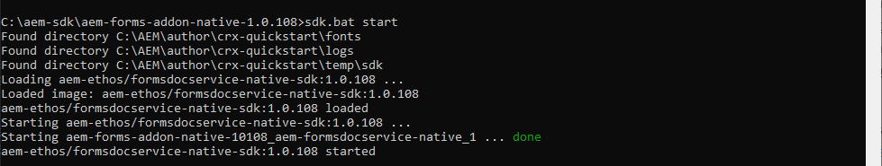

# 建立地方開發環境和初步開發項目 {#overview}

設定和配置 [!DNL  Adobe Experience Manager Forms] 作為 [!DNL  Cloud Service] 環境，您可以在雲上設定開發、試運行和生產環境。 此外，還可以設定和配置本地開發環境。

您可以使用本地開發環境執行以下操作而無需登錄到雲開發環境：

* [建立表單](creating-adaptive-form.md) 和相關資產（主題、模板、自定義提交操作等）
* [將PDF forms轉換為自適應Forms](https://experienceleague.adobe.com/docs/aem-forms-automated-conversion-service/using/convert-existing-forms-to-adaptive-forms.html)
* 生成要生成的應用程式 [客戶通信](aem-forms-cloud-service-communications-introduction.md) 按需或按批模式。

在本地開發實例或應用程式上準備好自適應表單或相關資產以生成 [客戶通信] 已準備好，您可以將Adaptive Form或Customer Communications應用程式從本地開發環境導出到Cloud Service環境，以便進一步測試或移動到生產環境。

您還可以在本地開發環境中開發和test自定義代碼，如自定義元件和預填充服務。 在測試並準備好自定義代碼後，您可以使用Cloud Service開發環境的Git儲存庫來部署自定義代碼。

要設定新的本地開發環境並使用它來開發活動，請按清單順序執行以下操作：

* [設定開發工具](#setup-development-tools-for-AEM-projects)

* [設定本地作者和發佈實例](#set-up-local-experience-manager-environment-for-development)

* [將Forms存檔添加到本地開發實例並配置用戶](#add-forms-archive-configure-users)

* [為微服務設定本地開發環境](#docker-microservices)

* [設定開發項目](#forms-cloud-service-local-development-environment)

* [設定本地調度程式工具](#setup-local-dispatcher-tools)

<!--
You can use the local development environment to create and test Adaptive Forms without connecting to the Cloud Service. [!DNL AEM Forms] provides an SDK to help test all the cloud-ready functionalities on the local development environment. When your forms and related assets are ready and tested on the local development environment, you can import these forms and related assets to an [!DNL AEM Forms] as a Cloud Service instance for publishing. 

You can also develop and test custom code like custom components and prefill service on the local development environment. When the custom code is tested and ready, you can use the Git repository of your [!DNL AEM Forms] as a Cloud Service development environment to deploy the custom code. 

>[!NOTE]
>
> Pre-pilot release does not support using an [!DNL AEM Forms] as a Cloud Service development instance to create forms. You can create forms, related assets, and custom code only on a local development environment.-->

<!--
You configure two types of development environments:

* **[!DNL AEM Forms] as a Cloud Service development environment:** Use the [[!DNL AEM Forms] as a Cloud Service](setup-forms-cloud-service.md) environment to store, manage, and publish Adaptive Forms and related assets. Do not use an [!DNL AEM Forms] as a Cloud Service environment to create Adaptive Forms and related assets <!--, form-centric workflows, a form data model, or to generate a Document of Record. -->

<!--
* **Local development environment:** You can use the local development environment to create and test Adaptive Forms without connecting to the service. Adobe provides a SDK for the local development to help test all the cloud-ready functionalities. 
Use a local development environment:
    
    * To create forms and related assets (themes, templates, custom Submit Actions, and more) and convert PDF forms to Adaptive Forms. After an Adaptive Form or related assets are ready on the local development instance, you can export the Adaptive Form and related assets from the local development environment to an [!DNL AEM Forms] as a Cloud Service development environment for publishing.  
    
    * To update configuration settings and develop and test custom code like custom components and prefill service. When the custom code is tested and ready, you can use the Git repository of your [!DNL AEM Forms] as a Cloud Service development environment to deploy the custom code.  

You can use the local development environment to create and test Adaptive Forms without connecting to the service. Adobe provides a SDK for the local development to help test all the cloud-ready functionalities. When your forms and related assets are ready and tested on the local development environment, you can import these forms and related assets to an [!DNL AEM Forms] as a Cloud Service instance for publishing. 

You can use the [development tools](https://experienceleague.adobe.com/docs/experience-manager-65/developing/devtools/dev-tools.html) to write custom code, customize or create new Adaptive Forms components, create a custom prefill service, or modify default configurations of an [!DNL AEM Forms] as a Cloud Service instance. 

-->

## 必備條件

您需要以下軟體來設定本地開發環境。 在開始設定本地開發環境之前，請先下載以下內容：

| 軟體 | 說明 | 下載連結 |
|---|---|---|
| Adobe Experience Manager as a Cloud ServiceSDK | SDK包括 [!DNL Adobe Experience Manager] 快速啟動和調度程式工具 | 從下載最新SDK [軟體分發](#software-distribution) |  |
| Adobe Experience Manager Forms功能存檔(AEM Forms附加模組) | 建立、設計和優化自適應Forms和其他Adobe Experience Manager Forms功能的工具 | 從 [軟體分發](#software-distribution) |
| （可選）Adobe Experience Manager Forms參考內容 | 建立、設計和優化自適應Forms和其他Adobe Experience Manager Forms功能的工具 | 從 [軟體分發](#software-distribution) |
| （可選）Adobe Experience Manager Forms設計師 | 建立、設計和優化自適應Forms和其他Adobe Experience Manager Forms功能的工具 | 從 [軟體分發](#software-distribution) |

### 從軟體分發下載最新版本的軟體 {#software-distribution}

要從以下位置下載最新版本的Adobe Experience Manager as a Cloud ServiceSDK、Experience Manager Forms功能歸檔(AEM Forms附件)、表單參考資產或Forms設計器 [軟體分發](https://experience.adobe.com/#/downloads/content/software-distribution/en/aemcloud.html):

1. 登錄到 <https://experience.adobe.com/#/downloads> 你的Adobe ID

   >[!NOTE]
   >
   > 您的Adobe組織必須設定AEMas a Cloud Service才能下載AEMas a Cloud ServiceSDK。

1. 導航到 **[!UICONTROL AEMas a Cloud Service]** 頁籤。
1. 按發佈日期按降序排序。
1. 按一下最新的Adobe Experience Manager as a Cloud ServiceSDK、Experience Manager Forms功能存檔(AEM Forms附件)、表單引用資產或Forms設計器。
1. 審閱並接受EULA。 點擊 **[!UICONTROL 下載]** 按鈕

## 設定項目開發工AEM具 {#setup-development-tools-for-AEM-projects}

Adobe Experience Manager Forms項目是自定義代碼庫。 它包含通過Cloud Manager部署到 [!DNL Adobe Experience Manager] as a Cloud Service。 的 [馬文AEM原型計畫](https://github.com/adobe/aem-project-archetype) 提供項目的基線結構。

設定以下開發工具以用於 [!DNL Adobe Experience Manager] 項目：

* [Java™](https://experienceleague.adobe.com/docs/experience-manager-learn/cloud-service/local-development-environment-set-up/development-tools.html?lang=en#local-development-environment-set-up)
* [蠢貨](https://experienceleague.adobe.com/docs/experience-manager-learn/cloud-service/local-development-environment-set-up/development-tools.html?lang=en#install-git)
* [節點.js(npm)](https://experienceleague.adobe.com/docs/experience-manager-learn/cloud-service/local-development-environment-set-up/development-tools.html?lang=en#node-js)
* [馬文](https://experienceleague.adobe.com/docs/experience-manager-learn/cloud-service/local-development-environment-set-up/development-tools.html?lang=en#install-maven)

有關設定前面提到的開發工具的詳細說明，請參見 [設定開發工具](https://experienceleague.adobe.com/docs/experience-manager-learn/cloud-service/local-development-environment-set-up/development-tools.html)。

## 建立地方Experience Manager發展環境

Cloud ServiceSDK提供QuickStart檔案。 它運行本地版本的Experience Manager。 您可以在本地運行「作者」(Author)或「發佈」(Publish)實例。

雖然QuickStart提供了本地開發體驗，但它並不具備以下所有功能： [!DNL Adobe Experience Manager] as a Cloud Service。 所以，始終test您的功能和代碼 [!DNL Adobe Experience Manager] as a Cloud Service開發環境，將功能移到舞台或生產。

要安裝和配置本地Experience Manager環境，請執行以下步驟：

* [下載和解壓](https://experience.adobe.com/#/downloads/content/software-distribution/en/aemcloud.html) 這樣 [!DNL Adobe Experience Manager] as a Cloud ServiceSDK
* [設定Author實例](https://experienceleague.adobe.com/docs/experience-manager-learn/cloud-service/local-development-environment-set-up/aem-runtime.html?lang=en#set-up-local-aem-author-service)
* [設定發佈實例](https://experienceleague.adobe.com/docs/experience-manager-learn/cloud-service/local-development-environment-set-up/aem-runtime.html?lang=en#set-up-local-aem-publish-service)

## 將Forms存檔添加到本地作者和發佈實例並配置特定於Forms的用戶 {#add-forms-archive-configure-users}

按列出順序執行以下步驟，將Forms存檔添加到Experience Manager實例並配置特定於表單的用戶：

### 安裝最新的Forms附加功能存檔 {#add-forms-archive}

Adobe Experience Manager Formsas a Cloud Service功能歸檔提供了在本地開發環境中建立、設計和優化Adaptive Diver的工具。 安裝軟體包以建立Adaptive Form並使用 [!DNL AEM Forms]。 要安裝軟體包：

1. 下載並解壓最新版本 [!DNL AEM Forms] 從 [軟體分發](https://experience.adobe.com/#/downloads/content/software-distribution/en/aemcloud.html)。

1. 導航到crx-quickstart/install目錄。 如果資料夾不存在，請建立它。

1. 停止AEM你的案例，放上 [!DNL AEM Forms] 附加功能存檔， `aem-forms-addon-<version>.far`，然後重新啟動實例。

### 配置用戶和權限 {#configure-users-and-permissions}

建立用戶，如表單開發者和表單實踐者和 [將這些用戶添加到預定義的表單組](https://experienceleague.adobe.com/docs/experience-manager-learn/cloud-service/accessing/aem-users-groups-and-permissions.html?lang=en#accessing) 提供所需的權限。 下表列出了每種表單用戶的所有類型和預定義的組：

| 用戶類型 | 組AEM |
|---|---|
| 窗體從業人員/ | [!DNL forms-users] (AEM Forms用戶), [!DNL template-authors]。 [!DNL workflow-users]。 [!DNL workflow-editors], [!DNL fdm-authors] |
| 窗體開發人員 | [!DNL forms-users] (AEM Forms用戶), [!DNL template-authors]。 [!DNL workflow-users]。 [!DNL workflow-editors], [!DNL fdm-authors] |
| 客戶體驗線索或UX設計器 | [!DNL forms-users], [!DNL template-authors] |
| AEM 管理員 | [!DNL aem-administrators]。 [!DNL fd-administrators] |
| 最終用戶 | 當用戶必須登錄才能查看和提交自適應表單時，請將這些用戶添加到 [!DNL forms-users] 組。 </br> 如果訪問Adaptive Forms不需要用戶身份驗證，則不要向此類用戶分配任何組。 |

<!--  

## Set up a local AEM instance for development

Perform the following steps in the listed order to set up and configure your local development environment:

1. **Set up an AEM author instance:** You require an author instance to create Adaptive Forms. Download and extract the latest AEM SDK archive. Run the quick start file in author run mode to set up an author instance. For detailed instructions, see [default local instance](https://experienceleague.adobe.com/docs/experience-manager-learn/cloud-service/local-development-environment-set-up/aem-runtime.html).  

1. **Install the latest [!DNL AEM Forms] add-on feature archive:** [!DNL AEM Forms] add-on feature archive provides tools to create, style, and optimize Adaptive Forms on the local development environment. Install the package to create an Adaptive Form and use various other features of [!DNL AEM Forms]. To install the package:

    1. Download and extract the latest [!DNL AEM Forms] archive for your operating system from [Software Distribution](https://experience.adobe.com/#/downloads/content/software-distribution/en/aemcloud.html).

    1. Navigate to the crx-quickstart/install directory. If the folder does not exist, create it.

    1. Stop your Cloud ready AEM instance, place the [!DNL AEM Forms] add-on feature archive, `aem-forms-addon-<version>.far`,  in the install folder, and restart the instance.

1. **Configure users and permissions:** Create users like Form Developer and Form Practitioner a nd add these users to pre-defined forms group to provide them required permissions. The table below lists all types of users and pre-defined groups for each type of forms users:
  
    | User Type | AEM Group |
    |---|---|
    | Form Practitioner  | forms-users (AEM Forms Users), template-authors  |
    | Form Developer | forms-users (AEM Forms Users), template-authors |
    | End-User| everyone* |

    `*` When a user should log in to access or submit Adaptive Forms, add such users to the everyone group.  -->

<!--    
### Set up an AEM project for the development tasks related to local AEM 6.5.5 Forms instance

Use this project to update configurations, create overlays, develop custom Adaptive Form components, and custom code using the local development environment. To set up the project:

1. **Install and configure Maven and set up an AEM project based on Apache Maven:** Apache Maven is an open-source tool for managing software projects. It helps automate builds and provides quality project information. It is the recommended build management tool for AEM projects. For detailed instructions to set up an AEM project based on Apache Maven, see [How to Build AEM Projects using Apache Maven](https://experienceleague.adobe.com/docs/experience-manager-65/developing/devtools/ht-projects-maven.html).

1. Configure the project to use [uber-jar](https://experienceleague.adobe.com/docs/experience-manager-65/release-notes/release-notes.html?lang=en#install-aem-forms-jee-installer) version 6.5.5 or later and [[!DNL AEM Forms] Client SDK](https://repo1.maven.org/maven2/com/adobe/aemfd/aemfd-client-sdk/) version 6.0.160 or later.  

1. **Set Up an Integrated Development Environment:**  Set up an IDE of your choice for development, see [Set Up an Integrated Development Environment](https://experienceleague.adobe.com/docs/experience-manager-learn/foundation/development/set-up-a-local-aem-development-environment.html#set-up-an-integrated-development-environment) for detailed instructions.
 -->

## 為記錄文檔設定本地開發環境(DoR){#docker-microservices}

AEM Forms作為Cloud Services，為記錄文檔的開發和使用其他微服務提供了基於文檔的SDK環境。 它使您無需手動配置特定於平台的二進位檔案和調整。 設定環境：

1. 安裝和配置Docker :

   * (用於Microsoft® Windows)安裝 [Docker案頭](https://www.docker.com/products/docker-desktop)。 它配置 `Docker Engine` 和 `docker-compose` 在你的機器上。

   * (ApplemacOS)安裝 [用於Mac的Docker台式機](https://hub.docker.com/editions/community/docker-ce-desktop-mac)。 它包括Docker引擎、Docker CLI客戶端、Docker合成、Docker內容信任、Kubernetes和Credential Helper。

   * （用於Linux®）安裝 [Docker引擎](https://docs.docker.com/engine/install/#server) 和 [多克撰寫](https://docs.docker.com/compose/install/) 在你的機器上。
   >[!NOTE]
   >
   > * 對於Apple·macOS，允許清單資料夾包含本地AEM作者實例。
   >
   > * Docker Desktop for Windows支援兩個後端，Hyper-V
      > (legacy)和WSL2(modern)。 檔案共用是自動的
      > 使用WSL2（現代）時由Docker管理。 你必須
      > 使用Hyper-V（舊版）時顯式配置檔案共用。


1. 建立與作者和發佈實例並行的資料夾（如aem-sdk）。 例如C:\aem-sdk。

1. 提取 `aem-forms-addon-<version>.zip\aem-forms-addon-native-<version>.zip` 的子菜單。

   

1. 建立環境變數AEM_HOME並指向本地AEM Author安裝。 例如C:\aem\author\。

1. 開啟sdk.bat或sdk.sh進行編輯。 將AEM_HOME設定為指向本地AEM Author安裝。 例如C:\aem\author\。

1. 開啟命令提示符並導航到 `aem-forms-addon-native-<version>` 的子菜單。

1. 確保本地AEM作者實例已啟動並正在運行。 運行以下命令以啟動SDK:

   * (在Microsoft® Windows上) `sdk.bat start`
   * (在Linux®或ApplemacOS上) `AEM_HOME=[local AEM Author installation] ./sdk.sh start`

   >[!NOTE]
   >
   > 如果在sdk.sh檔案中定義了環境變數，則在命令行中指定它是可選的。 提供在命令行上定義環境變數的選項以執行命令而不更新shell指令碼。

   

現在，您可以使用本地開發環境來呈現「記錄文檔」。 要test，請將XDP檔案上載到您的環境並呈現它。 比如說， <http://localhost:4502/libs/xfaforms/profiles/default.print.pdf?template=crx:///content/dam/formsanddocuments/cheque-request.xdp> 將XDP檔案轉換為PDF文檔。

## 基於Experience Manager原型的Forms開發工程 {#forms-cloud-service-local-development-environment}

使用此項目可在本地建立自適應Forms、部署配置更新、覆蓋、建立自定義自適應表單元件、test和自定義代碼 [!DNL Experience Manager Forms] SDK。 在本地測試後，您可以將項目部署到  [!DNL Experience Manager Forms] as a Cloud Service的生產和非生產環境。 部署項目時，還部署了以下AEM Forms資產：

| 主題 | 範本 | 表單資料模型 |
---------|----------|---------
| 畫布3.0 | 基本 | Microsoft® Dynamics 365 |
| 寧靜 | 空白 | Salesforce |
| 厄巴內 |  |  |
| 超海洋 |  |  |
| 貝里爾 |  |  |

>[!NOTE]
>
> 設定基AEM於Archetype版本30或更高版本的項目，以獲取和使用具有AEM Formsas a Cloud Service的Microsoft® Dynamics 365和Salesforce表單資料模型。
> 設定基AEM於原型版本32或更高版本的項目，以獲得和使用帶有AEM Formsas a Cloud Service的Tranquil、Urbane和Ultramarine主題。

要設定項目，請執行以下操作：

1. **在本地開發實例上克隆Cloud Manager Git儲存庫：**  您的Cloud Manager Git儲存庫包含預設AEM項目。 它基於 [原AEM型](https://github.com/adobe/aem-project-archetype/)。 使用Cloud Manager UI中的自助Git帳戶管理來克隆Cloud Manager Git儲存庫，以將項目帶到本地開發環境。 有關訪問儲存庫的詳細資訊，請參閱 [訪問儲存庫](https://experienceleague.adobe.com/docs/experience-manager-cloud-manager/using/managing-code/accessing-repos.html)。

<!-- 1. 
After the repository is cloned, [integrate your Git repo with Cloud Manager](https://experienceleague.adobe.com/docs/experience-manager-cloud-manager/using/managing-code/setup-cloud-manager-git-integration.html)

**Make cloned AEM project compatible with [!DNL AEM Forms] as a Cloud Service:** Remove uber-jar and other non-cloud dependencies from the pom.xml files of the project. You can refer the pom.xml files of the [sample AEM project](assets/FaaCSample.zip) for the list of required dependencies and update your AEM project accordingly. You can also refer [AEM Project Structure](https://experienceleague.adobe.com/docs/experience-manager-cloud-service/content/implementing/developing/aem-project-content-package-structure.html) to learn changes required to make an AEM project compatible with AEM as a Cloud Service.  -->

1. **建立 [!DNL Experience Manager Forms] 作為 [Cloud Service] 項目：** 建立 [!DNL Experience Manager Forms] 作為 [Cloud Service] 基於 [原型AEM32](https://github.com/adobe/aem-project-archetype/releases/tag/aem-project-archetype-32) 或稍後。 原型幫助開發人員輕鬆開始開發 [!DNL AEM Forms] as a Cloud Service。 它還包含一些示例主題和模板，幫助您快速啟動。

   開啟命令提示符並運行以下命令以建立 [!DNL Experience Manager Forms] as a Cloud Service項目。

   ```shell
   mvn -B archetype:generate -DarchetypeGroupId=com.adobe.aem -DarchetypeArtifactId=aem-project-archetype-DarchetypeVersion=32 -DaemVersion="cloud" -DappTitle="My Site" -DappId="mysite" -DgroupId="com.mysite" -DincludeFormsenrollment="y" -DincludeFormscommunications="y" -DincludeExamples="y"
   ```

   更改 `appTitle`。 `appId`, `groupId` 以反映您的環境。

   * 使用 `includeFormsenrollment=y` 選項，包括建立適應性Forms所需的Forms特定配置、主題、模板、核心元件和依賴項。 如果使用Forms門戶，請設定 `includeExamples=y` 的雙曲餘切值。 它為項目添加了Forms門戶核心元件。

   * 使用 `includeFormscommunications=y` 選項包括Forms核心元件和包括客戶通信功能所需的依賴項。

1. 將項目部署到您的本地開發環境。 可以使用以下命令部署到本地開發環境

   `mvn -PautoInstallPackage clean install`

   有關命令的完整清單，請參見 [構建和安裝](https://experienceleague.adobe.com/docs/experience-manager-core-components/using/developing/archetype/using.html?lang=en#building-and-installing)

1. [將代碼部署到 [!DNL AEM Forms] as a Cloud Service環境](https://experienceleague.adobe.com/docs/experience-manager-cloud-service/implementing/deploying/overview.html?lang=en#customer-releases)。

## 設定本地調度程式工具 {#setup-local-dispatcher-tools}

Dispatcher是Apache HTTP Web伺服器模組，在CDN和AEM發佈層之間提供安全性和效能層。 Dispatcher是整體Experience Manager體系結構的一個組成部分，應是本地開發環境的一部分。

執行以下步驟來配置本地Dispatcher，然後向其添加特定於Forms的規則：

### 設定本地調度程式 {#setup-local-dispatcher}

的 [!DNL Experience Manager] as a Cloud ServiceSDK包括推薦的Dispatcher Tools版本，它便於在本地配置、驗證和模擬Dispatcher。 Dispatcher Tools基於Docker，提供命令行工具，將Apache HTTP Web Server和Dispatcher配置檔案轉換為相容格式，並將其部署到在Docker容器中運行的Dispatcher。

在Dispatcher上快取允許 [!DNL AEM Forms] 在客戶端預填AdaptiveForms。 它提高了預填充表單的繪製速度。

有關設定Dispatcher的詳細說明，請參見 [設定本地調度程式工具](https://experienceleague.adobe.com/docs/experience-manager-learn/cloud-service/local-development-environment-set-up/dispatcher-tools.html?lang=en#local-development-environment-set-up)

### 將Forms特定規則添加到Dispatcher {#forms-specific-rules-to-dispatcher}

執行以下步驟為Experience Manager Formsas a Cloud Service配置Dispatcher快取：

1. 開啟AEM項目並導航至 `\src\conf.dispatcher.d\available_farms`
1. 建立 `default.farm` 的子菜單。 比如說， `forms.farm`。
1. 開啟新建立的 `forms.farm` 檔案以進行編輯並替換以下代碼：

   ```json
   #/ignoreUrlParams {
   #/0001 { /glob "*" /type "deny" }
   #/0002 { /glob "q" /type "allow" }
   #}
   ```

   替換為

   ```json
   /ignoreUrlParams {
   /0001 { /glob "*" /type "deny" }
   /0002 { /glob "dataRef" /type "allow" }
   }
   ```

1. 保存並關閉檔案。
1. 轉到 `conf.d/enabled_farms` 並建立指向 `forms.farm` 的子菜單。
1. 將項目編譯並部署到 [!DNL AEM Forms] as a Cloud Service環境。

### 快取的注意事項 {#considerations-about-caching}

* Dispatcher快取允許 [!DNL AEM Forms] 在客戶端預填AdaptiveForms。 它提高了預填充表單的繪製速度。
* 預設情況下，禁用快取安全內容功能。 要啟用該功能，可以執行 [快取安全內容](https://experienceleague.adobe.com/docs/experience-manager-dispatcher/using/configuring/permissions-cache.html?lang=en) 文章
* 調度程式無法使某些自適應Forms和相關自適應Forms失效。 要解決此類問題，請參閱 [[!DNL AEM Forms] 快取](troubleshooting-caching-performance.md) 中。
* 快取本地化自適應Forms:
   * 使用URL格式 `http://host:port/content/forms/af/<afName>.<locale>.html` 請求自適應表單的本地化版本，而不是 `http://host:port/content/forms/af/afName.html?afAcceptLang=<locale>`
   * 預設情況下，瀏覽器區域設定選項處於禁用狀態。 要更改瀏覽器區域設定，
* 使用URL格式時 `http://host:port/content/forms/af/<adaptivefName>.html`，並且禁用了配置管理器中的「使用瀏覽器區域設定」，則會提供自適應表單的非本地化版本。 非本地化語言是開發自適應表單時使用的語言。 不考慮為瀏覽器配置的區域設定（瀏覽器區域設定），並提供自適應表單的非本地化版本。
* 使用URL格式時 `http://host:port/content/forms/af/<adaptivefName>.html`，並啟用配置管理器中的「使用瀏覽器區域設定」，則提供自適應表單的本地化版本（如果可用）。 本地化的「自適應表單」的語言基於為瀏覽器配置的區域設定（瀏覽器區域設定）。 它會導致 [僅快取自適應表單的第一個實例]。 要防止在實例上發生問題，請參閱 [只快取自適應表單的第一個實例](troubleshooting-caching-performance.md) 中。

您的本地開發環境已準備就緒。

## 升級您的本地開發環境 {#upgrade-your-local-development-environment}

將SDK升級到新版本需要替換整個本地開發環境，從而導致本地儲存庫中的所有代碼、配置和內容丟失。 確保任何不應銷毀的代碼、配置或內容都安全提交到Git，或從本地Experience Manager實例導出為CRX-Packages。

### 如何避免升級SDK時丟失內容 {#avoid-content-loss-when-upgrading--SDK}

升級SDK實際上是建立全新的「作者」和「發佈」實例，包括新的儲存庫([設定項AEM目](#forms-cloud-service-local-development-environment))，表示對先前SDK的儲存庫所做的任何更改都將丟失。 有關幫助在SDK升級之間保留內容的可行策略，請參見 [如何避免升級SDK時的內AEM容丟失](https://experienceleague.adobe.com/docs/experience-manager-learn/cloud-service/local-development-environment-set-up/aem-runtime.html?lang=en#optional-local-aem-runtime-set-up-tasks)

<!--When you update any  Forms-specifc configuration, create overlays, develop custom Adaptive Form components, or develop and test any custom code in AEM project for the development tasks related to local development instance, use the AEM project cloned from the Cloud Manager Git repository to [deploy the custom code and other changes to your [!DNL AEM Forms] as a Cloud Service's production or non-production environment](https://video.tv.adobe.com/v/30191?quality=9).

## Upgrade your local development environment {#update-local-setup}

Update the local AEM setup (AEM SDK) to latest version at least monthly on, or shortly after, the last Thursday of each month, which is the release cadence for AEM as a Cloud Service "feature releases". You can download local AEM SDK from [Software Distribution](https://experience.adobe.com/#/downloads/content/software-distribution/en/aemcloud.html).

Updating the AEM SDK to a new version requires replacing the entire local development environment, resulting in a loss of all code, configuration and content in the local AEM repositories. Ensure that any code, config or content that should not be destroyed is safely committed to Git, or exported from the local AEM instance as AEM Packages.

### How to avoid content loss when upgrading the AEM SDK {#avoid-content-loss-when-upgrading--AEM-SDK}

Upgrading the AEM SDK is effectively creating a brand new AEM runtime ([Set up a local AEM instance](setup-forms-cloud-service.md)), including a new repository ([Set up AEM project](#forms-cloud-service-local-development-environment)), meaning any changes made to a prior AEM SDK's repository are lost. The following are viable strategies for aiding in persisting content between AEM SDK upgrades, and can be used discretely or in concert:

1. Create a content package dedicated to containing the sample content to aid in development and maintain it in Git. Any content that should be persisted through AEM SDK upgrades would be persisted into this package and re-deployed after upgrading the AEM SDK.
1. Use [oak-upgrade](https://jackrabbit.apache.org/oak/docs/migration.html) with the `includepaths` directive, to copy content from the prior AEM SDK repository to the new AEM SDK repository.
1. Back up any content using AEM Package Manager and content packages on the prior AEM SDK and re-install them on the new AEM SDK.

Remember, using the above approaches to maintain code between AEM SDK upgrades, indicates a development anti-pattern. Non-disposable code should originate in your Development IDE and flow into AEM SDK via deployments.

For information about troubleshooting, stopping local AEM environment, run modes, and deployment, see [Set up local AEM Runtime](https://experienceleague.adobe.com/docs/experience-manager-learn/cloud-service/local-development-environment-set-up/aem-runtime.html#local-development-environment-set-up).-->

### 將特定於Forms的內容備份並導入到新的SDK環境 {#backup-and-import-Forms-specific-content-to-new-SDK-environment}

要將資產從現有SDK備份並移動到新SDK環境，請執行以下操作：

* 建立現有內容的備份。

* 設定新的SDK環境。

* 將備份導入新SDK環境。

### 建立現有內容的備份 {#create-backup-of-your-existing-content}

備份AdaptiveForms、模板、表單資料模型、主題、配置和自定義代碼。 您可以執行以下操作來建立備份：

1. [下載](import-export-forms-templates.md#manage-forms-and-related-assets) 適應性Forms、主題和PDF forms。
1. 導出自適應表單模板。

1. 下載表單資料模型

1. 導出可編輯模板、雲配置和工作流模型。 要從現有SDK導出所有先前提及的項，請建立 [CRX軟體包](https://experienceleague.adobe.com/docs/experience-manager-cloud-service/implementing/deploying/overview.html) 使用以下篩選器：

   * /conf/ReferenceEditableTemplates
   * /conf/global/settings/cloudconfigs
   * /conf/global/settings/wcm
   * /var/workflow/models
   * /conf/global/settings/workflow
1. 從您的本地開發環境中導出電子郵件配置、提交和預填充操作代碼。 要導出這些設定和配置，請在本地開發環境中建立以下資料夾和檔案的副本：

   * `[Archetype Project in Cloud Service Git]/core/src/main/java/com/<program name>/core/service`
   * `[Archetype Project in Cloud Service Git] /core/src/main/java/com/<program name>/core/servlets/FileAttachmentServlet.java`
   * `[Archetype Project in Cloud Service Git]/ui.apps/src/main/content/jcr_root/apps/<program name>/config`

### 將備份導入新SDK環境 {#import-the-backup-to-your-new-SDK-environment}

將自適應Forms、模板、表單資料模型、主題、配置和自定義代碼導入到您的新環境。 您可以執行以下操作來導入備份：

1. [導入](import-export-forms-templates.md#manage-forms-and-related-assets) 適應新SDK環境的Forms、主題和PDF forms。
1. 將自適應表單模板導入新SDK環境。

1. 將表單資料模型上載到新SDK環境。

1. 導入可編輯模板、雲配置和工作流模型。 要導入新SDK環境中之前提及的所有項，請將包含這些項的CRX-Package導入新SDK環境。

1. 從本地開發環境導入電子郵件配置、提交和預填充操作代碼。 要導入這些設定和配置，請將下列檔案從舊的Archetype項目放置到新的Archetype項目：

   * `[Archetype Project in Cloud Service Git]/core/src/main/java/com/<program name>/core/service`
   * `[Archetype Project in Cloud Service Git] /core/src/main/java/com/<program name>/core/servlets/FileAttachmentServlet.java`
   * `[Archetype Project in Cloud Service Git]/ui.apps/src/main/content/jcr_root/apps/<program name>/config`

您的新環境現在具有舊環境的形式和相關資產。
