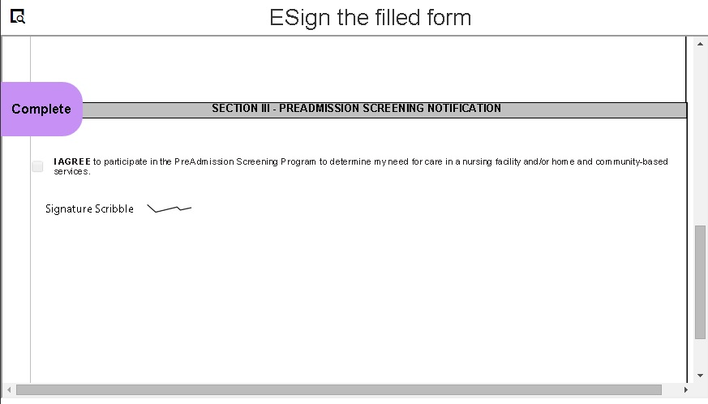

# 使用手寫簽名將電子簽名應用於表單{#apply-electronic-signatures-to-a-form-using-deprecated-scribble-signatures}

您可以使用 **Scribble簽名** 元件和 **簽名步驟** 要在自適應表單上繪製(Scribble)簽名的元件。 「簽名」步驟元件顯示自適應表單的PDF版本。 您需要啟用「記錄文檔」選項或基於表單模板的自適應Forms才能使用「簽名」步驟元件。

這兩個元件都提供了一個窗口，如下所示，用於簽署表單。 也可按一下地理位置表徵圖  將地理位置添加到簽名中。

## 配置自適應表單以使用Scribble簽名 {#configure-an-adaptive-form-to-use-scribble-signature}

1. 建立啟用「記錄文檔」選項或基於表單模板的自適應表單。 有關逐步資訊，請參見 [建立自適應窗體](creating-adaptive-form.md)。
1. 拖放 **Scribble簽名** 元件從元件瀏覽器到自適應表單。
1. 點擊 **配置**  表徵圖 它開啟屬性瀏覽器並顯示Scribble簽名元件的屬性。 配置Scribble簽名元件的屬性。
1. 將「簽名步驟」元件從元件瀏覽器拖放到「自適應表單」中。

   >[!NOTE]
   >
   >「簽名步驟」元件佔用表單的全寬。 建議在包含簽名步驟元件的部分上不使用任何其他元件。

1. 在內容瀏覽器中，點擊 **窗體容器**，然後按一下 **配置**  表徵圖 它開啟屬性瀏覽器並顯示「自適應表單」容器屬性。 導航到 **自適應窗體容器** > **電子簽名** 取消選擇 **啟用Adobe Sign** 的雙曲餘切值。 點擊完成  表徵圖。

   >[!NOTE]
   >
   >將簽名步驟元件添加到自適應表單時，將自動選擇啟用Adobe Sign選項。

1. 點擊 **配置**  表徵圖 它開啟屬性瀏覽器並顯示簽名步驟屬性。 配置以下屬性：

   * **元素名稱**:指定元件的名稱。

   * **標題：** 指定元件的唯一標題。
   * **模板消息：** 指定在載入簽名PDF時要顯示的消息。 Adobe Sign服務需要一些時間來準備和載入簽名PDF。
   * **簽名服務：** 選擇 **Scribble簽名** 的雙曲餘切值。

   * **CSS類**:指定客戶端庫的CSS類（如果有）。 建議使用 [主題](themes.md) 和 [內線樣式](inline-style-adaptive-forms.md) 而不是CSS類。

   點擊完成  表徵圖。 已成功配置簽名。

   現在，當您填寫表單時，將顯示自適應表單的PDF版本，並提供對PDF文檔進行簽名的選項。 有關詳細資訊，請參見 [使用Scribble簽名對自適應表單簽名](signing-forms-using-scribble.md#sign-an-adaptive-form-using-scribble-signature)。

## 使用Scribble簽名對自適應表單簽名 {#sign-an-adaptive-form-using-scribble-signature}

1. 填寫「自適應表單」並訪問「簽名步驟」頁後，將顯示簽名螢幕。

   

1. 按一下 **[!UICONTROL 簽名]**。 出現「Scribble sign（塗寫符號）」對話框。 簽名表單，然後按一下「完成」  表徵圖以保存簽名。

   

1. 按一下「完成」以完成簽名過程。

   

簽名將添加到表單中，表單控制項將移到下一個面板。

