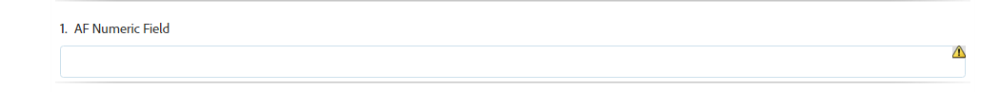

# 同步適用性Forms與XFA表單範本{#synchronizing-adaptive-forms-with-xfa-form-templates}

## 簡介 {#introduction}

您可以根據XFA表單範本建立最適化表單( `*.XDP` 檔案)。 此重複使用可讓您保留對現有XFA表單的投資。 如需如何使用XFA表單範本建立最適化表單的相關資訊， [根據範本建立最適化表單](creating-adaptive-form.md).

您可以在適用性表單中重複使用XDP檔案中的欄位。 這些欄位稱為二進位欄位。 系統會從XDP檔案複製二進位欄位的屬性（例如指令碼、標籤和顯示格式）。 您也可以選擇覆寫其中某些屬性的值。

[!DNL AEM Forms] 提供可協助您讓適用性Forms的欄位與後續對XDP檔案中對應欄位所做的任何變更保持同步。 本文說明如何啟用此同步。

在 [!DNL AEM Forms] 製作環境中，您可以將欄位從XFA表單（左）拖曳至最適化表單（右）

## 必備條件 {#prerequisites}

若要使用本文中的資訊，建議您熟悉下列方面：

* [建立最適化表單](creating-adaptive-form.md)

* XFA(XML Forms架構)

若要使用文章中的範例提供的資產，請下載範例套件，如下一節所述。 [範例套件](synchronizing-adaptive-forms-xfa.md#p-sample-package-p).

## 範例套件 {#sample-package}

文章透過範例來示範如何將適用性表單與更新的XFA表單範本同步。 範例中使用的資產可在套件中取得，可從 [下載](synchronizing-adaptive-forms-xfa.md#p-downloads-p) 一節。

上傳套件後，您可以在 [!DNL AEM Forms] UI。

使用套件管理器安裝套件： `https://<server>:<port>/crx/packmgr/index.jsp`

套件包含下列資產：

1. `sample-form.xdp`:作為範例的XFA表單範本

1. `sample-xfa-af`:以sample-form.xdp檔案為基礎的適用性表單。 不過，此適用性表單不包含任何欄位。 在下一個步驟中，我們會將內容新增至此最適化表單。

### 將內容新增至最適化表單 {#add-content-to-adaptive-form-br}

1. 導覽至https://&lt;server>:&lt;port>/aem/forms.html。 如有詢問，請輸入您的憑據。
1. 開啟sample-af-xfa以在製作模式中編輯。
1. 從側欄的「內容」瀏覽器中，選擇「資料模型對象」頁簽。 將NumericField1和TextField1拖曳至最適化表單。
1. 將NumericField1的標題從 **數值欄位** to **AF數值欄位。**

>[!NOTE]
>
>在上述步驟中，我們覆寫了XDP檔案中欄位的屬性。 因此，如果稍後修改XDP檔案中的對應屬性，則不會同步此屬性。

## 偵測XDP檔案中的變更 {#detecting-changes-in-xdp-file}

每當XDP檔案或片段有任何變更時， [!DNL AEM Forms] UI會根據XDP檔案或片段來標幟所有適用性Forms。

更新XDP檔案後，您需要在 [!DNL AEM Forms] 要標籤的變更的UI。

例如，請讓我們更新 `sample-form.xdp` 檔案時，請依下列步驟執行：

1. 導覽至 `https://<server>:<port>/projects.html.` 如果出現提示，請輸入您的憑證。
1. 按一下左側的Forms標籤。
1. 下載 `sample-form.xdp` 檔案。 XDP檔案會以 `.zip` 檔案，可使用任何檔案解壓縮公用程式來擷取。

1. 開啟 `sample-form.xdp` 檔案，並將欄位TextField1的標題從 **文字欄位** to **我的文字欄位**.

1. 上傳 `sample-form.xdp` 檔案 [!DNL AEM Forms] UI。

如果XDP檔案更新，當您根據XDP檔案編輯適用性Forms時，會在編輯器中看到圖示。 此圖示表示適用性表單與XDP檔案不同步。 在下圖中，查看側欄中旁邊的表徵圖。

## 將適用性Forms與最新XDP檔案同步 {#synchronizing-adaptive-forms-with-the-latest-xdp-file}

下次開啟與XDP檔案不同步的適用性表單進行製作時，會顯示下列訊息： **更新適用性表單的結構/表單範本。 `Click Here` 以新版本重新建立基礎。**

按一下訊息會同步適用性表單中的欄位與XDP檔案中的對應欄位。

針對本文所用的範例，請開啟 `sample-xfa-af` 在製作模式中。 訊息會顯示在最適化表單底部。

### 更新屬性 {#updating-the-properties}

除了由作者明確覆寫適用性表單（在元件對話方塊中）中的屬性外，所有從XDP檔案複製到適用性表單的屬性都會更新。 已更新的屬性清單可在伺服器記錄中取得。

若要更新範例適用性表單中的屬性，請按一下連結(標示為 `"Click Here"`)。 TextField1的標題從 **文字欄位** to **我的文字欄位**.

>[!NOTE]
>
>未更改標籤AF數值欄位，因為您已在元件屬性對話框中覆蓋此屬性，如 [新增內容至適用性Forms](synchronizing-adaptive-forms-xfa.md#p-add-content-to-adaptive-form-br-p).

### 從XDP檔案新增欄位至最適化表單   {#adding-new-fields-from-xdp-file-to-adaptive-form-nbsp}

任何稍後新增至原始XDP檔案的欄位都會顯示在「表單階層」索引標籤中，您可以將這些新欄位拖曳至「適用性表單」。

您不需要按一下錯誤訊息中的連結，即可更新「表單階層」索引標籤中的欄位。

### XDP檔案中已刪除的欄位 {#deleted-fields-in-xdp-file}

如果先前複製到適用性表單的欄位從XDP檔案中刪除，製作模式中會顯示錯誤訊息，指出XDP檔案中不存在該欄位。 在這種情況下，請手動從適用性表單中刪除欄位或清除 `bindRef` 屬性。

下列步驟將說明本文所用範例中資產的使用流程：

1. 更新 `sample-form.xdp` 檔案並刪除NumericField1。
1. 上傳 `sample-form.xdp` 檔案 [!DNL AEM Forms] UI
1. 開啟 `sample-xfa-af` 製作適用性表單。 將顯示以下錯誤消息：更新適用性表單的結構/表單範本。 `Click Here` 以新版本重新建立基礎。

1. 按一下連結(標示為「 `Click Here`&quot;)。 系統會顯示錯誤訊息，指出XDP檔案中已不存在該欄位。

已刪除的欄位也會以圖示標示，以指出欄位中的錯誤。

>[!NOTE]
>
>適用性表單中綁定錯誤（無效）的欄位 `bindRef` 值)也視為已刪除欄位。 如果作者未修正這些錯誤並發佈最適化表單，欄位會視為一般未結結束的最適化表單欄位，並包含在輸出XML檔案的未結束區段中。

## 下載 {#downloads}

本文範例的內容套件

[取得檔案](assets/sample-xfa-af-sync-1.0.zip)
