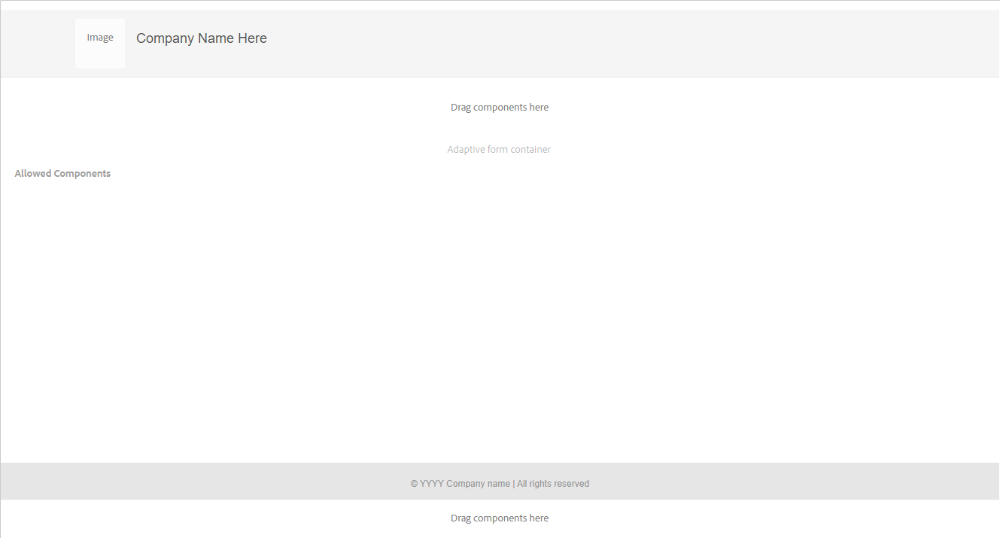

# 建立最適化表單範本 {#adaptive-form-templates}

製作表單時，您會新增欄位和元件，以在編輯器中定義表單結構、內容和動作。 您可以在 `guideRootPanel` 表單容器。 使用範本編輯器，您可以建立範本，其中包含作者可用來建立表單的基本結構和初始內容。

例如，您希望所有表單作者在註冊表單中都有特定的文本框、導航按鈕和提交按鈕。 您可以使用作者可用來建立與其他註冊表單一致的表單的元件來建立模板。 當作者使用範本建立適用性表單時，新表單會繼承您在範本中指定的結構和元件。 範本編輯器可讓您：

* 在結構層中添加表單的頁眉和頁腳元件。
* 提供表單的初始內容。
* 指定主題「提交操作」。

您可以下載並安裝 [!DNL AEM Forms] 參考內容套件 [Software Distribution](https://experience.adobe.com/#/downloads/content/software-distribution/en/aemcloud.html) 入口網站，將參考主題和範本匯入環境。

## 使用範本 {#working-with-templates}

您可以導覽至 **[!UICONTROL Adobe Experience Manager]** > **[!UICONTROL 工具]** > **[!UICONTROL 一般]** > **[!UICONTROL 範本]**. 在此，範本會組織在可編輯範本啟用的資料夾中。

Experience Manager提供用於組織模板的全局資料夾。 但預設不會啟用。 您可以請管理員啟用全域資料夾或建立範本的資料夾。 有關如何建立資料夾的詳細資訊，請參閱 [範本資料夾](https://experienceleague.adobe.com/docs/experience-manager-cloud-service/sites/authoring/features/templates.html#editing-templates-template-authors).

### 建立範本 {#create-template}

建立資料夾後，開啟資料夾並執行下列步驟以建立範本：

1. 點選 **[!UICONTROL 建立]** 在您建立的資料夾內。
1. 在「選擇模板類型」部分中，選擇 **[!UICONTROL 適用性表單範本]** 點選 **[!UICONTROL 下一個]**.

1. 在「範本詳細資料」區段中，提供範本標題並點選 **[!UICONTROL 建立]**.
您也可以提供說明。

1. 點選 **[!UICONTROL 完成]** 返回控制台，或點選 **[!UICONTROL 開啟]** 以在編輯器中開啟範本。

### 範本編輯器UI {#template-editor-ui}

開啟範本進行編輯時，您會看到下列AEM Editor元件：

* **頁面工具列**
包含下列選項：

   * **切換側面板**:讓您顯示或隱藏側欄。
   * **頁面資訊**:可讓您指定資訊，例如發佈/取消發佈時間、縮圖、用戶端程式庫、頁面原則，以及頁面設計用戶端程式庫。

   <!-- * **Emulator**: Lets you simulate and customize the look for different devices.-->
   * **模式選擇器：** 可讓您變更模式。
您可以選擇 **[!UICONTROL 結構]** 模式， **[!UICONTROL 初始內容]**, **[!UICONTROL 版面控制]** 模式。 結構模式可讓您新增及自訂頁首與頁尾。 「初始內容」模式可讓您自訂表單內容。
   * **預覽：** 可讓您預覽範本在您發佈時的外觀。 您可以使用「圖層選擇器」和「預覽」切換編輯和預覽模式。
* **側欄：** 提供內容、屬性、資產和元件瀏覽器。
* **元件工具欄：** 選取元件時，您會看到可自訂元件的工具列。
* **頁面**:新增內容以建立範本的區域。

<!-- See [Introduction to authoring Adaptive Forms](introduction-forms-authoring.md) to understand the Touch UI editor. -->

### 編輯範本 {#editing-a-template}

使用兩個層建立最適化表單範本：

* 結構
* 初始內容

圖層選擇器位於螢幕右上角的「預覽」選項旁。

### 結構 {#structure}

在「範本編輯器」中選取結構層時，您可以在「最適化表單容器」的上下看到版面容器。 作者可將這些版面容器用於頁首和頁尾。 您可以新增、編輯或自訂頁首與頁尾。 將「適用性表單標題」元件拖放至「適用性表單容器」上方的版面容器，以自訂範本標題。 將「適用性表單頁尾」元件拖放至「適用性表單容器」下方的版面容器，以自訂範本頁尾。

結構層中的佈局容器

**答：** 頁首元件的佈局容器 **B.** 頁尾元件的版面容器

將「最適化表單標題」元件拖放至「最適化表單容器」上方的版面容器中。 新增元件後，您可以指定其屬性，讓您新增標誌並提供標題。

同樣地，當您拖放頁尾元件至「適用性表單容器」下方的版面容器時，可以提供版權資訊和公司詳細資訊。

在「結構」層中添加頁首和頁尾

#### 在結構層中鎖定/解鎖元件 {#locking-unlocking-components-in-the-structure-layer}

當您編輯已選取結構層的範本時，可以解除鎖定範本的頁首和頁尾。 如果元件在範本中解除鎖定，表單作者可以在使用範本的適用性表單中編輯元件。 鎖定元件會防止表單作者在最適化表單中編輯元件。 元件工具欄中提供「鎖定」選項。

例如，您可在範本中新增標題元件。 選取元件時，可在元件工具列中看到鎖定選項。 標題通常包含公司名稱和標誌，您不希望表單作者變更範本中的標誌和標題。 在使用範本建立的已鎖定標題元件適用性表單中，表單作者無法變更標誌和公司名稱。

>[!NOTE]
>
>不建議單獨鎖定或解鎖頁首元件中的影像或徽標。 您可以解除鎖定標題元件。

### 初始內容 {#initial-content}

選取「初始內容」選項時，範本的「最適化表單容器」會像「最適化表單」一樣開啟以供編輯。 與編寫最適化表單一樣，您可以指定初始設定，例如選取主題和提交動作。

表單作者可以用它來建立表單。 內容流結構是在範本的「初始內容」層中指定。 若要切換到編輯表單範本的初始內容，請在「頁面」工具列中的「預覽」之前，點選  **>** **[!UICONTROL 初始內容]**.

在「初始內容」層，您會建立作者以為基礎的最適化表單範本。 製作範本與製作表單類似，您可以使用側欄中的可用選項。 側欄提供內容、屬性、資產和元件瀏覽器。

<!-- See [Sidebar](introduction-forms-authoring.md#sidebar). -->

>[!NOTE]
>
>選擇「儲存內容」或「儲存PDF」作為「提交操作」時，您將獲得指定「儲存」路徑的選項。 如果您在範本中指定路徑，則從該範本建立的所有表單都會有相同的路徑。 您可以指定正確的儲存路徑，或確保表單作者更新該路徑，以防止每個表單的資料儲存在同一位置。

#### 建立具有標籤和面板的最適化表單範本 {#creating-an-adaptive-form-template-with-tabs-and-panels-nbsp}

例如，您想要建立包含下列標籤的範本：

* 一般資訊
* 專業資訊

您已在結構層中新增標誌、提供標題，並新增頁尾。 鎖定頁首和頁尾，讓表單作者在使用範本建立表單時，無法加以編輯。

將圖層從「結構」變更為「初始內容」，然後開始將內容新增至表單。 要建立頁簽結構，請在「適用性表單」容器的guideRootPanel中添加子面板。 若要新增面板：

* 您可以點選 **[!UICONTROL +]** 按鈕 **[!UICONTROL 拖曳元件至此]** 選項。

* 您可以從側欄的元件瀏覽器拖放面板元件。
* 您可以新增 `guideRootPanel` （從元件工具欄）。

要建立「一般資訊」和「專業資訊」頁簽，請在的子面板中添加兩個面板 `guideRootPanel`. 選取面板並點選  來開啟側欄中的屬性。 將元素名稱變更為 `general-info` 和 `professional-info`，並分別命名為一般資訊及專業資訊。 在側欄中，點選內容以開啟內容瀏覽器。 在「表單對象」頁簽中，選擇 `guideRootPanel`. 在編輯器中，選取了guideRootPanel。 點選  （在元件工具欄中）以開啟其屬性。 在「面板配置」欄位中，選取 **[!UICONTROL 頁簽]** 點選 **[!UICONTROL 完成]**. 頁簽模板結構被應用。

#### 在索引標籤中新增內容 {#adding-content-in-tabs}

新增面板並將它們建構為標籤後，您就可以在標籤內新增欄位。 在編輯器中選取索引標籤時，您可以看到 **[!UICONTROL 拖曳元件至此]** 選項。 您可以拖放元件，例如文字方塊、清單項目和按鈕。 您可以從側欄的元件瀏覽器拖放元件。

每個元件都具有增強資料擷取和操作的屬性。 例如，您可以啟用 **[!UICONTROL 必填欄位]** 元件的屬性。 作者可以指定客戶略過填寫必要欄位時看到的訊息。 指定 **[!UICONTROL 必填欄位訊息]** 屬性。

在示例模板中，「一般資訊」頁簽中添加了「名稱」、「電話號碼」和「出生日期」欄位。 在「專業資訊」頁簽中，添加了「當前雇傭」、「雇傭類型」、「教育資格」欄位。

新增欄位後，您可以新增「提交」和「重設」等按鈕。

### 啟用範本 {#enabling-the-template}

建立範本時，會將其新增為草稿。 啟用範本，以便用於建立適用性Forms。 啟用模板：

1. 導覽至 **[!UICONTROL Adobe Experience Manager]** > **[!UICONTROL 工具]** > **[!UICONTROL 範本]**，並開啟您建立範本的資料夾。

1. 已建立的模板標籤為「草稿」。
1. 選取範本並點選 **[!UICONTROL 啟用]** 的下一頁。
當您建立適用性表單時，會看到系統要求您選擇範本時列出的範本。

## 匯入或匯出範本 {#importing-or-exporting-a-template}

表單可與其範本搭配使用。 下載使用自訂範本建立的適用性表單時，不會下載範本。 當您在不同的 [!DNL AEM Forms] 例項，則會匯入而不含其範本。 如果已匯入表單但其範本無法使用，則不會轉譯表單。 您可以封裝自訂範本，方法為 `/conf` 節點 `https://<server>:<port>/crx/packmgr`，並將其插入 [!DNL AEM Forms] 要上傳表單的例項。 您也可以 [使用AEM原型建立範本，並將其部署至您的Cloud Services例項](https://experienceleague.adobe.com/docs/experience-manager-learn/getting-started-wknd-tutorial-develop/pages-templates.html#prerequisites).

## 使用範本建立最適化表單 {#creating-an-adaptive-form-using-the-template}

建立並啟用範本後，當您建立最適化表單時，可在Forms Manager中使用範本。 若要使用範本並建立最適化表單，請參閱 [建立最適化表單](creating-adaptive-form.md).

<!--
## Change display option of out of the box templates  {#change-display-option-of-out-of-the-box-templates}

You can create custom templates for Adaptive Forms to define basic structure and initial content. [!DNL AEM Forms] also provides a set of out of the box template for Adaptive Forms. You can choose to show or hide the templates.

Perform the following steps to show and hide templates:

1. Log in to [!DNL AEM Forms] author instance and navigate to **[!UICONTROL Tools]** &gt; **[!UICONTROL Operations]** &gt; **[!UICONTROL Web Console]**.

   >[!NOTE]
   >
   >The URL of AEM web console is https://'[server]:[port]'/system/console/configMgr

1. Locate and open the **FormsManager Configuration** settings:

    * To show or hide out of the box Adaptive Forms template, check or uncheck the **Include Out of the box AF and AD Templates** option.
    * To show or hide out of the box Adaptive Form templates that were added in AEM 6.0 Forms or AEM 6.1 Forms releases but are now deprecated, check or uncheck the **Include AEM 6.0 AF Templates** option. If this option is checked, in order to take effect, it requires the **Include Out of the box AF and AD Templates** configuration to be enabled.

1. Click **Save**. The display options for the out of the box templates are changed. -->

## 建議 {#recommendations}

* 在模板編輯器中修改表單的屬性時，請勿使用BindReference屬性。
* 如果要添加斷點，請在編寫適用性表單模板時建立斷點。
有關斷點的詳細資訊，請參閱 [回應式版面](https://experienceleague.adobe.com/docs/experience-manager-cloud-service/sites/authoring/features/responsive-layout.html#authoring).
