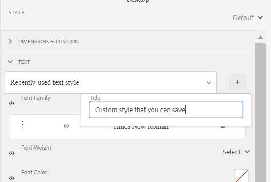
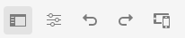

# 建立和使用主題 {#creating-and-using-themes}

您可以建立並套用主題，使最適化表單風格化<!-- or an interactive communication-->. 主題包含元件和面板的樣式詳細資料。 樣式包括背景顏色、狀態顏色、透明度、對齊方式和大小等屬性。 應用主題時，指定的樣式會反映在相應的元件上。 主題可獨立管理，不需參考適用性表單<!-- or interactive communication -->.

您可以下載並安裝 [!DNL AEM Forms] 參考內容套件 [Software Distribution](https://experience.adobe.com/#/downloads/content/software-distribution/en/aemcloud.html) 入口網站，將參考主題和範本匯入環境。

## 建立、下載或上傳主題 {#creating-downloading-or-uploading-a-theme}

主題會建立並儲存為個別實體，並包含中繼屬性，例如適用性Forms。 它可重複使用多個適用性Forms中的主題<!-- or  and interactive communications-->. 您也可以將主題移至不同的例項並重複使用。

### 建立主題 {#creating-a-theme}

要建立主題：

1. 按一下 **[!UICONTROL Adobe Experience Manager]**，按一下 **[!UICONTROL Forms]**，然後按一下 **[!UICONTROL 主題]**.

1. 在主題頁中，按一下 **[!UICONTROL 建立]** > **[!UICONTROL 主題]**.
啟動建立主題的精靈。

1. 指定 **[!UICONTROL 名稱]** 主題。

1. 指定表單以預覽 **[!UICONTROL 此主題的預設預覽]** 欄位。 按一下 **[!UICONTROL 使用預設值]** 以使用預設表單來預覽主題。

1. 指定 **[!UICONTROL 組態容器]**. 您可以選擇 **[!UICONTROL 組態容器]** 包含帳戶Adobe字型的設定詳細資訊。 您也可以暫時將選項保留為空白，並稍後從 [主題屬性](#metadata-of-a-theme).

1. 按一下 **[!UICONTROL 建立]** 然後按一下 **[!UICONTROL 編輯]** 在主題編輯器中開啟主題，或按一下 **[!UICONTROL 完成]** 返回主題頁。

### 與Experience Manager6.5 Forms及舊版主題的差異 {#difference-in-themes}

在Cloud Service實例上建立的主題：

* 有2版。

* 儲存於 `/content/dam/formsanddocuments-themes/<theme-name>/`

* 不提供客戶端庫選項。 不能指定客戶端庫類別和路徑。

* 對/apps位置沒有寫入和更新權限(Forms使用者群組沒有對/apps位置的寫入和更新權限)。

* 上傳在上建立的主題之前 [!DNL Experience Manager Forms] 6.5或舊版至Cloud Service例項，請確定用戶端程式庫位置設為 `etc/clientlibs/fd/themes`. 如果客戶端庫不存在於 `etc` 資料夾，手動將位置更新至 `etc/clientlibs/fd/themes`.  您可以對 [!DNL Experience Manager Forms] 6.5或舊版例項。 設定客戶端庫的位置後，管理員可以將主題上載到Cloud Service實例，或使用「內容轉移工具」將主題從6.5或舊版實例遷移到Cloud Service實例。

   另請變更類別的名稱。 如果名稱未變更，則會發生錯誤 `theme with same category name exists` 可能發生。 變更類別名稱時，不會影響使用主題的適用性Forms。

### 下載主題 {#downloading-a-theme}

您可以將主題匯出為zip檔案，並在其他專案或Experience Manager例項中使用這些主題。 若要下載主題：

1. 按一下 **[!UICONTROL Adobe Experience Manager]**，按一下 **[!UICONTROL Forms]**，然後按一下 **[!UICONTROL 主題]**.

1. 在主題頁中， **[!UICONTROL 選擇]** 主題，然後按一下 **[!UICONTROL 下載]**. 此時將顯示一個對話框，其中包含主題的詳細資訊。

1. 按一下 **[!UICONTROL 下載]**. 主題會以zip檔案的形式下載。

>[!NOTE]
>
>如果您下載的主題具有與其相關聯的適用性表單，且相關聯的適用性表單是以自訂範本為基礎，則也請下載自訂範本。 上傳下載的主題和最適化表單時，也要上傳相關的自訂範本。

### 上傳主題 {#uploading-a-theme}

具有管理員權限的使用者可以上傳在 [!DNL Experience Manager Forms] 6.5或更舊版本。

上傳主題：

1. 按一下 **[!UICONTROL Adobe Experience Manager]**，按一下 **[!UICONTROL Forms]**，然後按一下 **[!UICONTROL 主題]**.

1. 在主題頁中，按一下 **[!UICONTROL 建立]** > **[!UICONTROL 檔案上傳]**.
1. 在「檔案上傳」提示中，瀏覽並選擇電腦上的主題包，然後按一下 **[!UICONTROL 上傳]**.
已上傳的主題可在主題頁面中使用。

## 主題元資料 {#metadata-of-a-theme}

主題的元屬性清單（可在主題的屬性頁面中找到）。

<table>
 <tbody>
  <tr>
   <th>
<strong>ID</strong>
 
 
 </th>
   <th><strong>名稱</strong></th>
   <th><strong>可編輯</strong></th>
   <th><strong>屬性說明</strong></th>
  </tr>
  <tr>
   <td>1.</td>
   <td>標題</td>
   <td>是</td>
   <td>顯示主題的名稱。</td>
  </tr>
  <tr>
   <td>2.</td>
   <td>說明</td>
   <td>是</td>
   <td>主題說明。</td>
  </tr>
  <tr>
   <td>3.</td>
   <td>類型</td>
   <td>否</td>
   <td>
    <ul>
     <li>資產類型。</li>
     <li>值總是主題。</li>
    </ul> </td>
  </tr>
  <tr>
   <td>4.</td>
   <td>建立日期</td>
   <td>否</td>
   <td>主題建立日期</td>
  </tr>
  <tr>
   <td>5.</td>
   <td>作者名稱</td>
   <td>是</td>
   <td>主題的作者。 在主題建立時計算。</td>
  </tr>
  <tr>
   <td>6.</td>
   <td>上次修改日期</td>
   <td>否</td>
   <td>上次修改主題的日期。</td>
  </tr>
  <tr>
   <td>7.</td>
   <td>狀態</td>
   <td>否</td>
   <td>主題的狀態（已修改/已發佈）。</td>
  </tr>
  <tr>
   <td>8.</td>
   <td>準時發佈</td>
   <td>是</td>
   <td>自動發佈主題的時間。</td>
  </tr>
  <tr>
   <td>9.</td>
   <td>發佈關閉時間</td>
   <td>是</td>
   <td>自動取消發佈主題的時間。</td>
  </tr>
  <tr>
   <td>10.</td>
   <td>標記</td>
   <td>是</td>
   <td>附加到主題的標籤，用於改進搜索。</td>
  </tr>
  <!-- <tr>
   <td>11.</td>
   <td>References</td>
   <td>Links</td>
   <td>
    <ul>
     <li>Contains 'Referred by' section. Lists forms that use the theme.</li>
     <li>Since the theme does not refer to any other asset, there is no 'Refers' section.</li>
    </ul> </td>
  </tr>
   <tr>
   <td>12.</td>
   <td>Clientlib Location</td>
   <td>Yes</td>
   <td>
    <ul>
     <li>The user-defined repository path within '/etc' where the clientlibs corresponding to this theme are stored.</li>
     <li>Default value - '/etc/clientlibs/fd/themes' + relative path of theme asset.</li>
     <li>If the location does not exist, the folder hierarchy is auto-generated.</li>
     <li>When this value is changed, the clientlib node structure is moved to the new location entered.  <em><strong>Note:</strong> If you change default clientlib location, in the CRXDE repository assign <code>crx:replicate, rep:write, rep:glob:*, rep:itemNames:: js.txt, jcr:read </code>to <code>forms-users</code> and <code>crx:replicate</code>, <code>jcr:read </code>to <code>fd-service</code> in the new location. Also attach another ACL by adding <code>deny jcr:addChildNodes</code> for <code>forms-user</code></em></li>
    </ul> </td>
  </tr> 
  <tr>
   <td>13.</td>
   <td>Clientlib Category Name</td>
   <td>Yes</td>
   <td>
    <ul>
     <li>The user-defined clientlib category name for this theme.</li>
     <li>An error is displayed if the name is already in use by some other existing theme.</li>
     <li>Default value - computed using theme location.</li>
     <li>When this value is changed, the category name is updated on the corresponding clientlib node. Updating Clientlib Category Name in the jsp files is not required because clientlib category name is used by reference.</li>
    </ul> </td>
  </tr> -->
 </tbody>
</table>

## 關於主題編輯器 {#about-the-theme-editor}

主題編輯器是商業使用者和網頁設計人員/開發人員友好的介面，提供指定各種最適化表單樣式所需的功能 <!-- and interactive communication --> 元素。 當您建立主題時，主題會儲存為單獨的實體，如表單 <!--  , interactive communications, letters, document fragments, and data dictionaries-->.

主題編輯器可讓您自訂主題中已設定樣式的元件樣式。 您可以自訂表單 <!-- or interactive communication --> 在裝置上看。

主題編輯器分為兩個面板：

* **畫布**  — 顯示在右側。 它會顯示範例適用性表單 <!--  or interactive communication --> 所有樣式變更都會立即反映。 您也可以直接從畫布選取物件，以尋找與物件相關聯的樣式，並編輯這些樣式。 頂部的設備解析度標尺控制畫布。 從標尺中選擇解析斷點可顯示示例表單的預覽 <!--  or interactive communication --> 決議。 畫布會詳加討論 [low](themes.md#using-canvas).

* **側欄** — 顯示在左側。 它有下列項目：

   * **選取器：** 顯示為樣式選擇的元件及其可設定樣式的屬性。 選取器代表類型的所有元件。 如果在主題中為樣式選擇文本框元件，則窗體中的所有文本框 <!-- or interactive communication --> 繼承樣式。 選取器可讓您選取一般元件或樣式的特定元件。 例如，欄位元件是一般元件，文字方塊是特定元件。

      **樣式通用元件：**
欄位可以是數值方塊欄位（如年齡），或文字方塊欄位（如地址）。
當您設定欄位樣式時，所有欄位（如年齡、名稱、地址）都會設定樣式。

      **樣式特定元件**:特定元件會影響特定類別的對象。 在主題中設定數字框元件的樣式時，只有中的數字框對象會繼承樣式。

      例如，文本框欄位（如地址）較長，數字框欄位（如年齡）較短。 您可以選取數值方塊欄位、縮短欄位長度，然後套用至您的表單。 所有數字方塊欄位的寬度會以您的形式縮小。

      使用特定背景顏色自訂所有欄位元件時，所有欄位（如年齡、名稱和地址）都會繼承背景顏色。 選擇數字框（如年齡）並減小其寬度時，所有數字框（如年齡）的寬度、家庭中的人數都會減少。 文本框的寬度未更改。

   * **狀態：** 可讓您自訂特定狀態中物件的樣式。 例如，您可以在對象處於預設、焦點、禁用、暫留或錯誤狀態時指定對象的外觀。
   * **屬性類別：** 樣式屬性會分為不同類別。 例如「Dimension與位置」、「文字」、「背景」、「邊框」和「效果」。 在每個類別下，您提供樣式資訊。 例如，在「背景」下，可以提供「背景顏色」、「影像和漸層」。

   * **進階：** 可讓您新增自訂CSS至物件，以覆寫有重疊時視覺控制項定義的屬性。

   * **檢視CSS**:可讓您檢視所選元件的CSS。
   此外，在側欄底部會顯示箭頭。 按一下箭頭時，您還會看到兩個選項： **模擬成功** 和 **模擬錯誤。** 詳細討論這些選項以及上述選項 [low](themes.md#using-rail).

 **答：** 側欄 **B.** 畫布

### 樣式元件 {#styling-components}

您可以在多個適用性Forms中使用主題<!-- and interactive communications -->，會匯入您在主題中指定的元件格式。 您可以設定各種元件的樣式，例如標題、說明、面板、欄位、圖示和文字方塊。 使用小工具集在主題中配置元件屬性。 雖然「CSS覆寫」區段可讓您編寫CSS程式碼或提供自訂選取器，但您並不需要CSS或LESS的先前知識。 當您在側欄中選取元件時，「CSS覆蓋」區段便會出現。

邊欄中的選項，可讓您選取不同元件並設定其樣式。

對側欄中的元件按一下「編輯」按鈕，可在畫布中選取元件，並讓您使用側欄中的選項來設定元件的樣式。

文字方塊、數值方塊、選項按鈕和核取方塊等特定元件會分類在「欄位」等一般元件下。 例如，您要自訂選項按鈕的樣式。 要選擇樣式的單選按鈕，請選擇 **[!UICONTROL 欄位]** > **[!UICONTROL 介面工具集]** > **[!UICONTROL 選項按鈕]**.

### 樣式面板佈局 {#styling-panel-layouts-br}

主題 [!DNL AEM Forms] 支援表單中面板版面中元素的樣式<!-- and  interactive communications -->. 支援現成可用配置和自訂配置中的元素樣式。

現成可用的面板包括：

* 左側的索引標籤
* 索引標籤在頂端
* 折疊式面板
* 回應式
* 精靈
* 行動版面

   * 標題中的面板標題
   * 標題中沒有面板標題

每個版面的選取器不同。
來自主題編輯器的樣式自訂配置涉及：

* 定義可設定樣式的版面的元件，以及可唯一識別這些元件的CSS選取器。
* 定義可套用在這些元件上的CSS屬性。
* 從使用者介面以互動方式定義這些元件的樣式。

### 不同螢幕大小的不同樣式 {#different-styles-for-different-screen-sizes-br}

案頭和行動版面的樣式可能稍有或完全不同。 對於行動裝置，平板電腦和手機共用的版面與元件大小不同。

使用主題編輯器斷點為不同螢幕大小定義替代樣式。 您可以選取開始建立主題的基本裝置或解析度，並自動產生其他解析度的樣式變數。 您可以明確修改所有解析度的樣式。

>[!NOTE]
>
>主題是使用表單首次建立<!-- or interactive communication-->，然後套用至不同的表單<!-- or interactive communications-->. 主題建立中使用的斷點可以與窗體不同 <!-- or interactive communication --> 主題。 CSS媒體查詢是以表單為基礎 <!-- or interactive communication --> 用於主題建立，而不是窗體 <!-- or interactive communication --> 主題。

### 樣式屬性在選擇對象時在側欄中上下文更改 {#styling-properties-context-changes-in-sidebar-on-selecting-objects}

在畫布中選取元件時，其樣式屬性會列在側欄中。 選取物件類型及其狀態，然後提供其樣式。

### 主題編輯器中最近使用的樣式 {#recently-used-styles-in-theme-editor}

主題編輯器快取套用至元件的最多10種樣式。 您可以將快取樣式與主題的其他元件搭配使用。 最近使用的樣式位於側欄中所選元件的正下方，作為清單框。 最初，最近使用的樣式清單為空。

設定元件的樣式時，樣式會快取並列在清單方塊中。 在此示例中，文本框的標籤已設定樣式以更改字型大小和顏色。 您可以依照類似步驟選擇影像或變更顏色以設定元件樣式。 當欄位標籤樣式變更時，觀察樣式快取和列在清單方塊中的方式。

在此範例中，欄位標籤的樣式已變更，而為樣式選取「回應式面板說明」時，資產資料庫中會新增清單項目。 資產資料庫中的項目可用來變更回應式面板說明的樣式。

在資產庫中新增樣式時，可供其他主題和 [樣式模式](inline-style-adaptive-forms.md) 的下一頁。 同樣地，當您使用表單編輯器的樣式模式時 <!-- or interactive communication editor --> 使用者介面設定元件的樣式，會快取樣式，並可在主題中使用。

資產資料庫的加號按鈕可讓您以您提供的名稱永久儲存樣式。 即使您未按一下側邊欄中的「儲存」按鈕將樣式套用至元件，加號按鈕仍會儲存樣式。 樣式模式中不提供保存樣式以供以後使用的加號按鈕。

當您為樣式提供自訂名稱時，樣式會系結至主題，而不再適用於其他主題。 要刪除保存的樣式：

1. 在畫布工具列上，按一下 **[!UICONTROL 主題選項]**  > **[!UICONTROL 管理樣式]**.
1. 在管理樣式對話方塊中，選取儲存的樣式，按一下 **[!UICONTROL 刪除]**.

   

### 即時預覽、儲存和捨棄變更 {#live-preview-save-and-discard-changes}

樣式中所做的修改會立即反映在表單中 <!-- or interactive communication --> 已載入畫布中。 即時預覽可讓您以互動方式定義及查看樣式的影響。 變更元件的樣式時， **[!UICONTROL 完成]** 按鈕。 若要保留變更，請使用 **[!UICONTROL 完成]** 按鈕。

>[!NOTE]
>
>在欄位中輸入無效字元時，欄位邊界顏色會變成紅色，而畫面左上角會顯示錯誤訊息。 例如，如果您在文字方塊中輸入字母，該文字方塊接受數值字元作為輸入，則輸入方塊邊界顏色會變更為紅色。 若要儲存此類主題，您必須解決顯示在畫面中央底部的錯誤。

### 具有其他最適化表單的主題 {#theme-with-another-adaptive-form}

當您建立主題時，會使用主題編輯器附帶的表單建立主題。 您在此表單中提供元件的樣式。 您可以選取表單，而不是主題編輯器隨附的表單 <!-- or interactive communication --> 提供樣式並預覽其結果的選項。

替換當前窗體或 <!-- interactive communication --> 在主題編輯器畫布中：

1. 在「主題編輯器」面板中，按一下 **[!UICONTROL 主題選項]**  > **[!UICONTROL 設定]**.

1. 在「常規」頁簽中，瀏覽並選擇表單 <!-- or interactive communication --> 針對 **[!UICONTROL 適用性表單]** 欄位。

### 重做/還原 {#redo-undo}

您可以還原或重做意外發生的不適當變更。 在畫布中使用重做/還原按鈕。

在主題編輯器中設定元件樣式時，重做/還原按鈕會出現。

## 使用主題編輯器 {#using-the-theme-editor}

主題編輯器可讓您編輯您建立或上傳的主題。 導覽至 **[!UICONTROL Forms與檔案]** > **[!UICONTROL 主題]**，然後選取主題並開啟它。 主題在主題編輯器中開啟。

如上所述，主題編輯器有兩個面板：側欄和畫布。

在主題編輯器中自訂文字方塊Widget元件的成功狀態樣式。 元件在畫布中選取，其狀態在側欄中選取。 側欄中可用的樣式選項可用於自訂元件的外觀。

### 使用畫布 {#using-canvas}

主題是使用現成可用的表單建立，或使用表單 <!-- or interactive communication --> 你自己選擇的。 畫布會顯示表單或 <!-- interactive communication --> 用於建立主題，並在主題中指定自定義項。 表單上方的尺標用於根據裝置的顯示大小決定版面。

在畫布工具列中，您會看到：

* **[!UICONTROL 切換側面板]** :讓您顯示或隱藏側欄。
* **[!UICONTROL 主題選項]** :提供三個選項

   * 配置：提供選擇預覽表單的選項 <!-- or interactive communication , base clientlib, -->和Adobe Fonts設定。
   * 查看主題CSS:為所選主題生成CSS。
   * 管理樣式：提供管理文字和影像樣式的選項
   * 說明：執行主題編輯器的影像引導導覽。

* **[!UICONTROL 模擬器]** :模擬不同顯示大小的主題外觀。 在模擬器中，顯示大小被視為斷點。 可以選擇斷點並為其指定樣式。 例如，案頭和平板電腦是兩個中斷點。 可以為每個斷點指定不同的樣式。

在畫布中選取元件時，元件工具列上方會顯示該元件。 元件工具列可讓您選取元件或切換至一般元件。 例如，您可在面板中選取數值文字方塊。 您會在元件工具列中看到下列選項：

* **[!UICONTROL 數值框Widget]**:可讓您選取元件以自訂側欄的外觀。
* **[!UICONTROL 欄位介面工具集]**:可讓您選取樣式的一般元件。 在此示例中，為樣式選擇所有文本輸入元件（文本框/數字框/數字步進器/日期輸入）。

* :可讓您選取樣式的父元件。 如果您選取數值方塊並點選此圖示，則會選取欄位元件。 如果您選取欄位元件並點選此圖示，則會選取面板。 如果您繼續點選此圖示以進行選取，最後會選取樣式的版面。

>[!NOTE]
>
>元件工具列中可用的選項會根據您選取的元件而有所不同。

### 使用側欄 {#using-rail}

主題編輯器中的側欄提供可自訂主題中元件的樣式和使用選擇器的選項。 選取器可讓您選取一組元件或個別元件，並可在側邊欄中搜尋選取器。 您可以為自訂元件編寫選取器。

當您從側欄的畫布或選取器中選取元件時，側欄會顯示所有選項，讓您自訂元件的樣式。
以下是選取元件時，您在側邊欄中看到的選項：

* 狀態
* 屬性表
* 模擬錯誤/成功

#### 狀態 {#state}

狀態是使用者與元件互動的指標。 例如，當使用者在文字方塊中輸入錯誤資料時，文字方塊的狀態會變更為錯誤狀態。 主題編輯器可讓您指定特定狀態的樣式。

自訂狀態樣式的選項會因元件而異。

#### 屬性表 {#property-sheet}

<table>
 <tbody>
  <tr>
   <td><strong>屬性</strong></td>
   <td><strong>使用</strong></td>
  </tr>
  <tr>
   <td>
尺寸及位置
 </td>
   <td>
可讓您設定主題中元件的對齊方式、大小、位置和放置方式。 
 
您的選項包括顯示設定、邊框間距、邊距、寬度、高度和Z索引。
 
您也可以使用簡單的拖放介面，使用「配置」模式來定義元件寬度。 如需詳細資訊，請參閱 <a href="resize-using-layout-mode.md">使用「版面」模式調整元件大小</a>.
 </td>
  </tr>
  <tr>
   <td>
文字
 </td>
   <td>
可讓您自訂主題元件中的文字樣式。
 
例如，您要更改在文本框中輸入的文本的外觀。
 
您的選項包括字型系列、粗細、顏色、大小、行高、文本對齊、字母間距、文本縮進、下划線、斜體、文本轉換、垂直對齊、基線和方向。 
 </td>
  </tr>
  <tr>
   <td>
背景 
 </td>
   <td>
可讓您以影像或顏色填入元件的背景。 
 </td>
  </tr>
  <tr>
   <td>
邊框
 </td>
   <td>
可讓您選擇元件的邊框外觀。 例如，您希望文字方塊有深紅色的粗邊，並有虛線。 
 
選項包括邊框的寬度、樣式、半徑和顏色。
 </td>
  </tr>
  <tr>
   <td>
效果
 </td>
   <td>
可讓您為元件添加特殊效果，如不透明度、混合模式和陰影。 
 </td>
  </tr>
  <tr>
   <td>
進階
 </td>
   <td>
可讓您新增：

    <ul>
     <li>的屬性 <code>::before</code> 和 <code>::after</code> 在選取器的預設內容之後或之前新增內容，並設定其樣式的偽元素。  請參閱 <a href="https://www.w3schools.com/css/css_pseudo_elements.asp" target="_blank">CSS偽元素</a>.</li>
     <li>自訂CSS程式碼內嵌至元件。</li>
    </ul> 
新增自訂CSS程式碼時，會覆寫您使用側邊欄中的選項新增的自訂。 
 </td>
  </tr>
 </tbody>
</table>

#### 模擬錯誤/成功 {#simulate-error-success}

模擬錯誤和成功選項位於側欄底部。 您可以使用側欄底部顯示的顯示/隱藏箭頭來查看它們。 使用主題編輯器，您可以設定元件的各種狀態樣式。

例如，您在表單中新增數值欄位，並在主題編輯器中指定其樣式。 當用戶在欄位中鍵入字母數字值時，您希望文本框的背景顏色更改。 您可以在主題中選取數值欄位，然後在側欄中使用狀態選項。 在側欄中選取「錯誤」狀態，然後將背景顏色變更為紅色。 若要預覽行為，您可以使用側邊欄中的「模擬錯誤」選項。 「模擬錯誤」和「成功」選項的詳細說明如下：

* **模擬成功**:如果您為成功狀態指定其樣式，可讓您查看元件的外觀。 例如，在表單中，客戶設定密碼。 用戶可以根據您提供的准則設定密碼。 當使用者依照您提供的所有准則輸入密碼時，文字方塊會變成綠色。 文字方塊變成綠色時，就會處於成功狀態。 您可以為處於成功狀態的元件指定樣式，並使用「模擬成功」選項來模擬其外觀。

* **模擬錯誤**:如果您為錯誤狀態指定其樣式，可讓您查看元件的外觀。 例如，在表單中，客戶設定密碼。 用戶可以根據您提供的准則設定密碼。 當用戶鍵入的密碼不符合您提供的所有准則時，文本框將變為紅色。 文字方塊變成紅色時，會處於錯誤狀態。 您可以為處於錯誤狀態的元件指定樣式，並使用「模擬錯誤」選項來模擬其外觀。

### 元件的樣式 {#styling-a-component}

例如，在您的表單中，您有兩種文字方塊：僅接受數值，而接受英數字值的。 您可以為僅接受數值的文字方塊（數值方塊）自訂樣式。

要自定義特定元件的樣式（本示例中為數值框），請執行以下步驟：

1. 在主題編輯器中，在畫布中選取數值方塊。
1. 選取數值方塊時，您會看到包含三個選項的元件工具列：

   * **[!UICONTROL 數值方塊Widget]**
   * **[!UICONTROL 欄位Widget]**

1. 選擇 **[!UICONTROL 數值框Widget]**.
1. 側欄標題變更為「數值框小部件」，並顯示自定義其外觀的選項。
使用 **[!UICONTROL Dimension與位置]** 選項，以自訂元件的大小。 確保國家 **[!UICONTROL 預設]**.

而不是選取 **[!UICONTROL 數值框Widget]**，選取 **[!UICONTROL 欄位介面工具集]** 在元件工具列中，並執行上述步驟。 為選擇維時 **[!UICONTROL 欄位介面工具集]** 選項，則除數字框外的所有文本框都具有相同大小。

### 指定狀態的樣式欄位 {#styling-fields-given-state}

使用元件工具欄，還可以為元件的不同狀態指定元件的樣式。 例如，如果元件已停用，則會處於停用狀態。 在主題編輯器中可設定樣式的元件的常用狀態為：預設、焦點、停用、錯誤、成功和暫留。 您可以在畫布中選取元件，然後使用側邊欄中的狀態選項來自訂其外觀。

要為特定狀態的元件定制樣式，請執行以下步驟：

1. 在畫布中選取元件，然後從元件工具列中選取適當的選項。
側欄顯示可自訂元件樣式的選項。
1. 在側欄中選取狀態。 例如，錯誤狀態。
1. 使用選項，例如 **[!UICONTROL 邊框，背景]** 來自訂元件的外觀。
1. 使用 **[!UICONTROL 模擬錯誤]** 選項，查看樣式在編輯中的外觀。

在指定元件狀態後自訂元件的樣式時，只會針對指定狀態顯示元件的自訂。 例如，如果您在選取暫留狀態時自訂元件的樣式。 當您在呈現的表單中將指標移至元件上時，系統會針對元件顯示自訂 <!-- or interactive communication --> 來應用主題。

若要模擬錯誤和成功以外的狀態行為，請使用「預覽」模式。 若要使用預覽模式，請按一下 **[!UICONTROL 預覽]** 中。

### 小型顯示器的樣式配置 {#styling-layouts-for-smaller-displays}

在畫布中使用尺標可為顯示較小的設備選擇斷點。 按一下模擬器  在畫布中查看尺標和斷點。 斷點可讓您預覽表單 <!-- or interactive communication --> 針對與不同裝置（例如手機和平板電腦）相關的顯示大小。 主題編輯器支援多種顯示大小。

要為不同斷點設定元件樣式：

1. 在畫布中，在標尺上方選擇斷點。
斷點表示移動設備及其顯示大小。
1. 使用邊欄來自訂表單的樣式 <!-- or interactive communication --> 元件（在主題中）。
1. 確保已儲存自訂。

您可以設定表單樣式 <!-- or interactive communication --> 元件。 表單 <!-- and interactive communication --> 案頭和行動裝置的元件可能有完全不同的樣式。

### 在主題中使用Web Fonts {#using-web-fonts-in-a-theme}

您現在可以使用適用性表單中Web服務中可用的字型 <!-- or interactive communication -->. 現成可用， [Adobe Fonts](https://fonts.adobe.com/)，則Adobe的網頁字型服務可作為設定使用。 若要使用Adobe Fonts，請建立套件、在其中新增字型，然後從取得套件ID [Adobe Fonts](https://fonts.adobe.com/).

若要在Experience Manager中設定Adobe Fonts，請執行下列步驟：

1. 在製作例項中，按一下 **[!UICONTROL Adobe Experience Manager ]**>**[!UICONTROL &#x200B;工具&#x200B;]** >**[!UICONTROL &#x200B;部署&#x200B;]**>**[!UICONTROL  Cloud Services ]**.
1. 在 **[!UICONTROL Cloud Services]** 頁面，導覽至並開啟 **[!UICONTROL Adobe Fonts]** 選項。 開啟設定資料夾，然後按一下 **[!UICONTROL 建立]**.
1. 在 **[!UICONTROL 建立配置]** 對話框，指定配置的標題，然後按一下 **[!UICONTROL 建立]**.

   系統會將您重新導向至設定頁面。

1. 在出現的「編輯元件」對話框中，提供您的套件ID，然後按一下 **[!UICONTROL 確定]**.

若要設定主題以使用Adobe Fonts設定，請執行下列步驟：

1. 在製作例項上，在主題編輯器中開啟主題。
1. 在主題編輯器中，導覽至 **[!UICONTROL 主題選項]**  > **[!UICONTROL 設定]**.
1. 在 **[!UICONTROL Adobe Fonts設定]** 欄位，選擇套件，然後按一下 **[!UICONTROL 儲存]**.

   現在，您可以看到這些字型已添加到主題的font-family屬性中。

<!-- >
### Listing and selecting fonts in theme editor {#listing-and-selecting-fonts-in-theme-editor}

You can use the theme configuration service to add more fonts to the theme editor. Perform the following steps to add fonts:

1. Log in to Experience Manager Web Console with administrative privileges. URL for the Experience Manager Web Console is `https://'[server]:[port]'/system/console/configMgr`.
1. Open **[!UICONTROL Adaptive Form Theme Configuration Service]**.

   

1. Click +, specify the name of the font, and click **Save**. The font is added and available in theme editor. -->

#### 在主題編輯器中選擇字型 {#selecting-fonts-in-theme-editor}

您可以使用+按鈕來新增字型。 新增字型時，會列在側欄中。

除了主題配置選項之外，您還可以從主題編輯器本身添加字型。 在側欄下方的字型系列欄位中輸入您要使用的字型，然後在鍵盤上按回車鍵。

選取字型時，該字型會新增在字型系列清單下。 您可以使用主題編輯器中的「遮色片」選項來停用或啟用列出的字型。

您可以看到元件字型變更。

「字型系列」欄位支援多種字型。 輸入字型時，瀏覽器會尋找字型並將其套用至選取的元件。 如果瀏覽器找不到字型，它會在系列中查找該字型旁邊的字型。 首先，您可以輸入要尋找的特定字型。 如果找不到要使用的字型，可以在族中鍵入通用字型並使用它。

#### 主題編輯器中套用的遮色片樣式 {#mask-styles-applied-in-theme-editor}

您可以遮罩主題中套用的樣式。 在主題編輯器側欄中，您可以使用 表徵圖禁用應用樣式。 例如，如果更改窗體中元件的尺寸 <!-- or interactive communication -->，則可以使用屬性左側的遮罩按鈕加以停用。 保存主題時，將保留所選掩碼選項。

以下範例顯示主題中的遮罩和未遮罩樣式。

## 將主題套用至表單 {#applying-a-theme-to-a-form-or-interactive-communication-br}

若要將主題套用至最適化表單：

1. 在編輯模式中開啟表單。 若要在編輯模式中開啟表單，請選取表單並按一下 **[!UICONTROL 開啟]**.
1. 在編輯模式中，選取元件，然後按一下  > **[!UICONTROL 適用性表單容器]**，然後按一下 .

   您可以在側邊欄中編輯表單的屬性。

1. 在側欄中，按一下 **[!UICONTROL 樣式]**.
1. 從 **[!UICONTROL 最適化表單主題]** 下拉式清單，按一下 **[!UICONTROL 完成]** .

您也可以在建立適用性表單時為其定義主題。

<!-- To apply a theme to an interactive communication:

1. Open your interactive communication in edit mode. To open a interactive communication in edit mode, select a form and click **Open**.
1. In the edit mode, select a component, then click  &gt;**Document Container**, and then click .

   You can edit properties of your form in the sidebar.

1. In the sidebar, under **Basic**, select your theme from the **Theme** drop-down and click **Done**  -->

### 在運行時更改表單的主題 {#change-theme-of-a-form-at-runtime}

主題對表單的不同元件設定樣式。 您可以使用 `themeOverride` 屬性，以動態變更表單的主題。 表單的一般URL為：

`https://<server>:<port>/content/forms/af/test.html`

您可以使用themeOverride參數在運行時應用主題。

`https://<server>:<port>/content/forms/af/test.html?themeOverride=/content/dam/formsanddocuments-themes/simpleEnrollmentTheme`

此 `themeOverride` 選項可讓您提供主題的路徑。 它會變更表單的主題，並以更新的樣式重新整理表單。

## 使用主題獲取特定外觀 {#specific-af-appearance}

使用 [!DNL AEM Forms]，以及預設的現成畫布主題，還有其他許多主題。 如果您想要設計表單 <!-- or interactive communication --> 使用其他主題以及更多更改時，從「主題庫」資料夾複製主題。 將複製的主題貼到「主題庫」資料夾之外，並根據您想要的更改編輯複製的主題。

要複製主題，請執行以下步驟：

1. 在製作例項中，導覽至 **[!UICONTROL Adobe Experience Manager]** > **[!UICONTROL Forms]** > **[!UICONTROL 主題]**.
1. 開啟「主題庫」資料夾。
1. 在「主題程式庫」資料夾中，將指標暫留在對應的現成可用主題上，然後點選 **[!UICONTROL 複製]**.
1. 將複製的主題貼到「主題庫」資料夾之外。
1. 自訂複製的主題。

自訂主題後，將其套用至表單 <!-- or interactive communication -->.

>[!NOTE]
>
>請勿修改「主題庫」資料夾中可用的主題。 此資料夾包含系統主題。 安裝的較新版本或Hotfix時，會覆寫您對這些主題所做的任何變更 [!DNL AEM Forms].

## 對其他最適化表單使用案例的影響 {#impact-on-other-adaptive-form-use-cases}

* **發佈/取消發佈表單：** 發佈表單時，套用至的主題也會發佈（如果尚未發佈）
* **導入/導出表單：** 匯入或匯出表單時，也會自動匯入或匯出表單的相關主題。
* **表單的參考：** 表單參考中的「參考」區段包含主題的額外項目。
* **表單的上次修改時間：** 更新相關主題時。
<!-- * **A/B Testing:** You can apply a different theme to two versions of the form in A/B testing. The information of the two themes is individually stored on the two guide containers. -->

## CSS產生序列 {#css-generation-sequence}

選取檢視CSS時，主題編輯器會收集所有樣式資訊並建置CSS。 它會依下列順序收集資訊：

<!-- 1. Styling defined in the theme's base client library. -->
1. 用戶定義的樣式，使用側欄中的屬性指定。
1. 使用CSS覆蓋選項提供的CSS樣式。

例如，文本框的背景顏色為藍色<!-- in the base client library-->. 您可以使用側欄中的屬性將其變更為粉紅色。 產生CSS時，文字方塊的背景顏色會顯示為粉紅色。 使用屬性變更背景顏色後，另一個作者會使用CSS覆寫選項，將背景顏色文字方塊變更為白色。 當您產生CSS時，您會在產生的CSS中將背景顏色顯示為白色。

## 調試樣式 {#debugging-styles}

當您在主題編輯器中指定元件的樣式時，會產生CSS。 對通用元件進行樣式設定時，其中包含的多個元件也會進行樣式設定。 例如，當您設定欄位樣式時，其中的文本框和標籤也會設定樣式。 當您在欄位中設定文字方塊的樣式時，它會取得自己的CSS。 如果您想對為欄位和元件產生的CSS除錯，主題編輯器會提供可讓您檢視CSS的選項。

您可以使用下列選項來查看產生的CSS:

* **檢視CSS** 選項：當您在「主題」中選取元件時，可以在側欄中看到「檢視CSS」選項。 它會顯示產生的CSS，包括 `::before` 和 `::after` 偽元素。
* **檢視主題CSS** 選項：在畫布工具列中，按一下  > **[!UICONTROL 檢視主題CSS]**. 您可以從主題編輯器中定義的屬性中看到整個主題CSS。

## 疑難排解、建議和最佳實務 {#troubleshooting-recommendations-and-best-practices}

* **避免資產出自其他主題**

   編輯主題時，您可以瀏覽並新增其他主題的資產（例如影像）。 例如，您正在編輯頁面的背景。 例如，當您選取 **[!UICONTROL 頁面]** > **[!UICONTROL 背景]** > **[!UICONTROL 新增]** > **[!UICONTROL 影像]**，您會看到一個對話方塊，可讓您瀏覽和新增其他主題中的影像。

* 如果從另一個主題新增資產，而移動或刪除另一個主題，您可能會面臨目前主題的問題。 建議您避免瀏覽及新增其他主題中的資產。

<!-- * **Using base clientlib, theme editor, and inline styling**

    * **Base clientlib**:

      Base client library contains styling information. To use styling information in client-side libraries in themes.

        1. Navigate to **[!UICONTROL Experience Manager]** &gt; **[!UICONTROL Forms]** &gt; **[!UICONTROL Themes]**.
        1. In the Themes page, select a theme and click **[!UICONTROL Properties]**.
        1. In the Properties page that opens, click **[!UICONTROL Advanced]**.
        1. In the Advanced tab, in the Clientlib Location field, browse, and select the client-library you want to use.
        1. Click **[!UICONTROL Save]**.

      The styling you specify in client library is imported in the theme that uses it. For example, you specify styling for text box, numeric box, and switch in the client library. When you import your client library in the theme, styling for text box, numeric box, and switch is imported. You can then style other components using theme editor. -->
    您也可以建立主題、建立主題的副本，然後修改複製主題中提供的樣式，以利於類似的使用案例。
    請參閱[使用主題獲取特定外觀](#specific-af-appearance)
    
    * **主題編輯器：**
    
    主題編輯器可讓您建立主題來設定表單的樣式 &lt;!> — 或互動式通信 — >。 您可以指定主題中元件的樣式，以在多個表單之間維持外觀和風格的一致性 &lt;!> — 或互動式通信 — >您開發。 建議在主題中指定樣式資訊，然後將主題套用至表單。
    
    * **內嵌樣式：**
    
    在窗體中使用樣式模式設定元件的樣式 &lt;!> — 或互動式通信 — >使用表單時的多通道編輯器。 使用樣式模式更改表單元件樣式將覆蓋主題中指定的樣式。 如果您想要變更特定表單中某些元件的樣式，請參閱[元件的內嵌樣式](inline-style-adaptive-forms.md)。

<!-- * **Using client-side libraries**

  If you want to create client libraries to import styling information, see [Using Client-Side Libraries](https://experienceleague.adobe.com/docs/experience-manager-cloud-service/implementing/developing/clientlibs.html). After you create a client library, you can import it in your theme using the steps mentioned above. -->

* **變更容器面板版面寬度**

   不建議變更容器面板配置寬度。 當您指定容器面板的寬度時，它會變成靜態，且不會適應不同的顯示。

* **使用表單編輯器或主題編輯器處理頁首和頁尾的時機**

   如果要使用字型樣式、背景和透明度等樣式選項來設定頁眉和頁腳的樣式，請使用主題編輯器。
如果您想要提供標誌影像、頁首中的公司名稱、頁尾中的版權資訊等資訊，請使用表單編輯器選項。
