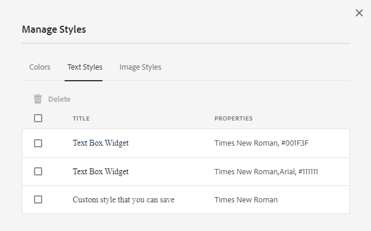

# 建立和使用主題 {#creating-and-using-themes}

可以建立和應用主題以設計自適應表單<!-- or an interactive communication-->。 主題包含元件和面板的樣式詳細資訊。 樣式包括背景顏色、狀態顏色、透明度、對齊方式和大小等屬性。 應用主題時，指定的樣式會反映在相應的元件上。 主題是獨立管理的，不引用自適應表單<!-- or interactive communication -->。

您可以下載並安裝 [!DNL AEM Forms] 引用內容包 [軟體分發](https://experience.adobe.com/#/downloads/content/software-distribution/en/aemcloud.html) 門戶，用於將參考主題和模板導入到您的環境。

## 建立、下載或上載主題 {#creating-downloading-or-uploading-a-theme}

主題將建立並保存為單獨的實體，並包含諸如自適應Forms等元屬性。 它允許在多個自適應Forms中重用主題<!-- or  and interactive communications-->。 您還可以將主題移動到其他實例並重新使用它。

### 建立主題 {#creating-a-theme}

要建立主題：

1. 按一下 **[!UICONTROL Adobe Experience Manager]**&#x200B;按一下 **[!UICONTROL Forms]**，然後按一下 **[!UICONTROL 主題]**。

1. 在「主題」頁中，按一下 **[!UICONTROL 建立]** > **[!UICONTROL 主題]**。
將啟動用於建立主題的嚮導。

1. 指定 **[!UICONTROL 名稱]** 的下界。

1. 指定用於在 **[!UICONTROL 此主題的預設預覽]** 的子菜單。 按一下 **[!UICONTROL 使用預設值]** 的子菜單。

1. 指定 **[!UICONTROL 配置容器]**。 您可以選擇 **[!UICONTROL 配置容器]** 包含帳戶的Adobe字型的配置詳細資訊。 您還可以將選項留空，並稍後從 [主題屬性](#metadata-of-a-theme)。

1. 按一下 **[!UICONTROL 建立]** 然後按一下 **[!UICONTROL 編輯]** 開啟主題編輯器中的主題，或按一下 **[!UICONTROL 完成]** 按鈕。

### 與第6.5號Experience Manager和以前版本的主題不同 {#difference-in-themes}

在Cloud Service實例上建立的主題：

* 版本號2。

* 儲存於 `/content/dam/formsanddocuments-themes/<theme-name>/`

* 不提供client-library選項。 不能指定客戶端庫類別和路徑。

* 對/apps位置沒有寫權限和更新權限(Forms用戶組對/apps位置沒有寫權限和更新權限)。

* 上載建立於 [!DNL Experience Manager Forms] 6.5或早期版本到Cloud Service實例，確保客戶端庫位置設定為 `etc/clientlibs/fd/themes`。 如果中不存在客戶端庫 `etc` 資料夾，手動將位置更新到 `etc/clientlibs/fd/themes`。  你可以 [!DNL Experience Manager Forms] 6.5或早期版本實例。 在設定客戶端庫的位置後，管理員可以將主題上載到Cloud Service實例，或使用內容傳輸工具將主題從6.5或早期版本實例遷移到Cloud Service實例。

   另外，更改類別的名稱。 如果名稱未更改，則出現錯誤 `theme with same category name exists` 可能會發生。 更改類別名稱時，它不會影響使用主題的自適應Forms。

### 下載主題 {#downloading-a-theme}

您可以將主題導出為zip檔案，並在其他項目或Experience Manager實例中使用這些主題。 下載主題：

1. 按一下 **[!UICONTROL Adobe Experience Manager]**&#x200B;按一下 **[!UICONTROL Forms]**，然後按一下 **[!UICONTROL 主題]**。

1. 在主題頁中， **[!UICONTROL 選擇]** 按一下 **[!UICONTROL 下載]**。 將顯示一個包含主題詳細資訊的對話框。

1. 按一下 **[!UICONTROL 下載]**。 主題將作為zip檔案下載。

>[!NOTE]
>
>如果您下載了一個主題，該主題具有與其關聯的自適應表單，並且關聯的自適應表單基於自定義模板，則還可下載自定義模板。 上載下載的主題和自適應表單時，也上載相關的自定義模板。

### 上載主題 {#uploading-a-theme}

具有管理員權限的用戶可以上載在中建立的主題 [!DNL Experience Manager Forms] 6.5或更早版本。

上載主題：

1. 按一下 **[!UICONTROL Adobe Experience Manager]**&#x200B;按一下 **[!UICONTROL Forms]**，然後按一下 **[!UICONTROL 主題]**。

1. 在「主題」頁中，按一下 **[!UICONTROL 建立]** > **[!UICONTROL 檔案上載]**。
1. 在「File Upload（檔案上載）」提示符下，瀏覽並選擇電腦上的主題包，然後按一下 **[!UICONTROL 上載]**。
上載的主題可在主題頁中找到。

## 主題的元資料 {#metadata-of-a-theme}

主題的元屬性清單（在主題的屬性頁面中找到）。

<table>
 <tbody>
  <tr>
   <th>
<strong>ID</strong>
 
 
 </th>
   <th><strong>名稱</strong></th>
   <th><strong>可編輯</strong></th>
   <th><strong>屬性說明</strong></th>
  </tr>
  <tr>
   <td>1.</td>
   <td>標題</td>
   <td>是</td>
   <td>顯示主題的名稱。</td>
  </tr>
  <tr>
   <td>2.</td>
   <td>說明</td>
   <td>是</td>
   <td>主題說明。</td>
  </tr>
  <tr>
   <td>3.</td>
   <td>類型</td>
   <td>否</td>
   <td>
    <ul>
     <li>資產類型。</li>
     <li>值始終為主題。</li>
    </ul> </td>
  </tr>
  <tr>
   <td>4.</td>
   <td>建立日期</td>
   <td>否</td>
   <td>主題建立日期</td>
  </tr>
  <tr>
   <td>5.</td>
   <td>作者姓名</td>
   <td>是</td>
   <td>主題的作者。 在建立主題時計算。</td>
  </tr>
  <tr>
   <td>6.</td>
   <td>上次修改日期</td>
   <td>否</td>
   <td>上次修改主題的日期。</td>
  </tr>
  <tr>
   <td>7.</td>
   <td>狀態</td>
   <td>否</td>
   <td>主題的狀態（已修改/已發佈）。</td>
  </tr>
  <tr>
   <td>8.</td>
   <td>按時發佈</td>
   <td>是</td>
   <td>自動發佈主題的時間。</td>
  </tr>
  <tr>
   <td>9.</td>
   <td>發佈關閉時間</td>
   <td>是</td>
   <td>自動取消發佈主題的時間。</td>
  </tr>
  <tr>
   <td>10.</td>
   <td>標記</td>
   <td>是</td>
   <td>附加到主題以用於改進搜索的標識的標籤。</td>
  </tr>
  <!-- <tr>
   <td>11.</td>
   <td>References</td>
   <td>Links</td>
   <td>
    <ul>
     <li>Contains 'Referred by' section. Lists forms that use the theme.</li>
     <li>Since the theme does not refer to any other asset, there is no 'Refers' section.</li>
    </ul> </td>
  </tr>
   <tr>
   <td>12.</td>
   <td>Clientlib Location</td>
   <td>Yes</td>
   <td>
    <ul>
     <li>The user-defined repository path within '/etc' where the clientlibs corresponding to this theme are stored.</li>
     <li>Default value - '/etc/clientlibs/fd/themes' + relative path of theme asset.</li>
     <li>If the location does not exist, the folder hierarchy is auto-generated.</li>
     <li>When this value is changed, the clientlib node structure is moved to the new location entered.  <em><strong>Note:</strong> If you change default clientlib location, in the CRXDE repository assign <code>crx:replicate, rep:write, rep:glob:*, rep:itemNames:: js.txt, jcr:read </code>to <code>forms-users</code> and <code>crx:replicate</code>, <code>jcr:read </code>to <code>fd-service</code> in the new location. Also attach another ACL by adding <code>deny jcr:addChildNodes</code> for <code>forms-user</code></em></li>
    </ul> </td>
  </tr> 
  <tr>
   <td>13.</td>
   <td>Clientlib Category Name</td>
   <td>Yes</td>
   <td>
    <ul>
     <li>The user-defined clientlib category name for this theme.</li>
     <li>An error is displayed if the name is already in use by some other existing theme.</li>
     <li>Default value - computed using theme location.</li>
     <li>When this value is changed, the category name is updated on the corresponding clientlib node. Updating Clientlib Category Name in the jsp files is not required because clientlib category name is used by reference.</li>
    </ul> </td>
  </tr> -->
 </tbody>
</table>

## 關於主題編輯器 {#about-the-theme-editor}

主題編輯器是業務用戶和Web設計器/開發人員友好介面，提供指定各種自適應表單樣式所需的功能 <!-- and interactive communication --> 元素。 建立主題時，它將作為單獨的實體儲存，如表單 <!--  , interactive communications, letters, document fragments, and data dictionaries-->。

通過主題編輯器，您可以自定義主題中樣式的元件樣式。 您可以自定義表單的方式 <!-- or interactive communication --> 在設備上看。

主題編輯器分為兩個面板：

* **畫布**  — 顯示在右側。 它顯示了一個示例自適應表單 <!--  or interactive communication --> 所有的造型變化都能即時反映。 也可以從畫布中直接選擇對象，以查找與其關聯的樣式，並編輯這些樣式。 頂部的設備解析度標尺控制畫布。 從標尺中選擇解析度斷點顯示示例表單的預覽 <!--  or interactive communication --> 為相關決議。 畫布將詳細討論 [下](themes.md#using-canvas)。

* **提要欄** — 顯示在左側。 它具有以下項：

   * **選擇器：** 顯示為樣式選擇的元件及其可設定樣式的屬性。 選擇器表示類型的所有元件。 如果在主題中選擇文本框元件以進行造型，則窗體中的所有文本框 <!-- or interactive communication --> 繼承樣式。 選擇器允許您為樣式選擇泛型元件或特定元件。 例如，欄位元件是泛型元件，文本框是特定元件。

      **造型通用元件：**
欄位可以是數字框欄位（如年齡），也可以是文本框欄位（如地址）。
當設定欄位樣式時，所有欄位（如年齡、名稱、地址）都將設定樣式。

      **定義特定元件**:特定元件會影響特定類別的對象。 在主題中對數字框元件進行樣式化時，只繼承樣式中的數字框對象。

      例如，地址等文本框欄位較長，而年齡等數字框欄位較短。 您可以選擇一個數字框欄位，縮短其長度，並應用於窗體。 所有數字框欄位的寬度以窗體形式減小。

      使用特定背景顏色定制所有欄位元件時，所有欄位（如年齡、名稱和地址）都繼承背景顏色。 選擇數字框（如年齡）並減小其寬度時，所有數字框（如年齡）的寬度會減小，家庭中的人數會減少。 文本框的寬度未更改。

   * **狀態：** 用於在特定狀態中自定義對象的樣式。 例如，當對象處於預設、焦點、禁用、懸停或錯誤狀態時，可以指定其外觀。
   * **屬性類別：** 造型屬性分為不同類別。 例如Dimension和位置、文本、背景、邊框和效果。 在每個類別下，提供樣式資訊。 例如，在「背景」下，可以提供「背景顏色」和「影像和漸變」。

   * **高級：** 用於向對象添加自定義CSS，該對象將覆蓋視覺控制項定義的屬性（如果存在重疊）。

   * **查看CSS**:用於查看所選元件的CSS。
   此外，在Sidebar中，底部有箭頭。 按一下箭頭後，將再獲得兩個選項： **模擬成功** 和 **模擬錯誤。** 這些選項以及上述選項將作詳細討論 [下](themes.md#using-rail)。

 **答：** 提要欄 **B** 畫布

### 造型元件 {#styling-components}

可以在多個自適應Forms中使用主題<!-- and interactive communications -->，可導入在主題中指定的元件格式。 您可以對各種元件（如標題、說明、面板、欄位、表徵圖和文本框）進行樣式化。 使用小部件配置主題中的元件屬性。 雖然「CSS覆蓋」部分允許您編寫CSS代碼或提供自定義選擇器，但不需要CSS或LESS的先前知識，但是它是必需的。 在邊欄中選擇元件時，將顯示「CSS覆蓋」部分。

邊欄中的選項，用於選擇和設計不同的元件。

按一下邊欄中某個元件的編輯按鈕，將選擇畫布中的元件，並允許您使用邊欄中的選項對元件進行樣式設定。

某些元件（如文本框、數字框、單選按鈕和複選框）在「欄位」等通用元件下分類。 例如，您要自定義單選按鈕的樣式。 要選擇用於樣式的單選按鈕，請選擇 **[!UICONTROL 欄位]** > **[!UICONTROL 小部件]** > **[!UICONTROL 單選按鈕]**。

### 樣式面板佈局 {#styling-panel-layouts-br}

主題 [!DNL AEM Forms] 支援窗體中面板佈局中元素的樣式<!-- and  interactive communications -->。 支援在出廠設定佈局和自定義佈局中對元素進行造型。

現成面板包括：

* 左側的索引標籤
* 索引標籤在頂端
* 折疊式面板
* 回應式
* 精靈
* 移動佈局

   * 標題中的面板標題
   * 標題中沒有面板標題

選擇器因每個佈局而異。
通過主題編輯器設計自定義佈局涉及：

* 為可設定樣式的佈局定義元件，並為唯一標識這些元件的CSS選擇器定義元件。
* 定義可應用於這些元件的CSS屬性。
* 從用戶介面交互定義這些元件的樣式。

### 不同螢幕大小的不同樣式 {#different-styles-for-different-screen-sizes-br}

台式機和移動佈局可以有略微或完全不同的樣式。 對於移動設備，平板電腦和電話共用的佈局類似，但元件大小除外。

使用主題編輯器斷點為不同螢幕大小定義替代樣式。 您可以選擇開始構建主題的基本設備或解析度，並自動生成其他解析度的樣式變化。 可顯式修改所有解析度的樣式。

>[!NOTE]
>
>首先使用窗體建立主題<!-- or interactive communication-->，然後應用於不同的窗體<!-- or interactive communications-->。 主題建立中使用的斷點可以與窗體不同 <!-- or interactive communication --> 主題。 CSS媒體查詢基於表單 <!-- or interactive communication --> 在主題建立中使用，而不是窗體 <!-- or interactive communication --> 主題。

### 樣式屬性上下文在選擇對象時在邊欄中更改 {#styling-properties-context-changes-in-sidebar-on-selecting-objects}

在「畫布」中選擇元件時，其樣式屬性將列在提要欄中。 選擇對象類型及其狀態，然後提供其樣式。

### 主題編輯器中最近使用的樣式 {#recently-used-styles-in-theme-editor}

主題編輯器最多快取應用於元件的十種樣式。 可以將快取樣式與主題的其他元件一起使用。 最近使用的樣式作為清單框在側邊欄的選定元件下方可用。 最初，最近使用的樣式清單為空。

在對元件進行樣式設定時，這些樣式將被快取並列在清單框中。 在本示例中，文本框的標籤將以樣式更改字型大小和顏色。 您可以執行類似的步驟來選擇影像或更改顏色以對元件進行樣式。 觀察更改欄位標籤樣式時如何快取樣式並在清單框中列出樣式。

在此示例中，欄位標籤的樣式被更改，當為樣式選擇響應面板說明時，資產庫中將添加一個清單條目。 資產庫中的條目可用於更改響應面板說明的樣式。

當在資產庫中添加樣式時，它可用於其他主題和 [樣式模式](inline-style-adaptive-forms.md) 對話框。 同樣，當使用表單編輯器的樣式模式時 <!-- or interactive communication editor --> UI用於對元件進行樣式化，樣式將被快取，並可在主題中使用。

通過資產庫的加號按鈕，您可以永久保存帶有所提供名稱的樣式。 即使您未按一下提要欄中的「保存」按鈕將樣式應用於元件，加號按鈕也會保存樣式。 在樣式模式下，無法使用用於保存樣式以供以後使用的加號按鈕。

為樣式提供自定義名稱時，該樣式與主題相關聯，不再可用於其他主題。 要刪除已保存的樣式：

1. 在「畫布」工具欄上，按一下 **[!UICONTROL 主題選項]**  > **[!UICONTROL 管理樣式]**。
1. 在「管理樣式」對話框中，選擇保存的樣式，按一下 **[!UICONTROL 刪除]**。

   

### 即時預覽、保存和放棄更改 {#live-preview-save-and-discard-changes}

在造型中所做的修改會立即反映在表單中 <!-- or interactive communication --> 裝入畫布。 即時預覽允許您交互地定義和查看樣式的影響。 更改元件的樣式時， **[!UICONTROL 完成]** 按鈕。 要保留更改，請使用 **[!UICONTROL 完成]** 按鈕

>[!NOTE]
>
>在欄位中輸入無效字元時，欄位邊界顏色將變為紅色，螢幕左上角將顯示錯誤消息。 例如，如果在文本框中輸入字母，該文本框接受數字字元作為輸入，則輸入框邊界顏色將變為紅色。 如果不解決螢幕中央底部顯示的錯誤，則無法保存此主題。

### 具有其他自適應窗體的主題 {#theme-with-another-adaptive-form}

建立主題時，會使用主題編輯器附帶的表單建立主題。 為此窗體中的元件提供樣式。 您可以選擇表單，而不是隨主題編輯器一起提供的表單 <!-- or interactive communication --> 的子菜單。

替換當前窗體或 <!-- interactive communication --> 在主題編輯器畫布中：

1. 在「主題編輯器」面板中，按一下 **[!UICONTROL 主題選項]**  > **[!UICONTROL 配置]**。

1. 在「常規」頁籤中，瀏覽並選擇一個表單 <!-- or interactive communication --> 為 **[!UICONTROL 自適應窗體]** 的子菜單。

### 重做/撤消 {#redo-undo}

您可以撤消或重做意外發生的意外更改。 使用畫布中的重做/撤消按鈕。

在主題編輯器中對元件進行樣式時，將顯示重做/撤消按鈕。

## 使用主題編輯器 {#using-the-theme-editor}

使用主題編輯器可以編輯您建立或上載的主題。 導航到 **[!UICONTROL Forms和文檔]** > **[!UICONTROL 主題]**，然後選擇一個主題並將其開啟。 主題將在主題編輯器中開啟。

如上所述，主題編輯器包含兩個面板：提要欄和畫布。

在主題編輯器中自定義文本框小部件元件的成功狀態樣式。 元件在畫布中被選中，其狀態在提要欄中被選中。 側欄中可用的樣式選項用於定制元件的外觀。

### 使用畫布 {#using-canvas}

主題是使用現成表單建立的，還是使用表單建立的 <!-- or interactive communication --> 你選擇的。 畫布顯示窗體或 <!-- interactive communication --> 用於建立主題和主題中指定的自定義項。 表格上方的標尺用於根據設備的顯示大小確定佈局。

在「畫布」工具欄中，您會看到：

* **[!UICONTROL 切換側面板]** :用於顯示或隱藏邊欄。
* **[!UICONTROL 主題選項]** :提供三個選項

   * 配置：提供選項以選擇預覽表單 <!-- or interactive communication , base clientlib, -->和Adobe Fonts配置。
   * 查看主題CSS:為所選主題生成CSS。
   * 管理樣式：提供用於管理文本和影像樣式的選項
   * 幫助：運行主題編輯器的影像指導教程。

* **[!UICONTROL 模擬器]** :模擬不同顯示大小的主題外觀。 在模擬器中，顯示大小被視為斷點。 可以選擇斷點並為其指定樣式。 例如，Desktop和Tablet是兩個斷點。 可以為每個斷點指定不同的樣式。

在「畫布」中選擇元件時，將看到元件工具欄的頂部。 元件工具欄允許您選擇元件或切換到通用元件。 例如，在面板中選擇一個數字文本框。 在元件工具欄中可看到以下選項：

* **[!UICONTROL 數字框小部件]**:允許您選擇元件以在邊欄中自定義其外觀。
* **[!UICONTROL 域小部件]**:用於選擇類屬元件進行造型。 在本示例中，所有文本輸入元件（文本框/數字框/數字步進器/日期輸入）都被選中用於造型。

* :用於為造型選擇父元件。 如果選擇數字框並點擊此表徵圖，則會選擇欄位元件。 如果選擇欄位元件並點擊此表徵圖，則會選擇面板。 如果繼續點擊此表徵圖進行選擇，則最終將選擇樣式佈局。

>[!NOTE]
>
>元件工具欄中的可用選項會因所選元件而異。

### 使用提要欄 {#using-rail}

主題編輯器中的提要欄提供了選項，用於為主題中的元件自定義樣式，並使用選擇器。 選擇器允許您選擇一組元件或單個元件，並可以在邊欄中搜索選擇器。 可以為自定義元件編寫選擇器。

從邊欄中的畫布或選擇器中選擇元件時，邊欄將顯示所有選項，以便您為其定制樣式。
以下是選擇元件時在邊欄中看到的選項：

* 狀態
* 屬性表
* 模擬錯誤/成功

#### 狀態 {#state}

狀態是用戶與元件交互的指示。 例如，當用戶在文本框中輸入錯誤資料時，文本框的狀態將變為錯誤狀態。 主題編輯器允許您指定特定狀態的樣式。

定制狀態樣式的選項因不同元件而異。

#### 屬性表 {#property-sheet}

<table>
 <tbody>
  <tr>
   <td><strong>屬性</strong></td>
   <td><strong>使用</strong></td>
  </tr>
  <tr>
   <td>
尺寸及位置
 </td>
   <td>
允許您對主題中的元件進行對齊、大小、定位和放置。 
 
您的選項包括顯示設定、填充、邊距、寬度、高度和Z索引。
 
也可以使用「佈局」模式使用簡單的拖放介面來定義元件的寬度。 有關詳細資訊，請參見 <a href="resize-using-layout-mode.md">使用佈局模式調整元件大小</a>。
 </td>
  </tr>
  <tr>
   <td>
文字
 </td>
   <td>
用於自定義主題元件中的文本樣式。
 
例如，您希望更改在文本框中輸入的文本的外觀。
 
您的選項包括字型系列、粗細、顏色、大小、行高、文本對齊、字母間距、文本縮進、下划線、斜體、文本轉換、垂直對齊、基線和方向。 
 </td>
  </tr>
  <tr>
   <td>
背景 
 </td>
   <td>
允許您用影像或顏色填充元件的背景。 
 </td>
  </tr>
  <tr>
   <td>
邊框
 </td>
   <td>
允許您選擇元件邊框的外觀。 例如，您希望文本框具有深紅色粗邊框和虛線。 
 
您的選項是邊框的寬度、樣式、半徑和顏色。
 </td>
  </tr>
  <tr>
   <td>
效果
 </td>
   <td>
用於向元件（如不透明度、混合模式和陰影）添加特殊效果。 
 </td>
  </tr>
  <tr>
   <td>
進階
 </td>
   <td>
允許您添加：

    <ul>
     <li>屬性 <code>::before</code> 和 <code>::after</code> 在選擇器中預設內容之後或之前添加內容的偽元素，並對其進行樣式化。  請參閱 <a href="https://www.w3schools.com/css/css_pseudo_elements.asp" target="_blank">CSS偽元素</a>。</li>
     <li>自定義CSS代碼內聯到元件。</li>
    </ul> 
添加自定義CSS代碼時，它將覆蓋使用邊欄中的選項添加的自定義。 
 </td>
  </tr>
 </tbody>
</table>

#### 模擬錯誤/成功 {#simulate-error-success}

「模擬錯誤」和「成功」選項位於邊欄底部。 您可以使用邊欄底部可見的顯示/隱藏箭頭來查看它們。 使用主題編輯器，可以對元件的各種狀態進行樣式化。

例如，在表單中添加一個數字欄位，並在主題編輯器中指定其樣式。 當用戶在欄位中鍵入字母數字值時，您希望文本框的背景顏色發生更改。 在主題中選擇數字欄位，然後使用提要欄中的狀態選項。 在提要欄中選擇「錯誤」狀態，並將背景顏色更改為紅色。 要預覽行為，可以使用提要欄中的「模擬錯誤」選項。 「模擬錯誤」和「成功」選項的詳細說明如下：

* **模擬成功**:允許您查看元件在指定其成功狀態樣式時的外觀。 例如，在表單中，客戶設定密碼。 用戶可以根據您提供的准則設定密碼。 當用戶根據您提供的所有准則鍵入密碼時，文本框將變為綠色。 文本框變綠時，處於成功狀態。 可以為處於成功狀態的元件指定造型，並使用「模擬成功」(Simulate Success)選項模擬其外觀。

* **模擬錯誤**:允許您查看元件在為錯誤狀態指定其樣式時的外觀。 例如，在表單中，客戶設定密碼。 用戶可以根據您提供的准則設定密碼。 當用戶鍵入的密碼不符合您提供的所有准則時，文本框將變為紅色。 當文本框變為紅色時，它處於錯誤狀態。 可以為處於錯誤狀態的元件指定造型，並使用「模擬錯誤」(Simulate Error)選項模擬其外觀。

### 設定元件的樣式 {#styling-a-component}

例如，在窗體中，您有兩種類型的文本框：一個僅接受數字值，另一個接受字母數字值。 您可以為僅接受數值的文本框（數字框）自定義樣式。

要定制特定元件的樣式（本示例中的數字框），請執行以下步驟：

1. 在主題編輯器中，選擇畫布中的數字框。
1. 選擇數字框時，可以看到元件工具欄包含三個選項：

   * **[!UICONTROL 數值方塊Widget]**
   * **[!UICONTROL 欄位Widget]**

1. 選擇 **[!UICONTROL 數字框小部件]**。
1. 提要欄標題將更改為「數字框小部件」，並顯示用於自定義其外觀的選項。
使用 **[!UICONTROL Dimension和職位]** 選項來自定義元件的大小。 確保國家 **[!UICONTROL 預設]**。

而不是選擇 **[!UICONTROL 數字框小部件]**&#x200B;選中 **[!UICONTROL 域小部件]** ，然後執行以下步驟。 選擇維時 **[!UICONTROL 域小部件]** 選項。

### 給定狀態的樣式欄位 {#styling-fields-given-state}

使用元件工具欄，還可以為其不同狀態指定元件的造型。 例如，如果元件被禁用，則它處於禁用狀態。 可在主題編輯器中設定樣式的元件的常用狀態為：預設、焦點、禁用、錯誤、成功和懸停。 可以在畫布中選擇元件，然後使用提要欄中的「狀態」選項自定義其外觀。

要為處於特定狀態的元件定製造型，請執行以下步驟：

1. 在「畫布」中選擇一個元件，然後從元件工具欄中選擇相應的選項。
Sidebar顯示用於定制元件樣式的選項。
1. 在提要欄中選擇狀態。 例如，錯誤狀態。
1. 使用選項，如 **[!UICONTROL 邊框，背景]** 的子菜單。
1. 使用 **[!UICONTROL 模擬錯誤]** 的子菜單。

在指定元件狀態後定制元件的造型時，僅針對指定狀態顯示該元件的定製。 例如，如果在選取懸停狀態時為元件定製造型。 當將指針移動到呈現窗體中的元件上時，將顯示元件的自定義項 <!-- or interactive communication --> 將主題應用到其中。

要模擬除錯誤和成功之外的狀態行為，請使用「預覽」模式。 要使用「預覽」模式，請按一下 **[!UICONTROL 預覽]** 的子菜單。

### 小型顯示器的樣式佈局 {#styling-layouts-for-smaller-displays}

使用畫布中的標尺為顯示較小的設備選擇斷點。 按一下模擬器  在畫布中查看標尺和斷點。 斷點允許您預覽窗體 <!-- or interactive communication --> 用於與不同設備（如電話和平板電腦）相關的顯示器尺寸。 主題編輯器支援多種顯示大小。

要為不同斷點設定元件樣式：

1. 在「畫布」中，在標尺上方選擇一個斷點。
斷點表示移動設備及其顯示大小。
1. 使用提要欄定制窗體樣式 <!-- or interactive communication --> 顯示大小的主題中的元件。
1. 確保保存自定義項。

您可以對窗體進行樣式化 <!-- or interactive communication --> 多個設備的元件。 窗體 <!-- and interactive communication --> 台式機和移動設備的元件可能具有完全不同的樣式。

### 在主題中使用Web Fonts {#using-web-fonts-in-a-theme}

現在，您可以使用Adaptive Form中Web服務中可用的字型 <!-- or interactive communication -->。 開箱即用， [Adobe Fonts](https://fonts.adobe.com/),Adobe的web字型服務可作為配置使用。 要使用Adobe Fonts，請建立套件，在其中添加字型，並從中獲取套件ID [Adobe Fonts](https://fonts.adobe.com/)。

要在Experience Manager中配置Adobe Fonts，請執行以下步驟：

1. 在作者實例中，按一下 **[!UICONTROL Adobe Experience Manager ]**>**[!UICONTROL &#x200B;工具&#x200B;]** >**[!UICONTROL &#x200B;部署&#x200B;]**>**[!UICONTROL  Cloud Services ]**。
1. 在 **[!UICONTROL Cloud Services]** 頁面，導航到並開啟 **[!UICONTROL Adobe Fonts]** 的雙曲餘切值。 開啟配置資料夾，然後按一下 **[!UICONTROL 建立]**。
1. 在 **[!UICONTROL 建立配置]** 對話框，指定配置的標題，然後按一下 **[!UICONTROL 建立]**。

   您被重定向到配置頁面。

1. 在出現的「編輯元件」對話框中，提供套件ID，然後按一下 **[!UICONTROL 確定]**。

要配置主題以使用Adobe Fonts配置，請執行以下步驟：

1. 在作者實例上，在主題編輯器中開啟一個主題。
1. 在主題編輯器中，導航到 **[!UICONTROL 主題選項]**  > **[!UICONTROL 配置]**。
1. 在 **[!UICONTROL Adobe Fonts配置]** 欄位，選擇套件，然後按一下 **[!UICONTROL 保存]**。

   現在，您可以看到這些字型已添加到主題的font-family屬性中。

<!-- >
### Listing and selecting fonts in theme editor {#listing-and-selecting-fonts-in-theme-editor}

You can use the theme configuration service to add more fonts to the theme editor. Perform the following steps to add fonts:

1. Log in to Experience Manager Web Console with administrative privileges. URL for the Experience Manager Web Console is `https://'[server]:[port]'/system/console/configMgr`.
1. Open **[!UICONTROL Adaptive Form Theme Configuration Service]**.

   

1. Click +, specify the name of the font, and click **Save**. The font is added and available in theme editor. -->

#### 在主題編輯器中選擇字型 {#selecting-fonts-in-theme-editor}

可以使用+按鈕添加字型。 添加字型時，它會列在提要欄中。

除了主題配置選項外，還可以從主題編輯器本身添加字型。 在提要欄下的字型系列欄位中鍵入要使用的字型，然後按鍵盤上的返回鍵。

選擇字型時，它將添加到字型系列清單下。 可以使用主題編輯器中的「蒙版」選項禁用或啟用列出的字型。

您可以看到元件字型更改。

「字型系列」欄位支援多種字型。 鍵入字型時，瀏覽器會查找字型並將其應用於選定的元件。 如果瀏覽器找不到字型，它會在系列中查找它旁邊的字型。 您可以首先鍵入要查找的特定字型。 如果找不到要使用的字型，可以在族中鍵入通用字型並使用它。

#### 在主題編輯器中應用的蒙版樣式 {#mask-styles-applied-in-theme-editor}

可以遮罩在主題中應用的樣式。 在主題編輯器邊欄中，您可以使用 表徵圖以禁用應用樣式。 例如，如果在窗體中更改元件的尺寸 <!-- or interactive communication -->，則可以使用屬性左側的蒙版按鈕禁用它。 保存主題時，將保留所選掩碼選項。

下面的示例顯示主題中的蒙版和未蒙版樣式。

## 將主題應用於窗體 {#applying-a-theme-to-a-form-or-interactive-communication-br}

要將主題應用於自適應表單，請執行以下操作：

1. 在編輯模式下開啟窗體。 要在編輯模式下開啟表單，請選擇一個表單，然後按一下 **[!UICONTROL 開啟]**。
1. 在編輯模式下，選擇一個元件，然後按一下  > **[!UICONTROL 自適應窗體容器]**，然後按一下 。

   您可以在邊欄中編輯表單的屬性。

1. 在提要欄中，按一下 **[!UICONTROL 造型]**。
1. 從 **[!UICONTROL 自適應窗體主題]** 下拉並按一下 **[!UICONTROL 完成]** 。

在建立自適應表單時，還可以為其定義主題。

<!-- To apply a theme to an interactive communication:

1. Open your interactive communication in edit mode. To open a interactive communication in edit mode, select a form and click **Open**.
1. In the edit mode, select a component, then click  &gt;**Document Container**, and then click .

   You can edit properties of your form in the sidebar.

1. In the sidebar, under **Basic**, select your theme from the **Theme** drop-down and click **Done**  -->

### 在運行時更改窗體的主題 {#change-theme-of-a-form-at-runtime}

主題對窗體的不同元件設定樣式。 您可以使用 `themeOverride` 屬性，以動態更改窗體的主題。 表單的典型URL是：

`https://<server>:<port>/content/forms/af/test.html`

可以使用themeOverride參數在運行時應用主題。

`https://<server>:<port>/content/forms/af/test.html?themeOverride=/content/dam/formsanddocuments-themes/simpleEnrollmentTheme`

的 `themeOverride` 的子菜單。 它會更改表單的主題，並使用更新的樣式刷新表單。

## 使用主題獲取特定外觀 {#specific-af-appearance}

與 [!DNL AEM Forms]除了預設的現成畫布主題之外，還有許多其他主題。 如果您想設計窗體 <!-- or interactive communication --> 使用其他主題以及更多更改，從「主題庫」資料夾中複製主題。 將複製的主題貼上到「主題庫」資料夾外，並根據所需更改編輯複製的主題。

要複製主題，請執行以下步驟：

1. 在創作實例中，導航到 **[!UICONTROL Adobe Experience Manager]** > **[!UICONTROL Forms]** > **[!UICONTROL 主題]**。
1. 開啟「主題庫」資料夾。
1. 在「主題庫」資料夾中，將指針懸停在相應的現成主題上，然後點擊 **[!UICONTROL 複製]**。
1. 將複製的主題貼上到「主題庫」資料夾外。
1. 自定義複製的主題。

自定義主題後，將其應用於窗體 <!-- or interactive communication -->。

>[!NOTE]
>
>不要修改「主題庫」資料夾中可用的主題。 此資料夾包含系統主題。 在安裝更新版本或修補程式時，您對這些主題所做的任何更改都會被覆蓋 [!DNL AEM Forms]。

## 對其他自適應表單使用情形的影響 {#impact-on-other-adaptive-form-use-cases}

* **發佈/取消發佈表單：** 在發佈表單時，還會發佈應用於的主題（如果尚未發佈）
* **導入/導出表單：** 導入或導出表單時，其關聯主題也會自動導入或導出。
* **表單的引用：** 表單引用中的「引用」部分包含主題的額外條目。
* **表單的上次修改時間：** 更改關聯主題時更新。
<!-- * **A/B Testing:** You can apply a different theme to two versions of the form in A/B testing. The information of the two themes is individually stored on the two guide containers. -->

## CSS生成序列 {#css-generation-sequence}

選擇「查看CSS」時，主題編輯器將收集所有樣式資訊並生成CSS。 它按以下順序收集資訊：

<!-- 1. Styling defined in the theme's base client library. -->
1. 用戶定義的樣式，使用提要欄中的屬性指定。
1. 使用「CSS覆蓋」選項提供的CSS樣式。

例如，文本框的背景顏色為藍色<!-- in the base client library-->。 使用提要欄中的屬性將其更改為粉紅色。 生成CSS時，文本框的背景顏色顯示為粉紅色。 使用屬性更改背景顏色後，另一作者使用CSS覆蓋選項將背景顏色文本框更改為白色。 生成CSS時，在生成的CSS中，背景顏色顯示為白色。

## 調試樣式 {#debugging-styles}

在主題編輯器中為元件指定樣式時，將生成CSS。 當設定通用元件的樣式時，其中包含的多個元件也會設定樣式。 例如，當對欄位進行樣式時，其中的文本框和標籤也是樣式。 在欄位中設定文本框樣式時，它會獲得自己的CSS。 如果要調試為欄位和元件生成的CSS，則「主題編輯器」提供了用於查看CSS的選項。

可以使用以下選項查看生成的CSS:

* **查看CSS** 選項：在「主題」中選擇元件時，可以在提要欄中看到「查看CSS」選項。 它顯示生成的CSS，包括 `::before` 和 `::after` 偽元素。
* **查看主題CSS** 選項：在畫布工具欄中，按一下  > **[!UICONTROL 查看主題CSS]**。 您可以查看從主題編輯器中定義的屬性生成的整個主題CSS。

## 故障排除、建議和最佳做法 {#troubleshooting-recommendations-and-best-practices}

* **避免資產來自其他主題**

   編輯主題時，可以瀏覽和添加來自其他主題的資源（如影像）。 例如，您正在編輯頁面的背景。 例如，當您選擇 **[!UICONTROL 頁面]** > **[!UICONTROL 背景]** > **[!UICONTROL 添加]** > **[!UICONTROL 影像]**，您將看到一個對話框，該對話框允許您瀏覽和添加其他主題中的影像。

* 如果從另一個主題添加資產，並且移動或刪除了另一個主題，則您可能會面臨當前主題的問題。 建議您避免瀏覽和添加來自其他主題的資產。

<!-- * **Using base clientlib, theme editor, and inline styling**

    * **Base clientlib**:

      Base client library contains styling information. To use styling information in client-side libraries in themes.

        1. Navigate to **[!UICONTROL Experience Manager]** &gt; **[!UICONTROL Forms]** &gt; **[!UICONTROL Themes]**.
        1. In the Themes page, select a theme and click **[!UICONTROL Properties]**.
        1. In the Properties page that opens, click **[!UICONTROL Advanced]**.
        1. In the Advanced tab, in the Clientlib Location field, browse, and select the client-library you want to use.
        1. Click **[!UICONTROL Save]**.

      The styling you specify in client library is imported in the theme that uses it. For example, you specify styling for text box, numeric box, and switch in the client library. When you import your client library in the theme, styling for text box, numeric box, and switch is imported. You can then style other components using theme editor. -->
    您還可以建立主題，建立主題的副本，然後修改複製主題中提供的樣式，以用於類似的使用案例。
    請參閱[使用主題獲取特定外觀](#specific-af-appearance)
    
    * **主題編輯器：**
    
    主題編輯器允許您建立主題以對窗體進行樣式化 &lt;!> — 或互動式通信 — >。 您可以指定主題中元件的樣式，以在多個表單之間實現外觀和感覺的一致性 &lt;!> — 或互動式通信 — >您開發。 建議在主題中指定樣式資訊，然後將主題應用於表單。
    
    * **內聯樣式：**
    
    可以使用窗體中的「樣式」模式對元件進行樣式化 &lt;!> — 或互動式通信 — >處理表單時的多通道編輯器。 使用樣式模式更改表單元件樣式將覆蓋主題中指定的樣式。 如果要更改特定窗體的某些元件的樣式，請參閱[元件的內聯樣式]（內聯樣式 — adaptive-forms.md）。

<!-- * **Using client-side libraries**

  If you want to create client libraries to import styling information, see [Using Client-Side Libraries](https://experienceleague.adobe.com/docs/experience-manager-cloud-service/implementing/developing/clientlibs.html). After you create a client library, you can import it in your theme using the steps mentioned above. -->

* **更改容器面板佈局寬度**

   不建議更改容器面板佈局寬度。 指定容器面板的寬度時，它將變為靜態，不適應不同的顯示。

* **何時使用表單編輯器或主題編輯器來使用頁眉和頁腳**

   如果要使用樣式選項（如字型樣式、背景和透明度）對頁眉和頁腳進行樣式化，請使用主題編輯器。
如果要提供徽標影像、頁眉中的公司名稱和頁腳中的版權資訊等資訊，請使用表單編輯器選項。
