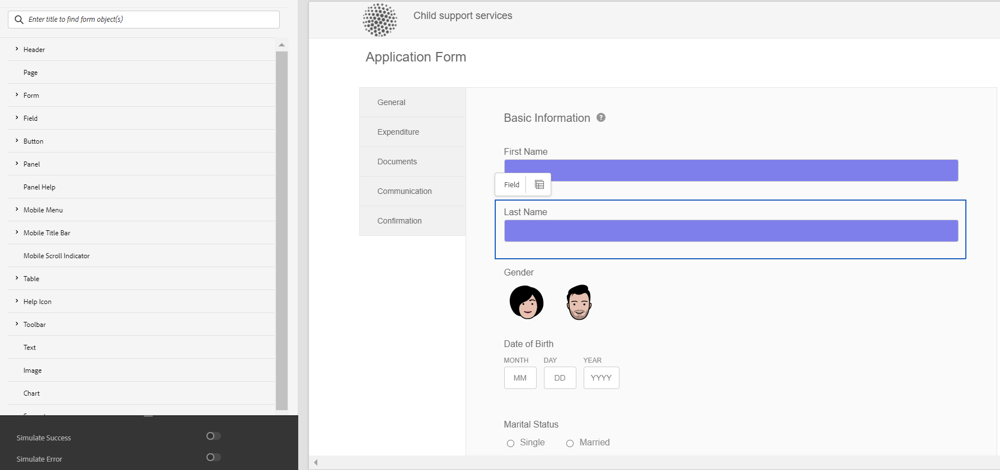

# 建立和使用主題 {#creating-and-using-themes}

>[!NOTE]
>
> Adobe建議針對[建立新的Adaptive Forms](https://experienceleague.adobe.com/docs/experience-manager-core-components/using/adaptive-forms/introduction.html)或[將Adaptive Forms新增至AEM Sites頁面](/help/forms/creating-adaptive-form-core-components.md)，使用現代且可擴充的資料擷取[核心元件](/help/forms/create-or-add-an-adaptive-form-to-aem-sites-page.md)。 這些元件代表最適化表單建立方面的重大進步，可確保令人印象深刻的使用者體驗。本文說明使用基礎元件製作最適化Forms的舊方法。

| 版本 | 文章連結 |
| -------- | ---------------------------- |
| AEM 6.5 | [按一下這裡](https://experienceleague.adobe.com/docs/experience-manager-65/forms/adaptive-forms-advanced-authoring/themes.html) |
| AEM as a Cloud Service  | 本文章 |

您可以建立並套用主題，使最適化表單<!-- or an interactive communication-->風格化。 主題包含元件和面板的樣式詳細資訊。 樣式包括背景顏色、狀態顏色、透明度、對齊方式和大小等屬性。套用主題時，指定的樣式會反映在對應的元件上。在不參考最適化表單<!-- or interactive communication -->的情況下獨立管理主題。

您可以從[!DNL AEM Forms]軟體發佈[入口網站下載並安裝](https://experience.adobe.com/#/downloads/content/software-distribution/en/aemcloud.html)參考內容封裝，以將參考主題和範本匯入您的環境。

## 建立、下載或上傳主題 {#creating-downloading-or-uploading-a-theme}

主題會建立並儲存為單獨的實體，並包含如最適化Forms之類的中繼屬性。 它允許在多個最適化Forms<!-- or  and interactive communications-->中重複使用主題。 您也可以將佈景主題移動至不同的執行個體並重複使用。

### 建立主題 {#creating-a-theme}

若要建立主題：

1. 按一下&#x200B;**[!UICONTROL Adobe Experience Manager]**，按一下&#x200B;**[!UICONTROL Forms]**，然後按一下&#x200B;**[!UICONTROL 主題]**。

1. 在「佈景主題」頁面中，按一下&#x200B;**[!UICONTROL 建立]** > **[!UICONTROL 佈景主題]**。
建立主題的精靈隨即啟動。

1. 指定主題的&#x200B;**[!UICONTROL 名稱]**。

1. 指定表單以預覽此佈景主題&#x200B;**[!UICONTROL 欄位的]**&#x200B;預設預覽。 按一下&#x200B;**[!UICONTROL 使用預設值]**&#x200B;以使用預設表單來預覽主題。

1. 指定&#x200B;**[!UICONTROL 設定容器]**。 您可以選擇包含您帳戶之Adobe字型組態詳細資料的&#x200B;**[!UICONTROL 組態容器]**。 您也可以暫時保留空白選項，稍後再從[佈景主題屬性](#metadata-of-a-theme)指定詳細資料。

1. 按一下&#x200B;**[!UICONTROL [建立]]**，然後按一下&#x200B;**[!UICONTROL [編輯]]**&#x200B;以開啟主題編輯器中的主題，或按一下&#x200B;**[!UICONTROL [完成]]**&#x200B;以返回主題頁面。

### Experience Manager 6.5 Forms和舊版的主題差異 {#difference-in-themes}

在Cloud Service例項上建立的主題：

* 版本編號為2。

* 儲存在`/content/dam/formsanddocuments-themes/<theme-name>/`

* 不提供使用者端程式庫選項。 您無法指定使用者端程式庫類別和路徑。

* 沒有/apps位置的寫入和更新許可權(Forms-user群組沒有/apps位置的寫入和更新許可權)。

* 將以[!DNL Experience Manager Forms] 6.5或舊版建立的主題上傳到Cloud Service執行個體之前，請確定使用者端資料庫位置已設為`etc/clientlibs/fd/themes`。 如果`etc`資料夾中不存在使用者端資料庫，請手動將位置更新為`etc/clientlibs/fd/themes`。  您可以在[!DNL Experience Manager Forms] 6.5或舊版執行個體上進行變更。 設定使用者端資料庫的位置後，管理員可以將主題上傳到Cloud Service執行個體，或使用「內容轉移工具」將主題從6.5版或舊版執行個體移轉至Cloud Service執行個體。

  此外，請變更類別的名稱。 如果未變更名稱，可能會發生錯誤`theme with same category name exists`。 當您變更類別名稱時，不會影響使用主題的最適化Forms。

### 下載主題 {#downloading-a-theme}

您可以將主題匯出為zip檔案，並在其他專案或Experience Manager執行個體中使用這些主題。 若要下載佈景主題：

1. 按一下&#x200B;**[!UICONTROL Adobe Experience Manager]**，按一下&#x200B;**[!UICONTROL Forms]**，然後按一下&#x200B;**[!UICONTROL 主題]**。

1. 在[主題]頁面中，**[!UICONTROL 選取]**&#x200B;主題，然後按一下&#x200B;**[!UICONTROL 下載]**。 隨即顯示包含主題詳細資訊的對話方塊。

1. 按一下&#x200B;**[!UICONTROL 下載]**。 主題會下載為zip檔案。

>[!NOTE]
>
>如果您下載的主題有關聯的最適化表格和相關聯的最適化表格是以自訂範本為基礎，那麼也可以下載自訂範本。 上傳下載的主題和最適化表單時，也要上傳相關的自訂範本。

### 上傳主題 {#uploading-a-theme}

具有管理員許可權的使用者可以上傳在[!DNL Experience Manager Forms] 6.5或更早版本中建立的主題。

上傳佈景主題：

1. 按一下&#x200B;**[!UICONTROL Adobe Experience Manager]**，按一下&#x200B;**[!UICONTROL Forms]**，然後按一下&#x200B;**[!UICONTROL 主題]**。

1. 在[佈景主題]頁面中，按一下[建立&#x200B;**&#x200B; > [檔案上傳]**]。**&#x200B;**
1. 在[檔案上傳]提示中，瀏覽並選取您電腦上的主題封裝，然後按一下[上傳]。**&#x200B;**
上傳的主題可在主題頁面中使用。

## 主題的中繼資料 {#metadata-of-a-theme}

佈景主題的中繼屬性清單（可在佈景主題的屬性頁面中找到）。

<table>
 <tbody>
  <tr>
   <th>
<strong>ID</strong>
 
 
 </th>
   <th><strong>名稱</strong></th>
   <th><strong>可以編輯</strong></th>
   <th><strong>屬性說明</strong></th>
  </tr>
  <tr>
   <td>1.</td>
   <td>標題</td>
   <td>是</td>
   <td>主題的顯示名稱。</td>
  </tr>
  <tr>
   <td>2.</td>
   <td>說明</td>
   <td>是</td>
   <td>佈景主題的說明。</td>
  </tr>
  <tr>
   <td>3.</td>
   <td>類型</td>
   <td>否</td>
   <td>
    <ul>
     <li>資產型別。</li>
     <li>值一律為主題。</li>
    </ul> </td>
  </tr>
  <tr>
   <td>4.</td>
   <td>已建立</td>
   <td>否</td>
   <td>佈景主題建立日期</td>
  </tr>
  <tr>
   <td>5.</td>
   <td>作者名稱</td>
   <td>是</td>
   <td>主題的作者。 在建立佈景主題時計算。</td>
  </tr>
  <tr>
   <td>6.</td>
   <td>上次修改日期</td>
   <td>否</td>
   <td>上次修改主題的日期。</td>
  </tr>
  <tr>
   <td>7.</td>
   <td>狀態</td>
   <td>否</td>
   <td>主題的狀態（已修改/已發佈）。</td>
  </tr>
  <tr>
   <td>8.</td>
   <td>準時發佈</td>
   <td>是</td>
   <td>自動發佈佈景主題的時間。</td>
  </tr>
  <tr>
   <td>9.</td>
   <td>發佈關閉時間</td>
   <td>是</td>
   <td>自動取消發佈佈景主題的時間。</td>
  </tr>
  <tr>
   <td>10.</td>
   <td>標記</td>
   <td>是</td>
   <td>附加至用於識別的主題的標籤，用於改善搜尋。</td>
  </tr>
  <!-- <tr>
   <td>11.</td>
   <td>References</td>
   <td>Links</td>
   <td>
    <ul>
     <li>Contains 'Referred by' section. Lists forms that use the theme.</li>
     <li>Since the theme does not refer to any other asset, there is no 'Refers' section.</li>
    </ul> </td>
  </tr>
   <tr>
   <td>12.</td>
   <td>Clientlib Location</td>
   <td>Yes</td>
   <td>
    <ul>
     <li>The user-defined repository path within '/etc' where the clientlibs corresponding to this theme are stored.</li>
     <li>Default value - '/etc/clientlibs/fd/themes' + relative path of theme asset.</li>
     <li>If the location does not exist, the folder hierarchy is auto-generated.</li>
     <li>When this value is changed, the clientlib node structure is moved to the new location entered.  <em><strong>Note:</strong> If you change default clientlib location, in the CRXDE repository assign <code>crx:replicate, rep:write, rep:glob:*, rep:itemNames:: js.txt, jcr:read </code>to <code>forms-users</code> and <code>crx:replicate</code>, <code>jcr:read </code>to <code>fd-service</code> in the new location. Also attach another ACL by adding <code>deny jcr:addChildNodes</code> for <code>forms-user</code></em></li>
    </ul> </td>
  </tr> 
  <tr>
   <td>13.</td>
   <td>Clientlib Category Name</td>
   <td>Yes</td>
   <td>
    <ul>
     <li>The user-defined clientlib category name for this theme.</li>
     <li>An error is displayed if the name is already in use by some other existing theme.</li>
     <li>Default value - computed using theme location.</li>
     <li>When this value is changed, the category name is updated on the corresponding clientlib node. Updating Clientlib Category Name in the jsp files is not required because clientlib category name is used by reference.</li>
    </ul> </td>
  </tr> -->
 </tbody>
</table>

## 關於主題編輯器 {#about-the-theme-editor}

主題編輯器是適合企業使用者和Web設計人員/開發人員的介面，提供輕鬆指定各種最適化表單<!-- and interactive communication -->元素樣式所需的功能。 當您建立佈景主題時，佈景主題會儲存為獨立的實體，如表單<!--  , interactive communications, letters, document fragments, and data dictionaries-->。

主題編輯器可讓您自訂主題中樣式化元件的樣式。 您可以自訂表單<!-- or interactive communication -->在裝置上的外觀。

主題編輯器分為兩個面板：

* **畫布** — 顯示在右側。 它會顯示一個最適化表單<!--  or interactive communication -->的範例，其中所有樣式變更都會立即反映。 您也可以直接從畫布中選取物件，以查詢與物件相關聯的樣式，並編輯這些樣式。 上方的裝置解析度尺標可控制畫布。 從尺標選取解析度中斷點，會顯示個別解析度的範例表單<!--  or interactive communication -->預覽。 畫布的詳細討論如下[&#128279;](themes.md#using-canvas)。

* **側欄***出現在左側。 它有下列專案：

   * **選取器：**&#x200B;顯示為樣式選取的元件，以及您可以設定樣式的元件屬性。 選取器代表某個型別的所有元件。 如果您在樣式的佈景主題中選取文字方塊元件，則表單<!-- or interactive communication -->中的所有文字方塊都會繼承樣式。 選取器可讓您選取一般元件或特定元件來設定樣式。 例如，欄位元件是類屬元件，而文字方塊是特定元件。

     **正在設定一般元件的樣式：**
欄位可以是數值方塊欄位（如年齡）或文字方塊欄位（如地址）。
當您設定欄位樣式時，所有欄位（例如年齡、姓名、地址）都會設定樣式。

     **正在設定特定元件的樣式**：
特定元件會影響特定類別的物件。 當您在主題中設定數值方塊元件的樣式時，只有中的數值方塊物件會繼承樣式。

     例如，文字方塊欄位（如地址）較長，而數值方塊欄位（如年齡）較短。 您可以選取數值方塊欄位、縮短其長度，並套用至您的表單。 表格中所有數值方塊欄位的寬度都會縮小。

     當您使用特定的背景顏色自訂所有欄位元件時，所有欄位（例如年齡、名稱和地址）都會繼承背景顏色。 當您選取數值方塊（例如年齡）並縮小其寬度時，所有數值方塊（例如年齡）的寬度都會縮小，家庭中的人數也會減少。 文字方塊的寬度不會變更。

   * **狀態：**&#x200B;可讓您自訂處於特定狀態的物件樣式。 例如，當物件處於預設、焦點、停用、暫留或錯誤狀態時，您可以指定物件的外觀。
   * **屬性類別：**&#x200B;樣式屬性分為不同的類別。 例如，Dimension &amp; Position、文字、背景、邊框和效果。 在每個類別下，您都會提供樣式資訊。 例如，在「背景」底下，您可以提供「背景顏色」和「影像與漸層」。

   * **進階：**&#x200B;可讓您將自訂CSS新增至物件，這會覆寫視覺控制項所定義的屬性（如果有重疊）。

   * **檢視CSS**：可讓您檢視所選元件的CSS。

  此外，在側邊欄中，底部會顯示箭頭。 按一下箭頭時，您會取得兩個其他選項： **模擬成功**&#x200B;和&#x200B;**模擬錯誤。**&#x200B;這些選項以及上述選項將在以下[詳細討論](themes.md#using-rail)。

 **A.**&#x200B;側欄&#x200B;**B.**&#x200B;畫布

### 設定元件樣式 {#styling-components}

您可以在多重最適化Forms<!-- and interactive communications -->中使用主題，這會匯入您在主題中指定的元件格式。 您可以設定各種元件的樣式，例如標題、說明、面板、欄位、圖示和文字方塊。 使用Widget來設定主題中的元件屬性。 您不一定要具備CSS或LESS的先前知識，但是需要，不過CSS覆寫區段可讓您撰寫CSS程式碼或提供自訂選取器。 在側邊欄中選取元件時，CSS覆寫區段隨即顯示。

側邊欄中的

側邊欄中的選項，可讓您選取不同元件並設定其樣式。

按一下側邊欄中某個元件的編輯按鈕，可選取畫布中的元件，並讓您使用側邊欄中的選項來設定元件樣式。

文字方塊、數值方塊、選項按鈕和核取方塊等特定元件會歸類在「欄位」等類屬元件下。 例如，您想要自訂選項按鈕的樣式。 若要選取樣式的選項按鈕，請選取&#x200B;**[!UICONTROL 欄位]** > **[!UICONTROL Widget]** > **[!UICONTROL 選項按鈕]**。

### 樣式面板配置 {#styling-panel-layouts-br}

[!DNL AEM Forms]中的主題支援表單<!-- and  interactive communications -->中面板版面配置元素的樣式。 現成可用的版面和自訂版面中的元素樣式受到支援。

現成可用的面板包括：

* 左側的索引標籤
* 頂端標籤
* 摺疊面板
* 反應
* 精靈
* 行動佈局

   * 標題中的面板標題
   * 標題中沒有面板標題

選擇器會因每個版面配置而異。
從主題編輯器設定自訂配置樣式涉及：

* 為可設定樣式的版面定義元件，以及為唯一識別這些元件的CSS選取器。
* 定義可套用至這些元件的CSS屬性。
* 從使用者介面以互動方式定義這些元件的樣式。

### 不同熒幕大小的不同樣式 {#different-styles-for-different-screen-sizes-br}

桌上型電腦和行動版面可有稍微不同或完全不同的樣式。 對於行動裝置，平板電腦和手機除了元件大小外，其他版面配置都類似。

使用主題編輯器中斷點來定義不同熒幕大小的替代樣式。 您可以選取要在其上開始建立佈景主題的基本裝置或解析度，系統會自動產生其他解析度的樣式變化。 您可以明確修改所有解析度的樣式。

>[!NOTE]
>
>先使用表單<!-- or interactive communication-->建立主題，然後套用至不同的表單<!-- or interactive communications-->。 用於建立佈景主題的中斷點可能與套用佈景主題的<!-- or interactive communication -->形式不同。 CSS媒體查詢是以主題建立中所使用的表單<!-- or interactive communication -->為基礎，而不是以套用主題的表單<!-- or interactive communication -->為基礎。

### 選取物件時，側邊欄中的樣式屬性前後關聯變更 {#styling-properties-context-changes-in-sidebar-on-selecting-objects}

在「畫布」中選取元件時，其樣式屬性會列在側邊欄中。 選取物件型別及其狀態，然後提供其樣式。

### 主題編輯器中最近使用的樣式 {#recently-used-styles-in-theme-editor}

主題編輯器會快取套用至元件的十個樣式。 您可以將快取樣式與主題的其他元件搭配使用。 您可在側邊欄中選取元件的正下方以清單方塊取得最近使用的樣式。 最初，最近使用的樣式清單是空的。

當您設定元件樣式時，會快取樣式並將樣式列在清單方塊中。 在此範例中，文字方塊的標籤會設定為變更字型大小和顏色。 您可以依照類似的步驟選擇影像或變更顏色來設定元件的樣式。 當欄位標籤樣式變更時，觀察樣式如何快取並列在清單方塊中。

在此範例中，欄位標籤的樣式已變更，而且當為樣式選取回應式面板說明時，清單專案會新增到資產庫中。 資產庫中的專案可用來變更回應式面板說明的樣式。

將樣式新增至資產庫時，該樣式便可用於其他主題及表單產生器UI的[樣式模式](inline-style-adaptive-forms.md)。 同樣地，當您使用表單產生器<!-- or interactive communication editor --> UI的樣式模式來設定元件的樣式時，該樣式會快取，並可在主題中使用。

資產庫的加號按鈕可讓您以提供的名稱永久儲存樣式。 即使您未按一下側邊欄中的「儲存」按鈕來將樣式套用至元件，加號按鈕也會儲存樣式。 樣式模式中無法使用加號按鈕來儲存樣式以供稍後使用。

當您提供樣式的自訂名稱時，該樣式會繫結至主題，且無法再用於其他主題。 若要刪除已儲存的樣式：

1. 在「畫布」工具列上，按一下&#x200B;**[!UICONTROL 主題選項]**  > **[!UICONTROL 管理樣式]**。
1. 在[管理樣式]對話方塊中，選取已儲存的樣式，按一下[刪除]。**&#x200B;**

   

### 即時預覽、儲存和捨棄變更 {#live-preview-save-and-discard-changes}

在樣式中所做的修改會立即反映在畫布中載入的表單<!-- or interactive communication -->中。 即時預覽可讓您以互動方式定義並檢視樣式的影響。 當您變更元件的樣式時，會啟用側邊欄中的&#x200B;**[!UICONTROL Done]**&#x200B;按鈕。 若要保留變更，請使用&#x200B;**[!UICONTROL 完成]**&#x200B;按鈕。

>[!NOTE]
>
>在欄位中輸入無效字元時，欄位邊界顏色會變更為紅色，並在熒幕左上角顯示錯誤訊息。 例如，如果在接受數字字元作為輸入的文字方塊中輸入字母，則輸入方塊的邊界顏色會變更為紅色。 如果不解決熒幕中央底部顯示的錯誤，就無法儲存此類主題。

### 使用其他最適化表單的主題 {#theme-with-another-adaptive-form}

當您建立佈景主題時，會使用佈景主題編輯器隨附的表單來建立。 您可以在此表單中提供元件的樣式。 您可以選取您選擇的表單<!-- or interactive communication -->來提供樣式並預覽其結果，而不是主題編輯器隨附的表單。

若要取代主題編輯器畫布中的目前表單或<!-- interactive communication -->：

1. 在[主題編輯器]面板中，按一下&#x200B;**[!UICONTROL 主題選項]**  > **[!UICONTROL 設定]**。

1. 在一般索引標籤中，瀏覽並選取<!-- or interactive communication -->最適化表單&#x200B;**[!UICONTROL 欄位的表單]**。

### 重做/還原 {#redo-undo}

您可以還原或重做意外發生的不想要的變更。 使用「畫布」中的重做/復原按鈕。

在主題編輯器中設定元件樣式時，會顯示重做/復原按鈕。

## 使用主題編輯器 {#using-the-theme-editor}

主題編輯器可讓您編輯您建立或上傳的主題。 導覽至&#x200B;**[!UICONTROL Forms &amp; Documents]** > **[!UICONTROL 佈景主題]**，然後選取佈景主題並加以開啟。 主題會在主題編輯器中開啟。

如上所述，主題編輯器有兩個面板：側欄和畫布。

在主題編輯器中自訂文字方塊Widget元件的成功狀態樣式。 元件在「畫布」中選取，其狀態在側欄中選取。 側邊欄中可用的樣式選項可用來自訂元件的外觀。

### 使用畫布 {#using-canvas}

主題是使用現成可用的表單，或使用您選擇的表單<!-- or interactive communication -->來建立。 畫布顯示表單或<!-- interactive communication -->的預覽，用於使用主題中指定的自訂來建立主題。 表單上方的尺標是用來根據裝置的顯示大小決定版面。

在「畫布」工具列中，您會看到：

* **[!UICONTROL 切換側面板]** ：可讓您顯示或隱藏側欄。
* **[!UICONTROL 佈景主題選項]** ：提供三個選項

   * 設定：提供選項以選取預覽表單<!-- or interactive communication , base clientlib, -->和Adobe Fonts設定。
   * 檢視主題CSS：為所選主題產生CSS。
   * 管理樣式：提供管理文字和影像樣式的選項
   * 說明：執行主題編輯器的影像導覽。

* **[!UICONTROL 模擬器]** ：模擬不同顯示大小之佈景主題的外觀。 在模擬器中將顯示大小視為中斷點。 您可以選取中斷點並為其指定樣式。 例如，桌上型電腦和平板電腦是兩個中斷點。 您可以為每個中斷點指定不同的樣式。

當您在畫布中選取元件時，您會看到其上方的元件工具列。 元件工具列可讓您選取元件，或切換到類屬元件。 例如，在面板中選取數值文字方塊。 您會在元件工具列中看到下列選項：

* **[!UICONTROL 數值方塊Widget]**：可讓您選取元件，以自訂其在側邊欄中的外觀。
* **[!UICONTROL 欄位Widget]**：可讓您選取樣式的一般元件。 在此範例中，會選取所有文字輸入元件（文字方塊/數值方塊/數值步進器/日期輸入）來設定樣式。

* ：可讓您選取樣式的父元件。 如果您選取數值方塊並選取此圖示，則會選取欄位元件。 如果您選取欄位元件並選取此圖示，則會選取面板。 如果您持續點選此圖示以進行選取，您最後會選取樣式的配置。

>[!NOTE]
>
>元件工具列中的可用選項會因您選取的元件而異。

### 使用側欄 {#using-rail}

主題編輯器中的側邊欄提供自訂主題中元件樣式的選項，並使用選取器。 選取器可讓您選取一組元件或個別元件，並可在側邊欄中搜尋選取器。 您可以編寫自訂元件的選取器。

當您從側欄的畫布或選取器中選取元件時，側欄會顯示可讓您自訂其樣式的所有選項。
以下是您在選取元件時於側邊欄中看到的選項：

* 狀態
* 特性表
* 模擬錯誤/成功

#### 狀態 {#state}

狀態是使用者與元件互動的指標。 例如，當使用者在文字方塊中輸入錯誤資料時，文字方塊的狀態會變更為錯誤狀態。 主題編輯器可讓您指定特定狀態的樣式。

自訂狀態樣式的選項會因不同元件而異。

#### 特性表 {#property-sheet}

<table>
 <tbody>
  <tr>
   <td><strong>屬性</strong></td>
   <td><strong>使用</strong></td>
  </tr>
  <tr>
   <td>
尺寸及位置
 </td>
   <td>
可讓您在主題中樣式對齊、大小、定位和放置元件。 
 
您的選項包括顯示設定、內距、邊界、寬度、高度和Z索引。
 
您也可以使用佈局模式，透過簡單的拖放介面來定義元件的寬度。 如需詳細資訊，請參閱<a href="resize-using-layout-mode.md">使用配置模式調整元件大小</a>。
 </td>
  </tr>
  <tr>
   <td>
文字
 </td>
   <td>
可讓您自訂主題元件中的文字樣式。
 
例如，您想要變更在文字方塊中輸入文字的外觀。
 
您的選項包括字型系列、粗細、顏色、大小、行高、文字對齊、字母間距、文字縮排、底線、斜體、文字轉換、垂直對齊、基線和方向。 
 </td>
  </tr>
  <tr>
   <td>
背景 
 </td>
   <td>
可讓您使用影像或顏色來填滿元件的背景。 
 </td>
  </tr>
  <tr>
   <td>
邊框
 </td>
   <td>
可讓您選擇元件的邊框外觀。 例如，您想要文字方塊具有深紅色、厚邊框和虛線。 
 
您的選項包括邊框寬度、樣式、半徑和顏色。
 </td>
  </tr>
  <tr>
   <td>
效果
 </td>
   <td>
可讓您為元件加入特殊效果，例如不透明度、混成模式和陰影。 
 </td>
  </tr>
  <tr>
   <td>
進階
 </td>
   <td>
可讓您新增：

    <ul>
     <li><code>::before</code>和<code>::after</code>虛擬元素的屬性，可在選取器中的預設內容之後或之前新增內容，並設定其樣式。 請參閱<a href="https://www.w3schools.com/css/css_pseudo_elements.asp" target="_blank">CSS Pseudo元素</a>。</li>
     <li>內嵌至元件的自訂CSS程式碼。</li>
    </ul> 
新增自訂CSS程式碼時，它會覆寫您使用側邊欄中的選項新增的自訂。 
 </td>
  </tr>
 </tbody>
</table>

#### 模擬錯誤/成功 {#simulate-error-success}

側邊欄底部提供「模擬錯誤」和「成功」選項。 您可以使用側邊欄底部的顯示/隱藏箭頭來檢視它們。 使用主題編輯器，您可以設定元件的各種狀態的樣式。

例如，您在表單中新增數值欄位，並在主題編輯器中指定其樣式。 當使用者在欄位中輸入英數字元值時，您想要變更文字方塊的背景顏色。 您可以選取主題中的數值欄位，並使用側邊欄中的狀態選項。 在側邊欄中選取「錯誤」狀態，然後將背景顏色變更為紅色。 若要預覽行為，您可以使用側邊欄中可用的模擬錯誤選項。 「模擬錯誤」和「成功」選項詳細說明如下：

* **模擬成功**：
讓您檢視指定成功狀態樣式的元件外觀。 例如，在表單中，客戶設定密碼。 使用者可以根據您提供的准則設定密碼。 當使用者按照您提供的所有准則輸入密碼時，文字方塊會變成綠色。 當文字方塊變成綠色時，它就會處於成功狀態。 您可以指定處於成功狀態的元件的樣式，並使用「模擬成功」選項來模擬其外觀。

* **模擬錯誤**：
讓您檢視指定錯誤狀態樣式的元件外觀。 例如，在表單中，客戶設定密碼。 使用者可以根據您提供的准則設定密碼。 當使用者鍵入的密碼未遵循您提供的所有准則時，文字方塊會變成紅色。 當文字方塊變成紅色時，它就會處於錯誤狀態。 您可以為處於錯誤狀態的元件指定樣式，並使用「模擬錯誤」選項來模擬其外觀。

### 設定元件樣式 {#styling-a-component}

例如，在您的表單中，您有兩個型別的文字方塊：一個僅接受數值，另一個接受英數字元。 您可以自訂只接受數值的文字方塊（數值方塊）的樣式。

若要自訂特定元件（此範例中的數值方塊）的樣式，請執行下列步驟：

1. 在主題編輯器中，選取畫布中的數值方塊。
1. 當您選取數值方塊時，您可以看到包含三個選項的元件工具列：

   * **[!UICONTROL 數值方塊Widget]**
   * **[!UICONTROL 欄位Widget]**

1. 選取&#x200B;**[!UICONTROL 數值方塊Widget]**。
1. 側欄標題會變更為數值方塊Widget，並顯示自訂其外觀的選項。
在側邊欄中使用&#x200B;**[!UICONTROL Dimension和位置]**&#x200B;選項來自訂元件的大小。 確定狀態為&#x200B;**[!UICONTROL 預設]**。

不要選取&#x200B;**[!UICONTROL 數值方塊Widget]**，請在元件工具列中選取&#x200B;**[!UICONTROL 欄位Widget]**，然後執行上述步驟。 當您選取&#x200B;**[!UICONTROL 欄位Widget]**&#x200B;選項的維度時，除了數值方塊之外，其他所有文字方塊的大小都相同。

### 指定狀態的樣式欄位 {#styling-fields-given-state}

使用元件工具列，您還可以指定不同狀態的元件樣式。 例如，如果元件已停用，則會處於已停用狀態。 您可以在主題編輯器中樣式化的元件常用狀態為：預設、焦點、已停用、錯誤、成功和暫留。 您可以在「畫布」中選取元件，並使用側邊欄中的「狀態」選項來自訂其外觀。

若要自訂處於特定狀態的元件的樣式，請執行下列步驟：

1. 在「畫布」中選取元件，然後從元件工具列選取適當的選項。
側邊欄會顯示自訂元件樣式的選項。
1. 在側邊欄中選取狀態。 例如，「錯誤」狀態。
1. 在側邊欄中使用&#x200B;**[!UICONTROL Border， Background]**&#x200B;等選項來自訂元件外觀。
1. 使用側邊欄底部的&#x200B;**[!UICONTROL 模擬錯誤]**&#x200B;選項，檢視編輯樣式時的外觀。

當您在指定元件的狀態之後自訂其樣式時，只會針對指定的狀態顯示元件的自訂。 例如，如果在選取懸停狀態時自訂元件的樣式。 將指標移到套用佈景主題之演算表單<!-- or interactive communication -->中的元件上時，會出現元件的自訂專案。

若要模擬錯誤和成功以外的狀態行為，請使用預覽模式。 若要使用預覽模式，請按一下頁面工具列中的&#x200B;**[!UICONTROL 預覽]**。

### 較小顯示器的樣式配置 {#styling-layouts-for-smaller-displays}

使用畫布中的尺標，為顯示較小的裝置選取中斷點。 按一下畫布中的模擬器以檢視尺標和中斷點。 中斷點可讓您預覽適用於不同裝置（例如手機和平板電腦）之顯示大小的表單<!-- or interactive communication -->。 主題編輯器支援多種顯示大小。

若要為不同的中斷點設定元件的樣式：

1. 在「畫布」中，選取尺標上方的中斷點。
中斷點代表行動裝置及其顯示大小。
1. 使用側邊欄，針對選取的顯示大小，自訂主題中表單<!-- or interactive communication -->元件的樣式。
1. 確保已儲存自訂。

您可以為多個裝置設定表單<!-- or interactive communication -->元件的樣式。 桌上型電腦和行動裝置的表單<!-- and interactive communication -->元件可以有完全不同的樣式。

### 在主題中使用Web Fonts {#using-web-fonts-in-a-theme}

您現在可以在最適化表單<!-- or interactive communication -->中使用網頁服務中可用的字型。 Adobe的Web字型服務[Adobe Fonts](https://fonts.adobe.com/)現成可用為設定。 若要使用Adobe Fonts，請建立套件、在其中新增字型，以及從[Adobe Fonts](https://fonts.adobe.com/)取得套件ID。

若要在Experience Manager中設定Adobe Fonts，請執行以下步驟：

1. 在作者執行個體中，按一下 **[!UICONTROL Adobe Experience Manager]** > **[!UICONTROL 工具]**  > **[!UICONTROL 部署]** > **[!UICONTROL 雲端服務]**。
1. 在&#x200B;**[!UICONTROL 雲端服務]**&#x200B;頁面上，瀏覽並開啟&#x200B;**[!UICONTROL Adobe Fonts]**&#x200B;選項。 開啟設定資料夾，然後按一下[建立]。**&#x200B;**
1. 在&#x200B;**[!UICONTROL 建立組態]**&#x200B;對話方塊中，指定組態的標題，然後按一下&#x200B;**[!UICONTROL 建立]**。

   系統會將您重新導向至設定頁面。

1. 在出現的「編輯元件」對話方塊中，提供您的Kit ID並按一下&#x200B;**[!UICONTROL 確定]**。

若要設定主題以使用Adobe Fonts設定，請執行以下步驟：

1. 在作者執行個體上，在主題編輯器中開啟主題。
1. 在主題編輯器中，導覽至&#x200B;**[!UICONTROL 主題選項]**  > **[!UICONTROL 設定]**。
1. 在&#x200B;**[!UICONTROL Adobe Fonts組態]**&#x200B;欄位中，選取套件，然後按一下&#x200B;**[!UICONTROL 儲存]**。

   現在，您可以看到字型已加入佈景主題的font-family屬性中。

<!-- 

### Listing and selecting fonts in theme editor {#listing-and-selecting-fonts-in-theme-editor}

You can use the theme configuration service to add more fonts to the theme editor. Perform the following steps to add fonts:

1. Log in to Experience Manager Web Console with administrative privileges. URL for the Experience Manager Web Console is `https://'[server]:[port]'/system/console/configMgr`.
1. Open **[!UICONTROL Adaptive Form Theme Configuration Service]**.

   

1. Click +, specify the name of the font, and click **Save**. The font is added and available in theme editor. 
-->

#### 在主題編輯器中選取字型 {#selecting-fonts-in-theme-editor}

您可以使用+按鈕來新增字型。 新增字型時，它會列在側邊欄中。

除了主題組態選項之外，您也可以從主題編輯器本身新增字型。 在側邊欄下的字型系列欄位中輸入您要使用的字型，然後按鍵盤上的返回鍵。

當您選取字型時，它會新增到字型系列清單下。 您可以使用主題編輯器中的「遮色片」選項來停用或啟用列出的字型。

您可以看到元件字型變更。

「字型系列」欄位支援多種字型。 當您鍵入字型時，瀏覽器會尋找該字型並將其套用至所選取的元件。 如果瀏覽器找不到字型，就會在系列中尋找其旁邊的字型。 您可以先輸入您要尋找的特定字型。 如果您找不到要使用的字型，可以在系列中鍵入類屬字型並使用它。

#### 套用至主題編輯器的遮色片樣式 {#mask-styles-applied-in-theme-editor}

您可以遮罩套用在佈景主題中的樣式。 在主題編輯器側邊欄中，您可以使用圖示來停用套用的樣式。 例如，如果您變更表單<!-- or interactive communication -->中元件的尺寸，則可以使用屬性左側的遮罩按鈕來停用它。 儲存佈景主題時，會保留選取的遮色片選項。

佈景主題編輯器側邊欄

下列範例顯示主題中遮色和未遮色的樣式。

## 將主題套用至表單 {#applying-a-theme-to-a-form-or-interactive-communication-br}

若要將主題套用至最適化表單：

1. 在編輯模式中開啟您的表單。 若要以編輯模式開啟表單，請選取表單並按一下&#x200B;**[!UICONTROL 開啟]**。
1. 在編輯模式中，選取元件，然後按一下 > **[!UICONTROL 最適化表單容器]**，然後按一下。

   您可以在側邊欄中編輯表單的屬性。

1. 在側邊欄中，按一下&#x200B;**[!UICONTROL 樣式]**。
1. 從&#x200B;**[!UICONTROL 最適化表單主題]**&#x200B;下拉式清單中選取您的主題，然後按一下&#x200B;**[!UICONTROL 完成]** 。

您也可以在建立最適化表單時為其定義主題。

<!-- To apply a theme to an interactive communication:

1. Open your interactive communication in edit mode. To open a interactive communication in edit mode, select a form and click **Open**.
1. In the edit mode, select a component, then click  &gt;**Document Container**, and then click .

   You can edit properties of your form in the sidebar.

1. In the sidebar, under **Basic**, select your theme from the **Theme** drop-down and click **Done**  -->

### 在執行階段變更表單主題 {#change-theme-of-a-form-at-runtime}

佈景主題會設定表單中不同元件的樣式。 您可以使用`themeOverride`屬性來動態變更表單主題。 表單的典型URL為：

`https://<server>:<port>/content/forms/af/test.html`

您可以使用themeOverride引數在執行階段套用主題。

`https://<server>:<port>/content/forms/af/test.html?themeOverride=/content/dam/formsanddocuments-themes/simpleEnrollmentTheme`

`themeOverride`選項可讓您提供主題的路徑。 它會變更表單的主題，並以更新的樣式重新整理表單。

## 使用主題取得特定外觀 {#specific-af-appearance}

使用[!DNL AEM Forms]以及預設的現成畫布主題，還有許多其他主題。 如果您要使用其他主題來設計您的表單<!-- or interactive communication -->以及更多變更，請從[主題資料庫]資料夾複製主題。 將複製的主題貼到Theme Library資料夾之外，並根據您想要的變更來編輯複製的主題。

若要複製主題，請執行下列步驟：

1. 在編寫執行個體中，導覽至&#x200B;**[!UICONTROL Adobe Experience Manager]** > **[!UICONTROL Forms]** > **[!UICONTROL 主題]**。
1. 開啟「主題資料庫」資料夾。
1. 在「主題資料庫」資料夾中，將指標暫留在對應的現成主題上，並選取&#x200B;**[!UICONTROL 複製]**。
1. 將複製的主題貼到「主題庫」資料夾外。
1. 自訂複製的主題。

自訂主題之後，請將其套用至您的表單<!-- or interactive communication -->。

>[!NOTE]
>
>請勿修改主題資料庫資料夾中可用的主題。 此資料夾包含系統主題。 安裝較新版本或[!DNL AEM Forms]的Hot Fix時會覆寫您對這些主題所做的任何變更。

## 對其他最適化表單使用案例的影響 {#impact-on-other-adaptive-form-use-cases}

* **發佈/取消發佈表單：**&#x200B;發佈表單時，套用的主題也會發佈（如果尚未發佈）
* **匯入/匯出表單：**&#x200B;匯入或匯出表單時，也會自動匯入或匯出與其關聯的主題。
* **表單的參考：**&#x200B;表單參考中的「參考」區段包含額外的佈景主題專案。
* **表單的上次修改時間：**&#x200B;關聯主題變更時更新。
<!-- * **A/B Testing:** You can apply a different theme to two versions of the form in A/B testing. The information of the two themes is individually stored on the two guide containers. -->

## CSS產生順序 {#css-generation-sequence}

當您選取檢視CSS時，主題編輯器會收集所有樣式資訊，並建置CSS。 系統會依下列順序收集資訊：

<!-- 1. Styling defined in the theme's base client library. -->
1. 使用者定義的樣式，使用側邊欄中的屬性指定。
1. 使用CSS覆寫選項提供的CSS樣式。

例如，文字方塊的背景顏色為藍色<!-- in the base client library-->。 您可以使用側邊欄中的屬性將其變更為粉紅色。 產生CSS時，文字方塊的背景顏色顯示為粉紅色。 使用屬性變更背景顏色後，另一位作者使用CSS覆寫選項，將背景顏色文字方塊變更為白色。 產生CSS時，背景顏色會在產生的CSS中顯示為白色。

## 偵錯樣式 {#debugging-styles}

當您在主題編輯器中指定元件的樣式時，會產生CSS。 當您設定類屬元件的樣式時，其中包含的多個元件也會設定樣式。 例如，當您設定欄位樣式時，其中的文字方塊和標籤也會設定樣式。 當您在欄位中設定文字方塊的樣式時，它會有自己的CSS。 如果您要為欄位和元件產生的CSS除錯，主題編輯器會提供選項供您檢視CSS。

您可以使用以下選項檢視產生的CSS：

* **在側邊欄中檢視CSS**&#x200B;選項：當您選取主題中的元件時，您可以在側邊欄中看到「檢視CSS」選項。 它會顯示產生的CSS，包括`::before`和`::after`虛擬專案的CSS。
* **在畫布工具列中檢視主題CSS**&#x200B;選項：在畫布工具列中按一下 > **[!UICONTROL 檢視主題CSS]**。 您可以看到從您在主題編輯器中定義的屬性產生的整個主題CSS。

## 疑難排解、建議和最佳作法 {#troubleshooting-recommendations-and-best-practices}

* **從另一個主題中避免資產**

  編輯主題時，您可以瀏覽並從其他主題新增資產（例如影像）。 例如，您正在編輯頁面的背景。 例如，當您選取&#x200B;**[!UICONTROL 頁面]** > **[!UICONTROL 背景]** > **[!UICONTROL 新增]** > **[!UICONTROL 影像]**&#x200B;時，您會看到一個對話方塊，可讓您瀏覽並新增其他主題中的影像。

* 如果從其他主題新增資產，且移動或刪除了其他主題，您可能會遇到目前主題的問題。 建議您避免瀏覽和從其他主題新增資產。

<!-- * **Using base clientlib, theme editor, and inline styling**

    * **Base clientlib**:

      Base client library contains styling information. To use styling information in client-side libraries in themes.

        1. Navigate to **[!UICONTROL Experience Manager]** &gt; **[!UICONTROL Forms]** &gt; **[!UICONTROL Themes]**.
        1. In the Themes page, select a theme and click **[!UICONTROL Properties]**.
        1. In the Properties page that opens, click **[!UICONTROL Advanced]**.
        1. In the Advanced tab, in the Clientlib Location field, browse, and select the client-library you want to use.
        1. Click **[!UICONTROL Save]**.

      The styling you specify in client library is imported in the theme that uses it. For example, you specify styling for text box, numeric box, and switch in the client library. When you import your client library in the theme, styling for text box, numeric box, and switch is imported. You can then style other components using theme editor. -->
    您也可以建立佈景主題、建立佈景主題復本，然後針對類似的使用案例修改複製佈景主題中提供的樣式。
    請參閱[使用佈景主題取得特定外觀](#specific-af-appearance)
    
    * **佈景主題編輯器：**
    
    佈景主題編輯器可讓您建立佈景主題來設定表單樣式&lt;！ — 或互動式通訊 — >。 您可以指定主題中元件的樣式，以便在您開發的多個表單之間保持外觀和感覺的一致性。 建議在主題中指定樣式資訊，然後將主題套用至表單。
    
    * **內嵌樣式：**
    
    您可以使用樣式模式來樣式化元件，格式為&lt;！ — 或互動式通訊 — >使用表單時的多頻道編輯器。 使用樣式模式變更表單元件樣式會覆寫主題中指定的樣式。 如果您想要變更特定表單之特定元件的樣式，請參閱[元件的內嵌樣式](inline-style-adaptive-forms.md)。

<!-- * **Using client-side libraries**

  If you want to create client libraries to import styling information, see [Using Client-Side Libraries](https://experienceleague.adobe.com/docs/experience-manager-cloud-service/implementing/developing/clientlibs.html). After you create a client library, you can import it in your theme using the steps mentioned above. -->

* **變更容器面板配置寬度**

  不建議變更容器面板配置寬度。 當您指定容器面板的寬度時，其會變成靜態，且無法適應不同的顯示。

* **何時使用表單產生器或主題編輯器來處理頁首和頁尾**

  如果要使用字型樣式、背景和透明度等樣式選項來設定頁首和頁尾的樣式，請使用主題編輯器。
如果您想在頁尾中提供標誌影像、公司名稱和版權資訊等資訊，請使用表單產生器選項。

## 另請參閱 {#see-also}

{{see-also}}
