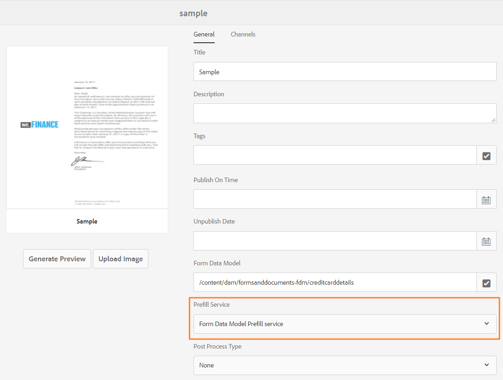

# 使用表單資料模型 {#use-form-data-model}

[!DNL Experience Manager Forms] 資料整合允許您使用不同的後端資料源來建立表單資料模型，您可以在各種自適應Forms中將其用作模式 <!--and interactive communications--> 工作流。 它需要配置資料源並根據資料源中可用的資料模型對象和服務建立表單資料模型。 有關詳細資訊，請參閱以下內容：

* [[!DNL Experience Manager Forms] 資料整合](data-integration.md)
* [設定資料來源](configure-data-sources.md)
* [建立表單資料模型](create-form-data-models.md)
* [使用表單資料模型](work-with-form-data-model.md)

表單資料模型是JSON架構的擴展，您可以使用它：

* [建立自適應Forms和片段](#create-af)

<!--* [Create interactive communications and building blocks like text, list, and condition fragments](#create-ic)-->
* [使用示例資料預覽](#preview-ic)
* [使用表單資料模型服務](#prefill)
* [將提交的Adaptive Form資料寫回資料源](#write-af)
* [使用自適應表單規則調用服務](#invoke-services)

## 建立自適應Forms和片段 {#create-af}

您可以建立 [自適應Forms](creating-adaptive-form.md) 和自適應格式片段 <!-- [Adaptive Form Fragments](adaptive-form-fragments.md) --> 基於表單資料模型。 建立自適應表單或自適應表單片段時，請執行以下操作以使用表單資料模型：

1. 在「添加屬性」螢幕的「表單模型」頁籤中，選擇 **[!UICONTROL 窗體資料模型]** 的 **[!UICONTROL 從中選擇]** 的子菜單。

   

1. 點擊以展開 **[!UICONTROL 選擇表單資料模型]**。 列出所有可用表單資料模型。

   從資料模型中選擇。

   

1. (**僅自適應表單片段**)可以基於表單資料模型中的一個資料模型對象建立自適應表單片段。 展開 **[!UICONTROL 表單資料模型定義]** 下拉。 它列出指定表單資料模型中的所有資料模型對象。 從清單中選擇資料模型對象。

   

   一旦建立基於表單資料模型的自適應表單或自適應表單片段，表單資料模型對象將出現在 **[!UICONTROL 資料源]** 的子菜單。

   >[!NOTE]
   >
   >對於自適應表單片段，只有創作時選擇的資料模型對象及其關聯的資料模型對象才會顯示在「資料源」頁籤中。

   

   可以將資料模型對象拖放到自適應表單或片段上以添加表單域。 添加的表單域保留元資料屬性並與資料模型對象屬性綁定。 該綁定確保在提交表單時在相應資料源中更新欄位值，並在呈現表單時預填。

<!-- ## Create interactive communications {#create-ic}

You can create an interactive communication based on a Form Data Model that you can use to prefill interactive communication with data from configured data sources. In addition, the building blocks of an interactive communication, such as text, list, and condition document fragments can be based on a form data model.

You can choose a Form Data Model when creating an interactive communication or a document fragment. The following image shows the General tab of the Create Interactive Communication dialog.

General tab of Create Interactive Communication dialog

For more information, see:

[Create an interactive communication](create-interactive-communication.md)

[Text in Interactive Communications](texts-interactive-communications.md)

[Conditions in Interactive Communications](conditions-interactive-communications.md)

[List fragments](lists.md) -->

## 使用示例資料預覽 {#preview-ic}

「表單資料模型」編輯器允許您為表單資料模型中的資料模型對象生成和編輯示例資料。 可以使用此資料預覽和test <!--interactive communications and--> 適應Forms。 在預覽之前必須生成示例資料，如中所述 [使用表單資料模型](work-with-form-data-model.md#sample)。

<!--To preview an interactive communication with sample Form Data Model data:

1. On [!DNL  Experience Manager] author instance, navigate to **[!UICONTROL Forms > Forms & Documents]**.
1. Select an interactive communication and tap **[!UICONTROL Preview]** in the toolbar to select **[!UICONTROL Web Channel]**, **[!UICONTROL Print Channel]**, or **[!UICONTROL Both Channels]** to preview the interactive communication.
1. In the Preview [*channel*] dialog, ensure that **[!UICONTROL Test Data of Form Data Model]** is selected and tap **[!UICONTROL Preview]**.

The interactive communication opens with prefilled sample data.

-->

要預覽帶有示例資料的自適應表單，請在作者模式下開啟自適應表單，然後點擊 **[!UICONTROL 預覽]**。

## 使用表單資料模型服務預填充 {#prefill}

[!DNL Experience Manager Forms] 提供現成表單資料模型預填充服務，您可以為自適應Forms啟用 <!--and interactive communications--> 基於表單資料模型。 預填充服務在自適應表單中查詢資料模型對象的資料源 <!--and interactive communication--> 因此，在呈現表單或通信時預填充資料。

要為自適應表單啟用表單資料模型預填充服務，請開啟自適應表單容器屬性並選擇 **[!UICONTROL 表單資料模型預填充服務]** 從 **[!UICONTROL 預填充服務]** 按鈕。 然後，保存屬性。

<!--To configure Form Data Model prefill service in an interactive communication, you can select Form Data Model Prefill Service in the Prefill Service drop-down while creating it or later by modifying the properties.

Edit Properties dialog for an interactive communication-->

## 將提交的Adaptive Form資料寫入資料源 {#write-af}

當用戶基於表單資料模型提交表單時，可以配置表單以將資料模型對象的提交資料寫入其資料源。 為了實現這個用例， [!DNL Experience Manager Forms] 提供 [表單資料模型提交操作](configuring-submit-actions.md)，僅適用於基於表單資料模型的自適應Forms。 它將資料模型對象的提交資料寫入其資料源。

要配置表單資料模型提交操作，請開啟自適應表單容器屬性並選擇 **[!UICONTROL 使用表單資料模型提交]** 從「提交」面板下的「提交操作」下拉清單中。 然後，瀏覽並從 **[!UICONTROL 要提交的資料模型對象的名稱]** 下拉。 保存屬性。

在表單提交時，將配置的資料模型對象的資料寫入相應的資料源。

<!---->

您還可以使用二進位資料模型對象屬性將表單附件提交到資料源。 執行以下操作將附件提交到JDBC資料源：

1. 將包含二進位屬性的資料模型對象添加到表單資料模型。
1. 在自適應窗體中，拖放 **[!UICONTROL 檔案附件]** 從「元件」瀏覽器到「自適應表單」。
1. 點擊以選擇添加的元件，然後點擊  開啟元件的屬性瀏覽器。
1. 在「綁定引用」欄位中，按一下  並導航以選擇在表單資料模型中添加的二進位屬性。 根據需要配置其他屬性。

   點擊  的子菜單。 附件欄位現在綁定到窗體資料模型的二進位屬性。

1. 在「自適應表單容器」屬性的「提交」部分，啟用 **[!UICONTROL 提交表單附件]**。 它在提交表單時將二進位屬性欄位中的附件提交到資料源。

## 使用規則調用自適應Forms中的服務 {#invoke-services}

在基於表單資料模型的自適應表單中， [建立規則](rule-editor.md) 調用窗體資料模型中配置的服務。 的 **[!UICONTROL 調用服務]** 規則中的操作將列出表單資料模型中的所有可用服務，並允許您為服務選擇輸入和輸出欄位。 您還可以使用 **[!UICONTROL 設定值]** 規則類型，用於調用表單資料模型服務並將欄位的值設定為服務返回的輸出。

例如，以下規則調用以員工ID為輸入的獲取服務，返回的值將填充到表單中相應的「從屬ID」、「姓氏」、「名字」和「性別」欄位中。

此外，您還可以 `guidelib.dataIntegrationUtils.executeOperation` 在規則編輯器的代碼編輯器中編寫JavaScript的API。 <!-- For API details, see [API to invoke Form Data Model service](invoke-form-data-model-services.md).-->
