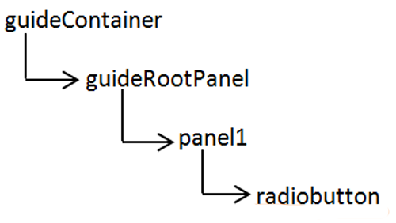
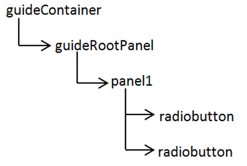

# 在最適化表單中使用 SOM 運算式{#using-som-expressions-in-adaptive-forms}

最適化Forms是以AEM頁面建模，在AEM存放庫中呈現為JCR內容結構。 內容結構的關鍵元素是guideContainer節點。 guideContainer下方有rootPanel，其中可能包含巢狀面板和欄位。

您可以使用指令碼物件模型(SOM)來參照特定檔案物件模型(DOM)中的值、屬性和方法。 DOM會以樹狀階層組織記憶體物件和屬性。 SOM運算式會參考欄位/Draw元素和面板。

下圖說明將元件新增至表單時，最適化表單轉譯的節點結構。 例如，您可以將面板新增至根面板，以及在執行階段轉換為DOM的面板中新增選項按鈕。 最適化表單中選項按鈕欄位的SOM運算式指定為`guide[0].guide1[0].guideRootPanel[0].panel1[0].radiobutton[0]`。

DOM樹狀結構

適用性表單中任何專案的SOM運算式都以`guide[0].guide1[0]`為前置詞。 元件在節點結構階層中的位置是用來衍生其SOM運算式。

包含兩個選項按鈕的DOM樹狀結構

當您變更最適化表單中選項按鈕的位置時，SOM運算式會變更。 在撰寫模式中，您可以使用「檢視SOM運算式」選項來檢視[!DNL AEM Forms]中欄位或元素的SOM運算式。 當您以滑鼠右鍵按一下欄位或元素時，面板上就會顯示選項。

在最適化表單中擷取SOM運算式

在面板中，您可以從面板工具列存取功能。 此功能有助於最適化表單作者的指令碼。

使用面板工具列擷取SOM運算式

[GuideBridge](https://helpx.adobe.com/aem-forms/6/javascript-api/GuideBridge.html)中列出的部分API會使用專案的SOM運算式。 例如，若要將焦點置於最適化表單中的特定欄位，請將對應的SOM運算式傳遞至`getFocus`中的`guideBridge`API。
