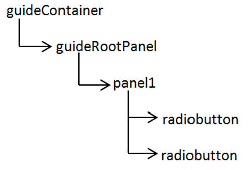

# 在適用性Forms中使用SOM運算式{#using-som-expressions-in-adaptive-forms}

適用性Forms會模型化為AEM頁面，在AEM存放庫中以JCR內容結構表示。 內容結構的關鍵元素為guideContainer節點。 在guideContainer下方，可能包含巢狀面板和欄位的rootPanel。

可以使用指令碼對象模型(SOM)來參考特定文檔對象模型(DOM)中的值、屬性和方法。 DOM將記憶體對象和屬性組織在樹層次中。 SOM表達式引用欄位/繪製元素和面板。

下圖描述了當您將元件添加到表單時，適用性表單將轉換為的節點結構。 例如，您可以將面板新增至根面板，以及在執行階段轉換為DOM的面板中的選項按鈕。 適用性表單中單選按鈕欄位的SOM運算式指定為 `guide[0].guide1[0].guideRootPanel[0].panel1[0].radiobutton[0]`.

DOM樹

適用性表單中任何元素的SOM運算式會加上前置詞 `guide[0].guide1[0]`. 元件在節點結構層次中的位置用於導出其SOM表達式。

具有兩個單選按鈕的DOM樹

當您更改「最適化表單」中單選按鈕的位置時，SOM表達式將更改。 在製作模式中，您可以檢視內欄位或元素的SOM運算式 [!DNL AEM Forms] 使用「查看SOM表達式」選項。 當您以滑鼠右鍵按一下欄位或元素時，選項便會出現在面板上。

在最適化表單中擷取SOM運算式

在面板內，您可以從面板工具列存取功能。 此功能可方便適用性表單作者編寫指令碼。

使用面板工具欄提取SOM表達式

列於 [GuideBridge](https://helpx.adobe.com/aem-forms/6/javascript-api/GuideBridge.html) 使用元素的SOM運算式。 例如，若要將焦點置於適用性表單中的特定欄位，請將對應的SOM運算式傳遞至 `getFocus`API `guideBridge`.
