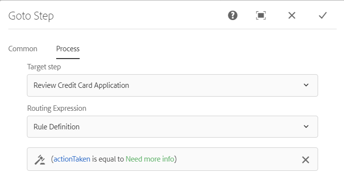

# 以Forms為中心的工作流中的AEM變數 {#variables-in-aem-forms-workflows}

工作流模型中的變數是基於其資料類型來儲存值的一種方式。 可以在任何工作流步驟中使用變數的名稱來檢索儲存在變數中的值。 也可以使用變數名稱來定義用於做出路由選擇的表達式。

在工AEM作流模型中，您可以：

* [建立變數](variable-in-aem-workflows.md#create-a-variable) 類型的資料類型。
* [為變數設定值](variable-in-aem-workflows.md#set-a-variable) 使用「設定變數」(Set Variable)工作流步驟。
* [使用變數](variable-in-aem-workflows.md#use-a-variable) 全部 [!DNL AEM Forms] 要檢索儲存值的工作流步驟，以及在「或分割」(OR Split)和「轉至」(Goto)步驟中定義路由表達式。

以下視頻演示了如何在工作流模型中建立、設定和AEM使用變數：

>[!VIDEO](assets/variables_introduction_1_1.mp4)

變數是現有 [元資料映射](https://helpx.adobe.com/experience-manager/6-5/sites/developing/using/reference-materials/javadoc/com/adobe/granite/workflow/metadata/MetaDataMap.html) 。 您可以使用 [元資料映射](https://helpx.adobe.com/experience-manager/6-5/sites/developing/using/reference-materials/javadoc/com/adobe/granite/workflow/metadata/MetaDataMap.html) 訪問使用變數保存的元資料。

## 建立變數 {#create-a-variable}

使用工作流模型旁邊可用的「變數」(Variables)部分建立變數。 工AEM作流變數支援以下資料類型：

* **基元資料類型**:長、雙、布爾、日期和字串
* **複雜資料類型**: [文檔](https://helpx.adobe.com/experience-manager/6-5/forms/javadocs/com/adobe/aemfd/docmanager/Document.html)。 [XML](https://docs.oracle.com/javase/8/docs/api/org/w3c/dom/Document.html)。 [JSON](https://static.javadoc.io/com.google.code.gson/gson/2.3/com/google/gson/JsonObject.html)和窗體資料模型實例。

>[!NOTE]
>
>工作流僅支援日期類型變數的ISO8601格式。

使用ArrayList資料類型建立變數集合。 可以為所有基元和複雜資料類型建立ArrayList變數。 例如，建立ArrayList變數，然後選擇String作為子類型，以使用該變數儲存多個字串值。

要建立變數：

1. 在實例AEM上，導航至「工具」  >工作流>模型。
1. 點擊 **[!UICONTROL 建立]** 並指定工作流模型的標題和可選名稱。 選取模型並點擊 **[!UICONTROL 編輯]**。
1. 點擊工作流模型旁邊可用的變數表徵圖，點擊 **[!UICONTROL 添加變數]**。

   

1. 在「添加變數」(Add Variable)對話框中，指定變數名稱並選擇變數類型。
1. 從 **[!UICONTROL 類型]** 下拉清單並指定以下值：

   * 基元資料類型 — 為變數指定可選預設值。
   * JSON或XML — 指定可選的JSON或XML架構路徑。 系統在將此模式中的可用屬性映射到另一個變數並將其儲存時驗證模式路徑。
   * 表單資料模型 — 指定表單資料模型路徑。
   * ArrayList — 指定集合的子類型。

1. 指定變數的可選說明並點擊  的子菜單。 變數顯示在左窗格中可用的清單中。

在建立變數時，請考慮以下操作：

* 建立工作流所需的變數數。 但是，要節省資料庫資源，請盡可能使用所需的最小變數數，並重新使用變數。
* 變數區分大小寫。 確保在工作流中使用相同大小寫引用變數。
* 避免在變數名稱中使用特殊字元

## 設定變數 {#set-a-variable}

可以使用「設定變數」(Set Variable)步驟來設定變數的值並定義值的設定順序。 變數按設定變數步驟中列出變數映射的順序設定。

變數值的更改只影響發生更改的進程實例。 例如，當啟動工作流並更改變數資料時，更改僅影響工作流的該實例。 這些更改不會影響以前啟動或以後啟動的工作流的其他實例。

根據變數的資料類型，可以使用以下選項來設定變數的值：

* **文字：** 當知道要指定的精確值時，使用該選項。 您還可以使用該選項以字串形式指定JSON。

* **表達式：** 在根據表達式計算要使用的值時，使用該選項。 表達式是在提供的表達式編輯器中建立的。

* **JSON點表示法：** 使用該選項從JSON或FDM類型變數中檢索值。
* **XPATH:** 使用該選項從XML類型變數中檢索值。

* **相對於負載：** 當要保存到變數的值在相對於負載的路徑上可用時，請使用該選項。

* **絕對路徑：** 當要保存到變數的值在絕對路徑上可用時，使用該選項。

您還可以使用JSON DOT表示法或XPATH表示法更新JSON或XML類型變數的特定元素。

### 添加變數之間的映射 {#add-mapping-between-variables}

要添加變數之間的映射：

1. 在工作流編輯頁面上，按一下工作流模型旁邊部分中可用的「步驟」表徵圖。
1. 拖放 **[!UICONTROL 設定變數]** 步驟到工作流編輯器，點擊該步驟並選擇  （配置）。
1. 在「設定變數」(Set Variable)對話框上，選擇 **[!UICONTROL 映射]** > **[!UICONTROL 添加映射]**。
1. 在 **映射變數** 部分，選擇要儲存資料的變數，選擇映射模式，並指定要儲存在變數中的值。 映射模式根據變數的類型而改變。
1. 映射更多變數以生成有意義的表達式。 點擊  的子菜單。

### 示例1:查詢XML變數以設定字串變數的值 {#example-query-an-xml-variable-to-set-value-for-a-string-variable}

選擇XML類型的變數以儲存XML檔案。 查詢XML變數，為XML檔案中可用的屬性設定字串變數的值。 使用 **為XML變數指定XPATH** 欄位，以定義要儲存在字串變數中的屬性。

在此示例中，選擇 **格式資料** 用於儲存 **cc-app.xml** 的子菜單。 查詢 **格式資料** 變數，以設定 **電子郵件地址** 字串變數，用於儲存 **電子郵件地址** 屬性 **cc-app.xml** 的子菜單。

>[!VIDEO](https://helpx.adobe.com/content/dam/help/en/experience-manager/6-5/forms/using/set_variable_example1.mp4 "設定變數的值")

### 示例2:使用表達式根據其他變數儲存值 {#example2}

使用表達式計算變數的和並將結果儲存在變數中。

在此示例中，使用表達式編輯器定義表達式以計算 **資產成本** 和 **餘額** 變數並將結果儲存在 **合計值** 變數。

>[!VIDEO](https://helpx.adobe.com/content/dam/help/en/experience-manager/6-5/forms/using/variables_expression.mp4)

## 使用表達式編輯器 {#use-expression-editor}

還可以使用表達式計算運行時變數的值。 變數提供表達式編輯器來定義表達式。

使用表達式編輯器可以：

* 使用其他工作流變數、數字或數學表達式設定變數的值。
* 在數學表達式中使用工作流變數、字串、數字或表達式
* 添加條件以設定變數值。
* 在條件之間添加運算子。


它基於自適應Forms規則編輯器，具有以下更改。 變數中的規則編輯器：

* 不支援函式。
* 不提供用於查看規則摘要的UI
* 沒有代碼編輯器。
* 不支援對象的啟用和禁用值。
* 不支援對象的setting屬性。
* 不支援調用Web服務。

有關詳細資訊，請參見 [自適應Forms規則編輯器](rule-editor.md)。

## 使用變數 {#use-a-variable}

可以使用變數來檢索輸入和輸出或保存步驟的結果。 工作流編輯器提供了兩種類型的工作流步驟：

* 支援變數的工作流步驟
* 不支援變數的工作流步驟

### 支援變數的工作流步驟 {#workflow-steps-with-support-for-variables}

「轉至」(Go To)步驟、「或拆分」(OR Split)步驟以及所有 [!DNL AEM Forms] 工作流步驟支援變數。

#### 或拆分步驟 {#or-split-step}

「或拆分」(OR Split)在工作流中建立一個拆分，之後只有一個分支處於活動狀態。 此步驟使您能夠將條件處理路徑引入工作流。 根據需要將工作流步驟添加到每個分支。

可以使用規則定義、ECMA指令碼或外部指令碼為分支定義路由表達式。

可以使用變數使用表達式編輯器定義路由表達式。 有關使用「或分割」步驟的路由表達式的詳細資訊，請參見 [或拆分步驟](https://experienceleague.adobe.com/docs/experience-manager-65/developing/extending-aem/extending-workflows/workflows-step-ref.html#extending-aem#or-split)。

在本示例中，在定義路由表達式之前，請使用 [示例2](variable-in-aem-workflows.md#example2) 為 **合計值** 變數。 如果 **合計值** 變數大於50000。 同樣，如果Branch 2的值 **合計值** 變數小於50000。

>[!VIDEO](https://helpx.adobe.com/content/dam/help/en/experience-manager/6-5/forms/using/variables_orsplit_example.mp4)

同樣，選擇外部指令碼路徑或指定路由表達式的ECMA指令碼以計算活動分支。 點擊 **[!UICONTROL 更名分支]** 指定分支的備用名稱。

<!-- For more examples, see [Create a workflow model](aem-forms-workflow.md#create-a-workflow-model). -->

#### 轉到步驟 {#go-to-step}

的 **轉至步驟** 允許您根據路由表達式的結果，在工作流模型中指定要執行的下一步。

與「或拆分」步驟類似，您可以使用規則定義、ECMA指令碼或外部指令碼為「轉到」步驟定義路由表達式。

可以使用變數使用表達式編輯器定義路由表達式。 有關使用「轉至」步驟的路由表達式的詳細資訊，請參見 [轉至步驟](https://experienceleague.adobe.com/docs/experience-manager-65/developing/extending-aem/extending-workflows/workflows-step-ref.html#extending-aem#goto-step)。



在此示例中，如果「轉到」步驟的值為 **行動** 變數等於 **需要更多資訊**。

有關在轉到步驟中使用規則定義的更多示例，請參見 [模擬For循環](https://experienceleague.adobe.com/docs/experience-manager-65/developing/extending-aem/extending-workflows/workflows-step-ref.html#extending-aem#simulateforloop)。

#### 以Forms為中心的工作流步驟 {#forms-workflow-centric-workflow-steps}

全部 [!DNL AEM Forms] 工作流步驟支援變數。 有關詳細資訊，請參見 [基於OSGi的以Forms為中心的工作流](aem-forms-workflow-step-reference.md)。

### 不支援變數的工作流步驟 {#workflow-steps-without-support-for-variables}

您可以使用 [元資料映射](https://helpx.adobe.com/experience-manager/6-5/sites/developing/using/reference-materials/javadoc/com/adobe/granite/workflow/metadata/MetaDataMap.html) 用於訪問不支援變數的工作流步驟中的變數的介面。

#### 檢索變數值 {#retrieve-the-variable-value}

使用ECMA指令碼中的以下API可基於資料類型檢索現有變數的值：

| 變數資料類型 | API |
|---|---|
| 基元（長、雙、布爾、日期和字串） | workItem.getWorkflowData()。getMetaDataMap()。get(variableName, type) |
| 文件 | Packages.com.adobe.aemfd.docmanager.Document doc = workItem.getWorkflowData()。getMetaDataMap()。get(&quot;docVar&quot;, Packages.com.adobe.aemfd.docmanager.Document.class); |
| XML | Packages.org.w3c.dom.Document xmlObject = workItem.getWorkflowData()。getMetaDataMap()。get(variableName, Packages.org.w3c.dom.Document.class); |
| 表單資料模型 | Packages.com.adobe.aem.dermis.api.FormDataModelInstance fdmObject = workItem.getWorkflowData()。getMetaDataMap()。get(variableName, Packages.com.adobe.aem.dermis.api.FormDataModelInstance.class); |
| JSON | Packages.com.google.gson.JsonObject jsonObject = workItem.getWorkflowData()。getMetaDataMap()。get(variableName, Packages.com.google.gson.JsonObject.class); |


**範例**

使用以下API檢索字串資料類型的值：

```javascript
workItem.getWorkflowData().getMetaDataMap().get(accname, Packages.java.lang.String)
```

#### 更新變數值 {#update-the-variable-value}

在ECMA指令碼中使用以下API更新變數的值：

```javascript
workItem.getWorkflowData().getMetaDataMap().put(variableName, value)
```

**範例**

```javascript
workItem.getWorkflowData().getMetaDataMap().put(salary, 50000)
```

更新 **薪** 變數為50000。

### 設定變數以調用工作流 {#apiinvokeworkflow}

可以使用API設定變數並傳遞它們以調用工作流實例。

[workflowSession.startWorkflow](https://helpx.adobe.com/experience-manager/6-5/sites/developing/using/reference-materials/javadoc/com/adobe/granite/workflow/WorkflowSession.html#startWorkflow-com.adobe.granite.workflow.model.WorkflowModel-com.adobe.granite.workflow.exec.WorkflowData-java.util.Map-) 將model、wfData和metaData用作參數。 使用MetaDataMap為變數設定值。

在此API中， **變數名稱** 變數設定為 **值** 使用metaData.put(variableName, value);

```javascript
import com.adobe.granite.workflow.model.WorkflowModel;
import com.adobe.granite.workflow.metadata.MetaDataMap;
import com.adobe.aemfd.docmanager.Document;

/*Assume that you already have a workflowSession and modelId along with the payloadType and payload*/
WorkflowData wfData = workflowSession.newWorkflowData(payloadType, payload);
MetaDataMap metaData = wfData.getMetaDataMap();
metaData.put(variableName, value); //Create a variable "variableName" in your workflow model
WorkflowModel model = workflowSession.getModel(modelId);
workflowSession.startWorkflow(model, wfData, metaData);
```

**範例**

初始化 **文檔** 將文檔對象設定為路徑(「a/b/c」)，並設定 **docVar** 變數到儲存在文檔對象中的路徑。

```javascript
import com.adobe.granite.workflow.WorkflowSession;
import com.adobe.granite.workflow.exec.WorkflowData;
import com.adobe.granite.workflow.model.WorkflowModel;
import com.adobe.granite.workflow.metadata.MetaDataMap;
import com.adobe.aemfd.docmanager.Document;

/*This example assumes that you already have a workflowSession and modelId along with the payloadType and payload */
WorkflowData wfData = workflowSession.newWorkflowData(payloadType, payload);
MetaDataMap metaData = wfData.getMetaDataMap();
Document doc = new Document("/a/b/c");// initialize a document object
metaData.put("docVar",doc); //Assuming that you have created a variable "docVar" of type Document in your workflow model
WorkflowModel model = workflowSession.getModel(modelId);
workflowSession.startWorkflow(model, wfData, metaData);
```

## 編輯變數 {#edit-a-variable}

1. 在編輯工作流頁面上，按一下工作流模型旁鍵中可用的「變數」表徵圖。 左窗格中的「變數」部分顯示所有現有變數。
1. 點擊  要編輯的變數名稱旁邊的（編輯）表徵圖。
1. 編輯變數資訊並點擊  的子菜單。 無法編輯 **[!UICONTROL 名稱]** 和 **[!UICONTROL 類型]** 欄位。

## 刪除變數 {#delete-a-variable}

刪除變數之前，請從工作流中刪除變數的所有引用。 確保該變數未在工作流中使用。

要刪除變數：

1. 在編輯工作流頁面上，按一下工作流模型旁鍵中可用的「變數」表徵圖。 左窗格中的「變數」部分顯示所有現有變數。
1. 按一下要刪除的變數名稱旁邊的「刪除」表徵圖。
1. 點擊  確認和刪除變數。

## 引用 {#references}

有關在中使用變數的更多示例 [!DNL AEM Forms] 工作流步驟，請參閱 [工作流中的AEM變數](https://helpx.adobe.com/experience-manager/kt/forms/using/authoring_variables_in_aem_forms-workflow1.html)。
