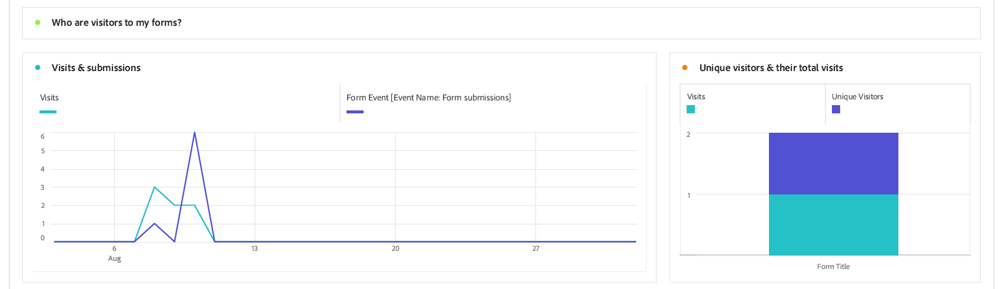

# 檢視和瞭解Adaptive Forms analytics報表 {#viewing-and-understanding-aem-forms-analytics-reports}

 這是搶鮮版功能，可透過我們的以下網站存取： [發行前通道](https://experienceleague.adobe.com/docs/experience-manager-cloud-service/content/release-notes/prerelease.html#new-features). 

在快速發展的數位分析中，為了做出明智的決策並最佳化數位體驗，必須跟上全球趨勢。 為解決此問題，最適化Forms與Adobe Analytics緊密整合，以擷取及追蹤您已發佈表單和檔案的績效量度。 分析這些量度是為了使用量度和分析來增強表單的可用性和有效性，進而做出資料導向式決策。

透過擷取和追蹤關鍵績效指標，企業可以找出需要改善的領域、最佳化使用者體驗，並最終推動更好的結果，以建立卓越的客戶體驗。

## 將Adobe Analytics設定為最適化Forms {#setup-adobe-analytics-to-aem-forms}

針對AEM Forms Analytics報表，首先需透過「Experience Cloud設定自動化」將Adobe Analytics整合至AEM Forms。 Adaptive Forms中的Experience Cloud設定自動化需要Adobe Analytics授權、Data Collection (先前稱為Adobe Launch)來管理追蹤指令碼，以及與Experience Platform Launch API整合，以簡化資料彙總和見解產生。 造訪 [使用Experience Cloud設定自動化啟用最適化表單的Adobe Analytics](/help/forms/forms-experience-cloud-setup-automation.md) 以取得完整的設定資訊。

## 檢視最適化Forms Adobe Analytics報表 {#view-adobe-analytics-report}

1. 在您的AEM執行個體上，前往 **[!UICONTROL Forms]** >> **[!UICONTROL Forms和檔案]**.
1. 選取您的表單，您會看到Adobe Analytics已整合（如左側所示）至為Adobe Analytics啟動的Forms。

   {width="100%"}

1. 按一下 **Adobe Analytics** 以檢視您的報表和分析效能資料。

## 瞭解最適化Forms分析報表 {#understanding-aem-forms-analytics-reports}

Adobe Analytics提供全方位的Adaptive Forms效能量度，旨在提供表單使用的寶貴見解。 這些量度包括：

### **最適化Forms表現如何？** {#how-your-adaptive-form-is-performing}

它具有表單轉譯、表單提交、驗證錯誤和不重複訪客量度，可讓您評估表單的使用情況和成效：

* **表單轉譯**：表單轉譯會顯示表單已轉譯或開啟的次數。

* **表單提交**：表單提交指出使用者成功完成並提交適用性表單的次數。

* **驗證錯誤**：驗證錯誤顯示表單欄位上發生的驗證相關錯誤總數。

* **不重複訪客**：不重複訪客代表訪客轉譯表單的次數。 如需不重複訪客的詳細資訊，請參閱 [不重複訪客、造訪和客戶行為](https://experienceleague.adobe.com/docs/analytics/components/metrics/visits.html).

  {width="100%"}

### **您的表單的訪客** {#visitors-to-your-forms}

它可協助您針對表單上的訪客活動獲得有價值的深入分析：

* **瀏覽與提交**：其說明日期範圍內造訪您表格的頻率以及表格提交的相關次數，以取得此次點按的詳細資訊 [造訪](https://experienceleague.adobe.com/docs/analytics/components/metrics/visits.html).
* **不重複訪客及其造訪總數**：它會區分新使用者和回訪使用者。 例如，某位訪客可能在一個月內每天造訪您的網站，但這仍會計為單一不重複訪客。 造訪 [不重複訪客](https://experienceleague.adobe.com/docs/analytics/components/metrics/unique-visitors.html) 以取得詳細資訊。

  {width="100%"}

### **裝置型別** {#device-type}

裝置型別可協助您識別用來存取表單的裝置型別。 它將裝置型別分類為行動裝置型別。 例如，在此範例中，選擇「行動裝置型別：其他」和「行動裝置型別：行動電話」。 各種型別的行動裝置包括手機、平板電腦、媒體播放器、遊戲主機等。

{width="100%"}

### **地理劃分** {#geographical-breakdown}

其中會顯示Forms的存取位置。 它提供有關表單使用者的地區特定資訊，例如，您可以看到有關表單使用者的地區特定資訊是印度，如影像所示。

{width="100%"}

### **流量主要來源和常見表單** {#top-sources-of-traffic-and-popular-forms}

這可協助您識別主要來源或參照表單的連結。 例如，在下方的指定影像中，您會看到最適化表單的搜尋例項，其中18.9%為 **分類/建立書籤**， 70.49%根據 **搜尋引擎**，其中24%來自 **其他網站**. 您可以根據需求定義維度專案。 此外，您也可以排序哪些是瀏覽次數最多或最受歡迎的表單。

{width="100%"}

### **熱門表單上的使用者活動** {#user-activity-on-top-forms}

使用者參與欄位瀏覽、表單轉譯、驗證錯誤、放棄的表單和表單提交的完整檢視，提供最活躍表單的相關深入分析。 在下圖中，您會看到根據表單事件量度，「應用程式表單」是最為活躍的。

{width="100%"}

### **表單逗留時間的時間表** {#timeline-for-time-spent-on-forms}

這是使用者隨著時間花在表格上的時間，可協助您識別參與模式。

{width="100%"}

### **訪客在填寫表單時需要協助的區域** {#areas-requiring-assistance}

說明檢視、驗證錯誤和欄位瀏覽等量度會顯示使用者在哪些位置需要協助或如何追蹤欄位中的錯誤。 例如，在下圖中，您會在包含欄位（例如）的表單中看到 **全名**， **電話號碼**， **DoB**. 此 **全名** 欄位有12次造訪，在12次造訪中，有8次造訪發生驗證錯誤，有1次點按說明圖示可在此欄位上檢視說明。 您可以檢視其他表單欄位的量度資料。

{width="100%"}

### **訪客在放棄表單前檢視的最後一個表單欄位** {#last-form-field-that-visitors-viewed}

它可協助您分析使用者在放棄表單前所花時間的表單欄位。 例如，在下方給定的影像中，在5個放棄的表單中，有2個在欄位中保留 **全名**，欄位左側2 **電話號碼**，而欄位上還剩1個 **文字輸入**.

{width="100%"}