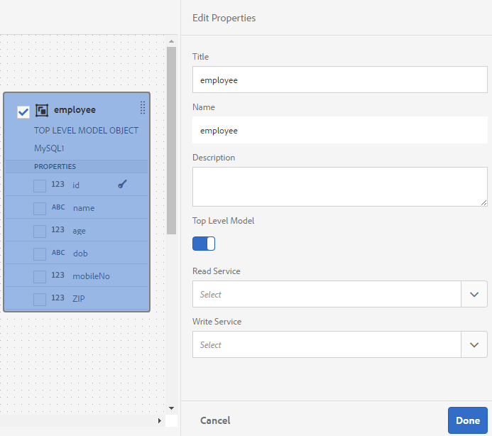
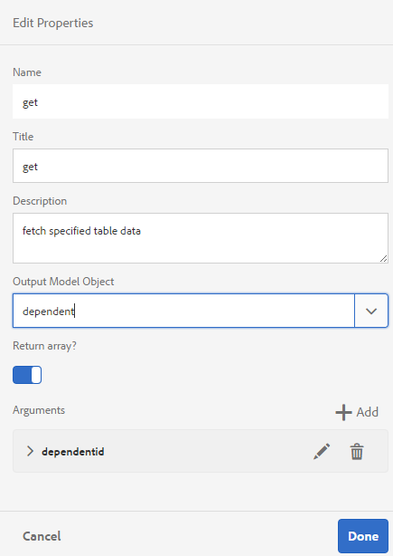
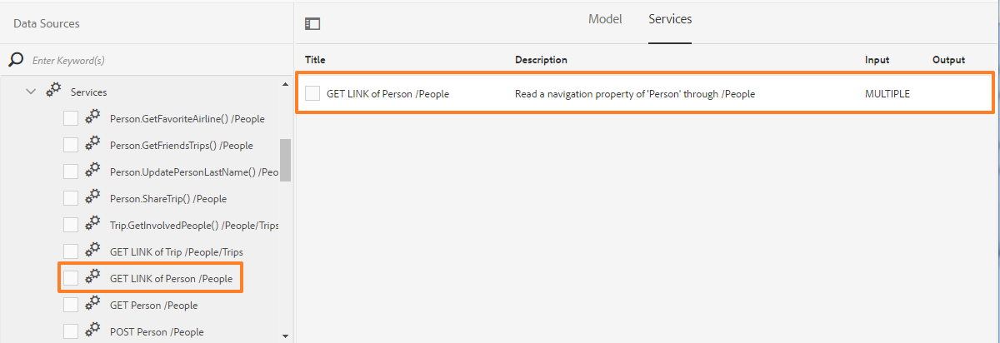
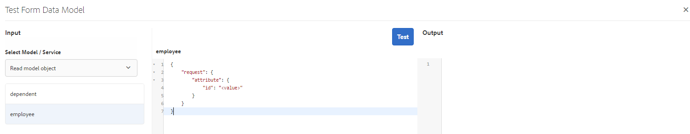

# 處理表單資料模型 {#work-with-form-data-model}


表單資料模型編輯器提供了用於編輯和配置表單資料模型的直觀用戶介面和工具。 使用編輯器，可以在表單資料模型中從關聯資料源添加和配置資料模型對象、屬性和服務。 此外，它允許您建立沒有資料源的資料模型對象和屬性，並稍後將它們與相應的資料模型對象和屬性綁定。 您還可以為資料模型對象屬性生成和編輯示例資料，這些資料可用於預填充自適應Forms <!--and interactive communications--> 預覽時。 您可以test在表單資料模型中配置的資料模型對象和服務，以確保它與資料源正確整合。

如果您是Forms資料整合的新手，並且尚未配置資料源或建立表單資料模型，請參閱以下主題：

* [[!DNL Experience Manager Forms] 資料整合](data-integration.md)
* [設定資料來源](configure-data-sources.md)
* [建立表單資料模型](create-form-data-models.md)

有關可以使用表單資料模型編輯器執行的各種任務和配置的詳細資訊，請閱讀。

>[!NOTE]
>
>您必須是兩者的成員 **fdm作者** 和 **表單用戶** 組以便能夠建立和使用表單資料模型。 聯繫您 [!DNL Experience Manager] 管理員成為組的成員。

## 添加資料模型對象和服務 {#add-data-model-objects-and-services}

如果建立了具有資料源的表單資料模型，則可以使用表單資料模型編輯器添加資料模型對象和服務、配置其屬性、在資料模型對象之間構建關聯以及test表單資料模型和服務。

可以從表單資料模型中的可用資料源添加資料模型對象和服務。 添加的資料模型對象顯示在「模型」頁籤中，添加的服務顯示在「服務」頁籤中。

要添加資料模型對象和服務，請執行以下操作：

1. 登錄 [!DNL Experience Manager] 作者實例，導航 **[!UICONTROL Forms>資料整合]**，並開啟要在其中添加資料模型對象的窗體資料模型。
1. 在「資料源」窗格中，展開資料源以查看可用的資料模型對象和服務。
1. 選擇要添加到表單資料模型的資料模型對象和服務，然後點擊 **[!UICONTROL 添加選定項]**。

   

   所選資料模型對象和服務

   的 **[!UICONTROL 模型]** 頁籤顯示所有資料模型對象及其添加到窗體資料模型的屬性的圖形表示。 每個資料模型對象由表單資料模型中的框表示。

   

   **[!UICONTROL 模型]** 頁籤顯示添加的資料模型對象

   >[!NOTE]
   >
   >可以圍繞資料模型對象框進行按住和拖動，以在內容區域中組織它們。 在「表單資料模型」中添加的所有資料模型對象在「資料源」窗格中呈灰色顯示。

   的 **[!UICONTROL 服務]** 頁籤列出添加的服務。

   

   **[!UICONTROL 服務]** 頁籤顯示資料模型服務

   >[!NOTE]
   >
   >除了資料模型對象和服務之外，OData服務元資料文檔還包括定義兩個資料模型對象之間的關聯的導航屬性。 有關詳細資訊，請參見 [使用OData服務的導航屬性](#work-with-navigation-properties-of-odata-services)。

1. 點擊 **[!UICONTROL 保存]** 的子菜單。

   >[!NOTE]
   >
   >可以使用自適應表單規則調用在表單資料模型的「服務」頁籤中配置的服務。 已配置的服務可在規則編輯器的「調用服務」操作中使用。有關在自適應表單規則中使用這些服務的詳細資訊，請參閱中的「調用服務和設定規則值」 [規則編輯器](rule-editor.md)。

## 建立資料模型對象和子屬性 {#create-data-model-objects-and-child-properties}

### 建立資料模型對象 {#create-data-model-objects}

雖然可以從配置的資料源添加資料模型對象，但也可以建立沒有資料源的資料模型對象或實體。 如果您未在表單資料模型中配置資料源，則此功能尤其有用。

建立沒有資料源的資料模型對象：

1. 登錄 [!DNL Experience Manager] 作者實例，導航 **[!UICONTROL Forms>資料整合]**，並開啟要在其中建立資料模型對象或實體的表單資料模型。
1. 點擊 **[!UICONTROL 建立實體]**。
1. 在 [!UICONTROL 建立資料模型] 對話框，指定資料模型對象的名稱並點擊 **[!UICONTROL 添加]**。 資料模型對象被添加到表單資料模型。 新添加的資料模型對象未綁定到資料源，並且沒有以下影像中所示的任何屬性。

   

接下來，可以在未綁定資料模型對象中添加子屬性。

### 添加子屬性 {#child-properties}

「表單資料模型」編輯器允許您在資料模型對象中建立子屬性。 建立時的屬性未綁定到資料源中的任何屬性。 以後可以將子屬性與包含資料模型對象中的另一個屬性綁定。

要建立子屬性：

1. 在表單資料模型中，選擇資料模型對象並點擊 **[!UICONTROL 建立子屬性]**。
1. 在 **[!UICONTROL 建立子屬性]** 對話框，為中的屬性指定名稱和資料類型 **[!UICONTROL 名稱]** 和 **[!UICONTROL 類型]** 的下界。 您可以選擇為屬性指定標題和說明。
1. 如果屬性是計算屬性，則啟用計算。 基於規則或表達式計算計算屬性的值。 有關詳細資訊，請參見 [編輯屬性](#properties)。
1. 如果資料模型對象綁定到資料源，則添加的子屬性將自動綁定到具有相同名稱和資料類型的父資料模型對象的屬性。

   要手動將子屬性與資料模型對象屬性綁定，請按一下 **[!UICONTROL 綁定引用]** 的子菜單。 的 **[!UICONTROL 選擇對象]** 對話框列出父資料模型對象的所有屬性。 選擇要綁定的屬性並點擊刻度表徵圖。 只能選擇與子屬性具有相同資料類型的屬性。

1. 點擊 **[!UICONTROL 完成]** 保存子屬性並點擊 **[!UICONTROL 保存]** 以保存窗體資料模型…… 子屬性現在添加到資料模型對象。

建立資料模型對象和屬性後，可以繼續建立自適應Forms <!--and interactive communications--> 基於表格資料模型。 以後，當您有可用的資料源和配置的資料源時，可以將表單資料模型與資料源綁定。 綁定在關聯的自適應Forms中自動更新 <!--and interactive communications-->。 有關建立自適應Forms的詳細資訊 <!--and interactive communications--> 使用表單資料模型，請參閱 [使用表單資料模型](using-form-data-model.md)。

### 綁定資料模型對象和屬性 {#bind-data-model-objects-and-properties}

當要與表單資料模型整合的資料源可用時，可以將它們添加到表單資料模型，如中所述 [更新資料源](create-form-data-models.md#update)。 然後，執行以下操作來綁定未綁定的資料模型對象和屬性：

1. 在表單資料模型中，選擇要與資料源綁定的未綁定資料源。
1. 點擊 **[!UICONTROL 編輯屬性]**。
1. 在 **[!UICONTROL 編輯屬性]** ，按一下 **[!UICONTROL 綁定]** 的子菜單。 開啟 **[!UICONTROL 選擇對象]** 對話框，其中列出了在表單資料模型中添加的資料源。

   

1. 展開資料源樹，選擇要綁定的資料模型對象，然後點擊刻度表徵圖。
1. 點擊 **[!UICONTROL 完成]** 保存屬性，然後點擊 **[!UICONTROL 保存]** 來修改標籤元素的屬性。 資料模型對象現在與資料源綁定。 請注意，資料模型對象不再標籤為未綁定。

   

## 配置服務 {#configure-services}

要讀取和寫入資料模型對象的資料，請執行以下操作來配置讀取和寫入服務：

1. 選中資料模型對象頂部的複選框以選擇該對象並點擊 **[!UICONTROL 編輯屬性]**。

   

   編輯屬性以配置資料模型對象的讀和寫服務

   的 [!UICONTROL 編輯屬性] 對話框。

   

   編輯屬性對話框

   >[!NOTE]
   >
   >除了資料模型對象和服務之外，OData服務元資料文檔還包括定義兩個資料模型對象之間的關聯的導航屬性。 在將OData服務資料源添加到表單資料模型時，在表單資料模型中有一個服務可用於資料模型對象中的所有導航屬性。 可以使用此服務讀取相應資料模型對象的導航屬性。
   >
   >
   >有關使用服務的詳細資訊，請參見 [使用OData服務的導航屬性](#work-with-navigation-properties-of-odata-services)。

1. 切換 **[!UICONTROL 頂級對象]** 指定資料模型對象是否為頂級模型對象。

   在表單資料模型中配置的資料模型對象可用於基於表單資料模型的自適應表單的內容瀏覽器的資料模型對象頁籤中。 在兩個資料模型對象之間添加關聯時，要關聯的資料模型對象嵌套在要關聯的資料模型對象的下面 **[!UICONTROL 資料模型對象]** 頁籤。 如果嵌套資料模型是頂級對象，則它也會單獨顯示在 **[!UICONTROL 資料模型對象]** 頁籤。 因此，您會看到其中兩個條目，一個在嵌套層次結構內，另一個在嵌套層次結構外，這可能會使表單作者感到困惑。 要使關聯的資料模型對象僅顯示在嵌套層次中，請禁用「頂級對象」屬性。

1. 為所選資料模型對象選擇讀和寫服務。 此時將顯示服務的參數。

   

   為員工資料源配置的讀寫服務

1. 點擊  對於讀取服務參數 [將參數綁定到用戶配置檔案屬性、請求屬性或文本值](#bindargument) 並指定綁定值。
1. 點擊 **[!UICONTROL 完成]** 來保存這個論點， **[!UICONTROL 完成]** 保存屬性，然後 **[!UICONTROL 保存]** 來修改標籤元素的屬性。

### 綁定讀取服務參數 {#bindargument}

基於綁定值將Read服務參數綁定到用戶配置檔案屬性、請求屬性或文本值。 該值作為參數傳遞給服務，以從資料源獲取與指定值關聯的詳細資訊。

#### 文字值 {#literal-value}

選擇 **[!UICONTROL 文字]** 從 **[!UICONTROL 綁定到]** 下拉菜單，並在 **[!UICONTROL 綁定值]** 的子菜單。 從資料源檢索與該值相關聯的詳細資訊。 使用此選項可檢索與靜態值關聯的詳細資訊。

在此示例中，與 **436765678**，作為 `mobilenum` 從資料源檢索。 如果傳遞了移動號碼參數的值，則關聯的詳細資訊可以包括客戶名稱、客戶地址和城市等屬性。


#### 使用者檔案屬性 {#user-profile-attribute}

選擇 **[!UICONTROL 用戶配置檔案屬性]** 從 **[!UICONTROL 綁定到]** 下拉菜單，並在 **[!UICONTROL 綁定值]** 的子菜單。 登錄到 [!DNL Experience Manager] 根據屬性名稱從資料源檢索實例。

在 **[!UICONTROL 綁定值]** 欄位必須包括完整的綁定路徑，直到用戶的屬性名。 開啟以下URL以訪問CRXDE上的用戶詳細資訊：

`https://[server-name]:[port]/crx/de/index.jsp#/home/users/`


在此示例中，指定 `profile.empid` 的 **[!UICONTROL 綁定值]** 的 `grios` 。


的 `id` 參數採用 `empid` 用戶配置檔案的屬性，並將其作為參數傳遞給Read服務。 它從員工資料模型對象中讀取並返回關聯屬性的值 `empid` 與登錄用戶關聯。

#### 要求屬性 {#request-attribute}

使用request屬性從資料源檢索關聯的屬性。

1. 選擇 **[!UICONTROL 請求屬性]** 從 **[!UICONTROL 綁定到]** 下拉菜單，並在 **[!UICONTROL 綁定值]** 的子菜單。

1. 建立 [覆蓋](https://experienceleague.adobe.com/docs/experience-manager-cloud-service/implementing/developing/full-stack/overlays.html?lang=en#developing) 為head.jsp。 要建立覆蓋，請開啟CRX DE並複製 `https://<server-name>:<port number>/crx/de/index.jsp#/libs/fd/af/components/page2/afStaticTemplatePage/head.jsp` 檔案 `https://<server-name>:<port number>/crx/de/index.jsp#/apps/fd/af/components/page2/afStaticTemplatePage/head.jsp`

   >[!NOTE]
   >
   > * 如果使用靜態模板，請在以下位置覆蓋head.jsp:
      >   `/libs/fd/af/components/page2/afStaticTemplatePage/head.jsp`
   > * 如果使用可編輯模板，請覆蓋aftemplatedpage.jsp:
      >   `/libs/fd/af/components/page2/aftemplatedpage/aftemplatedpage.jsp`


1. 設定 [!DNL paramMap] 的子菜單。 例如，在apps資料夾的.jsp檔案中包括以下代碼：

   ```javascript
   <%Map paraMap = new HashMap();
    paraMap.put("<request_attribute>",request.getParameter("<request_attribute>"));
    request.setAttribute("paramMap",paraMap);
   ```

   例如，使用以下代碼從資料源檢索petid的值：


   ```javascript
   <%Map paraMap = new HashMap();
   paraMap.put("petId",request.getParameter("petId"));
   request.setAttribute("paramMap",paraMap);%>
   ```

根據在請求中指定的屬性名稱從資料源檢索詳細資訊。

例如，將屬性指定為 `petid=100` 在請求中，從資料源檢索與屬性值關聯的屬性。

## 添加關聯 {#add-associations}

通常，資料源中的資料模型對象之間會建立關聯。 關聯可以是一對一或一對多。 例如，可以有多個與員工關聯的家屬。 它稱為一對多關聯，由 `1:n` 連接關聯資料模型對象的行。 但是，如果關聯為給定的員工ID返回唯一的員工名稱，則它稱為一對一關聯。

將資料源中的關聯資料模型對象添加到表單資料模型時，它們的關聯將保留並顯示為通過箭頭線連接。 您可以在表單資料模型中跨不同資料源添加資料模型對象之間的關聯。

>[!NOTE]
>
>JDBC資料源中的預定義關聯不會保留在表單資料模型中。 必須手動建立它們。

要添加關聯：

1. 選中資料模型對象頂部的複選框以選擇該對象並點擊 **[!UICONTROL 添加關聯]**。 將開啟「添加關聯」對話框。

   

   >[!NOTE]
   >
   >除了資料模型對象和服務之外，OData服務元資料文檔還包括定義兩個資料模型對象之間的關聯的導航屬性。 在表單資料模型中添加關聯時，可以使用這些導航屬性。 有關詳細資訊，請參見 [使用OData服務的導航屬性](#work-with-navigation-properties-of-odata-services)。

   的 [!UICONTROL 添加關聯] 對話框。

   

   「添加關聯」對話框

1. 在「添加關聯」窗格中：

   * 指定關聯的標題。
   * 選擇關聯類型 —  **[!UICONTROL 一對一]** 或 **[!UICONTROL 一對多]**。
   * 選擇要關聯的資料模型對象。
   * 選擇讀取服務以從所選模型對象讀取資料。 將顯示讀取服務參數。 編輯以更改參數（如有必要），並將其綁定到要關聯的資料模型對象的屬性。

   在以下示例中，Dependents資料模型對象的讀取服務的預設參數是 `dependentid`。

   

   Dependents讀取服務的預設參數為dependentid

   但是，參數必須是關聯資料模型對象之間的公用屬性，在本例中是 `Employeeid`。 因此， `Employeeid` 參數必須綁定到 `id` Employee資料模型對象的屬性，以從Dependents資料模型對象中提取關聯的依存對象詳細資訊。

   

   更新的參數和綁定

   點擊 **[!UICONTROL 完成]** 來保存參數。

1. 點擊 **[!UICONTROL 完成]** 保存關聯，然後 **[!UICONTROL 保存]** 來修改標籤元素的屬性。
1. 重複這些步驟以根據需要建立更多關聯。

>[!NOTE]
>
>添加的關聯將顯示在資料模型對象框中，其中包含指定的標題和連接關聯資料模型對象的一行。
>
>通過選中關聯的複選框並點擊，可以編輯關聯 **[!UICONTROL 編輯關聯]**。


## 編輯屬性 {#properties}

可以編輯資料模型對象的屬性、其屬性以及在表單資料模型中添加的服務。

要編輯屬性：

1. 選中表單資料模型中資料模型對象、屬性或服務旁邊的複選框。
1. 點擊 **[!UICONTROL 編輯屬性]**。 的 **[!UICONTROL 編輯屬性]** 開啟選定模型對象、屬性或服務的窗格。

   * **[!UICONTROL 資料模型對象]**:指定讀寫服務和編輯參數。
   * **[!UICONTROL 屬性]**:指定屬性的類型、子類型和格式。 還可以指定所選屬性是否是資料模型對象的主鍵。
   * **[!UICONTROL 服務]**:指定服務的輸入模型對象、輸出類型和參數。 對於Get服務，可指定是否需要返回陣列。

      
   編輯獲取服務的「屬性」對話框

1. 點擊 **[!UICONTROL 完成]** 保存屬性，然後 **[!UICONTROL 保存]** 來修改標籤元素的屬性。

### 建立計算屬性 {#computed}

computed屬性是基於規則或表達式計算其值的屬性。 使用規則，可以將計算屬性的值設定為文本字串、數字、數學表達式的結果或窗體資料模型中另一個屬性的值。

例如，可以建立計算屬性 **全名** 其值是現有級聯的結果 **名字** 和 **姓氏** 屬性。 為此：

1. 使用名稱建立新屬性 `FullName` 其資料類型為String。
1. 啟用 **[!UICONTROL 計算]** 點擊 **[!UICONTROL 完成]** 的子菜單。

   

   將建立FullName計算屬性。 請注意屬性旁邊的表徵圖以描述計算屬性。

   

1. 選擇FullName屬性並點擊 **[!UICONTROL 編輯規則]**。 將開啟規則編輯器窗口。
1. 在規則編輯器窗口中，按一下 **[!UICONTROL 建立]**。 A **[!UICONTROL 設定值]** 的下界。

   從「選擇選項」(Select Option)下拉清單中，選擇 **[!UICONTROL 數學表達式]**。 其他可用選項包括 **[!UICONTROL 窗體資料模型對象]** 和 **[!UICONTROL 字串]**。

1. 在數學表達式中，選擇 **[!UICONTROL 名字]** 和 **[!UICONTROL 姓氏]** 第一及第二對象。 選擇 **[!UICONTROL 加]** 作為運算子。

   點擊 **[!UICONTROL 完成]** 然後點擊 **[!UICONTROL 關閉]** 關閉規則編輯器窗口。 該規則與以下內容類似。

   

1. 在表單資料模型上，點擊 **[!UICONTROL 保存]**。 已配置計算屬性。

## 使用OData服務的導航屬性 {#work-with-navigation-properties-of-odata-services}

在OData服務中，導航屬性用於定義兩個資料模型對象之間的關聯。 這些屬性是在實體類型或複雜類型上定義的。 例如，在以下從示例的元資料檔案中提取 [行程固定](https://www.odata.org/blog/trippin-new-odata-v4-sample-service/) OData示例服務，人員實體包含三個導航屬性 — 朋友、BestFriend和行程。

有關導航屬性的詳細資訊，請參見 [OData文檔](https://docs.oasis-open.org/odata/odata/v4.0/errata03/os/complete/part3-csdl/odata-v4.0-errata03-os-part3-csdl-complete.html#_Toc453752536)。

```xml
<edmx:Edmx xmlns:edmx="https://docs.oasis-open.org/odata/ns/edmx" Version="4.0">
<script/>
<edmx:DataServices>
<Schema xmlns="https://docs.oasis-open.org/odata/ns/edm" Namespace="Microsoft.OData.Service.Sample.TrippinInMemory.Models">
<EntityType Name="Person">
<Key>
<PropertyRef Name="UserName"/>
</Key>
<Property Name="UserName" Type="Edm.String" Nullable="false"/>
<Property Name="FirstName" Type="Edm.String" Nullable="false"/>
<Property Name="LastName" Type="Edm.String"/>
<Property Name="MiddleName" Type="Edm.String"/>
<Property Name="Gender" Type="Microsoft.OData.Service.Sample.TrippinInMemory.Models.PersonGender" Nullable="false"/>
<Property Name="Age" Type="Edm.Int64"/>
<Property Name="Emails" Type="Collection(Edm.String)"/>
<Property Name="AddressInfo" Type="Collection(Microsoft.OData.Service.Sample.TrippinInMemory.Models.Location)"/>
<Property Name="HomeAddress" Type="Microsoft.OData.Service.Sample.TrippinInMemory.Models.Location"/>
<Property Name="FavoriteFeature" Type="Microsoft.OData.Service.Sample.TrippinInMemory.Models.Feature" Nullable="false"/>
<Property Name="Features" Type="Collection(Microsoft.OData.Service.Sample.TrippinInMemory.Models.Feature)" Nullable="false"/>
<NavigationProperty Name="Friends" Type="Collection(Microsoft.OData.Service.Sample.TrippinInMemory.Models.Person)"/>
<NavigationProperty Name="BestFriend" Type="Microsoft.OData.Service.Sample.TrippinInMemory.Models.Person"/>
<NavigationProperty Name="Trips" Type="Collection(Microsoft.OData.Service.Sample.TrippinInMemory.Models.Trip)"/>
</EntityType>
```

在表單資料模型中配置OData服務時，實體容器中的所有導航屬性都可通過表單資料模型中的某個服務提供。 在此TripPin OData服務示例中， `Person` 實體容器可使用一個 `GET LINK` 的下界。

以下將突出顯示 `GET LINK of Person /People` 表單資料模型中的服務，它是中的三個導航屬性的組合服務 `Person` TripPin OData服務的實體。



添加 `GET LINK` 服務到「表單資料模型」中的「服務」頁籤，可以編輯屬性以選擇要在服務中使用的輸出模型對象和導航屬性。 例如，以下 `GET LINK of Person /People` 以下示例中的服務將Trip用作輸出模型對象，將導航屬性用作Trips。


>[!NOTE]
>
>中的可用值 **[!UICONTROL 預設值]** 的 **導航屬性名** 論據取決於 **[!UICONTROL 返回陣列？]** 切換按鈕。 啟用後，將顯示「集合」類型的導航屬性。

在本示例中，您還可以選擇輸出模型對象作為「人員」，而導航屬性參數作為「朋友」或「最佳朋友」(取決於 **[!UICONTROL 返回陣列？]** 啟用或禁用)。


同樣，您可以 `GET LINK` 在窗體資料模型中添加關聯時，配置其導航屬性。 但是，要能夠選擇導航屬性，請確保 **[!UICONTROL 綁定到欄位]** 設定為 **[!UICONTROL 文字]**。


## 生成和編輯示例資料 {#sample}

「表單資料模型」編輯器允許您為表單資料模型中的所有資料模型對象屬性（包括計算屬性）生成示例資料。 它是一組隨機值，與為每個屬性配置的資料類型一致。 也可以編輯和保存資料，即使重新生成示例資料也會保留這些資料。

執行以下操作以生成和編輯示例資料：

1. 開啟表單資料模型並點擊 **[!UICONTROL 編輯示例資料]**。 它在「編輯示例資料」窗口中生成並顯示示例資料。

   

1. 在 **[!UICONTROL 編輯示例資料]** 窗口，根據需要編輯資料，然後點擊 **[!UICONTROL 保存]**。

<!--Next, you can use the sample data to prefill and test interactive communications based on the form data model. For more information, see [Use form data model](using-form-data-model.md).-->

## Test資料模型對象和服務 {#test-data-model-objects-and-services}

您的表單資料模型已配置，但是在使用前，如果配置的資料模型對象和服務按預期方式工作，您可能需要test。 要test資料模型對象和服務：

1. 在表單資料模型中選擇資料模型對象或服務，然後點擊 **[!UICONTROL Test模型對象]** 或 **[!UICONTROL Test服務]**&#x200B;的下界。

   「Test表單資料模型」(Form Data Model)窗口隨即開啟。

   

1. 在 [!UICONTROL Test表單資料模型] 窗口，從「輸入」窗格中選擇要test的資料模型對象或服務。

1. 在test代碼中指定參數值並點擊 **[!UICONTROL Test]**。 成功的test將返回「輸出」窗格中的輸出。

   

同樣，您可以test表單資料模型中的其他資料模型對象和服務。

## 輸入資料的自動驗證 {#automated-validation-of-input-data}

表單資料模型根據表單資料模型中可用的驗證標準，在調用DermisBridge API時驗證作為輸入接收的資料。 驗證基於 `ValidationOptions` 用於調用API的查詢對象中設定的標誌。

該標誌可以設定為以下任何值：

* **已滿**:FDM基於所有約束執行驗證
* **關閉**:無驗證
* **基本**:FDM基於「required」和「null」約束執行驗證

如果未為 `ValidationOptions`標誌， **基本** 對輸入資料執行驗證。

以下是將驗證標誌設定為 **已滿**:

```java
operationOptions.setValidationOptions(ValidationOptions.FULL);
```

>[!NOTE]
>
>為輸入資料中的屬性提供的值必須與元資料文檔中為屬性定義的資料類型匹配。\
>如果該值與為屬性定義的資料類型不匹配，則DermisBridge API將顯示異常，而與 `ValidationOptions` 。 如果日誌級別設定為「調試」，則會將錯誤記錄到 **錯誤.log** 的子菜單。

表單資料模型根據資料類型約束清單驗證輸入資料。 輸入資料的約束清單可以根據資料源而改變。

下表列出了基於資料源的輸入資料約束：

<table>
 <tbody> 
  <tr> 
   <td>限制</td> 
   <td>說明</td> 
   <td>輸入資料源</td> 
  </tr> 
  <tr> 
   <td>要求</td> 
   <td>如果為true，則必須將參數包括在輸入資料中。</td> 
   <td>Swagger 、 WSDL和資料庫</td> 
  </tr> 
  <tr> 
   <td>可為</td> 
   <td>如果為true，則可以在輸入資料中將參數的值設定為Null。</td> 
   <td>WSDL、Odata和資料庫</td> 
  </tr> 
  <tr> 
   <td>最大</td> 
   <td>指定數值的上限。 指定為上界的最大值也可以分配給輸入資料中的參數。</td> 
   <td>Swagger和WSDL</td> 
  </tr> 
  <tr> 
   <td>最小</td> 
   <td>指定數值的下界。 也可以將指定為下限的最小值分配給輸入資料中的參數。</td> 
   <td>Swagger和WSDL</td> 
  </tr> 
  <tr> 
   <td>獨佔最大值</td> 
   <td>指定數值的上限。 不能將指定為上限的最大值分配給輸入資料中的參數。</td> 
   <td>Swagger和WSDL</td> 
  </tr> 
  <tr> 
   <td>獨佔最小值</td> 
   <td>指定數值的下界。 不能將指定為下限的最小值分配給輸入資料中的參數。</td> 
   <td>Swagger和WSDL</td> 
  </tr> 
  <tr> 
   <td>最小長度</td> 
   <td>指定字串中包括的字元數的下界。 也可以將指定為下限的最小值分配給輸入資料中的參數。</td> 
   <td>Swagger和WSDL</td> 
  </tr> 
  <tr> 
   <td>最大長度</td> 
   <td>指定字串中包含的字元數的上限。 指定為上界的最大值也可以分配給輸入資料中的參數。</td> 
   <td>Swagger 、 WSDL 、 Odata和資料庫</td> 
  </tr> 
  <tr> 
   <td>圖案</td> 
   <td>指定固定的字元序列。 僅當字元符合指定的模式時，才成功驗證輸入字串。</td> 
   <td>斯瓦格</td> 
  </tr> 
  <tr> 
   <td>最小項</td> 
   <td>指定陣列中最小項數。 也可以將指定為下限的最小值分配給輸入資料中的參數。</td> 
   <td>Swagger和WSDL</td> 
  </tr> 
  <tr> 
   <td>最大項</td> 
   <td>指定陣列中的最大項數。 指定為上界的最大值也可以分配給輸入資料中的參數。</td> 
   <td>Swagger和WSDL</td> 
  </tr> 
  <tr> 
   <td>唯一項</td> 
   <td>如果為true，則陣列的所有元素在輸入資料中必須唯一。</td> 
   <td>斯瓦格</td> 
  </tr> 
  <tr> 
   <td>枚舉（字串）<br /> <br /> </td> 
   <td>將輸入資料中參數的值限制為固定的字串值集。 它必須是至少包含一個元素的陣列，其中每個元素都是唯一的。</td> 
   <td>Swagger 、 WSDL和Odata</td> 
  </tr> 
  <tr> 
   <td>枚舉（數字）<br /> <br /> </td> 
   <td>將輸入資料中參數的值限制為固定數值集。 它必須是至少包含一個元素的陣列，其中每個元素都是唯一的。</td> 
   <td>WSDL</td> 
  </tr> 
 </tbody> 
</table>

在此示例中，根據Swagger檔案中定義的最大、最小和所需約束來驗證輸入資料。 僅當訂單標識存在且其值介於1和10之間時，輸入資料才符合驗證標準。

```json
   parameters: [
   {
   name: "orderId",
   in: "path",
   description: "ID of pet that needs to be fetched",
   required: true,
   type: "integer",
   maximum: 10,
   minimum: 1,
   format: "int64"
   }
   ]
```

如果輸入資料不符合驗證標準，則顯示異常。 如果日誌級別設定為 **調試**，錯誤記錄到 **錯誤.log** 的子菜單。 例如，

```verilog
21.01.2019 17:26:37.411 *ERROR* com.adobe.aem.dermis.core.validation.JsonSchemaValidator {"errorCode":"AEM-FDM-001-044","errorMessage":"Input validations failed during operation execution.","violations":{"/orderId":["numeric instance is greater than the required maximum (maximum: 10, found: 16)"]}}
```

## 後續步驟 {#next-steps}

您有一個工作表單資料模型，它現在已準備好在自適應Forms中使用 <!--and interactive communications--> 工作流。 有關詳細資訊，請參見 [使用表單資料模型](using-form-data-model.md)。
