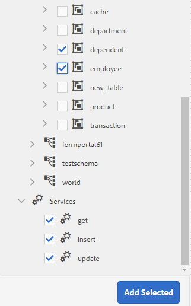
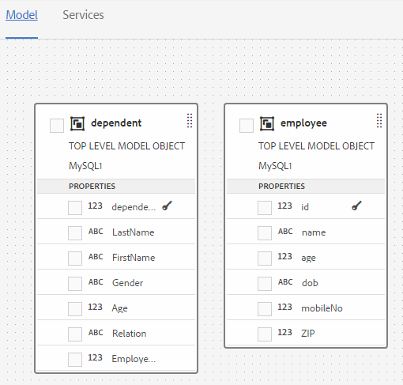
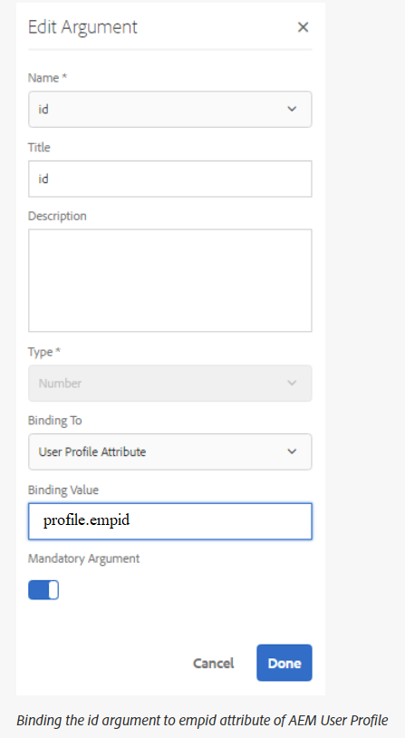

# 處理表單資料模型 {#work-with-form-data-model}


表單資料模型編輯器提供直覺式使用者介面和工具，可用於編輯和設定表單資料模型。 使用編輯器，可以在表單資料模型中，從關聯的資料源添加和配置資料模型對象、屬性和服務。 此外，它還允許您建立資料模型對象和屬性，而不使用資料源，並以後將它們與相應的資料模型對象和屬性綁定。 您也可以為資料模型物件屬性產生和編輯範例資料，以便用來預填適用性Forms <!--and interactive communications--> 預覽時。 您可以測試在表單資料模型中設定的資料模型物件和服務，以確保其與資料來源正確整合。

如果您是初次使用Forms資料整合，且尚未設定資料來源或建立表單資料模型，請參閱下列主題：

* [[!DNL Experience Manager Forms] 資料整合](data-integration.md)
* [設定資料來源](configure-data-sources.md)
* [建立表單資料模型](create-form-data-models.md)

有關可以使用表單資料模型編輯器執行的各種任務和配置的詳細資訊，請閱讀。

>[!NOTE]
>
>您必須同時是 **fdm-author** 和 **forms-user** 群組，以便建立及使用表單資料模型。 請連絡您的 [!DNL Experience Manager] 管理員成為群組的成員。

## 添加資料模型對象和服務 {#add-data-model-objects-and-services}

如果您使用資料源建立了表單資料模型，則可以使用表單資料模型編輯器來添加資料模型對象和服務、配置其屬性、在資料模型對象之間建立關聯，以及測試表單資料模型和服務。

您可以在表單資料模型中，從可用的資料來源新增資料模型物件和服務。 新增的資料模型物件顯示在「模型」標籤中時，新增的服務會顯示在「服務」標籤中。

要添加資料模型對象和服務，請執行以下操作：

1. 登入 [!DNL Experience Manager] 製作例項，導覽至 **[!UICONTROL Forms >資料整合]**，並開啟要在其中添加資料模型對象的「表單資料模型」。
1. 在「資料來源」窗格中，展開資料來源以檢視可用的資料模型物件和服務。
1. 選擇要添加到「表單資料模型」中的資料模型對象和服務，然後點選 **[!UICONTROL 添加選定內容]**.

   

   所選資料模型對象和服務

   此 **[!UICONTROL 模型]** 頁簽顯示所有資料模型對象及其屬性添加到表單資料模型中的圖形表示。 每個資料模型物件由表單資料模型中的方塊表示。

   

   **[!UICONTROL 模型]** 頁簽顯示添加的資料模型對象

   >[!NOTE]
   >
   >您可以按住並拖曳資料模型物件方塊四周，以在內容區域中組織這些物件。 在「表單資料模型」中添加的所有資料模型對象在「資料源」窗格中都呈灰色。

   此 **[!UICONTROL 服務]** 索引標籤清單中新增的服務。

   

   **[!UICONTROL 服務]** 頁簽顯示資料模型服務

   >[!NOTE]
   >
   >除了資料模型對象和服務之外，OData服務元資料文檔還包括定義兩個資料模型對象之間關聯的導航屬性。 如需詳細資訊，請參閱 [使用OData服務的導航屬性](#work-with-navigation-properties-of-odata-services).

1. 點選 **[!UICONTROL 儲存]** 保存窗體模型對象。

   >[!NOTE]
   >
   >您可以使用適用性表單規則，叫用在表單資料模型的「服務」索引標籤中設定的服務。 規則編輯器的「調用服務」操作中提供了已配置的服務。有關在適用性表單規則中使用這些服務的詳細資訊，請參閱 [規則編輯器](rule-editor.md).

## 建立資料模型對象和子屬性 {#create-data-model-objects-and-child-properties}

### 建立資料模型對象 {#create-data-model-objects}

雖然可以從配置的資料源添加資料模型對象，但也可以建立沒有資料源的資料模型對象或實體。 如果您尚未在表單資料模型中設定資料來源，則此功能特別實用。

要建立不使用資料源的資料模型對象，請執行以下操作：

1. 登入 [!DNL Experience Manager] 製作例項，導覽至 **[!UICONTROL Forms >資料整合]**，並開啟要在其中建立資料模型對象或實體的「表單資料模型」。
1. 點選 **[!UICONTROL 建立實體]**.
1. 在 [!UICONTROL 建立資料模型] 對話框，指定資料模型對象的名稱並點選 **[!UICONTROL 新增]**. 資料模型物件會新增至表單資料模型。 新添加的資料模型對象未綁定到資料源，並且沒有如下圖所示的任何屬性。

   

接下來，可以在未綁定的資料模型對象中添加子屬性。

### 添加子屬性 {#child-properties}

表單資料模型編輯器可讓您在資料模型物件中建立子屬性。 建立時的屬性不會綁定到資料源中的任何屬性。 您稍後可以將子屬性與包含資料模型物件中的其他屬性捆綁。

要建立子屬性，請執行以下操作：

1. 在表單資料模型中，選取資料模型物件並點選 **[!UICONTROL 建立子屬性]**.
1. 在 **[!UICONTROL 建立子屬性]** 對話框中，為 **[!UICONTROL 名稱]** 和 **[!UICONTROL 類型]** 欄位。 您可以選擇指定屬性的標題和說明。
1. 如果屬性是計算屬性，則啟用計算。 根據規則或運算式來評估計算屬性的值。 如需詳細資訊，請參閱 [編輯屬性](#properties).
1. 如果資料模型對象綁定到資料源，則添加的子屬性將自動綁定到具有相同名稱和資料類型的父資料模型對象的屬性。

   若要使用資料模型物件屬性手動系結子屬性，請點選 **[!UICONTROL 系結參考]** 欄位。 此 **[!UICONTROL 選擇對象]** 對話框列出父資料模型對象中的所有屬性。 選取要系結的屬性，並點選勾號圖示。 您只能選擇與子屬性資料類型相同的屬性。

1. 點選 **[!UICONTROL 完成]** 要保存子屬性，請點選 **[!UICONTROL 儲存]** 保存表單資料模型…… 子屬性現在已新增至資料模型物件。

建立資料模型物件和屬性後，您可以繼續建立最適化Forms <!--and interactive communications--> 根據表單資料模型。 稍後，當您有可用的資料來源並加以設定時，您就可以將表單資料模型與資料來源系結。 關聯的適用性Forms中會自動更新系結 <!--and interactive communications-->. 如需建立適用性Forms的詳細資訊 <!--and interactive communications--> 使用表單資料模型，請參閱 [使用表單資料模型](using-form-data-model.md).

### 綁定資料模型對象和屬性 {#bind-data-model-objects-and-properties}

當您要與「表單資料模型」整合的資料來源可供使用時，您可以依照 [更新資料來源](create-form-data-models.md#update). 然後，執行以下操作來綁定未綁定的資料模型對象和屬性：

1. 在表單資料模型中，選擇要與資料源綁定的未綁定資料源。
1. 點選 **[!UICONTROL 編輯屬性]**.
1. 在 **[!UICONTROL 編輯屬性]** ，點選旁邊的瀏覽表徵圖 **[!UICONTROL 綁定]** 欄位。 它會開啟 **[!UICONTROL 選擇對象]** 對話框，列出在表單資料模型中添加的資料源。

   

1. 展開資料來源樹狀結構，並選取要以系結的資料模型物件，然後點選勾號圖示。
1. 點選 **[!UICONTROL 完成]** 若要儲存屬性，然後點選 **[!UICONTROL 儲存]** 保存表單資料模型。 資料模型物件現在與資料來源系結。 請注意，資料模型物件不再標示為「未系結」。

   

## 配置服務 {#configure-services}

要讀取和寫入資料模型對象的資料，請執行以下操作來配置讀取和寫入服務：

1. 選取資料模型物件頂端的核取方塊，以選取該物件並點選 **[!UICONTROL 編輯屬性]**.

   

   編輯屬性以配置資料模型對象的讀寫服務

   此 [!UICONTROL 編輯屬性] 對話框開啟。

   

   編輯屬性對話方塊

   >[!NOTE]
   >
   >除了資料模型對象和服務之外，OData服務元資料文檔還包括定義兩個資料模型對象之間關聯的導航屬性。 將OData服務資料源添加到表單資料模型時，表單資料模型中有一個服務可用於資料模型對象中的所有導航屬性。 您可以使用此服務讀取相應資料模型對象的導航屬性。
   >
   >
   >如需使用服務的詳細資訊，請參閱 [使用OData服務的導航屬性](#work-with-navigation-properties-of-odata-services).

1. 切換 **[!UICONTROL 頂級對象]** 指定資料模型對象是否為頂級模型對象。

   在「表單資料模型」中配置的資料模型對象可用於基於表單資料模型的適用性表單的「內容」瀏覽器的「資料模型對象」頁簽中的「資料模型對象」頁簽。 在兩個資料模型對象之間添加關聯時，要關聯的資料模型對象將嵌套在要關聯的資料模型對象下，該資料模型對象位於 **[!UICONTROL 資料模型物件]** 標籤。 如果巢狀資料模型是頂層物件，它也會分別顯示在 **[!UICONTROL 資料模型物件]** 標籤。 因此，您會看到其中兩個項目，一個在巢狀階層內，另一個在巢狀階層外，這可能會混淆表單作者。 要使關聯的資料模型對象僅顯示在嵌套層次結構中，請禁用頂級對象屬性。

1. 為所選資料模型對象選擇讀和寫服務。 服務的引數隨即顯示。

   

   為員工資料源配置的讀寫服務

1. 點選  對於 [將參數綁定到用戶配置檔案屬性、請求屬性或常值](#bindargument) 和指定綁定值。
1. 點選 **[!UICONTROL 完成]** 為了保存引數， **[!UICONTROL 完成]** 儲存屬性，然後 **[!UICONTROL 儲存]** 保存表單資料模型。

### 綁定讀取服務參數 {#bindargument}

根據綁定值將Read服務參數綁定到用戶配置檔案屬性、請求屬性或常值。 該值會以引數的形式傳遞至服務，以從資料來源擷取與指定值相關聯的詳細資料。

#### 常值 {#literal-value}

選擇 **[!UICONTROL 常值]** 從 **[!UICONTROL 綁定到]** 下拉式功能表中輸入值 **[!UICONTROL 綁定值]** 欄位。 與值相關聯的詳細資料會從資料來源中擷取。 使用此選項可檢索與靜態值關聯的詳細資訊。

在此範例中，與 **4367655678**，作為 `mobilenum` 引數。 如果您傳入行動號碼引數的值，則相關的詳細資料可包含客戶名稱、客戶地址和城市等屬性。


#### 使用者檔案屬性 {#user-profile-attribute}

選擇 **[!UICONTROL 使用者設定檔屬性]** 從 **[!UICONTROL 綁定到]** 下拉式選單中，並在 **[!UICONTROL 綁定值]** 欄位。 登入的使用者詳細資訊 [!DNL Experience Manager] 例項是根據屬性名稱從資料來源擷取。

在 **[!UICONTROL 綁定值]** 欄位必須包含完整的綁定路徑，直到用戶的屬性名稱為止。 開啟下列URL以存取CRXDE的使用者詳細資訊：

`https://[server-name]:[port]/crx/de/index.jsp#/home/users/`


在此範例中，指定 `profile.empid` 在 **[!UICONTROL 綁定值]** 欄位 `grios` 使用者。



此 `id` 引數採用 `empid` 屬性，並將其作為引數傳遞至讀取服務。 它會從員工資料模型物件中，為 `empid` 與登入的使用者相關聯。

#### 要求屬性 {#request-attribute}

使用請求屬性從資料來源擷取關聯的屬性。

1. 選擇 **[!UICONTROL 請求屬性]** 從 **[!UICONTROL 綁定到]** 下拉式選單中，並在 **[!UICONTROL 綁定值]** 欄位。

1. 建立 [覆蓋](https://experienceleague.adobe.com/docs/experience-manager-cloud-service/implementing/developing/full-stack/overlays.html?lang=en#developing) 為head.jsp。 若要建立覆蓋，請開啟CRX DE並複製 `https://<server-name>:<port number>/crx/de/index.jsp#/libs/fd/af/components/page2/afStaticTemplatePage/head.jsp` 檔案 `https://<server-name>:<port number>/crx/de/index.jsp#/apps/fd/af/components/page2/afStaticTemplatePage/head.jsp`

   >[!NOTE]
   >
   > * 如果使用靜態範本，請在以下位置覆蓋head.jsp:
      >   `/libs/fd/af/components/page2/afStaticTemplatePage/head.jsp`
   > * 如果您使用可編輯的範本，請在以下位置覆蓋aftemplatedpage.jsp:
      >   `/libs/fd/af/components/page2/aftemplatedpage/aftemplatedpage.jsp`


1. 設定 [!DNL paramMap] ，以取得要求屬性。 例如，在應用程式資料夾的.jsp檔案中加入下列程式碼：

   ```javascript
   <%Map paraMap = new HashMap();
    paraMap.put("<request_attribute>",request.getParameter("<request_attribute>"));
    request.setAttribute("paramMap",paraMap);
   ```

   例如，使用以下代碼從資料源檢索petid的值：


   ```javascript
   <%Map paraMap = new HashMap();
   paraMap.put("petId",request.getParameter("petId"));
   request.setAttribute("paramMap",paraMap);%>
   ```

詳細資訊會根據請求中指定的屬性名稱從資料來源擷取。

例如，將屬性指定為 `petid=100` 在請求中，會從資料來源擷取與屬性值相關聯的屬性。

## 添加關聯 {#add-associations}

通常，資料源中的資料模型對象之間會建立關聯。 關聯可以是一對一或一對多。 例如，可以有多個與員工相關聯的家屬。 它稱為一對多關聯，如 `1:n` 線上連接相關資料模型對象。 但是，如果關聯為指定的員工ID返回唯一的員工名稱，則稱為一對一關聯。

將資料源中的關聯資料模型對象添加到表單資料模型時，它們的關聯將被保留並顯示為通過箭頭線連接。 您可以在表單資料模型中，跨不同資料來源新增資料模型物件之間的關聯。

>[!NOTE]
>
>JDBC資料源中的預定義關聯不會保留在表單資料模型中。 您必須手動建立。

添加關聯：

1. 選取資料模型物件頂端的核取方塊，以選取該物件並點選 **[!UICONTROL 添加關聯]**. 將開啟「添加關聯」對話框。

   

   >[!NOTE]
   >
   >除了資料模型對象和服務之外，OData服務元資料文檔還包括定義兩個資料模型對象之間關聯的導航屬性。 在表單資料模型中新增關聯時，可以使用這些導覽屬性。 如需詳細資訊，請參閱 [使用OData服務的導航屬性](#work-with-navigation-properties-of-odata-services).

   此 [!UICONTROL 添加關聯] 對話框開啟。

   

   添加關聯對話框

1. 在「添加關聯」窗格中：

   * 指定關聯的標題。
   * 選擇關聯類型 —  **[!UICONTROL 一對一]** 或 **[!UICONTROL 一對多]**.
   * 選擇要關聯的資料模型對象。
   * 選擇讀取服務以從所選模型對象讀取資料。 讀取服務參數隨即出現。 編輯以變更引數（如有必要），並將其系結至要關聯的資料模型物件的屬性。

   在以下示例中，Dependents資料模型對象的讀取服務的預設參數為 `dependentid`.

   

   Dependents讀取服務的預設參數為dependited

   但引數必須是關聯資料模型對象之間的公用屬性，在本示例中為 `Employeeid`. 因此， `Employeeid` 引數必須與 `id` Employee資料模型對象的屬性，以從Dependents資料模型對象中獲取關聯的依存項詳細資訊。

   

   更新引數和系結

   點選 **[!UICONTROL 完成]** 來儲存引數。

1. 點選 **[!UICONTROL 完成]** 保存關聯，然後 **[!UICONTROL 儲存]** 保存表單資料模型。
1. 重複步驟，視需要建立更多關聯。

>[!NOTE]
>
>添加的關聯將顯示在資料模型對象框中，具有指定的標題和一條連接關聯資料模型對象的線。
>
>您可以選取相關的核取方塊，然後點選，以編輯關聯 **[!UICONTROL 編輯關聯]**.


## 編輯屬性 {#properties}

您可以編輯資料模型對象的屬性、其屬性以及在表單資料模型中添加的服務。

要編輯屬性：

1. 選取表單資料模型中資料模型物件、屬性或服務旁的核取方塊。
1. 點選 **[!UICONTROL 編輯屬性]**. 此 **[!UICONTROL 編輯屬性]** 將開啟所選模型對象、屬性或服務的窗格。

   * **[!UICONTROL 資料模型物件]**:指定讀和寫服務和編輯參數。
   * **[!UICONTROL 屬性]**:指定屬性的類型、子類型和格式。 也可以指定所選屬性是否為資料模型對象的主鍵。
   * **[!UICONTROL 服務]**:指定服務的輸入模型對象、輸出類型和參數。 對於Get服務，可以指定它是否應返回陣列。

      
   獲取服務的編輯屬性對話框

1. 點選 **[!UICONTROL 完成]** 保存屬性，然後 **[!UICONTROL 儲存]** 保存表單資料模型。

### 建立計算屬性 {#computed}

計算屬性是根據規則或表達式計算其值的屬性。 使用規則，可以將計算屬性的值設定為文本字串、數字、數學表達式的結果或窗體資料模型中其他屬性的值。

例如，您可以建立計算屬性 **FullName** 其值是現有 **名字** 和 **LastName** 屬性。 若要這麼做：

1. 以名稱建立新屬性 `FullName` 其資料類型為字串。
1. 啟用 **[!UICONTROL 計算]** 點選 **[!UICONTROL 完成]** 來建立屬性。

   

   將建立FullName計算屬性。 請注意屬性旁的圖示，以描繪計算屬性。

   

1. 選取FullName屬性，然後點選 **[!UICONTROL 編輯規則]**. 規則編輯器視窗隨即開啟。
1. 在規則編輯器視窗中，點選 **[!UICONTROL 建立]**. A **[!UICONTROL 設定值]** 規則視窗開啟。

   從「選取選項」下拉式清單中，選取 **[!UICONTROL 數學表達式]**. 其他可用選項包括 **[!UICONTROL 表單資料模型物件]** 和 **[!UICONTROL 字串]**.

1. 在數學表達式中，選擇 **[!UICONTROL 名字]** 和 **[!UICONTROL LastName]** 分別位於第一和第二對象中。 選擇 **[!UICONTROL plus]** 作為運算子。

   點選 **[!UICONTROL 完成]** 然後點選 **[!UICONTROL 關閉]** 以關閉規則編輯器視窗。 規則看起來類似下列。

   

1. 在表單資料模型上，點選 **[!UICONTROL 儲存]**. 已配置計算屬性。

## 使用OData服務的導航屬性 {#work-with-navigation-properties-of-odata-services}

在OData服務中，導航屬性用於定義兩個資料模型對象之間的關聯。 這些屬性是在實體類型或複雜類型上定義的。 例如，在下列範例中繼資料檔案的擷取中 [TripPin](https://www.odata.org/blog/trippin-new-odata-v4-sample-service/) OData示例服務，人員實體包含三個導航屬性：朋友、BestFriend和Trips。

如需導覽屬性的詳細資訊，請參閱 [OData檔案](https://docs.oasis-open.org/odata/odata/v4.0/errata03/os/complete/part3-csdl/odata-v4.0-errata03-os-part3-csdl-complete.html#_Toc453752536).

```xml
<edmx:Edmx xmlns:edmx="https://docs.oasis-open.org/odata/ns/edmx" Version="4.0">
<script/>
<edmx:DataServices>
<Schema xmlns="https://docs.oasis-open.org/odata/ns/edm" Namespace="Microsoft.OData.Service.Sample.TrippinInMemory.Models">
<EntityType Name="Person">
<Key>
<PropertyRef Name="UserName"/>
</Key>
<Property Name="UserName" Type="Edm.String" Nullable="false"/>
<Property Name="FirstName" Type="Edm.String" Nullable="false"/>
<Property Name="LastName" Type="Edm.String"/>
<Property Name="MiddleName" Type="Edm.String"/>
<Property Name="Gender" Type="Microsoft.OData.Service.Sample.TrippinInMemory.Models.PersonGender" Nullable="false"/>
<Property Name="Age" Type="Edm.Int64"/>
<Property Name="Emails" Type="Collection(Edm.String)"/>
<Property Name="AddressInfo" Type="Collection(Microsoft.OData.Service.Sample.TrippinInMemory.Models.Location)"/>
<Property Name="HomeAddress" Type="Microsoft.OData.Service.Sample.TrippinInMemory.Models.Location"/>
<Property Name="FavoriteFeature" Type="Microsoft.OData.Service.Sample.TrippinInMemory.Models.Feature" Nullable="false"/>
<Property Name="Features" Type="Collection(Microsoft.OData.Service.Sample.TrippinInMemory.Models.Feature)" Nullable="false"/>
<NavigationProperty Name="Friends" Type="Collection(Microsoft.OData.Service.Sample.TrippinInMemory.Models.Person)"/>
<NavigationProperty Name="BestFriend" Type="Microsoft.OData.Service.Sample.TrippinInMemory.Models.Person"/>
<NavigationProperty Name="Trips" Type="Collection(Microsoft.OData.Service.Sample.TrippinInMemory.Models.Trip)"/>
</EntityType>
```

在表單資料模型中配置OData服務時，實體容器中的所有導航屬性都可通過表單資料模型中的服務提供。 在TripPin OData服務的這個示例中， `Person` 實體容器可使用 `GET LINK` 服務。

以下重點說明 `GET LINK of Person /People` 表單資料模型中的服務，此組合服務適用於 `Person` TripPin OData服務的實體。


在您新增 `GET LINK` 服務到「表單資料模型」中的「服務」頁簽，您可以編輯屬性以選擇要在服務中使用的輸出模型對象和導航屬性。 例如，下列 `GET LINK of Person /People` 以下示例中的服務使用Trip作為輸出模型對象，導航屬性使用Trips。


>[!NOTE]
>
>中可用的值 **[!UICONTROL 預設值]** 欄位 **NavigationPropertyName** 引數取決於 **[!UICONTROL 返回陣列？]** 切換按鈕。 啟用後，將顯示「集合」類型的導航屬性。

在此示例中，您還可以選擇輸出模型對象作為Person，選擇導航屬性參數作為Friends或BestFriend(取決於 **[!UICONTROL 返回陣列？]** 啟用或停用)。


同樣地，您也可以選擇 `GET LINK` 在表單資料模型中新增關聯時，服務和設定其導覽屬性。 不過，若要選取導覽屬性，請確定 **[!UICONTROL 綁定到欄位]** 設為 **[!UICONTROL 常值]**.


## 產生和編輯範例資料 {#sample}

表單資料模型編輯器可讓您為表單資料模型中的所有資料模型物件屬性（包括計算屬性）產生範例資料。 這是一組符合為每個屬性設定的資料類型的隨機值。 您也可以編輯和儲存資料，即使重新產生範例資料，資料也會保留。

執行下列操作以生成和編輯示例資料：

1. 開啟表單資料模型並點選 **[!UICONTROL 編輯範例資料]**. 它會在「編輯範例資料」視窗中產生並顯示範例資料。

   

1. 在 **[!UICONTROL 編輯範例資料]** 視需要，編輯資料，然後點選 **[!UICONTROL 儲存]**.

<!--Next, you can use the sample data to prefill and test interactive communications based on the form data model. For more information, see [Use form data model](using-form-data-model.md).-->

## 測試資料模型對象和服務 {#test-data-model-objects-and-services}

您的表單資料模型已配置，但在投入使用之前，您可能希望測試已配置的資料模型對象和服務是否按預期工作。 要測試資料模型對象和服務，請執行以下操作：

1. 在「表單資料模型」中選取資料模型物件或服務，然後點選 **[!UICONTROL 測試模型對象]** 或 **[!UICONTROL 測試服務]**，分別為。

   將開啟「測試表單資料模型」窗口。

   

1. 在 [!UICONTROL 測試表單資料模型] 窗口，從「輸入」窗格中選擇要測試的資料模型對象或服務。

1. 在測試程式碼中指定引數值，然後點選 **[!UICONTROL 測試]**. 成功的測試會在「輸出」窗格中返回輸出。

   

同樣地，您可以測試表單資料模型中的其他資料模型物件和服務。

## 輸入資料的自動驗證 {#automated-validation-of-input-data}

「表單資料模型」會根據表單資料模型中可用的驗證准則，驗證叫用DermisBridge API時收到的輸入資料。 驗證以 `ValidationOptions` 用於叫用API的查詢物件中設定的標幟。

標幟可設為下列任一值：

* **完整**:FDM根據所有約束執行驗證
* **關閉**:無驗證
* **基本**:FDM根據「必要」和「nullable」約束執行驗證

若未設定 `ValidationOptions`標幟， **基本** 對輸入資料執行驗證。

以下範例將驗證標幟設為 **完整**:

```java
operationOptions.setValidationOptions(ValidationOptions.FULL);
```

>[!NOTE]
>
>輸入資料中為屬性提供的值必須與元資料文檔中為屬性定義的資料類型相匹配。\
>如果值不符合為屬性定義的資料類型，則DermisBridge API會顯示例外狀況，而不考慮 `ValidationOptions` 標籤。 如果記錄層級設為「除錯」，系統會將錯誤記錄至 **error.log** 檔案。

表單資料模型會根據資料類型限制清單來驗證輸入資料。 輸入資料的限制清單可根據資料源而改變。

下表列出根據資料來源輸入資料的限制：

<table>
 <tbody> 
  <tr> 
   <td>限制</td> 
   <td>說明</td> 
   <td>輸入資料源</td> 
  </tr> 
  <tr> 
   <td>必填</td> 
   <td>如果為true，則必須將參數包含在輸入資料中。</td> 
   <td>Swagger、WSDL和資料庫</td> 
  </tr> 
  <tr> 
   <td>null</td> 
   <td>如果為true，則輸入資料中的參數值可設為Null。</td> 
   <td>WSDL、Odata和資料庫</td> 
  </tr> 
  <tr> 
   <td>最大值</td> 
   <td>指定數值的上界。 指定為上界的最大值也可以分配給輸入資料中的參數。</td> 
   <td>Swagger和WSDL</td> 
  </tr> 
  <tr> 
   <td>最小</td> 
   <td>指定數值的下限。 指定為下界的最小值也可以分配給輸入資料中的參數。</td> 
   <td>Swagger和WSDL</td> 
  </tr> 
  <tr> 
   <td>exclusiveMaximum</td> 
   <td>指定數值的上界。 指定為上限的最大值不得分配給輸入資料中的參數。</td> 
   <td>Swagger和WSDL</td> 
  </tr> 
  <tr> 
   <td>exclusiveMinimum</td> 
   <td>指定數值的下限。 指定為下限的最小值不得分配給輸入資料中的參數。</td> 
   <td>Swagger和WSDL</td> 
  </tr> 
  <tr> 
   <td>minLength</td> 
   <td>指定字串中包含的字元數的下限。 指定為下界的最小值也可以分配給輸入資料中的參數。</td> 
   <td>Swagger和WSDL</td> 
  </tr> 
  <tr> 
   <td>maxLength</td> 
   <td>指定字串中包含的字元數的上限。 指定為上界的最大值也可以分配給輸入資料中的參數。</td> 
   <td>Swagger、WSDL、Odata和資料庫</td> 
  </tr> 
  <tr> 
   <td>圖樣</td> 
   <td>指定固定的字元順序。 只有在字元符合指定模式時，輸入字串才會成功驗證。</td> 
   <td>Swagger</td> 
  </tr> 
  <tr> 
   <td>minItems</td> 
   <td>指定陣列中的最小項目數。 指定為下界的最小值也可以分配給輸入資料中的參數。</td> 
   <td>Swagger和WSDL</td> 
  </tr> 
  <tr> 
   <td>maxItems</td> 
   <td>指定陣列中的項目數上限。 指定為上界的最大值也可以分配給輸入資料中的參數。</td> 
   <td>Swagger和WSDL</td> 
  </tr> 
  <tr> 
   <td>uniqueItems</td> 
   <td>如果為true，則陣列的所有元素在輸入資料中必須是唯一的。</td> 
   <td>Swagger</td> 
  </tr> 
  <tr> 
   <td>列舉（字串）<br /> <br /> </td> 
   <td>將輸入資料中參數的值限制為一組固定的字串值。 它必須是陣列，其中至少包含一個元素，且每個元素都是唯一的。</td> 
   <td>Swagger、WSDL和Odata</td> 
  </tr> 
  <tr> 
   <td>枚舉（數字）<br /> <br /> </td> 
   <td>將輸入資料中參數的值限制為一組固定的數值。 它必須是陣列，其中至少包含一個元素，且每個元素都是唯一的。</td> 
   <td>WSDL</td> 
  </tr> 
 </tbody> 
</table>

在此範例中，會根據Swagger檔案中定義的最大、最小和必要限制來驗證輸入資料。 只有在訂單ID存在且其值介於1和10之間時，輸入資料才符合驗證標準。

```json
   parameters: [
   {
   name: "orderId",
   in: "path",
   description: "ID of pet that needs to be fetched",
   required: true,
   type: "integer",
   maximum: 10,
   minimum: 1,
   format: "int64"
   }
   ]
```

如果輸入資料不符合驗證標準，則會顯示例外。 如果記錄層級設為 **除錯**，則會將錯誤記錄到 **error.log** 檔案。 例如，

```verilog
21.01.2019 17:26:37.411 *ERROR* com.adobe.aem.dermis.core.validation.JsonSchemaValidator {"errorCode":"AEM-FDM-001-044","errorMessage":"Input validations failed during operation execution.","violations":{"/orderId":["numeric instance is greater than the required maximum (maximum: 10, found: 16)"]}}
```

## 後續步驟 {#next-steps}

您有可用的表單資料模型，現已可在適用性Forms中使用 <!--and interactive communications--> 工作流程。 如需詳細資訊，請參閱 [使用表單資料模型](using-form-data-model.md).
