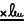

# 在最適化表單中使用[!DNL Adobe Sign] {#using-adobe-sign-in-an-adaptive-form}

>[!NOTE]
>
> Adobe建議針對[建立新的Adaptive Forms](https://experienceleague.adobe.com/docs/experience-manager-core-components/using/adaptive-forms/introduction.html)或[將Adaptive Forms新增至AEM Sites頁面](/help/forms/creating-adaptive-form-core-components.md)，使用現代且可擴充的資料擷取[核心元件](/help/forms/create-or-add-an-adaptive-form-to-aem-sites-page.md)。 這些元件代表最適化表單建立方面的重大進步，可確保令人印象深刻的使用者體驗。本文說明使用基礎元件製作最適化Forms的舊方法。


| 版本 | 文章連結 |
| -------- | ---------------------------- |
| AEM 6.5 | [按一下這裡](https://experienceleague.adobe.com/docs/experience-manager-65/forms/adaptive-forms-advanced-authoring/working-with-adobe-sign.html) |
| AEM as a Cloud Service  | 本文章 |


[!DNL Adobe Sign] 可啟用最適化表單的電子簽名工作流程。 電子簽章可改善處理法律、銷售、薪資、人力資源管理及更多領域檔案的工作流程。

在一般[!DNL Adobe Sign]和最適化Forms案例中，使用者會填寫最適化表單來申請需要一或多個當事人簽章的服務。 例如，抵押貸款與信用卡申請需要所有借方與共同申請者的合法簽章。 若要針對類似案例啟用電子簽章工作流程，您可以將[!DNL Adobe Sign]與最適化表單整合。 再舉幾個範例，您可以使用[!DNL Adobe Sign]來：

* 透過完全自動化的提案、報價及合約程式，完成任何裝置的交易。
* 更快地完成人力資源程式，並為員工提供數位體驗。
* 縮短合約週期時間，讓您的廠商更快上線。
* 建立自動化常見流程的數位工作流程。

[!DNL Adobe Sign]與[!DNL AEM Forms]的整合支援：

* 單一和多使用者簽署工作流程
* 循序簽名與同步簽名工作流程
* 以匿名或登入使用者身分簽署表單
* 動態簽署程式（與[!DNL AEM Forms]工作流程整合）
* 透過知識庫、電話、社交設定檔和政府ID進行驗證
* 指派角色給每個協定收件者。 適用於商業和企業服務等級的Adobe Sign可選擇展開協定收件者的[角色](#addsignerstoanadaptiveform)。

<!-- * In-form and out-of-form signing experiences -->

## 先決條件 {#prerequisites}

在最適化表單中使用[!DNL Adobe Sign]之前：

* 請確定[!DNL AEM Forms] as a Cloud Service已設定為使用Adobe Sign。 如需詳細資訊，請參閱[整合Adobe Sign與 [!DNL AEM Forms]](adobe-sign-integration-adaptive-forms.md)。
* 保持收件者清單準備就緒。 您至少需要每個收件者的電子郵件地址。

## 為最適化表單設定[!DNL Adobe Sign] {#configure-adobe-sign-for-an-adaptive-form}

若要為最適化表單設定[!DNL Adobe Sign]：

1. [為最適化表單啟用 [!DNL Adobe Sign] ](#enableadobsignforanadaptiveform)
1. [將 [!DNL Adobe Sign] 欄位新增至最適化表單](#addadobesignfieldstoanadaptiveform)
1. [為最適化表單選取 [!DNL Adobe Sign] Cloud Service](#select-adobe-sign-cloud-service-and-signing-order)

1. [將 [!DNL Adobe Sign] 收件者新增至最適化表單](#addsignerstoanadaptiveform)
1. [選擇最適化表單的提交動作](#selectsubmitactionforanadaptiveform)


### 為最適化表單啟用[!DNL Adobe Sign]  {#enableadobesign}

您可以為現有的調適型表單啟用[!DNL Adobe Sign]，或建立啟用[!DNL Adobe Sign]的調適型表單。 選擇下列其中一項：

* [建立啟用 [!DNL Adobe Sign] 的最適化表單](#create-an-adaptive-form-for-adobe-sign)
* 針對現有的最適化表單[啟用 [!DNL Adobe Sign] ](#editafsign)。

#### 建立Adobe Sign適用性表單 {#create-an-adaptive-form-for-adobe-sign}

若要建立可啟用簽名的最適化表單：

1. 導覽至「**[!UICONTROL Adobe Experience Manager]**」>「**[!UICONTROL 「表單]**」>「**[!UICONTROL 表單與文件]**」。
1. 選取&#x200B;**[!UICONTROL 建立]**&#x200B;並選取&#x200B;**[!UICONTROL 最適化表單]**。 範本清單隨即顯示。 選取範本並選取&#x200B;**[!UICONTROL 下一步]**。
1. 在&#x200B;**[!UICONTROL 基本]**&#x200B;索引標籤中：

   1. 指定最適化表單的&#x200B;**[!UICONTROL 名稱]**&#x200B;和&#x200B;**[!UICONTROL 標題]**。

   1. 選取[整合](adobe-sign-integration-adaptive-forms.md#configure-adobe-sign-with-aem-forms)與[時所建立的 [!DNL Adobe Sign] 設定容器 [!DNL AEM Forms]](adobe-sign-integration-adaptive-forms.md)。

   設定容器包含為您的環境設定的[!DNL Adobe Sign]雲端服務。 這些服務可在最適化表單產生器中選擇。

1. 在&#x200B;**[!UICONTROL 表單模型]**&#x200B;索引標籤中，選取下列其中一個選項：

   * 如果您有自訂表格範本，而且需要以表格範本為基礎的記錄檔案，請選取&#x200B;**[!UICONTROL 關聯表格範本作為記錄檔案範本]**&#x200B;選項，並選取記錄檔案範本。 當您使用選項時，傳送以供簽署的檔案只會顯示以相關表單範本為基礎的欄位。 它不會顯示最適化表單的所有欄位。

   * 如果您沒有自訂表格範本，請選取&#x200B;**[!UICONTROL 產生記錄檔案]**&#x200B;選項。 當您使用選項時，傳送以供簽署的檔案會顯示最適化表單的所有欄位。

1. 選擇 **[!UICONTROL 建立]**。系統隨即會建立可啟用簽名的最適化表單。 您可以將[!DNL Adobe Sign]欄位新增至表單，並傳送以進行簽署。

#### 為最適化表單啟用[!DNL Adobe Sign] {#editafsign}

若要在現有的最適化表單中使用[!DNL Adobe Sign]：

1. 導覽至「**[!UICONTROL Adobe Experience Manager]**」>「**[!UICONTROL 「表單]**」>「**[!UICONTROL 表單與文件]**」。
1. 選取最適化表單並選取&#x200B;**[!UICONTROL 屬性]**。
1. 在&#x200B;**[!UICONTROL 基本]**&#x200B;索引標籤中，選取整合[與](adobe-sign-integration-adaptive-forms.md#configure-adobe-sign-with-aem-forms)時所建立的[!DNL Adobe Sign]設定容器[!DNL AEM Forms]。
1. 在&#x200B;**[!UICONTROL 表單模式]**&#x200B;索引標籤中，選取下列其中一個選項：

   * 如果您有自訂表格範本，而且需要以表格範本為基礎的記錄檔案，請選取&#x200B;**[!UICONTROL 關聯表格範本作為記錄檔案範本]**&#x200B;選項，並選取記錄檔案範本。 當您使用選項時，傳送以供簽署的檔案只會顯示以相關表單範本為基礎的欄位。 它不會顯示最適化表單的所有欄位。

   * 如果您沒有自訂表格範本，請選取&#x200B;**[!UICONTROL 產生記錄檔案]**&#x200B;選項。 當您使用選項時，傳送以供簽署的檔案會顯示最適化表單的所有欄位。

1. 選取&#x200B;**[!UICONTROL 儲存並關閉]**。 已為[!DNL Adobe Sign]啟用最適化表單。 現在，您可以將[!DNL Adobe Sign]欄位新增至表單，並傳送以進行簽署。

### 將[!DNL Adobe Sign]欄位新增至最適化表單 {#addadobesignfieldstoanadaptiveform}

[!DNL Adobe Sign]有多種欄位可放在最適化表單上。 這些欄位接受各種型別的資料，例如簽名、首字母、公司或標題，並幫助在簽名期間收集額外的資訊以及簽名。 您可以使用[!DNL Adobe Sign]區塊元件將[!DNL Adobe Sign]欄位放置在調適型表單中的各個位置。

若要新增欄位至調適型表單並自訂與這些欄位相關的各種選項：

1. 將&#x200B;**[!UICONTROL Adobe Sign區塊]**&#x200B;元件從元件瀏覽器拖放至最適化表單。 [!DNL Adobe Sign]區塊元件具有所有支援的[!DNL Adobe Sign]欄位。 依預設，它會將&#x200B;**[!UICONTROL 簽章]**&#x200B;欄位新增至最適化表單。

   

   依預設，[!DNL Adobe Sign]區塊不會顯示在已發佈的調適型表單中。 它只顯示在簽署檔案中。 您可以從[!DNL Adobe Sign]區塊元件的屬性變更[!DNL Adobe Sign]區塊的可見度。

   >[!NOTE]
   >
   > * 使用[!DNL Adobe Sign]區塊並非調適型表單中必須使用[!DNL Adobe Sign]。 如果您未使用[!DNL Adobe Sign]封鎖並新增收件者的欄位，則預設簽章欄位會顯示在簽署檔案的底部。
   > * 僅針對自動產生記錄檔案的最適化Forms使用[!DNL Adobe Sign]區塊。 如果您使用自訂XDP來產生記錄檔案或表單範本式的最適化表單，則不支援[!DNL Adobe Sign]區塊。


1. 選取&#x200B;**[!UICONTROL Adobe Sign區塊]**&#x200B;元件，並選取&#x200B;**[!UICONTROL 編輯]** 圖示。 它會顯示新增欄位和格式化欄位外觀的選項。

   

   **A.**&#x200B;選取並新增[!DNL Adobe Sign]欄位。 **B.**&#x200B;展開[!DNL Adobe Sign]區塊至全熒幕檢視

1. 選取&#x200B;**[!UICONTROL Adobe簽署]**&#x200B;欄位圖示。 它會顯示選取和新增[!DNL Adobe Sign]欄位的選項。

   展開&#x200B;**[!UICONTROL 型別]**&#x200B;下拉式欄位以選取[!DNL Adobe Sign]欄位，並選取「完成」圖示以將選取的欄位新增至[!DNL Adobe Sign]區塊。 **[!UICONTROL 型別]**&#x200B;下拉式欄位包含簽章、收件者資訊和資料欄位型別。 [!DNL Adobe Sign]與AEM的整合[!DNL Forms]僅支援[!UICONTROL 型別]下拉式方塊中列出的欄位。 如需[!DNL Adobe Sign]欄位的詳細資訊，請參閱[Adobe Sign檔案](https://helpx.adobe.com/sign/help/field-types.html)。

   

   必須為欄位提供唯一名稱。 您也可以選取必要選項，將欄位標示為必要欄位。 除了&#x200B;**[!UICONTROL Name]**&#x200B;和&#x200B;**[!UICONTROL 必要]**&#x200B;選項外，有些[!DNL Adobe Sign]欄位還有其他選項。 例如，遮色片和多行。 此外，無論欄位位位於相同或不同的[!DNL Adobe Sign]區塊中，請為每個[!DNL Adobe Sign]欄位指定唯一的名稱。

   如果您從下拉式清單中選取&#x200B;**[!UICONTROL 數位簽章]**，您可以將數位簽章套用至最適化表單：

   * 使用雲端簽章，以由信任服務提供者代管的[數位識別碼](https://helpx.adobe.com/sign/kb/digital-certificate-providers.html)進行線上簽署。
   * 使用智慧卡、USB權杖或檔案式數位ID，透過Adobe Acrobat或Reader下載檔案即可在本機執行。

### 為最適化表單啟用[!DNL Adobe Sign] {#enableadobsignforanadaptiveform}

未立即為最適化表單啟用[!DNL Adobe Sign]。 若要啟用此功能：

1. 在內容瀏覽器中，選取&#x200B;**[!UICONTROL 表單容器]**，然後選取&#x200B;**[!UICONTROL 設定]** 圖示。 它會開啟屬性瀏覽器並顯示最適化表單容器屬性。
1. 在屬性瀏覽器中，展開&#x200B;**[!UICONTROL 電子簽章]**&#x200B;摺疊式功能表，然後選取&#x200B;**[!UICONTROL 啟用Adobe簽章]**&#x200B;選項。 它啟用最適化表單的[!DNL Adobe Sign]。

### 選取[!DNL Adobe Sign] Cloud Service和簽署順序 {#select-adobe-sign-cloud-service-and-signing-order}

您可以為AEM [!DNL Adobe Sign]的執行個體設定多個[!DNL Forms]服務。 建議您為每個功能（人力資源、財務等）設定個別的服務集。 它可讓您更輕鬆地追蹤及報告已簽署的檔案。 例如，銀行擁有多個部門。 您可以為每個部門設定個別的設定，以便更妥善地追蹤檔案。

一個檔案也可以有多個收件者。 例如，信用卡申請可以有多個應徵者。 在開始處理申請之前，銀行需要所有申請者的簽章。 對於多收件者情況，您可以選取以循序或同時順序簽署檔案。

若要選取Cloud Service和簽署順序：


1. 在內容瀏覽器中，選取&#x200B;**[!UICONTROL 表單容器]**，然後選取&#x200B;**[!UICONTROL 設定]** 圖示。 它會開啟屬性瀏覽器並顯示最適化表單容器屬性。
1. 在屬性瀏覽器中，展開&#x200B;**[!UICONTROL 電子簽章]**&#x200B;摺疊式功能表，然後選取&#x200B;**[!UICONTROL 啟用Adobe簽章]**&#x200B;選項。 它啟用最適化表單的[!DNL Adobe Sign]。
1. 從已設定的[!DNL Adobe Sign]雲端服務清單中選取Cloud Service。

   如果&#x200B;**[!UICONTROL Adobe Sign Cloud Service]**&#x200B;清單是空的，請依照[設定 [!DNL Adobe Sign] 與 [!DNL AEM Forms]](adobe-sign-integration-adaptive-forms.md)文章中的說明來設定服務。

   下拉式清單會列出「工具> `global`雲端服務&#x200B;**[!UICONTROL >]** Adobe Sign **[!UICONTROL 」中]**&#x200B;資料夾內存在的雲端服務。 此外，當您建立最適化表單時，下拉式清單也會列出您在&#x200B;**[!UICONTROL 設定容器]**&#x200B;欄位中選取的資料夾中存在的雲端服務。

1. 選取選項，以使用&#x200B;**[!UICONTROL 提交表單]**&#x200B;來設定提交動作。 您可以從下列兩個選項中選取任一個：
   * **送出表單（並傳送合約以供簽署）**：此選項會立即送出表單，然後傳送表單以供簽署給收件者。
   * **提交表單（在每個收件者完成簽署儀式後）**：此選項只會在所有簽署者完成簽署程式後提交最適化Forms。 您可以設定間隔來檢查所有簽署者的簽署狀態。 如需詳細資訊，請參閱[設定 [!DNL Adobe Acrobat Sign] 排程器](/help/forms/adobe-sign-integration-adaptive-forms.md#configure-dnl-adobe-acrobat-sign-scheduler-to-sync-the-signing-status)。

1. 從&#x200B;**[!UICONTROL 收件者可以完成]**&#x200B;對話方塊中選取簽署順序。 收件者可以依序簽署最適化表單&#x200B;**** — 一個接一個的收件者，或&#x200B;**[!UICONTROL 同時]** — 任何順序。

   一位收件者會依序每次收到Adobe Sign合約。 收件者完成指派的動作後，協定會傳送給下一個收件者，依此類推。

   所有收件者都會同時收到Adobe Sign合約，且可互相平行動作。

1. 使用「合約識別碼」欄位，將繫結與合約識別碼(agreementId)相關聯。 它會將合約ID新增至結構描述型表單提交資料的afBoundData區段。 合約ID也會新增至提交之所有已啟用Adobe Sign表單的afSubmissionInfo區段。 您可以使用協定ID來使用自訂程式碼追蹤協定狀態（需要自訂實施）。

   >[!NOTE]
   >
   > 如果使用表單資料模型(FDM)建立最適化表單，則對話方塊中會顯示「合約ID」欄位。

1. [將收件者新增至最適化表單](working-with-adobe-sign.md#addsignerstoanadaptiveform)，並選取「完成」圖示以儲存變更。

### 將收件者新增至最適化表單 {#addsignerstoanadaptiveform}

Adobe Sign協定可以有一或多個收件者。 新增收件者時，您也可以設定收件者的驗證詳細資料，並選取表單填寫者與收件者是否為同一人。 執行以下步驟來新增並提供收件者的各種詳細資訊：

1. 在內容瀏覽器中，選取&#x200B;**[!UICONTROL 表單容器]**，然後選取&#x200B;**[!UICONTROL 設定]** 圖示。 它會以最適化表單容器屬性開啟屬性瀏覽器。
1. 在屬性瀏覽器中，展開&#x200B;**[!UICONTROL 電子簽章]**&#x200B;摺疊式功能表，然後選取&#x200B;**[!UICONTROL 啟用Adobe簽章]**&#x200B;選項。 它啟用最適化表單的[!DNL Adobe Sign]。
1. 選取&#x200B;**[!UICONTROL 新增收件者]**。 它會新增收件者至最適化表單。 您可以將多位收件者新增至最適化表單。 所有收件者都會收到最適化表單提交的Adobe Sign合約。
   

1. 按一下「**[!UICONTROL 編輯]**」」圖示，指定收件者的下列相關資訊：

   * **[!UICONTROL 標題]：**&#x200B;指定唯一識別收件者的標題。

   * **[!UICONTROL 收件者和填表人是否相同？]：**&#x200B;如果表單填寫者與第一個收件者是同一個人，請選取&#x200B;**[!UICONTROL 是]**。<!-- If the option is set to **No,** then do not use the signature step component in the Adaptive Form. If the form contains a Signature Step component, then the field is automatically set to Yes. -->

   * **[!UICONTROL 收件者角色]：**&#x200B;選取收件者的角色。 適用於商業和企業服務等級的Adobe Sign可選擇擴充協定收件者的[角色](https://helpx.adobe.com/sign/using/set-up-signer-approver-roles.html)，而不只是&#x200B;**簽署者**，以便更符合其工作流程需求。

   * **[!UICONTROL 收件者電子郵件地址]：**&#x200B;指定收件者的電子郵件地址。 收件者會使用指定的電子郵件地址收到Adobe Sign合約。 您可以選擇使用表單欄位、登入使用者的Experience Manager使用者設定檔中提供的電子郵件地址，或手動輸入電子郵件地址。 此為強制步驟。

     >[!NOTE]
     >
     >確保第一個收件者或唯一收件者（如果有單一收件者）的電子郵件地址與用來設定AEM雲端服務的[!DNL Adobe Sign]帳戶不相同。

   * **[!UICONTROL 收件者驗證方法]：**&#x200B;指定在開啟Adobe Sign合約之前驗證收件者的方法。 您可以在電話、知識庫、以社交身分為基礎的驗證和[的](https://helpx.adobe.com/sign/using/adobesign-authentication-government-id.html)政府機關識別碼[!DNL Adobe Acrobat Sign]之間選擇。 對於[!DNL Adobe Acrobat Sign for Government]，您可以在電話和知識型驗證之間選擇。

   >[!NOTE]
   >
   > * 依預設，社交身分型驗證會提供使用Facebook、Google和LinkedIn進行驗證的選項。 您可以連絡[!DNL Adobe Sign]支援以啟用其他社交驗證服務提供者。
   >

   * 要填寫或簽署的&#x200B;**[!DNL Adobe Sign]欄位：**&#x200B;請為收件者選取[!DNL Adobe Sign]欄位。 自適應表單可以有多個[!DNL Adobe Sign]欄位。 您可以選擇為收件者啟用特定欄位。 欄位會顯示所有可用的[!DNL Adobe Sign]區塊。 當您選取區塊時，會選取區塊的所有欄位。 您可以使用X圖示來取消選取欄位。

   

   上述影像有兩個範例[!DNL Adobe Sign]區塊：個人資訊和辦公室詳細資訊

   選取圖示。 收件者已新增。

### 選擇最適化表單的提交動作 {#selectsubmitactionforanadaptiveform}

之後，新增[!DNL Adobe Sign]欄位至最適化表單、從表單容器啟用[!DNL Adobe Sign]、選取[!DNL Adobe Sign]Cloud Service，以及新增Adobe Sign合約收件者，為最適化表單選取適當的提交動作。 如需最適化Forms提交動作的詳細資訊，請參閱[設定提交動作](configuring-submit-actions.md)。

簽署和提交表單是相互獨立的。 使用者提交表單後，一旦建立Adobe Sign合約，最適化表單就會提交。 [!DNL AEM Forms] as a Cloud Service不會等待收件者簽署或完成其他動作以提交最適化表單。 當使用者按一下提交按鈕或摘要步驟顯示表單摘要時，就會提交表單。

此外，[!DNL Adobe Sign]啟用的最適化表單會嵌入Adobe Sign合約ID以提交資料。 您可以使用協定ID來使用自訂程式碼追蹤協定狀態（需要自訂實施）。

Adobe Sign合約ID (agreementId)包含在最適化表單的提交資料中。 依預設，合約識別碼會顯示在已提交資料的`afSubmissionInfo`節點中。

```xml
   <?xml version="1.0" encoding="UTF-8"?>
   <afData>
      <afUnboundData>
         <data>
            <textbox1613455050902>ff</textbox1613455050902>
         </data>
      </afUnboundData>
      <afBoundData>
         <data xmlns:xfa="http://www.xfa.org/schema/xfa-data/1.0/" />
      </afBoundData>
      <afSubmissionInfo>
         <lastFocusItem>guide[0].guide1[0].guideRootPanel[0].textbox1613455050902[0]</lastFocusItem>
         <stateOverrides />
         <signers>
            <signer0>
               <email />
            </signer0>
         </signers>
         <afPath>/content/dam/formsanddocuments/testsign</afPath>
         <afSubmissionTime>20210311031009</afSubmissionTime>
         <agreementId>xxxxxxxxxxxxxxxxxxxxxxxxxxxxxxxxxxxxxxxxxxxxx</agreementId>
      </afSubmissionInfo>
   </afData>
```

或者，您也可以將繫結連結與合約ID (agreementId)關聯。 它會將合約ID新增至已提交資料的afBoundData區段。 例如，在下列提交的資料中，合約識別碼繫結至`<userName>`節點：

```xml
      <?xml version="1.0" encoding="UTF-8"?>
      <afData>
         <afUnboundData>
            <data />
         </afUnboundData>
         <afBoundData>
            <config xmlns:xfa="http://www.xfa.org/schema/xfa-data/1.0/" xmlns:xsi="http://www.w3.org/2001/XMLSchema-instance">
               <userName>3AAABLblqZhC2MWu7GFauKh45j_t2ih8mAtmbdIcNSl1HgQubhMJfDaDfylyN7NQiYRam_44ISKm45enIOafHqWZrdaxShf9r</userName>
               <dateOfBirth>0001-01-01</dateOfBirth>
            </config>
         </afBoundData>
         <afSubmissionInfo>
            <lastFocusItem>guide[0].guide1[0].guideRootPanel[0].projectDetails[0]</lastFocusItem>
            <stateOverrides />
            <signers>
               <signer0>
                  <email />
               </signer0>
            </signers>
            <afPath>/content/dam/formsanddocuments/testathon2021-1/gaurav/xsd-based</afPath>
            <afSubmissionTime>20210311095211</afSubmissionTime>
            <agreementId>xxxxxxxxxxxxxxxxxxxxxxxxxxxxxxxxxxxxxxxxxxxx</agreementId>
         </afSubmissionInfo>
      </afData>
```

<!-- Remove when forms portal goes live
>[!NOTE]
>
>Data of the Adaptive Form is stored temporarily on Forms Portal. Adobe recommends using [custom storage for Forms Portal](/help/forms/using/configuring-draft-submission-storage.md). It ensures that the PII (personally identifiable information) data is not stored on AEM servers. 
-->

您的表單簽署體驗已準備就緒。 您可以預覽表單以驗證簽名體驗。 在已發佈的表單上，當收件者收到要透過電子郵件簽署的表單時，會顯示[!DNL Adobe Sign]區塊欄位。 當&#x200B;**[!UICONTROL 收件者何時與填寫表單的人員相同？]**&#x200B;選項標示為「是」且符合條件，使用者在提交檔案後會重新導向至Adobe Sign合約，且使用者可以立即簽署檔案，而非等候合約出現在電子郵件中。

## 為最適化表單設定雲端簽名 {#configure-cloud-signatures-for-an-adaptive-form}

雲端數位簽名或遠端簽名是新一代的數位簽名，可在案頭、行動裝置和Web上運作，並符合收件者驗證的最高合規性和保證等級。 您可以使用雲端型數位簽名在最適化表單上簽名。

在[編輯Adobe Sign的最適化表單屬性](working-with-adobe-sign.md#enableadobesign)後，執行以下步驟以將雲端簽名欄位新增至最適化表單：

1. 將&#x200B;**[!UICONTROL Adobe Sign區塊]**&#x200B;元件從元件瀏覽器拖放至最適化表單。 [!UICONTROL Adobe Sign區塊]元件具有所有支援的[!DNL Adobe Sign]欄位。 依預設，它會將&#x200B;**[!UICONTROL 簽章]**&#x200B;欄位新增至最適化表單。

   

1. 選取&#x200B;**[!UICONTROL Adobe Sign區塊]**&#x200B;元件，並選取&#x200B;**[!UICONTROL 編輯]** 圖示。 它會顯示新增欄位和格式化欄位外觀的選項。

   

   **A.**&#x200B;選取並新增[!DNL Adobe Sign]欄位。 **B.**&#x200B;展開[!DNL Adobe Sign]區塊至全熒幕檢視

1. 選取&#x200B;**[!UICONTROL Adobe Sign欄位]** 圖示。 它會顯示選取和新增[!DNL Adobe Sign]欄位的選項。

   展開&#x200B;**[!UICONTROL Type]**&#x200B;下拉式欄位以選取&#x200B;**[!UICONTROL 數位簽章]**，並選取&#x200B;**[!UICONTROL 完成]**&#x200B;圖示以將選取的欄位新增至[!DNL Adobe Sign]區塊。

   

   必須為欄位提供唯一名稱。

   使用以下將數位簽名套用至最適化表單：

   * 雲端簽章：使用由信任服務提供者代管的[數位識別碼](https://helpx.adobe.com/sign/kb/digital-certificate-providers.html)簽署。
   * Adobe Acrobat或Reader：使用Adobe Acrobat或Reader下載並開啟檔案，以使用智慧卡、USB權杖或檔案式數位ID簽名。

     >[!NOTE]
     >
     > 數位簽章也適用於[!DNL Adobe Acrobat Sign for Government]，但您無法使用雲端簽章套用它。

   將雲端簽名欄位新增至最適化表單後，執行以下步驟以完成設定程式：

   * [為最適化表單啟用Adobe Sign](#enableadobsignforanadaptiveform)
   * [為最適化表單選取Adobe Sign Cloud Service](#selectadobesigncloudserviceforanadaptiveform)
   * [將收件者新增至最適化表單](#addsignerstoanadaptiveform)
   * [選擇最適化表單的提交動作](#selectsubmitactionforanadaptiveform)

### 設定感謝頁面或摘要步驟元件 {#configure-the-thank-you-page-or-summary-step-component}

**[!UICONTROL 摘要步驟]**&#x200B;元件會自動提交表單、在自訂摘要頁面中填入資訊，並顯示已提交表單的摘要。 摘要步驟元件會佔用表單可用的完整寬度。 建議在包含摘要步驟元件的區段上不要有任何其他元件。

## 常見問題 {#frequently-asked-questions}

**問：**&#x200B;您可以將最適化表單內嵌在其他最適化表單中。 內嵌的最適化表單是否可啟用[!DNL Adobe Sign]？
**Ans：**&#x200B;否，Experience Manager Forms不支援使用內嵌[!DNL Adobe Sign]已啟用的最適化表單以供簽署的最適化表單

**問：**當我使用進階範本建立最適化表單並開啟以進行編輯時，出現錯誤訊息「電子簽章或收件者設定不正確」。 隨即顯示。 如何解決錯誤訊息？
使用進階範本建立的**Ans：**&#x200B;最適化表單已設定為使用[!DNL Adobe Sign]。 若要解決錯誤，請建立並選取[!DNL Adobe Sign]雲端設定，然後為最適化表單設定[!DNL Adobe Sign]收件者。

**問：**&#x200B;我可以在最適化表單的靜態文字元件中使用[!DNL Adobe Sign]文字標籤嗎？
**ANS：**&#x200B;是，您可以在文字元件中使用文字標籤，將[!DNL Adobe Sign]欄位新增至啟用最適化表單的記錄檔案（僅限自動產生記錄檔案選項）。 若要瞭解建立文字標籤的程式和規則，請參閱[Adobe Sign檔案](https://helpx.adobe.com/sign/using/text-tag.html)。 另請注意，最適化Forms對文字標籤的支援有限。 您只能使用文字標籤來建立[Adobe Sign Block](working-with-adobe-sign.md#configure-cloud-signatures-for-an-adaptive-form)支援的欄位。

## 疑難排解 {#troubleshoot}

### [!DNL Adobe Sign]個合約失敗 {#adobe-sign-agreement-failures}

**問題**
為最適化表單設定[!DNL Adobe Sign]服務時，該服務無法為基礎最適化表單建立[!DNL Adobe Sign]合約。

**解析度**

* 檢查最適化表單中使用的Adobe Sign Cloud Service[的](adobe-sign-integration-adaptive-forms.md)設定。
* 請確定用來設定[!DNL Adobe Sign] Cloud Service之[!DNL Adobe Sign]伺服器上的API應用程式具有必要許可權。
* 如果您使用多個[!DNL Adobe Sign]雲端服務，請將所有服務的&#x200B;**[!UICONTROL oAuth URL]**&#x200B;指向相同的&#x200B;**[!UICONTROL Adobe Sign Shard]**。

* 使用個別的電子郵件地址來設定[!DNL Adobe Sign]帳戶，以及第一個或單一收件者的帳戶。 第一個收件者或唯一收件者（如果有單一收件者）的電子郵件地址不能與用來設定AEM雲端服務的[!DNL Adobe Sign]帳戶相同。

>[!MORELIKETHIS]
>
>* [整合 [!DNL Adobe Sign] 與 [!DNL AEM Forms]](adobe-sign-integration-adaptive-forms.md)
>* [搭配最適化Forms使用 [!DNL Adobe Sign] 的最佳實務](https://medium.com/adobetech/using-adobe-sign-to-e-sign-an-adaptive-form-heres-the-best-way-to-do-it-dc3e15f9b684)


## 另請參閱 {#see-also}

{{see-also}}
